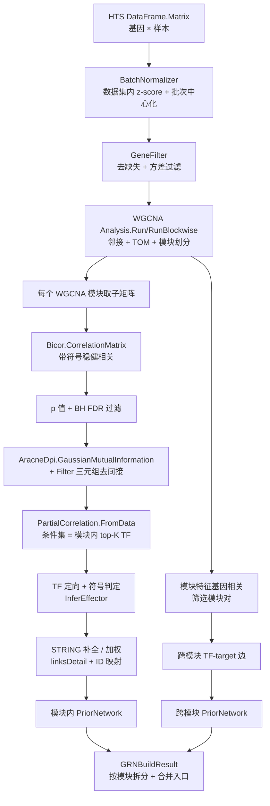

## 产品概述

在 GCModeller 的 `CellPhenotype` 子系统中新增一个「基因表达调控先验网络构建」模块。该模块从原始的大规模基因表达矩阵出发，端到端地构建出可供 bnlearn 动态贝叶斯网络与 GEARS 图神经网络使用的先验知识网络。

## 核心功能

1. **数据预处理**：接收多公共数据集合并后的表达矩阵（基因 × 样本），支持按数据集分组做组内 z-score 标准化与可选的批次中心化，剔除高缺失率与低方差基因。
2. **共表达网络构建**：复用 WGCNA 完成软阈值邻接与模块划分；在每个模块内用稳健相关（bicor）计算带符号的基因-基因相关矩阵。
3. **统计显著性过滤**：为候选边计算相关显著性 p 值并做 BH FDR 校正，p/FDR 同时参与过滤与置信度计算。
4. **间接关系去除**：用 ARACNe 的 DPI 三元组过滤去除由共同上游调控造成的间接边；再用偏相关（条件集为模块内高相关 TF）做二次筛选，抑制假阳性。
5. **方向性与调控符号**：依据 TF 注释（`K:\hsa_grn\Homo_sapiens_TF.txt`）定向 TF → 靶基因，相关符号决定激活/抑制；TF-TF 与非 TF-非 TF 边不丢弃，降级保留为候选边供下游算法裁决。
6. **STRING 蛋白互作整合**：可配置地执行「拓扑补全（新增 PPI 边）」与「置信度加权（提升已有共表达边）」，按 combined_score 阈值过滤，并在 Evidence 中标记边来源。
7. **按模块输出**：每个 WGCNA 模块输出一个 `PriorNetwork` 子网络，另附模块间连接边，同时提供合并为单一 `PriorNetwork` 的入口。输出元素类型为 `BNLearn.Core.RegulatoryEdge`（TF / TargetGene / RegulationType / Confidence / Evidence）。
8. **规模可控**：DPI、偏相关、bicor 全矩阵均为高阶复杂度，全部按模块/Top-N 分块执行，避免全基因组规模爆内存。

## 技术栈

- 语言与框架：Visual Basic .NET（net10.0），`CellPhenotype.vbproj` 现有配置 `OptionExplicit On` / `OptionStrict Off` / `OptionInfer On`，`GenerateDocumentationFile=True`
- 目标项目：`src/GCModeller/sub-system/CellPhenotype/CellPhenotype.vbproj`（RootNamespace `SMRUCC.genomics.Analysis.CellPhenotype`）
- 已有依赖（**无需新增项目引用**）：WGCNA（`SMRUCC.genomics.Analysis.HTS.WGCNA`）、STRING-db（`SMRUCC.genomics.Data.STRING.Tabular.Tsv`）、Bio.InteractionModel（`SMRUCC.genomics.InteractionModel`）、BNLearn（`SMRUCC.genomics.Analysis.BNLearn.Core`）、HTS_matrix（`SMRUCC.genomics.Analysis.HTS.DataFrame`）、sciBASIC# 统计/图论
- 复用算法组件：`Bicor`、`PartialCorrelation`、`AracneDpi`、`WGCNA.Analysis`、`GeneFilter`、`linksDetail`、`entrez_gene_id_vs_string`、`FalseDiscoveryRate.BHCorrection`、`Ttest.Pvalue`

## 实现方案

### 总体策略

采用「**双轨制 + 分块流水线**」：

- **模块划分轨**：WGCNA 内部使用 GEMM 版 Pearson 相关矩阵（`TensorCorrelation`）跑全矩阵，产出 `modules`（模块名 → 基因列表）、`moduleEigengenes`、`moduleMembership`（kME）、`K`（连接度）。这一步是唯一的全基因组 O(n²) 计算，已有成熟实现且支持 GPU 后端，直接复用。
- **边权轨**：在每个模块内部（几百个基因规模）改用 `Bicor.CorrelationMatrix` 计算**带符号**的稳健相关矩阵，用于边权、符号、p 值与后续 DPI/偏相关。理由是 bicor 为 O(g²·样本数) 的逐对计算，全基因组 2 万基因不可行，而模块内完全可行；同时 WGCNA 的 TOM 邻接不带符号，不能用于判定激活/抑制。

### 关键设计决策与权衡

1. **为何模块内而非全局算 bicor**：`Bicor.CorrelationMatrix` 对 2 万基因需 2×10⁸ 对、每对 O(样本数)，不可行；模块化后单模块 g≈600 仅 1.8×10⁵ 对，秒级完成。代价是跨模块边需单独处理（见第 5 点）。
2. **为何 DPI 与偏相关都要**：DPI 只利用三角形权重关系，擅长去除典型的三元间接链；偏相关显式控制条件集（模块内 top-K 高相关 TF），能捕获 DPI 抓不到的多因子共调控。二者串联、各有开关，便于后续做消融实验。
3. **为何保留 TF-TF / 非 TF-非 TF 边**：现有 `GeneRegulatoryNetwork.BuildPriorNetwork` 直接跳过这些边，会丢失调控级联。本模块将其保留为候选边，但 `Confidence` 乘以折扣系数、`Evidence` 打 `undirected` 标记，下游 DBN 可作软先验、GNN 可作可选边类型。
4. **为何不修改 `PriorNetwork.vb`**：`RegulatoryEdge` 现有字段（TF/TargetGene/RegulationType/Confidence/Evidence）已足以表达全部需求；方向存疑的边用 `Evidence` 受控词表承载，避免跨项目改动影响 `GeneRegulatoryNetwork`、`BNLearnWorkflow`、`ModularNetwork`、`GEARS` 等既有消费方。
5. **跨模块边策略**：先用模块特征基因（`moduleEigengenes`）之间的相关筛出显著相关的模块对，只在这些模块对之间计算「模块内 TF × 另一模块基因」的相关边。相比全 TF × 全基因（约 3×10⁷ 对）大幅降维，同时保留真正的跨模块调控通路。

### 置信度融合（统一量纲到 0-1）

- `base = |bicor|`；`sig = 1 - min(1, q / fdrThreshold)`（q 为 BH 校正后 FDR）
- `conf_expr = 0.7·base + 0.3·sig`
- 偏相关衰减：`|pcor| / |cor| ∈ [0.5, 0.8)` → `conf_expr *= 0.8` 且 Evidence 追加 `partial:attenuated`；`< 0.5` 或符号翻转 → 剔除
- STRING 加权：`conf = (1 - w)·conf_expr + w·(score - min) / (1000 - min)`（w 默认 0.3，min 默认 700）
- 纯 PPI 新增边：`conf = 0.5·(score - min) / (1000 - min)`，`RegulationType` 默认 `Activator` 且 Evidence 标 `string:ppi:unsigned`
- 无向候选边：`conf *= undirectedConfidenceScale`（默认 0.5）
- 最终 `Confidence` 钳制到 [0,1]

### 复杂度与性能控制

| 环节 | 复杂度 | 控制手段 |
| --- | --- | --- |
| WGCNA 全矩阵 | O(G²) 内存 + GEMM | 复用 `Analysis.Run/RunBlockwise`，`buildGraph=False`、`maxBlockSize` 分块 |
| bicor | O(g²·S) | 仅在模块内；`maxModuleGenes` 截断 + kME/连接度取 hub 子集 |
| p 值 + BH FDR | O(E·1) | 仅对 ` | r | ≥ minAbsCorrelation` 的候选边计算 |
| ARACNe DPI | O(g³) 三角形枚举 | `maxDpiGenes`（默认 600）截断；先用 ` | r | ` 阈值使邻接稀疏，`Filter` 内层有 `adj` 短路 |
| 偏相关 | O(E·S·K²)（两次 OLS，K ≤ 5） | 仅对通过 DPI 的候选边；`AsParallel` 并行；`maxPartialEdgesPerModule` 上限 |
| STRING 加载 | 文件约千万行 | 流式 `IteratesLinks` + `Where` 边读边判，只为网络内基因建索引，不整体物化 |


内存：单模块 `Double(,)`（cor + MI + Boolean(,)）在 g=600 时约 3×2.9MB，逐模块释放，峰值可控。

## 实现要点（执行细节）

1. **先核对再编码**：实现前用 LSP / 代码探索确认 ① `Analysis.Run` 是否已在内部调用 `GeneFilter.Filter`（若已调用，则不要重复过滤，并以 WGCNA 输出基因集为准取子矩阵）；② `Ttest.Pvalue` 与 `FalseDiscoveryRate.BHCorrection` 的确切命名空间与静态/实例调用方式；③ `linksDetail.protein1/protein2` 的 id 形态（是否形如 `9606.ENSP...`）与 `entrez_gene_id_vs_string` 映射方向。
2. **矩阵方向**：`Bicor.CorrelationMatrix` 与 `PartialCorrelation` 均要求 `Double(,)` 且 **rows = 基因、cols = 样本**；从 `HTS.DataFrame.Matrix` 的 `expression(i).experiments` 组装时不要转置。
3. **基因过滤顺序**：`DropMissing` → `ByVariance(filterTopN)` → 批次标准化 → WGCNA；z-score 不改变基因间相对方差序，放在过滤后更省算力。
4. **日志**：复用项目惯例（`$"...".info` / `.debug`），输出每模块的：候选边数、FDR 通过数、DPI 去除数、偏相关剔除数、STRING 新增/加权数、定向/无向计数、耗时；不打印逐边明细，避免日志风暴。
5. **TF 集合**：沿用 `grn_demo2.vb` 的用法（`DataFrameResolver.Load(path, tsv:=True)` 取 `Ensembl` 列），并在模块内提供 `ReadTfList(path, column, tsv)` 便捷入口；集合统一用 `HashSet(Of String)(StringComparer.OrdinalIgnoreCase)`。
6. **向后兼容**：只新增文件，不改 `GeneRegulatoryNetwork.vb` 与 `BNLearn/Core/PriorNetwork.vb`；SDK 风格项目自动 glob `.vb`，无需改 `.vbproj`。
7. **失败与边界**：样本数 < 3、TF 集合为空、模块为空、条件集为空时给出明确异常或降级路径（条件集为空时退化为不做偏相关，而非抛错）。

## 架构设计



组件关系：

- `BatchNormalizer`、`CorrelationSignificance` 为无状态工具模块，仅被 `ExpressionGRNBuilder` 调用
- `GRNBuildOptions` 为唯一配置入口，承载 WGCNA 配置引用与全部阈值
- `ExpressionGRNBuilder` 是编排者（orchestrator），串联 WGCNA / Bicor / AracneDpi / PartialCorrelation / STRING / PriorNetwork
- `GRNBuildResult` / `ModulePriorNetwork` 为结果容器，提供按模块访问、合并、白名单导出

## 目录结构

本次为现有项目新增模块，全部为新增文件，不修改既有文件（除可选的 test 演示入口）。

```
src/GCModeller/sub-system/CellPhenotype/
├── RegulationNetwork/
│   ├── GRNBuildOptions.vb             # [NEW] 流水线配置对象。承载批次分组（数据集名 → sampleID）、基因过滤参数（filterTopN/minVariance/maxMissingRate）、WGCNAConfig 引用与 runBlockwise 开关、相关参数（useBicor/bicorConstant/pearsonFallback/minAbsCorrelation/fdrThreshold）、DPI 参数（dpiEnabled/dpiTolerance/miThreshold/maxDpiGenes）、偏相关参数（partialEnabled/partialConditionTopK/partialMinRetainRatio/partialUseRobust/maxPartialEdgesPerModule）、TF 定向参数（keepUndirectedCandidates/undirectedConfidenceScale）、STRING 参数（stringLinks 路径/stringIdMap/stringMinScore/stringAddEdges/stringWeight）、规模控制（maxModuleGenes/hubSelection）。所有字段给默认值，使无参调用即可跑通。
│   ├── EvidenceTags.vb               # [NEW] Evidence 受控词表常量模块。定义 coexpression:bicor / coexpression:pearson / partial:retained / partial:attenuated / string:ppi / string:ppi:unsigned / undirected:tf-tf / undirected:non-tf / cross-module，并提供拼接辅助函数，避免魔法字符串散落。
│   ├── BatchNormalizer.vb            # [NEW] 多数据集合并的批次预处理。实现按数据集分组的基因 z-score 标准化与可选批次中心化（减去批次内均值）；未分组时退化为全局 z-score。返回新的 HTS Matrix，不原地修改输入。
│   ├── CorrelationSignificance.vb    # [NEW] 相关显著性工具。实现 t = r·sqrt((n-2)/(1-r²)) 与 `Ttest.Pvalue(t, n-2, TwoSided)` 求 p 值，批量 BH FDR 校正，以及前述置信度融合公式（base/sig/偏相关衰减/STRING 加权/无向折扣/钳制）。
│   ├── ModulePriorNetwork.vb         # [NEW] 输出容器。ModulePriorNetwork（moduleName / genes / module As PriorNetwork / crossModule As PriorNetwork / statistics）与 GRNBuildResult（modules 数组、全局跨模块边、wgcna 结果、汇总统计，并提供 ToPriorNetwork 合并、ToWhitelist、按边类型/Evidence 过滤的访问器）。
│   ├── StringPriorEvidence.vb        # [NEW] STRING 证据源封装。加载 linksDetail（流式过滤 combined_score ≥ 阈值）、维护 geneID ↔ STRING protein id 双向映射（支持直接匹配、entrez_gene_id_vs_string 映射表、protein_aliases 兜底）、提供 Lookup(geneA, geneB) 返回分数，仅物化网络内基因相关的边。
│   └── ExpressionGRNBuilder.vb       # [NEW] 主流水线模块（公开入口）。Build(samples, TF, options) → GRNBuildResult；内部依次执行预处理、WGCNA 模块划分、逐模块 bicor→p/FDR→DPI→偏相关→TF 定向→STRING 整合、跨模块边构建与汇总；另提供 ReadTfList、BuildStringIdMap、以及复用已有 WGCNA Result 的重载；复用 GeneRegulatoryNetwork.InferEffector 做符号判定。
└── test/
    └── grn_prior_demo.vb             # [NEW] 演示/冒烟入口（test 目录若独立成项目则在此编译）。读取 K:\hsa\Homo_sapiens_expr_advanced_all_conditions.csv、K:\hsa_grn\Homo_sapiens_TF.txt（Ensembl 列）与 STRING 9606.protein.links 文件，跑通全流程并打印各模块边数与 Evidence 分布。
```

## 关键代码结构

```
' RegulationNetwork/GRNBuildOptions.vb —— 流水线唯一配置入口（字段默认值即推荐参数）
Public Class GRNBuildOptions
    Public Property batches As Dictionary(Of String, String())   ' 数据集名 → sampleID；Nothing 视为单批次
    Public Property centerBatch As Boolean = True
    Public Property filterTopN As Integer = 8000
    Public Property maxMissingRate As Double = 0.2
    Public Property wgcnaConfig As WGCNAConfig                   ' Nothing 时用 Analysis 默认 + buildGraph=False
    Public Property runBlockwise As Boolean = True
    Public Property useBicor As Boolean = True
    Public Property minAbsCorrelation As Double = 0.3
    Public Property fdrThreshold As Double = 0.05
    Public Property dpiEnabled As Boolean = True
    Public Property dpiTolerance As Double = 0.1
    Public Property partialEnabled As Boolean = True
    Public Property partialConditionTopK As Integer = 5
    Public Property partialMinRetainRatio As Double = 0.5
    Public Property keepUndirectedCandidates As Boolean = True
    Public Property undirectedConfidenceScale As Double = 0.5
    Public Property stringLinks As String = Nothing
    Public Property stringIdMap As Dictionary(Of String, String) = Nothing  ' geneID → STRING protein id
    Public Property stringMinScore As Double = 700
    Public Property stringAddEdges As Boolean = True
    Public Property stringWeight As Double = 0.3
    Public Property maxModuleGenes As Integer = 1000
    Public Property maxDpiGenes As Integer = 600
End Class
```

```
' RegulationNetwork/ExpressionGRNBuilder.vb —— 公开入口签名
Public Module ExpressionGRNBuilder
    ' 主入口：原始表达矩阵 → 按模块拆分的先验网络集合
    Public Function Build(samples As Matrix,
                         TF As IEnumerable(Of String),
                         Optional options As GRNBuildOptions = Nothing) As GRNBuildResult

    ' 复用已完成的 WGCNA 结果（跳过模块划分），用于重复调参场景
    Public Function Build(samples As Matrix,
                         wgcna As Result,
                         TF As IEnumerable(Of String),
                         Optional options As GRNBuildOptions = Nothing) As GRNBuildResult

    ' 读取 TF 注释表（默认取 Ensembl 列，tsv）
    Public Function ReadTfList(path As String,
                              Optional column As String = "Ensembl",
                              Optional tsv As Boolean = True) As String()
End Module
```

```
' RegulationNetwork/ModulePriorNetwork.vb —— 结果容器（用户所需的 PriorNetwork 集合）
Public Class GRNBuildResult
    Public Property modules As ModulePriorNetwork()          ' 每个 WGCNA 模块一个 PriorNetwork 子网络
    Public Property wgcna As Result
    Public Property summary As BuildSummary

    ' 扁平访问：全部 RegulatoryEdge（含模块内 + 跨模块）
    Public ReadOnly Property allEdges As IEnumerable(Of RegulatoryEdge)

    ' 合并为单一 PriorNetwork，供不需要分块的 DBN/GNN 调用方使用
    Public Function ToPriorNetwork() As PriorNetwork
End Class
```

## Agent Extensions

### SubAgent

- **code-explorer**
- Purpose：在编码前核实三处不确定的既有行为——① `WGCNA.Analysis.Run/RunBlockwise` 是否内部已调用 `GeneFilter.Filter`（决定是否重复过滤）；② `Ttest.Pvalue` 与 `FalseDiscoveryRate.BHCorrection` 的确切命名空间与调用形态；③ STRING `linksDetail` 的 id 形态与 `entrez_gene_id_vs_string` 映射方向
- Expected outcome：拿到可直接引用的完整限定名与调用代码片段，避免编译期符号错误与重复过滤导致的基因集不一致

### Skill

- **lsp-code-analysis**
- Purpose：对新模块中引用的跨项目符号（`Bicor.CorrelationMatrix`、`PartialCorrelation.FromData`、`AracneDpi.Filter`、`linksDetail.IteratesLinks`、`PriorNetwork.AddEdge`、`InferEffector`）做定义跳转与签名确认
- Expected outcome：所有跨项目调用签名精确匹配，`CellPhenotype` 项目一次编译通过