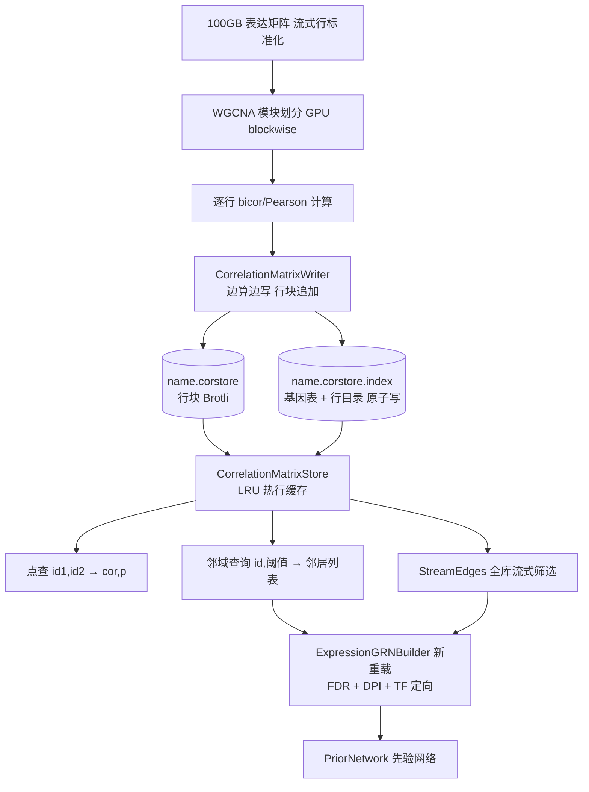

## 产品概述

在 `dataframeUtils-netcore5.vbproj` 中新增一个磁盘分行持久化的**带符号相关矩阵存储**（Correlation Store）。针对 100GB 表达矩阵一次性计算出 N×N（N=5 万）的 bicor/Pearson 相关矩阵后，将**未过滤的原始矩阵**持久化缓存；此后所有阈值过滤实验均基于缓存进行，不再重复矩阵计算。

## 核心功能

1. **写入端**：计算端逐行产出相关系数（与 WGCNA/bicor 逐基因产出行方式吻合），`CorrelationMatrixWriter` 边算边写、顺序追加行块，`Complete()` 原子写索引。
2. **点查**：给定 `(gene_id1, gene_id2)` → 返回相关系数与 p 值（p 值不存储，按 r 与样本数 n 解析重算）。
3. **邻域查询**：给定 `gene_id` 与绝对值阈值 → 返回 |cor| ≥ 阈值的关联基因列表及其相关系数、p 值（单次块读 + 行内线性扫描）。
4. **全库流式筛选**：给定阈值遍历全部行块，以 `Iterator` 流式产出边表（供阈值实验与网络生成），不物化中间结果。
5. **p 值重算**：t = r·sqrt(df/(1-r²))，p = Beta.betai(df/2, 0.5, df/(df+t²))，df=n-2；与 CellPhenotype 流水线同公式。
6. **上游集成**：`CellPhenotype.ExpressionGRNBuilder` 新增基于存储的重载，模块内候选边直接来自存储的邻域查询，跳过 bicor 重算，实现“一次计算、无限次过滤实验”。

## 性能目标（N=50,000）

- 点查 / 邻域查询：1–2 ms（内存目录 O(1) + 一次块读 + 解压）
- 全库流式筛选：约 1–2 分钟/次
- 磁盘占用：Single 编码原始 10GB → Brotli 后约 2–4GB；Int16 量化原始 5GB → 约 1–2GB

## 技术栈

- 语言：VB.NET（net10.0），沿用 `dataframeUtils-netcore5.vbproj` 现有配置（RootNamespace `Microsoft.VisualBasic.Math.Matrix`）
- 依赖：现有引用已足够（Core 含 `Beta.betai`、dataframework、stats、Math.NET5），无需新增
- 压缩：`System.IO.Compression.BrotliStream`（netcore 内置）；块读取用 `File.OpenHandle` + `RandomAccess.Read` 显式偏移（参考 BucketDb `ReadFully`，多线程并发读无需加锁）

## 系统架构



## 存储格式

- 主文件 `{name}.corstore`：`[block_len(4B)][Brotli(block)]` 顺序追加；每行存该基因对全部 N 个基因的相关系数（不存上三角，保证邻域查询单块读）
- 索引文件 `{name}.corstore.index`：Brotli 压缩的 `{version, N, sampleN, encoding, genes, rows:[offset(8B),length(4B)]}`，二进制定长记录（参考 `Index.vb` 的 16B 格式），打开时全量载入（数 MB）
- 编码枚举：`Single`（4B，精度 1e-7）与 `Int16` 量化（2B，r×32767，精度 3e-5，NaN 用 `Int16.MinValue` 哨兵）
- p 值不存储，由 `r` 与头部样本数 `n` 按需重算（存储减半）

## 关键设计决策

1. **行分块而非上三角/KV**：邻域查询 = 单块读；上三角会导致 I/O 放大 2.5 万倍；KV（BucketDb）在 1 亿键下有 32 位哈希碰撞丢数据风险且索引常驻 5–8GB 内存
2. **p 值按需重算**：r 与 n 的确定性函数，存储减半且与既有流水线公式一致
3. **行内线性扫描做阈值过滤**：单行仅 5 万条，无需任何阈值索引结构
4. **索引原子替换**：`Complete()` 写临时文件后 `File.Replace`，防止中断留下损坏索引

## 目录结构

```
src/runtime/sciBASIC#/Data_science/Mathematica/Math/DataFrame/
└── Correlation/
    └── Persistency.vb                    # [NEW] CorrelationEncodings 枚举、
                                          #     CorrelationMatrixWriter（写入端）、
                                          #     CorrelationMatrixStore（点查/邻域/流式）、
                                          #     CorrelationPValues.PValue(r,n)（p 值重算）
src/runtime/sciBASIC#/Data_science/Mathematica/Math/DataFrame/test/
└── corstore_test.vb                      # [NEW] round-trip 冒烟：写 N=2000 随机矩阵 →
                                          #     点查/邻域/流式筛选断言
src/GCModeller/sub-system/CellPhenotype/
├── CellPhenotype.vbproj                  # [MODIFY] 新增 dataframeUtils ProjectReference
└── RegulationNetwork/
    └── ExpressionGRNBuilder.vb           # [MODIFY] 新增 Build(store, TF, options, expr?) 重载
```

## 关键接口

```
Public Class CorrelationMatrixWriter : Implements IDisposable
    Sub New(path$, geneIds As IEnumerable(Of String), sampleN%,
            Optional encoding As CorrelationEncodings = CorrelationEncodings.Single)
    Sub WriteRow(geneId$, row As Single())   ' 行序 = geneIds 声明序，长度必须 = N
    Sub WriteRow(geneId$, row As Double())
    Sub Complete()                            ' 原子写索引
End Class

Public Class CorrelationMatrixStore : Implements IDisposable
    Shared Function Open(path$) As CorrelationMatrixStore
    ReadOnly Property genes As String()
    ReadOnly Property size As Integer         ' N
    ReadOnly Property SampleN As Integer
    Function GetCorrelation(id1$, id2$) As (cor#, pvalue#)
    Function Neighbors(id$, minAbsCor#) As (gene$, cor#, pvalue#)()
    Iterator Function StreamEdges(minAbsCor#,
                                  Optional genes As IEnumerable(Of String) = Nothing,
                                  Optional pvalueCutoff# = Double.NaN
    ) As IEnumerable(Of (a$, b$, cor#, pvalue#))
End Class
```

## Agent Extensions

### SubAgent

- **code-explorer**
- Purpose：实现前核对 dataframeUtils 项目属性（GenerateDocumentationFile/OptionStrict）、`DataMatrix`/`Index.vb` 的二进制序列化惯例、BucketDb `ReadFully` 的 RandomAccess 用法
- Expected outcome：拿到可直接套用的编码惯例与并发块读实现细节，避免编译期符号错误

### Skill

- **lsp-code-analysis**
- Purpose：对跨项目符号（`Beta.betai`、`BrotliStream`、`RandomAccess.Read`）与新增类的引用做定义跳转与签名确认
- Expected outcome：dataframeUtils 与 CellPhenotype 两侧一次编译通过