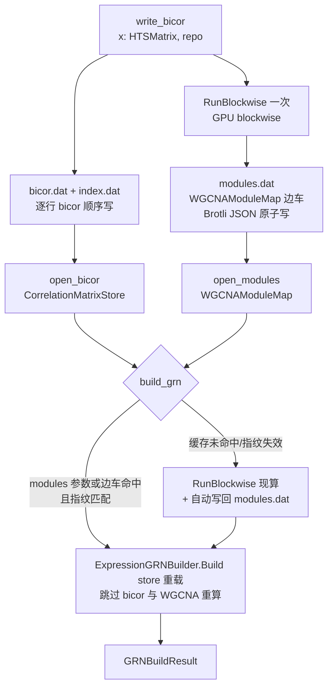

## 需求概述

用户已将基因表达调控先验网络构建流程重构为 R# 程序包 API（`TRNtoolkit/WGCNA.vb` 的 `build_grn`、`cytoscape_toolkit/bioModels/TRN.vb` 的 `write_bicor`/`open_bicor`、`phenotype_kit/geneExpression.vb`），并配套了流程脚本 `test/omics/GRN.R`。

当前问题：`build_grn` 即使已经传入缓存的 bicor 相关矩阵存储（`CorrelationMatrixStore`），每次调用仍然要从原始表达矩阵重新执行 `Analysis.RunBlockwise` 做 WGCNA 模块划分。对 5 万基因、100GB 表达矩阵而言，这一步需要数十分钟，使 bicor 缓存的性能收益（秒级过滤）被完全抵消。

## 核心功能

- 新增 **WGCNAModuleMap**（WGCNA 模块映射边车缓存）数据模型：只缓存下游实际消费的模块映射表（`modules: Dictionary(Of String, String())`）+ 基因 ID 表 + 指纹，不缓存 WGCNA `Result` 的 TOM（~10GB）/network 图等大对象
- **指纹失效检测**：缓存携带 `hash(genes 行序) + hash(WGCNA 关键配置)` 指纹，不匹配自动回退重算并重写缓存，杜绝静默使用过期模块
- **`CorrelationMatrixStore.storeFile`** 属性：文件模式返回数据文件路径，外部 Stream 模式返回 Nothing，供 `build_grn` 自动定位边车文件
- **R# API 改造**：
- `write_bicor` 同一趟计算顺带运行 blockwise 并缓存模块到 `{repo}/modules.dat`（用户无需二次加载 100GB 表达矩阵）
- 新增 `open_modules(repo)` 读取模块缓存
- `build_grn` 新增可选 `modules` 参数：未提供时自动尝试 `{storeFile}.modules` 边车 + 指纹校验；未命中才现算并自动写缓存
- **向后兼容**：所有新增参数均为 Optional，现有 `GRN.R` 脚本无需强制修改
- 顺带清理 `build_grn` 中的 demo Console 打印（module statistics / evidence 分布），移为可选项

## 预期效果

| 场景 | 现状 | 改造后 |
| --- | --- | --- |
| 首次 `write_bicor` | bicor 数小时 | bicor 数小时 + 模块划分一次（分钟级，GPU） |
| 有 bicor 的 `build_grn` | 每次重跑 blockwise（数十分钟） | 读 1–2MB 边车，秒级 |
| 换阈值重复 `build_grn` | 每次重跑 blockwise | 仅 FDR/DPI/定向过滤，秒~分钟级 |
| 数据/配置变化 | 静默用错模块 | 指纹失效 → 自动重算重写 |

## 技术方案

### 技术栈

- VB.NET（net10.0），复用现有项目引用，无需新增 ProjectReference
- 复用既有组件：`CorrelationMatrixStore`（dataframeUtils）、`Analysis.RunBlockwise`/`WGCNAConfig`（WGCNA）、`ExpressionGRNBuilder.Build(store, ...)` 存储驱动重载（CellPhenote）、sciBASIC 的 Brotli/JSON 序列化与 R# `<ExportAPI>` 惯例

### 架构设计

### 关键设计决策

1. **只缓存模块映射，不缓存 WGCNA Result**：存储路径只消费 `modules` 字典（hub 截断用连接度现算、跨模块边不构建），`TOM`/`network` 等大对象在 N=5 万时达 10GB 且无用
2. **指纹失效检测**：`Fingerprint = SHA256(genes 行序 JSON) + SHA256(WGCNA 配置字段)`；确定性依据是 blockwise 预聚类 `randomSeed` 固定（12345）
3. **边车文件双命名约定**：`{bicor.storeFile}.modules`（文件模式自动定位）与 `{repo}/modules.dat`（`write_bicor` 的 repo 约定）；`build_grn` 优先消费显式 `modules` 参数 → 自动边车 → 现算回退
4. **原子写**：tmp + `File.Replace`，防止中断留下损坏缓存
5. **`storeFile` 属性**：`CorrelationMatrixStore` 新增 `Public ReadOnly Property storeFile As String`，文件模式返回 `_path`，外部 Stream 模式返回 Nothing（流模式由调用方在 R# 层显式传 modules 参数）

### 实现要点

- `WGCNAModuleMap.Save/Load` 复用 `Persistency.vb` 的 Brotli + GetJson 惯例与 `StringPriorEvidence` 的日志风格
- `build_grn` 的 RunBlockwise 回退路径使用与现在相同的 GPU 配置（`useGpu=True, buildGraph=False`）
- 移除 `build_grn` 内嵌的 Console 打印（改为遍历返回的 `GRNBuildResult` 由脚本侧按需输出），保证 R# API 输出干净
- `GRNBuildResult.wgcna` 在存储路径为 Nothing（现状已如此），R# 脚本侧无依赖

## Agent Extensions

### SubAgent

- **code-explorer**
- Purpose: 核对 R# workbench 三个 API 模块（TRNtoolkit/WGCNA.vb、cytoscape_toolkit/bioModels/TRN.vb、phenotype_kit/geneExpression.vb）的现有 imports、GRNBuildOptions 构造方式与 `GRN.R` 脚本的实际调用形态，确认改动点与向后兼容性
- Expected outcome: 拿到精确的改动位置清单与 R# API 惯例片段，避免编译期符号错误与脚本破坏性变更