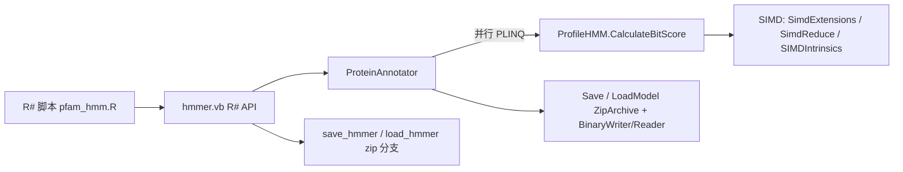

## 用户需求

优化 HMMER3.vbproj 项目（`SMRUCC.genomics.Analysis.SequenceTools.HMMER`）中蛋白质注释功能的计算性能，并补齐模型持久化能力。

## 需求明细

1. **并行化**：`ProteinAnnotation.vb` 中 `Annotate`（L173-197）遍历 `_models` 逐个模型串行调用 `CompareSequence` 的循环改为并行计算；`AnnotateTop`、`AnnotateAll` 同理受益（模型间/序列间相互独立，可安全并行）。
2. **SIMD 加速**：计算热点为 `ProfileHMM.CalculateBitScore` 的 Viterbi 动态规划（M/I/D 三张 DP 表逐单元格标量 max/add），以及 `GetAminoAcidIndex` 对每个字符的 20 元素线性扫描、`GetEmissionScore/GetTransitionScore` 的重复边界检查。需基于基础代码库 `src\runtime\sciBASIC#\Microsoft.VisualBasic.Core\src\Math\SIMD`（命名空间 `Microsoft.VisualBasic.Math.SIMD`：`SimdExtensions` 扩展方法、`SimdReduce`、`SIMDIntrinsics`、`SimdParallel`）对得分计算进行向量化加速。
3. **Zip 持久化（二进制格式）**：实现 `ProteinAnnotator` 中已声明但为空的 `Save(zipfile As Stream)`（L164）与 `Shared LoadModel(zipfile As Stream)`（L160），将已加载的 HMM 模型集合（含阈值、DatabaseSize 配置）序列化为 zip 压缩包保存，并能从 zip 包加载还原为 `ProteinAnnotator` 实例。**用户明确要求：`ProfileHMM` 模型对象必须使用二进制格式（`BinaryWriter`/`BinaryReader` 直接写入原始数值数据）序列化，不要使用 JSON 等字符串序列化，以避免额外的字符串转换开销。**
4. **R# API 与测试**：在 `src\workbench\R#\seqtoolkit\hmmer.vb` 中补充 zip 保存/加载的 R# 导出 API；更新 `G:\GCModeller\test\demo\sequencekit\pfam_hmm.R` 测试脚本验证保存/加载及注释功能。
5. **编译部署与实测**：使用 dotnet 以 `Rsharp_app_release|x64` 配置编译 `src\GCModeller.slnx`，部署更新到 `assembly\net10.0`；随后在 `src\R-sharp\App\net10.0` 目录运行 `R# G:\GCModeller\test\demo\sequencekit\pfam_hmm.R --attach G:\GCModeller --debug=none` 完成回归验证。

## 验收标准

- 注释结果与优化前一致（得分、E 值、比对路径不变），多核环境下批量注释吞吐明显提升。
- zip 包保存/加载后 `ProteinAnnotator` 模型数量、模型名、阈值配置完整还原；模型条目为二进制数据（非 JSON 文本）。
- R# 测试脚本运行通过，输出结果 CSV 正常生成。

## 技术栈

- VB.NET / .NET 10（net10.0），项目已引用 `Core.vbproj`（`Microsoft.VisualBasic.Core`，含 `Microsoft.VisualBasic.Math.SIMD`），无需新增依赖。
- 并行：PLINQ（`AsParallel().AsOrdered()`）或 `System.Threading.Tasks.Parallel`，遵循 TPL 标准设施。
- zip：`System.IO.Compression.ZipArchive`，仿照 `src\GCModeller\sub-system\GEARS\GEARS.vb`（L773 Save / L806 Load）与 `GEARSStorage.vb` 的 manifest+分条目模式。
- 模型序列化：`System.IO.BinaryWriter` / `BinaryReader` 二进制格式（写入 `Double()`/`Double()()` 等原始数值数组 + 元数据），**不使用 JSON/文本序列化**；zip 内 manifest 仍可用极简文本行或二进制头写入版本号与配置。
- R# API：`<ExportAPI>` + `<Package("hmmer")>` 现有模式（`Microsoft.VisualBasic.CommandLine.Reflection` / `SMRUCC.Rsharp.Runtime`）。

## 实现方案

### 1. SIMD 加速（ProfileHMM.vb）

核心思路是"预处理扁平化 + 查表 + 向量化归约"，Viterbi DP 的状态依赖（M(k,i) 依赖 M(k-1,i-1)）使得整表难以全并行，因此将热点算子向量化：

- **氨基酸索引查表化**：用 `Dictionary(Of Char, Integer)` 或 256 长度查表替代 `GetAminoAcidIndex` 的线性扫描；将序列一次性预转换为索引数组（`Integer()`），消除内层逐字符转换。
- **模型参数扁平化**：将 `MatchEmissions`（`Double()()`）预扁平化为连续 `Double` 数组（k×20 布局），`Transitions` 同理扁平化（k×7），消除每次调用的边界检查与锯齿数组跳跃访问；在首次使用时惰性构建并缓存于 `ProfileHMM` 内部字段。
- **向量化发射得分**：对每个 DP 行 k，发射得分行为 `MatchEmissions(k)`（20 元素向量），可选地将整行与候选列向量用 `SIMDIntrinsics`（AVX2 `VectorAddAvx2`/`DotFma`）批量计算；DP 单元格的三候选 max（M/I/D 来源 + 转移得分）采用 `SimdReduce.Max` / `SimdExtensions.SimdMax` 归约，消除分支。
- **多序列外层并行**：`AnnotateAll` 按序列并行（序列间零依赖），每个序列内仍走 SIMD 路径，两层加速互补且互不争抢（线程数受 `ThreadPool`/`SimdParallel.ShouldParallelize` 阈值约束，避免过度订阅）。

复杂度：DP 本体仍为 O(L_model × L_seq)，但常数因子显著下降（查表 O(1)、扁平内存布局、向量归约）；并行化将批量注释吞吐提升至接近核数倍。

### 2. 并行化（ProteinAnnotation.vb）

- 将 `_models.Values` 缓存为快照数组（`_modelList`，在模型加载方法后失效重建），避免并行遍历字典。
- `Annotate`：`_modelList.AsParallel().AsOrdered().Select(Function(m) CompareSequence(...))` 后过滤/排序，保持与原 LINQ 相同的输出顺序语义；每模型结果独立，无共享可变状态，线程安全。
- `AnnotateTop`：并行计算后取最高 BitScore（用 `AsParallel().Select(...).Aggregate` 或先并行求值再 max 归约）。
- `AnnotateAll`：`proteins.AsParallel().Select(Function(fa) AnnotateTop(fa))`（保持输入序）。

### 3. Zip 持久化——二进制格式（ProteinAnnotation.vb）

- **不使用 JSON 序列化模型数据**（避免 Double→字符串→Double 的转换开销）。
- `Save(zipfile As Stream)`：
- `New ZipArchive(file, ZipArchiveMode.Create, leaveOpen:=True)`；
- 写入 `manifest` 条目（`manifest.txt` 简单键值文本或二进制头均可）：格式版本号、模型数量、EValueThreshold、BitScoreThreshold、DatabaseSize；
- 每个模型一个二进制条目（如 `models/0001.bin`），用 `BinaryWriter` 按固定布局写入 `ProfileHMM` 核心字段：元数据（Version/Name/Length/Alphabet/NumSequences/EffectiveNum/Checksum/StatsMSV/StatsViterbi/StatsForward 各 Double 对）、背景分布（`CompositionEmission/Insert/Transitions`）、`MatchEmissions`/`InsertEmissions`/`Transitions`（先写行数与每行长度，再逐元素 `Write(Double)`）；
- 派生字段 `HMMStates/HMMObservables/HMMInitialProb` 不持久化（加载后按需重建）。
- `Shared LoadModel(zipfile As Stream)`：`ZipArchiveMode.Read` 读取 manifest 校验格式版本后，逐条目用 `BinaryReader` 按相同布局反序列化重建 `ProfileHMM`，填充新 `ProteinAnnotator` 的 `_models` 字典并返回实例。
- 二进制读写封装为 `ProfileHMM` 上的 `WriteBinary(w As BinaryWriter)` / `Shared Function ReadBinary(r As BinaryReader) As ProfileHMM` 方法，保证 Save/Load 布局对称。
- 命名空间 `Imports System.IO.Compression`（net10.0 内置，无需包引用）。

### 4. R# API 与测试脚本

- `hmmer.vb` 新增 `<ExportAPI("save_hmmer")>`（`Save(hmmer, file)`）与 `load_hmmer` 增加 zip 文件后缀分支（`.zip` → `ProteinAnnotator.LoadModel(File.OpenRead(...))`）。
- `pfam_hmm.R` 增加 save → load → 重新搜索的回归测试段落，比对结果一致性。

## 执行要点

- **回归安全**：并行/SIMD 重构前后用同一条序列对比 BitScore/EValue/AlignmentPath，保证浮点求和顺序一致处（DP 内标量路径保持不变处不加向量化重排，仅在纯 max/独立加法处向量化），确保结果逐位一致或误差在容差内。
- **二进制兼容**：Save/Load 必须使用完全对称的写入/读取顺序；写入格式版本号以便未来布局演进时兼容判断。
- **线程安全**：`ProfileHMM` 缓存字段（扁平化数组、索引表）使用惰性初始化时注意并发首次加载（`SyncLock` 或提前在加载阶段构建），避免并行 `Annotate` 时重复构建。
- **性能热点规避**：不使用 LINQ 于 DP 内层；避免每模型/每序列重复分配大数组（DP 表按需分配，可考虑数组池化但首版不做以控制改动半径）。
- **部署链路**：`dotnet build g:\GCModeller\src\GCModeller.slnx -c Rsharp_app_release -p:Platform=x64` → 确认输出更新至 `assembly\net10.0` → 在 `g:\GCModeller\src\R-sharp\App\net10.0` 下运行 R# 测试命令。

## 架构设计



## 目录结构

```
g:/GCModeller/
├── src/GCModeller/analysis/SequenceToolkit/Pfam-HMM/PfamHMMScan/
│   ├── ProteinAnnotation.vb   # [MODIFY] Annotate/AnnotateTop/AnnotateAll 并行化；_modelList 快照缓存；实现 Save(zip)/LoadModel(zip) 二进制模型条目
│   └── ProfileHMM.vb          # [MODIFY] 氨基酸索引查表、模型参数扁平化缓存、DP 热点向量化（SIMD）；WriteBinary/ReadBinary 二进制序列化
├── src/workbench/R#/seqtoolkit/
│   └── hmmer.vb               # [MODIFY] 新增 save_hmmer API；load_hmmer 支持 zip 包加载
├── test/demo/sequencekit/
│   └── pfam_hmm.R             # [MODIFY] 增加 zip 保存/加载回归测试
└── src/GCModeller.slnx        # [UNCHANGED] Rsharp_app_release|x64 编译入口
```