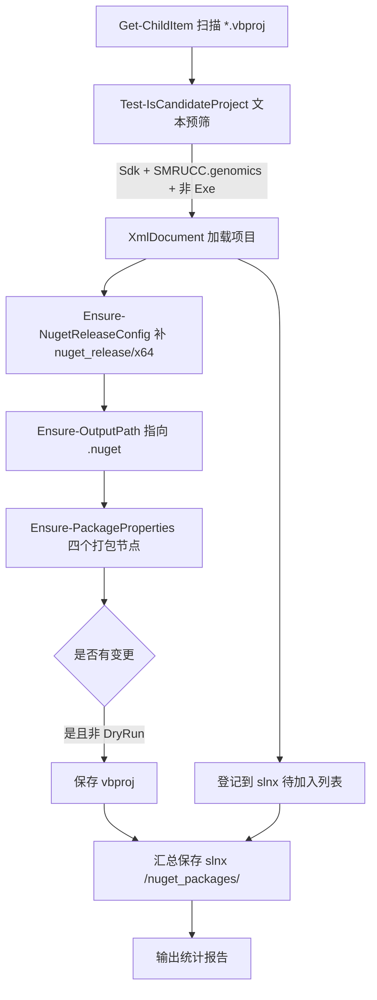

## User Requirements

编写一个 PowerShell 脚本，自动同步 GCModeller 仓库中"需要发布为 NuGet 包"的 VB.NET 项目配置。

## Product Overview

脚本存放于 `G:\GCModeller\msbuild\`，运行后对全仓库 `*.vbproj` 做一次扫描与批量规范化，使符合条件的类库项目全部登记进 `GCModeller.slnx`，并具备 `nuget_release|x64` 构建配置、指向 `.nuget` 目录的输出路径，以及生成 NuGet 符号包所需的属性节点。

## Core Features

1. **项目筛选**：递归扫描 vbproj，仅处理根元素为 `<Project Sdk="Microsoft.NET.Sdk">` 的 SDK 风格项目；`RootNamespace` 必须以 `SMRUCC.genomics` 开头；`<OutputType>` 为 `Exe`/`WinExe` 的项目直接忽略，仅保留 class（Library）类型。
2. **解决方案登记**：检查项目是否已存在于 `G:\GCModeller\src\GCModeller.slnx`（按相对 `src` 的正斜杠路径比较，路径中的 `#`、`%` 按字面量处理，不做 URL 解码）；不存在则新增，统一放入新建的 Solution Folder `/nuget_packages/`。
3. **配置补齐**：若 vbproj 缺少 `Condition="'$(Configuration)|$(Platform)'=='nuget_release|x64'"` 的 PropertyGroup 则新增（需归一化空格后比较，且仅匹配两段式 `$(Configuration)|$(Platform)`，排除含 `$(TargetFramework)` 的三段式）；同时确保 `<Configurations>` 含 `nuget_release`、`<Platforms>` 含 `x64`。
4. **输出路径**：在 `nuget_release|x64` 组中把 `OutputPath` 设为相对 `G:\GCModeller\.nuget` 的相对路径（正斜杠，如 `../../../../.nuget`）；已有则覆盖。
5. **打包属性**：检查并补齐 `GeneratePackageOnBuild=True`、`PackageRequireLicenseAcceptance=True`、`IncludeSymbols=True`、`SymbolPackageFormat=snupkg` 四个节点（缺哪个补哪个）。
6. **运行方式**：默认直接写盘；`-DryRun` 仅打印将要执行的改动；可选 `-Root`、`-Solution`、`-NugetDir` 覆盖默认路径；结束时输出变更统计。

## Tech Stack Selection

- 语言：Windows PowerShell 5.1+（`System.Xml.XmlDocument` 做 XML 读写，避免正则破坏大文件结构）
- 目标文件：`.vbproj`（MSBuild SDK 风格）、`.slnx`（新式解决方案 XML）
- 无第三方依赖，与 `msbuild/` 目录现有 `.cmd` 脚本同风格

## Implementation Approach

**策略**：以 XML DOM 为主（保形修改）+ 幂等检查（重复运行不产生脏改），全流程先"计算变更"再"落盘"，`-DryRun` 与实际写入共用同一变更管线。

**关键技术决策**

1. **用 XmlDocument 而非正则/文本替换**：vbproj 文件普遍 1000+ 行（如 `biocore-netcore5.vbproj` 1565 行），正则易破坏格式；`PreserveWhitespace = $true` 可保留原有缩进与空行，插入节点时手工补 `XmlWhitespace`/换行文本节点即可。
2. **编码显式化**：工作区禁止无编码参数的 `Get-Content`/`Set-Content` 回写。脚本统一用 `$doc.Load($path)` 读取（XmlDocument 自动识别声明编码），保存时用 `XmlWriterSettings { Encoding = 检测到的编码; Indent = $false }` 或 `XmlDocument.Save(StreamWriter)`，并保留/不凭空新增 XML 声明；BOM 通过读取首 3 字节判断后沿用。
3. **Condition 归一化匹配**：仓库内同时存在无空格写法 `"'$(Configuration)|$(Platform)'=='nuget_release|x64'"` 与带空格写法 `" '$(Configuration)|$(Platform)' == 'Debug|AnyCPU' "`。匹配前对 Condition 值去掉空白后比较；且必须排除含 `$(TargetFramework)` 的三段式节点，否则会误判。
4. **exe 判定**：存在 `<OutputType>` 且值（忽略大小写/空白）为 `Exe`/`WinExe` 则跳过；无该节点或值为 `Library` 视为 class 类型（SDK 默认即 Library）。
5. **slnx 路径比较**：`Project/@Path` 为相对 `src` 的正斜杠路径，含字面量 `#` 与 `%`（如 `runtime/sciBASIC#/mime/application%json/JSON-netcore5.vbproj`）。比较时用 `[Uri]::UnescapeDataString` 会误伤 `%`，因此直接字符串比较（`OrdinalIgnoreCase`）。
6. **相对路径计算**：用 `System.IO.Path` 与 `Uri.MakeRelativeUri` 计算 vbproj 所在目录到 `.nuget` 目录的相对路径，再把 `\` 统一换成 `/`（用户选定正斜杠风格）。跨盘/无法计算时回退为手工 `../` 拼接并告警。
7. **slnx 增量写入**：只在至少有一个新项目时才加载/保存 slnx；`/nuget_packages/` 文件夹节点不存在时创建，存在则复用，新项目节点追加 `<Platform Solution="*|x64" Project="x64" />` 子元素，保持与现有条目一致（x64 已在 slnx `<Configurations>` 中，无需新增）。

**性能**：约 900+ vbproj 文件，单文件约 1–5 MB 级别解析量；采用"先快速文本预筛（读首屏文本正则匹配 `Sdk=` 与 `RootNamespace`）再 DOM 解析"两级过滤，避免对全部文件做 DOM 加载；slnx 只解析一次并在内存中追加，最后单次保存。整体 O(总文件数)，秒级完成。

**幂等性 / 影响面控制**：每项修改都有"已存在则跳过"判断；不改动无关 PropertyGroup；不修改不符合筛选条件的任何文件；默认写盘但提供 `-DryRun`；对解析失败的文件打印警告后跳过，不中断整体流程。

## Implementation Notes

- 修改粒度：仅向第一个（主）`<PropertyGroup>` 追加缺失的打包属性与 `Configurations`/`Platforms` 补全；`nuget_release|x64` 组不存在时插入到项目末尾、第一个 `<ItemGroup>` 之前，符合 VS 生成习惯。
- 空格/换行：新建节点时按父节点缩进补齐（vbproj 多为 2 空格、slnx 同为 2 空格）。
- 日志：控制台彩色输出 `[SKIP]/[ADD]/[FIX]/[WARN]`，末尾汇总"新增到 slnx N 个、补配置 M 个、补 OutputPath K 个、补打包属性 J 个"；不打印文件全文。
- 风险：`<Configurations>` 补 `nuget_release` 会改变项目可用配置集合，属用户已确认行为；脚本不修改任何 `.sln` 旧式文件、不执行 msbuild、不提交 git。

## Architecture Design

单文件脚本，函数化分层（无需额外模块）：



## Directory Structure

```
G:\GCModeller\msbuild\
├── sync_nuget_projects.ps1   # [NEW] 主脚本。参数：-Root（默认 G:\GCModeller）、-Solution（默认 <Root>\src\GCModeller.slnx）、-NugetDir（默认 <Root>\.nuget）、-DryRun（开关，仅预览）。
│                             #  含函数：Get-VbprojFiles / Test-IsCandidateProject / Get-RelativeNugetPath /
│                             #  Ensure-NugetReleaseConfig / Ensure-OutputPath / Ensure-PackageProperties /
│                             #  Add-ProjectsToSolution / Write-XmlPreservingEncoding。
└── logs\                     # [已存在] 不改动；可选将运行输出重定向到此目录。

G:\GCModeller\src\GCModeller.slnx   # [MODIFY] 新增 <Folder Name="/nuget_packages/"> 及其中缺失项目的 <Project Path=...> 节点。
G:\GCModeller\src\**\*.vbproj        # [MODIFY] 批量补齐 nuget_release|x64 配置、OutputPath 与四个 NuGet 打包属性（幂等）。
```

## Key Code Structures

```
# 脚本入口参数契约（其余函数内部使用）
param(
    [string]$Root     = 'G:\GCModeller',
    [string]$Solution = (Join-Path $Root 'src\GCModeller.slnx'),
    [string]$NugetDir = (Join-Path $Root '.nuget'),
    [switch]$DryRun
)
```

Condition 归一化匹配规则（必须遵守，避免误匹配三段式）：

- 去掉 Condition 全部空白后，等于 `"'$(Configuration)|$(Platform)'=='nuget_release|x64'"` 才算命中；含 `$(TargetFramework)` 的一律忽略。

## Agent Extensions

### SubAgent

- **code-explorer**
- Purpose: 在实现前核查仓库内 vbproj 的 Condition 写法分布、`<Configurations>`/`<Platforms>` 缺失比例，以及 slnx 中是否已有 `/nuget_packages/` 同名文件夹，确认脚本分支覆盖完整。
- Expected outcome: 得到筛选与补齐规则的准确边界数据，确保脚本首轮运行不遗漏、不误改。