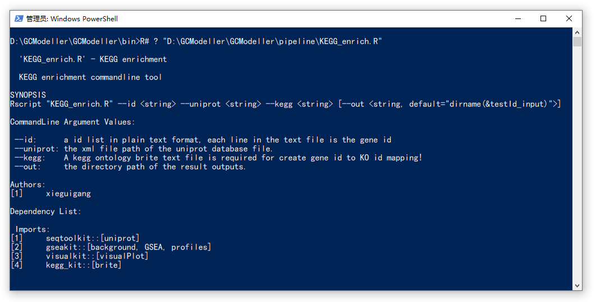

# Usage Note

Run commandline query for script to view commandline of the pipeline script usage

```bash
R# ? /path/to/R#/script.R
```

Example as,

```bash
R# ? KEGG_enrich.R

# D:\GCModeller\GCModeller\bin>R# ? "D:\GCModeller\GCModeller\pipeline\KEGG_enrich.R"
#
#   'KEGG_enrich.R' - KEGG enrichment
#
#   KEGG enrichment commandline tool
#
# SYNOPSIS
# Rscript "KEGG_enrich.R" --id <string> --uniprot <string> --kegg <string> [--out <string, default="dirname(&testId_input)">]
#
# CommandLine Argument Values:
#
#  --id:      a id list in plain text format, each line in the text file is the gene id
#  --uniprot: the xml file path of the uniprot database file.
#  --kegg:    A kegg ontology brite text file is required for create gene id to KO id mapping!
#  --out:     the directory path of the result outputs.
#
# Authors:
# [1]     xieguigang
#
# Dependency List:
#
#  Imports:
# [1]     seqtoolkit::[uniprot]
# [2]     gseakit::[background, GSEA, profiles]
# [3]     visualkit::[visualPlot]
# [4]     kegg_kit::[brite]
```

