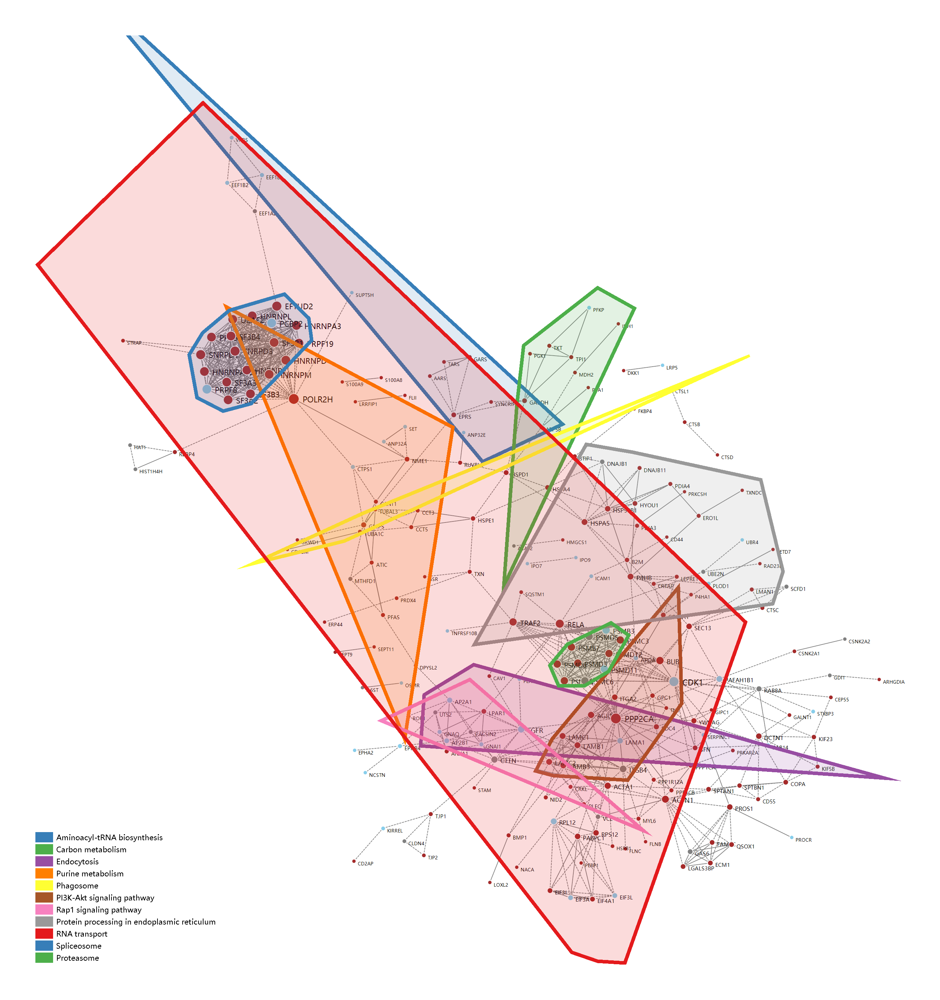
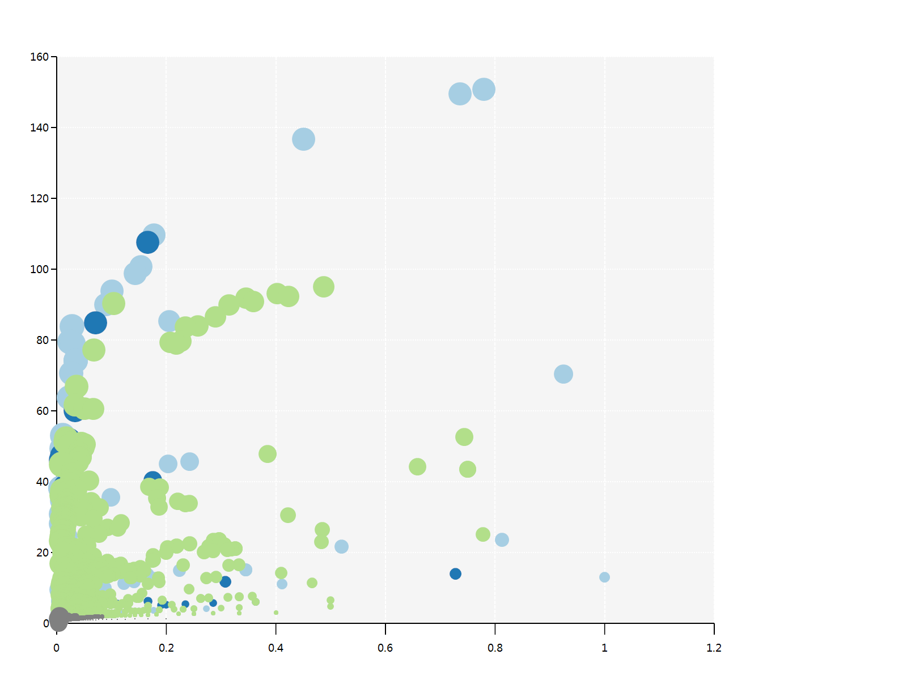
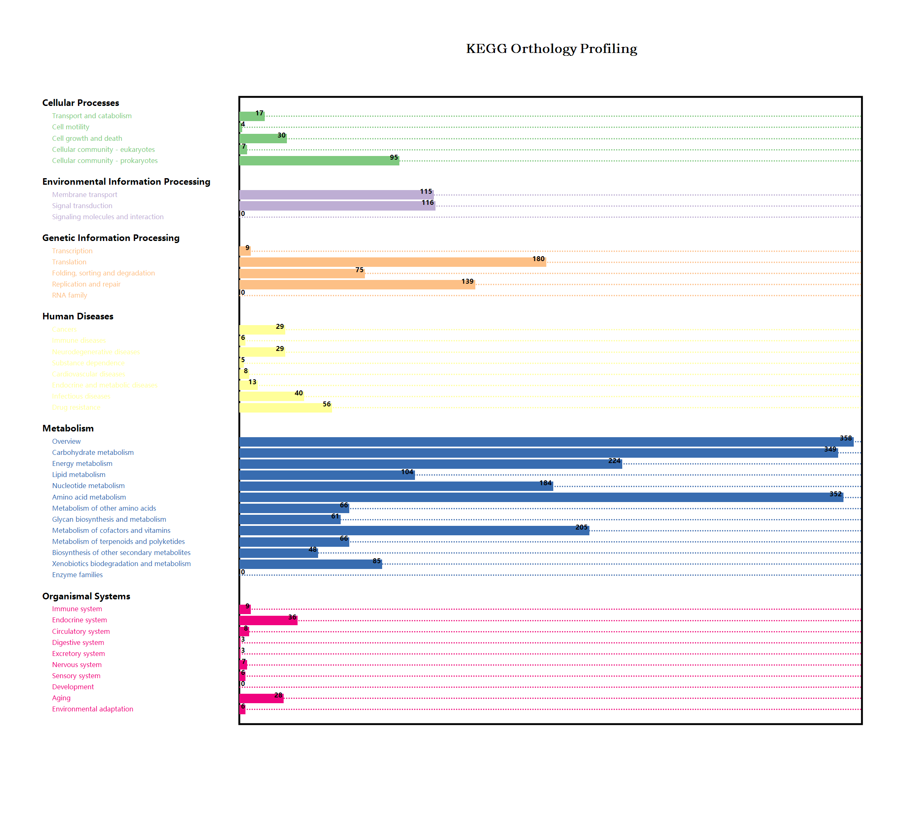
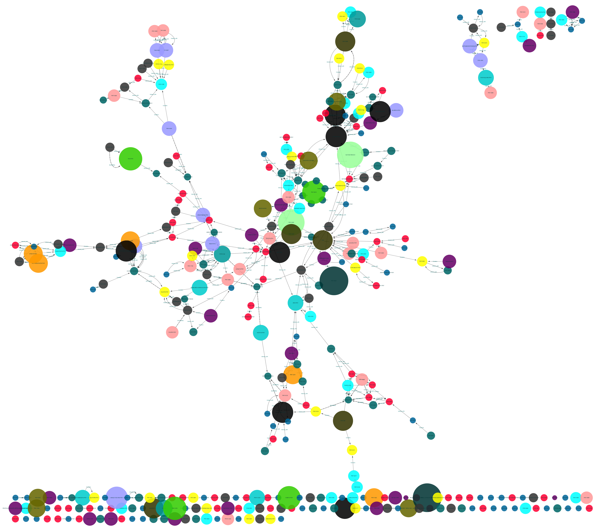
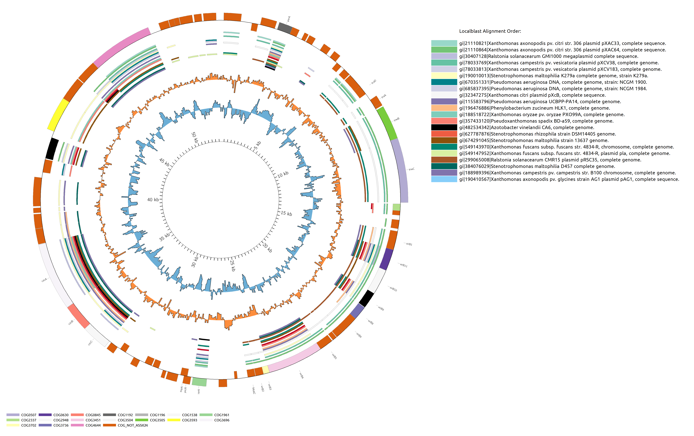

[](https://zenodo.org/badge/latestdoi/48901128)
[]()
[](https://opensource.org/licenses/GPL-3.0/)
[](https://travis-ci.org/SMRUCC/GCModeller)

###### [WARNING] This project is a work in progress and is not recommended for production use.

# GCModeller
GCModeller: genomics CAD(Computer Assistant Design) Modeller system in .NET language

> + HOME: http://gcmodeller.org
> + Github: https://github.com/SMRUCC/GCModeller
> + SDK docs: http://docs.gcmodeller.org

**Supported platform:** ``Microsoft Windows``, ``GNU Linux``, ``MAC``, ``Microsoft Azure Cloud`` <br />
**Development:** Microsoft VisualStudio 2017 | VisualBasic.NET<br />
**Runtime environment:** [sciBASIC#](https://www.nuget.org/packages/sciBASIC/) v2.1.5 beta &amp; ``.NET Framework 4.6`` (or ``mono 4.4``)<br />
**Installation:** ``VS2017`` is required of compiles this project. After the source code have been clone using git, just open solution file **[/src/GCModeller.sln](./src/GCModeller.sln)**, and when restore nuget packages finished, then you are good to go of compile GCModeller project.

**NOTE:** Due to the reason of this project is using git submodule for manage some runtime component, so that **please do not directly download** the project source code from github by using the ``Donwload Zip`` button. The internal github client in the VisualStudio is recommended using for download the project source code.

---------------------------------------------------------------------------------------------------

``GCModeller`` is an open source cloud computing platform for the geneticist and systems biology. You can easily build a local computing server cluster for ``GCModeller`` on the large amount biological data analysis.

The ``GCModeller`` platform is original writen in ``VisualBasic.NET`` language, a feature bioinformatics analysis environment that .NET language hybrids programming with R language was included, which its SDK is available at repository:
https://github.com/SMRUCC/R.Bioinformatics

Currently the ``R`` language hybrids programming environment just provides some ``bioconductor`` API for the analysis in ``GCModeller``.

``GCModeller`` is a set of utility tools working on the annotation of the whole cell system, this including the whole genome regulation annotation, transcriptome analysis toolkits, metabolism pathway analysis toolkits. And some common bioinformatics problem utils tools and common biological database I/O tools is also available in GCModeller for the .NET language programming.

### Directory Roadmap
+ [/GCModeller](./GCModeller) : The location of GCModeller compile output, I have config all of the project output in the path ``./GCModeller/bin/``
+ [/src](./src)
	+ [/src/GCModeller](./src/GCModeller) : GCModeller basic library and analysis protocols
	+ [/src/interops](./src/interops) : GCModeller tools that dependent on the external programs
	+ [/src/R.Bioconductor](./src/R.Bioconductor) : R language hybrids environment
	+ [/src/repository](./src/repository) : GCModeller data repository system
	+ [/src/runtime](./src/runtime) : Third part library and VisualBasic runtime source code
+ [/tools](./tools)

### Data Standards
+ GCModeller supports the ``SBML`` and ``BIOM`` data standards for exchanges the analysis and model data with other bioinformatics softwares.
+ Supports ``PSI`` data for the biological interaction network model
+ Supports ``OBO`` data for ontology database like ``go``.

<a href="http://sbml.org/Main_Page"></a> <a href="http://biom-format.org/"></a> <a href="http://www.psidev.info/overview"></a> <a href="http://www.obofoundry.org/"></a>

### Modules &amp; Functions

GCModeller provides a set of .NET libraries and CLI tools for processing biological analysis data. Currently **GCModeller** can provides these productive ready libraries:

###### 1.Basically libraries

+ NCBI data analysis toolkit: Genbank/Taxonomy/nt/nr database
+ Common Data: FastA database, FastQ, SAM data file I/O class
+ Biological Data Standard Supports: SBML(level 3), BIOM(level1), PSI, OBO
+ Biological Pathway Database: MetaCyc, Reactome, KEGG data tools for .NET language

###### 2.Biological Data Visualization software API for .NET

+ Circos API(genomic visualizing), Cytoscape DataModel API(Biological network visualizing), SequenceLogo(Molecular motif site visualize)

###### 3.Annotation Tools:

+ A complete NCBI localblast toolkit for proteins and nucleotide sequence analysis, includes parallel task library for Win/Linux Server and data analysis protocol.
+ SNP toolkit
+ Nucleotide sequence topology feature site analysis toolkit.
+ RegPrecise database tool and MEME software toolkit for the annotation of bacterial genomics regulation network.
+ Go(Gene Ontology) annotation tools

###### 4.R language hybrids environment for bioinformatics

+ Includes basically R language API, and some R package API from CRAN and Bioconductor

###### 5.WebAPI wrapper for KEGG database and RegPrecise Database

### Publications

Here listing the scientific paperworks that based on the analysis services of GCModeller:

+ _Niu, X.-N., et al. (2015)._ **"Complete sequence and detailed analysis of the first indigenous plasmid from Xanthomonas oryzae pv. oryzicola."** BMC Microbiol 15(1): 1-15.

    + **DOI:** 10.1186/s12866-015-0562-x

> Bacterial plasmids have a major impact on metabolic function and adaptation of their hosts. An indigenous plasmid was identified in a Chinese isolate (GX01) of the invasive phytopathogen Xanthomonas oryzae pv. oryzicola (Xoc), the causal agent of rice bacterial leaf streak (BLS). To elucidate the biological functions of the plasmid, we have sequenced and comprehensively annotated the plasmid.


## Gallery









Visit our project home: http://gcmodeller.org

## For developers
Here are some released library of the ``GCModeller`` is published on nuget, then you can install these library in ``VisualStudio`` from **Package Manager Console**:

```bash
# Install Microsoft VisualBasic sciBASIC# runtime via nuget:
# https://github.com/xieguigang/sciBASIC/
PM>  Install-Package sciBASIC -Pre

# The GCModeller core base library was released:
# https://github.com/SMRUCC/GCModeller.Core
PM>  Install-Package GCModeller.Core

# The NCBI localblast analysis toolkit:
# https://github.com/SMRUCC/ncbi-localblast
PM>  Install-Package NCBI_localblast
```

## For User

The GCModeller demo script and data for user tutorials can be download from these public data repository:
+ [[Xanthomonas campestris pv. campestris 8004] GCModeller genomics Modelling Project](https://github.com/SMRUCC/Xanthomonas_campestris_8004_uid15).

###### genome map plot of Xanthomonas campestris pv. campestris 8004

[](https://github.com/SMRUCC/Xanthomonas_campestris_8004_uid15/tree/master/genome/chromsome-map)
[](https://github.com/SMRUCC/Xanthomonas_campestris_8004_uid15/tree/master/genome/chromsome-map)

----------------------------------------------------------------------------------------------------
 

Copyleft &copy; [SMRUCC genomics](http://smrucc.org) 2016. All rights reversed.
