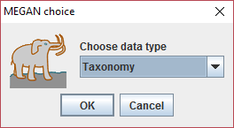

## Build BIOM model for MEGAN

### Reads content profiling between samples

### Assign OTU samples with taxonomy information

About how to creates the metagenome taxonomy information for each OTU sequence, reference to this page: [Annotation of the taxonomy using GCModeller](./Metagenomics_taxonomy.md)

### Export BIOM using GCModeller

```bash
rna-seq ? /Export.Megan.BIOM
# Help for command '/Export.Megan.BIOM':
#
#   Information:
#   Usage:        /home/biostack/GCModeller/RNA-seq /Export.Megan.BIOM /in <relative.table.csv> [/out <out.json.biom>]
#   Example:      CLI usage example not found!

# Example as:
RNA-seq /Export.Megan.BIOM /in OTU-relative_samples.table.csv
```

### Data visualize using MEGAN

+ Once the metagenome BIOM data was generated, then you can imports the file into MEGAN for data visualize and downstream analysis:

> File -> Imports -> BIOM1


+ Then after select your BIOM file from the file open dialog, select the data file type ``Taxonomy`` at this following dialog:



+ If the BIOM file was imports success, a tip will show up:


+ Finally your BIOM data was displayed on MEGAN


