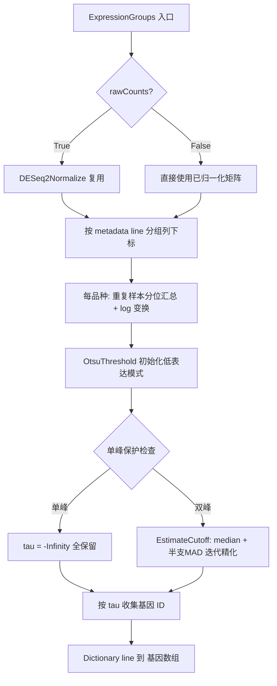

## 需求概述

在无参考基因组的分子育种场景下（两个 4 倍体母本杂交产生 8 倍体子代，共 3 个品种完成转录组测序），依据转录组表达矩阵中**表达值的分布特征**，自动拆分出每个品种（line）基因组所实际携带的基因集合，用表达矩阵的"有表达 / 零或极低表达"模式近似推断基因组组成。

## 核心功能

- **按品种分组**：依据 `SampleInfo.metadata("line")` 的品种编号，把表达矩阵 `Matrix` 的样本列划分为若干品种组；支持任意数量的品种（≥2），不局限于当前 3 个。
- **每品种自适应表达阈值**：对每个品种，用组内重复样本的分位数（默认中位数）汇总出该品种的每基因代表值，做 log2(v+1) 变换后在其分布上做双峰检测，自动确定"零/低表达本底"的判定阈值。
- **单峰保护**：当某品种的表达分布不呈双峰（典型如携带两母本全部基因的 8 倍体子代，全部基因均有表达）时，自动退化为"全部基因保留"，不产生假阴性。
- **阈值精化**：初值由 Otsu 类间方差最大化给出，再用"低表达模式的中位数 + k×MAD"迭代精化，k 等参数可选传入。
- **数据模式开关**：提供开关区分"原始 count 矩阵"与"已归一化矩阵（TPM/FPKM/CPM）"两种输入模式，count 模式下函数内部自行完成文库深度校正。
- **通用输出**：返回 `Dictionary(Of String, String())`，键为品种编号，值为该品种基因组基因 ID 数组；不额外输出并集/交集/特异集等派生集合。

## 边界与约束

- 实现位置限定在 `GCModeller\analysis\HTS_matrix\Math\ExpressionScale.vb` 第 110-112 行的空函数 `ExpressionGroups` 中（可在同模块内补充私有辅助函数）。
- 新增参数必须为 `Optional`，保持既有调用方兼容。

## 技术栈

- 语言/平台：Visual Basic .NET（`HTS_matrix-netcore5.vbproj`，TargetFramework `net10.0`，RootNamespace `SMRUCC.genomics.Analysis.HTS.DataFrame`）。
- 现有类型：`Matrix`（`sampleID`、`expression As DataFrameRow()`、`size`、`sample_count`、`IndexOf`、`Project`）、`DataFrameRow`（`geneID`、`experiments As Double()`、`Default Value(Integer()) As Double()`）、`SampleInfo`（`ID`、`sample_info`、`metadata`，`Default Value(name)` 对 `Nothing` 安全）。
- 可用统计：`Microsoft.VisualBasic.Math.Statistics.Linq`（`Median`、`SD`，项目内已在用）。
- 复用归一化：同项目 `Math\DESeq2Normalization.vb` 的 `<Extension> DESeq2Normalize(countData As Matrix) As Matrix`（DESeq2 median-of-ratios size factor）。
- 不引入外部依赖：KMeans/GMM/Otsu 位于 DataMining、MachineLearning、Visualization 项目，**不在** HTS_matrix 引用范围内，故本地实现；`Vector.MAD` 位于 `Microsoft.VisualBasic.Math.Distributions`（目标文件未 Imports），故本地实现以避免命名冲突。

## 实现方案

### 总体策略

对一个表达矩阵，先在品种维度上把列分组，再对每个品种独立估计"背景本底（absent 模式）"的分布上界作为判定阈值，最后按阈值把基因行分配给各品种。核心是一个**鲁棒的双峰分割 + 单峰保护**流程，而非依赖人工设定阈值，从而对任意品种数量与任意倍性都通用。

### 算法流程（每个品种独立执行）

1. **列分组**：遍历 `sampleinfo`，取 `metadata(lineKey)`（默认 `"line"`）作为品种键；键缺失时回退 `sample_info` 并输出 warning；用 `Matrix.IndexOf` 映射到列下标，矩阵中不存在的样本跳过。
2. **数据模式**：`rawCounts = True` 时先调用 `exp.DESeq2Normalize()` 做 median-of-ratios 校正（**不用列总和/CPM**——8 倍体子代表达基因数本就更多，总计数归一化会引入系统性偏差）；`False` 时假定输入已归一化，不做校正。
3. **每基因代表值**：对品种内重复样本取 `presenceQuantile` 分位（默认 0.5，即中位数）得到 `v_g`，再取 `x_g = log(v_g + 1) / log(logBase)`。这天然等价于"必须在 ≥(1−p) 比例的重复中表达"的存在性判据，无需额外的 minPresence 参数；单重复时退化为该样本值；NaN/虚数按 0 处理。
4. **Otsu 初始化**：对 `x` 排序并求前缀和，在 1%~99% 分位网格（约 199 个候选）上最大化类间方差 `w0*w1*(μ0−μ1)^2`，得到初始 `τ0` 与 low/high 划分。
5. **单峰保护**：若 low 占比 `< minAbsentFraction`（默认 1%）或 `> 1−minAbsentFraction`，或两峰分离度 `gap = (μ_high−μ_low)/max(σ_low,σ_high) < minGap`（默认 1.5），判定为单峰 → `τ = −Infinity`，该品种全部基因保留（8 倍体子代走此分支）。
6. **MAD 迭代精化**：`μ0 = median(low)`，`σ0 = 1.4826 × median(|x−μ0|, x ∈ low 且 x ≤ μ0)`（**只用下半支 MAD**，抵抗表达基因尾部污染并保证迭代收敛），`τ = μ0 + k×σ0`；重复至多 10 次或收敛。`σ0 = 0`（该模式全为 0）时 `τ = μ0`，退化为"v > 0 即存在"。
7. **判定与输出**：基因属于该品种 ⟺ `x_g > τ` 且 `v_g >= absFloor`（默认 0）；按矩阵原始行序收集 geneID 输出。

### 复杂度与性能

- 复杂度：每个品种一次 `O(G log G)` 排序 + `O(G)` 前缀和与 `O(C)` 候选扫描（C≈199），总计 `O(L·G·log G)`，L 为品种数。5 万基因 × 5 品种量级为毫秒到百毫秒级，无额外内存峰值（除一份排序副本）。
- 热点规避：不在循环内重复分配数组；Otsu 用前缀和避免 `O(G·C)` 的重复求和；`DataFrameRow.Value(Integer())` 一次性取子集，避免逐列索引。
- 日志：沿用项目 `Call $"...".warning` 风格，仅输出"分组键缺失回退"与"该品种判为单峰/阈值"等少量摘要，不打印基因或样本全量列表。

### 向后兼容

- 所有新增参数均为 `Optional`，既有 `ExpressionGroups(exp, sampleinfo)` 调用签名与行为（默认已归一化数据、默认 log2、默认 k=3）保持不变。
- 不修改 `Matrix`、`DataFrameRow`、`SampleInfo` 等既有类型的任何成员，改动集中在一个文件内。

## 执行要点（落地细节）

- 阈值以 **log 空间**为准（便于诊断），可通过 `ByRef thresholds` 可选参数回传，日志中同时打印还原后的原始尺度值 `2^τ − 1`。
- 空值防御：`exp` / `sampleinfo` 为 `Nothing`、矩阵无样本、某品种在矩阵中无对应列等情况均安全返回（该品种返回空数组或跳过），不抛异常。
- 分隔符与键名冲突：品种键直接来自元数据，不做改写；若不同样本同一 `ID` 出现重复元数据，以先出现者为准并记录 warning。
- 判定使用严格大于 `>`，保证 `τ=0` 时语义为 `v > 0`（与"零表达即缺失"一致）。

## 架构设计

改动完全收敛在 `ExpressionScale` 模块内部，为"公开入口 + 私有统计辅助"的两层结构，不新增类型、不新增文件、不触碰既有类：



## 目录结构

```
GCModeller/analysis/HTS_matrix/
└── Math/
    └── ExpressionScale.vb   # [MODIFY] 在 ExpressionGroups(exp, sampleinfo) 空函数体内实现完整算法；
                             #          并新增同模块私有辅助：QuantileSorted(分位数, 取序统计量, 无插值)、
                             #          OtsuThreshold(排序x + 前缀和 + 分位网格扫描, 返回 tau 与 low/high 划分)、
                             #          LowHalfMAD(下半支中位数绝对偏差 * 1.4826)、
                             #          EstimateCutoff(单峰保护 + 迭代精化, 返回最终 tau)。
                             #          [依赖] 复用同项目 Math/DESeq2Normalization.vb 的 DESeq2Normalize 扩展方法，
                             #                 不修改该文件；不改动 Matrix/DataFrameRow/SampleInfo。
```

## 关键代码结构

公开入口签名（新增参数全部 Optional，保持向后兼容）：

```
Public Function ExpressionGroups(exp As Matrix,
                                 sampleinfo As IReadOnlyCollection(Of SampleInfo),
                                 Optional lineKey As String = "line",
                                 Optional rawCounts As Boolean = False,
                                 Optional logBase As Double = 2,
                                 Optional kMAD As Double = 3,
                                 Optional presenceQuantile As Double = 0.5,
                                 Optional minAbsentFraction As Double = 0.01,
                                 Optional minGap As Double = 1.5,
                                 Optional absFloor As Double = 0,
                                 Optional verbose As Boolean = True,
                                 Optional ByRef thresholds As Dictionary(Of String, Double) = Nothing
                                ) As Dictionary(Of String, String())
```

私有辅助函数签名（同模块内）：

```
' 取排序向量的 p 分位（序统计量，无插值）
Private Function QuantileSorted(sorted As Double(), p As Double) As Double

' Otsu 类间方差最大化：返回候选阈值与低表达侧元素个数
Private Function OtsuThreshold(sorted As Double(), ByRef nLow As Integer) As Double

' 下半支 MAD 尺度估计（抗表达基因尾部污染，保证迭代收敛）
Private Function LowHalfMAD(values As IEnumerable(Of Double), median As Double) As Double

' 单峰保护 + 中位数/MAD 迭代精化，返回最终 log 空间阈值；单峰时返回 Double.NegativeInfinity
Private Function EstimateCutoff(sorted As Double(), kMAD As Double,
                                minAbsentFraction As Double, minGap As Double) As Double
```