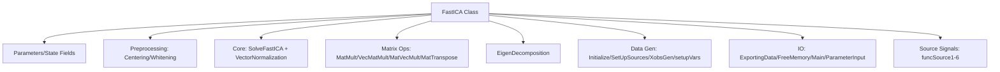

## 用户需求

整理 `runtime\sciBASIC#\Data_science\Mathematica\Math\Math.Statistics\FastICA.vb` 模块中混乱的 VB 源代码风格，并为该类的每一个对象（方法、子过程、字段、常量）补充完善的 XML 文档注释。

## 产品概述

对 FastICA 独立分量分析算法的 VB 实现模块进行纯风格级重构（不改动任何数学计算逻辑），使代码符合 VB.NET 惯用写法，并补齐从 0% 到完整覆盖的 XML 文档，提升可读性与可维护性。

## 核心特性

- 将 C 风格 `While...End While` 循环改写为 `For` 循环，变量就近声明
- 为所有方法参数显式标注 `ByVal`/`ByRef`，保持数学语义不变
- 删除所有 C 源文件头注释残留块（如 `AlgorithmFunctions.c`、`MatrixOps.c` 等移植痕迹）
- 清理 `ExportingData` 中被注释掉的 C `fopen/fprintf` 死代码，改为精简英文说明
- 为类的全部成员（函数、子过程、字段、常量）添加 `''' <summary>` 等 XML 文档
- 保留文件头 GPL3 License Region、Imports 语句，以及所有公开字段的原始声明

## Tech Stack Selection

- 语言：Visual Basic (.NET) — 与现有项目完全一致，无新增依赖
- 文档标准：VB.NET XML 文档注释（`''' <summary>` / `<param>` / `<returns>` / `<remarks>`），与同目录 `Extensions.vb` 风格一致
- 辅助类：`Microsoft.VisualBasic.ComponentModel.Collection.RectangularArray.Matrix(Of T)`（已在使用，保持不变）

## Implementation Approach

采用**纯风格重构 + 文档化**策略：在不改变任何数学计算行为、方法签名语义、公开字段布局的前提下，逐成员重写代码体并补全 XML 注释。

- **循环改写**：所有 `While i < N ... i += 1 ... End While` 改为 `For i As Integer = 0 To N - 1`，减少循环变量集中声明与手动自增错误风险。
- **变量就近声明**：原在过程顶部集中 `Dim i, j, k` 改为在 `For` 循环声明或首次使用前声明，遵循 VB.NET 惯用作用域最小化原则。
- **参数显式修饰符**：为所有方法参数补充 `ByVal`（默认）或 `ByRef`（如 `EigenDecomposition` 的 `EigValues`、`VecMatMult` 的 `V`、`VectorNormalization` 的 `wp`、`MatVecMult` 的 `V`），保持引用语义不变。
- **删除 C 残留**：移除第 64-69、384-389、433-445、608-613、911-916、921-926、953-964、1013-1018、1046-1051、1088-1131 行等处的 C 文件头注释块，仅保留 FastICA 算法整体来源的一句话英文说明（置于类级 `<summary>`）。
- **XML 文档**：为 `FastICA` 类、`RAND_MAX` 常量、全部 `Public`/`Private` 成员、全部公开字段补充英文 XML 注释，描述数学含义、参数、返回值。

**性能与可靠性**：纯结构重写，时间/空间复杂度与原实现一致（矩阵乘法 O(N³)、特征值分解 O(N³·iterations)）；无新增分配或 I/O；不改变 `Double()()` 锯齿数组与 `RectangularArray.Matrix` 的协作方式，确保编译通过。

**避免技术债**：严格沿用现有 `std = System.Math`、`rand = RandomExtensions`、`RectangularArray.Matrix` 的别名与调用约定，不引入新工具或泛型封装，避免范围扩散。

## Implementation Notes

- **保持数学等价**：`SolveFastICA` 中随机初始化 `CDbl(rand.NextNumber()) / RAND_MAX`、Gram-Schmidt 正交化、tanh 非线性等核心逻辑逐行对应，仅改循环语法糖，禁止优化计算顺序。
- **`ExportingData` 处理**：删除第 400-431 行被注释的 C 代码块，保留为空 `Sub` 并加 `<summary>` 说明其原本用于导出 `SourcesEstimation.txt`（当前实现为空壳，保持不破坏调用链）。
- **字段排序**：公开字段（第 1133-1159 行）保持原顺序与 `Public` 修饰，仅追加 `''' <summary>`；`[end]` 方括号转义标识符原样保留。
- **文档一致性**：`<param>` 名称必须与参数标识符完全一致（含大小写），确保 VB XML 文档生成无警告。

## Architecture Design

单文件单类结构（不变），仅内部成员顺序与注释增强：



## Directory Structure

```
runtime/sciBASIC#/Data_science/Mathematica/Math/Math.Statistics/
└── FastICA.vb   # [MODIFY] 纯风格重构 + 完整 XML 文档。
                 #  - 删除所有 C 文件头注释残留块
                 #  - While 循环改写为 For 循环，变量就近声明
                 #  - 参数显式标注 ByVal/ByRef
                 #  - 清理 ExportingData 中注释掉的 C 死代码
                 #  - 为类、常量 RAND_MAX、全部方法与公开字段补充英文 XML 文档
                 #  - 保留 GPL3 Region、Imports、公开字段声明与数学逻辑不变
```

## Key Code Structures

以下为重构后的典型成员签名示例（仅示意契约，不实现方法体）：

```
''' <summary>
''' Performs the centering operation on the observation matrix Xobs by subtracting the per-row mean.
''' </summary>
''' <param name="Xobs">The original observation matrix (N x M).</param>
''' <param name="N">Number of sources / rows.</param>
''' <param name="M">Number of observation samples / columns.</param>
''' <returns>The centered matrix X (N x M).</returns>
Public Function PreprocessingCentering(ByVal Xobs As Double()(), ByVal N As Integer, ByVal M As Integer) As Double()()

''' <summary>
''' Computes the eigenvalues (ByRef) and eigenvectors of a real symmetric N x N matrix using iterative Jacobi-like rotation.
''' </summary>
''' <param name="ExxT">Input symmetric covariance matrix.</param>
''' <param name="N">Matrix dimension.</param>
''' <param name="EigVectors">Output eigenvectors matrix.</param>
''' <param name="EigValues">Output eigenvalues vector (passed ByRef).</param>
''' <param name="iterations">Number of decomposition iterations.</param>
Public Sub EigenDecomposition(ByVal ExxT As Double()(), ByVal N As Integer, ByVal EigVectors As Double()(), ByRef EigValues As Double(), ByVal iterations As Integer)
```