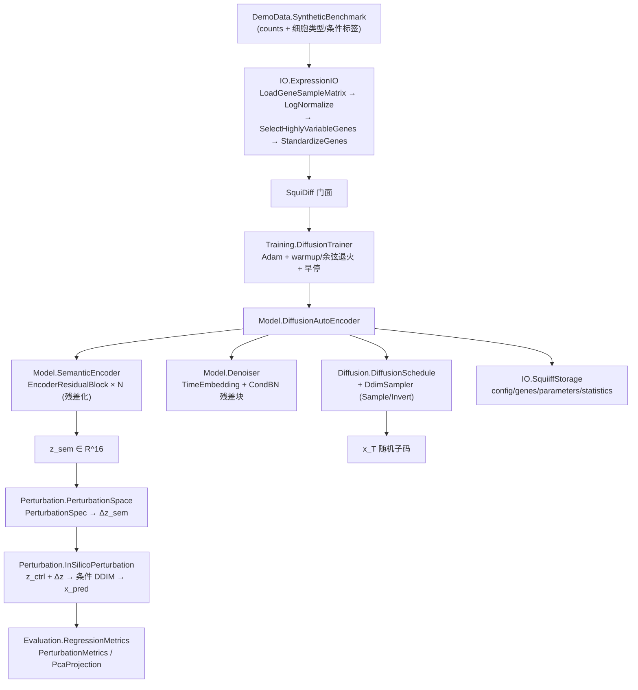

## 产品概述

SquiDiff（Single-cell QUantitative Inference of stimuli responses by DIFFusion models）是一个基于**条件 DDIM + 扩散自编码器**的单细胞虚拟扰动预测框架。本任务要求以 `GCModeller/sub-system/Squiiff/readme.md` 的算法描述为准绳，在 `Squiiff/Squiiff.vbproj` 现有底层依赖（`TensorFlow.Tensor` 张量库、`DeepLearning.TensorOps`、手写 NN 层体系）之上，补齐尚未实现或有偏差的算法环节，并让 `Squiiff/test/test.vbproj` 从"只跑梯度校验"升级为一条可复现、可断言、可导出的端到端演示。

## 核心功能

1. **工程可编译**：修正 `Squiiff.vbproj` 中 `HTS_matrix` 工程引用路径错误（少一级目录），这是当前编译失败的根因；修复其余编译期错误。
2. **语义编码器残差化**：readme 第四节要求语义编码器为"条件批归一化 + 残差连接"的 MLP，现有实现是纯串行 `Linear→Act→[BN→Act→Linear]×N`，需改为残差块堆叠；并接线当前**完全未被读取**的 `SquiiffConfig.EncoderConditioned` 开关。
3. **DDIM 数值精度**：`DiffusionSchedule.Recombine` 目前用 `CSng` 把 ᾱ 系数降为单精度，破坏 `Sample(Invert(x0)) ≈ x0` 的确定性往返可逆性，改为 Double 精度标量缩放。
4. **训练样本覆盖**：`DiffusionTrainer.Fit` 每轮丢弃尾部不足一批的细胞，需补齐。
5. **扰动空间管理**：`PerturbationSpec` 目前无任何调用方；新增"扰动名 → Δz_sem"登记表，支持按名预测与**组合扰动外推**（Δz_A + Δz_B），对应 readme 第六节的非可加性检验场景。
6. **模型存档保真**：`SquiiffStorage` 需额外存档 BN / 条件 BN 的滑动均值与方差，使 Save→Load 后推理结果逐位一致。
7. **端到端演示**：用 `DemoData` 合成基准（3 细胞类型 × ctrl/ko_kinA/ko_kinB/组合扰动）走完"计数 → CSV → 通用加载链 → log1p 归一化 → 高变基因 → z-score → 训练 → 编码/重建 → Δz 估计 → 扰动预测 → 组合外推 → 插值轨迹 → 方向一致性 → 评估 → 存档往返 → 导出 CSV"全流程。
8. **可复现断言**：梯度校验通过、训练损失下降、DDIM 自编码往返保真、Save→Load 逐位一致、插值端点一致；扰动预测质量指标只报告不硬断言。

## 技术栈

- 语言 / 框架：Visual Basic .NET，SDK 风格工程，`net10.0`（已安装 `dotnet 10.0.401`）
- 张量计算：`Microsoft.VisualBasic.MachineLearning.TensorFlow`（`Tensor` + `ITensorCompute` SIMD 后端）——**无自动微分**，所有层手写 Forward/Backward
- 算子辅助：`Microsoft.VisualBasic.MachineLearning.Transformer.TensorOps`（`ConcatLastDim` / `Accumulate` / `CloneTensor` / `HeNormalInit`）
- 表达矩阵加载：`SMRUCC.genomics.Analysis.HTS.DataFrame.Matrix.LoadData` + `BNLearn.IO.BnIO.ReadGeneExpressionMatrix`
- 解决方案：`Squiiff.slnx`（x64 平台映射）
- 约束：**不修改** `runtime/sciBASIC#` 下任何工程，仅在 Squiiff 库与 test 工程内实现

## 实现方案

### 总体策略

先"打通编译"，再"补齐算法"，最后"端到端跑通"。三者严格串行：工程引用错误会屏蔽一切后续验证；算法改动依赖梯度校验作为正确性护栏；demo 是唯一的回归验证手段。

### 关键技术决策

1. **新增 `EncoderResidualBlock`（非条件 BN 版残差块）而不是复用 `ResidualBlock`**

- 理由：`NN/ResidualBlock.vb` 现为**条件**残差块（内部固定 `ConditionalBatchNorm`，`Backward` 额外输出 `dCond`），且实现的是 `IParameterized` 而非 `LayerModule`，无法放入 `Sequential`。语义编码器默认走非条件 BN（避免 `Δz = Enc(x_pert) − Enc(x_ctrl)` 的标签泄漏），因此需要独立的 `LayerModule` 残差块。
- 结构：`BN₁ → Act → Linear₁ → BN₂ → Act → Linear₂`，`out = x + v`；维度不匹配时用 1×1 线性投影做跳跃连接（编码器首块 `geneCount → hidden` 必然升维，必须支持）。
- 该块同时是 `LayerModule`，可直接挂进 `GradientCheck.CheckLayer` 做有限差分校验，与现有校验风格一致。

2. **`EncoderConditioned` 的接线方式**：为 True 时把块内 `BatchNorm` 换成 `ConditionalBatchNorm`，条件向量由外部传入的 `condition` 张量（默认 Nothing 时用零向量，退化为非条件）。默认 False，保持隐空间向量算术的可解释性。这样既不改默认行为，又让死配置生效且可对比。

3. **`Recombine` 改 Double**：用 `TensorUtil.Scale`（`computeKernel.MultiplyScalar(Double)`）替代 `x0Hat * CSng(...)`。这是 DDIM 往返可逆性（扩散自编码器"编码"一半成立）的前提，也是 demo 中"重建 PCC"断言能否达标的关键。

4. **组合扰动外推放 `PerturbationSpace` 而非塞进 `InSilicoPerturbation`**

- 理由：`InSilicoPerturbation` 目前只吃"裸 Δz 张量"，不知道扰动名；`PerturbationSpec` 是元数据。新增 `PerturbationSpace` 作为"元数据 ↔ 隐向量"的登记处，符合单一职责；`Squiiff` 门面只加薄封装，不破坏现有 API。

5. **存档格式向后兼容**：新增 `statistics.tsv` 条目（层名 + 元素数 + 数值）。`SquiiffStorage.Load` 中该条目缺失时静默跳过（沿用初始 running mean=0 / var=1），旧存档仍可读；参数还原的"数量必须完整"校验保持不变。

6. **demo 断言口径**：只对与训练质量无关的确定性性质做硬断言（梯度校验、损失下降、DDIM 往返、存档往返、插值端点），扰动预测 PCC / Top-K 重叠只打印报告。避免在合成数据上因训练波动造成 demo 偶发失败。

### 性能与可靠性

- **训练规模**：600 细胞 × 200 基因，batch=64 → 9 步/轮，300 轮 ≈ 2700 步；每步仅 3 个 `[64,128]` 残差块的前反向，毫秒级，整体应在数十秒内完成。
- **推理热点**：`EncodeToSubcode` + `Sample` 各 100 步串行前向（`InferenceSteps=100`），是 demo 耗时主项。demo 中把被预测的细胞数控制在 ~50，必要时通过 `SquiiffConfig.InferenceSteps` 调小以压缩时间。
- **避免 N+1 式小步张量分配**：沿用 `TensorUtil.OnesColumn/OnesRow` 的按尺寸缓存复用，`Recombine` 改动不得引入逐元素循环。
- **随机性可控**：全部噪声走 `DiffusionAutoEncoder._rng`（由 `Seed` 初始化）与 `TensorUtil.StandardNormal`，训练器用 `Seed + 777` 独立洗牌流，保证 demo 可复现。
- **日志**：沿用 `DiffusionTrainer` 的 `LogInterval` 节流打印（默认每 10 轮），demo 用 `[n/m]` 步骤式进度输出，不打印大张量。

## 执行要点（防回归）

- `Tensor` 的 `Operator -` **要求两侧形状完全一致**且不广播；所有广播加/减必须走 `TensorUtil.BroadcastAdd/BroadcastSubtract/RowScale`。新增编码器反向代码同样受此约束。
- 新增/修改任何手写反向层后，**必须**在 `GradientCheck` 中补一条有限差分校验再跑 demo；扩散模型反向一旦有误，损失曲线会无意义地停滞或发散。
- `SemanticEncoder` 结构变更会改变参数命名（`encoder.bn{i}` / `encoder.fc{i}` 等），而 `SquiiffStorage` 按**名称**匹配参数；旧存档将因"参数还原不完整"报错——这是预期行为（结构不兼容），但需保证 `statistics.tsv` 缺失时仍能读旧档。
- `Sequential.Parameters` 是遍历子层实时聚合，新增残差块后无需改 `ParameterGroups` 调用点。
- `TakeBatch` 补齐尾部批次时，需保证最后一个批次不越界（`order` 索引取模或把凑不满的部分补随机重采样），否则会抛 `IndexOutOfRangeException`。
- 不改动 `SquiiffConfig` 的公开字段集合及其默认值语义，避免 `config.tsv` 序列化/反序列化出现未预期字段。

## 架构设计



数据流：计数矩阵 → 预处理张量 `[cell, gene]` → 训练（噪声预测损失 + β·KL）→ 语义编码 + DDIM 反演得到 `(z_sem, x_T)` → 隐空间向量算术得到 `z_sem^new` → 条件 DDIM 解码得到预测转录组 → 指标评估 + CSV 导出。

## 目录结构

```
GCModeller/sub-system/Squiiff/
├── Squiiff/
│   ├── Squiiff.vbproj                          # [MODIFY] 修正 HTS_matrix 工程引用路径为 ..\..\..\analysis\HTS_matrix\HTS_matrix-netcore5.vbproj；其余引用保持不变
│   ├── Squiiff.vb                              # [MODIFY] 门面接入 PerturbationSpace：RegisterPerturbation / EstimatePerturbation / PredictByPerturbation / PredictCombination / InterpolateBetween 薄封装；Load 时一并还原 BN 统计量
│   ├── NN/
│   │   └── EncoderResidualBlock.vb             # [NEW] 非条件 BN 残差块（LayerModule）：BN→Act→Linear→BN→Act→Linear + 跳跃连接（含升维时的 1×1 投影）；实现 Forward/Backward/Parameters，供 Sequential 组装与 GradientCheck 复用
│   ├── Model/
│   │   └── SemanticEncoder.vb                  # [MODIFY] 主干由纯串行改为 Linear_in → EncoderResidualBlock × EncoderBlocks → μ/logVar 双头；接线 EncoderConditioned（True 时块内 BN 换 ConditionalBatchNorm 并接受外部 cond）；保持 KLDivergence/Backward(dZ, betaKL) 语义不变
│   ├── Diffusion/
│   │   └── DiffusionSchedule.vb                # [MODIFY] Recombine 改用 Double 标量缩放（TensorUtil.Scale）替代 CSng 单精度路径，恢复 DDIM 往返可逆性
│   ├── Training/
│   │   └── DiffusionTrainer.vb                 # [MODIFY] Fit 覆盖不足一批的尾部样本（补齐最后一个小批次），修正 stepsPerEpoch 计算，避免部分细胞永不参与训练
│   ├── Perturbation/
│   │   ├── PerturbationSpace.vb                # [NEW] 扰动登记表：PerturbationSpec → Δz_sem；提供 Register/Estimate(control,perturbed,spec)/TryGet/Combine(names)→ΣΔz/Describe；复用 LatentArithmetic.MeanRows 求组中心
│   │   └── InSilicoPerturbation.vb             # [MODIFY] 增加按 PerturbationSpace 的预测入口（按名取 Δz / 组合 Δz 求和），保留现有 Predict(controlCells, delta, mode, snapshots) 签名不变
│   └── IO/
│       └── SquiiffStorage.vb                   # [MODIFY] 新增 statistics.tsv 条目：存档/还原 BatchNorm 与 ConditionalBatchNorm 的 running mean / running variance（按层名匹配）；缺失时静默跳过以兼容旧存档
└── test/
    ├── SquiiffDemo.vb                          # [NEW] 端到端演示 Module：合成数据 → CSV → ExpressionIO 加载链 → 预处理 → 训练 → 重建/子码 → Δz 估计 → 单扰动/组合扰动预测 → 插值轨迹 → 跨细胞类型方向一致性 → 评估 → Save/Load 往返一致性 → 导出 CSV 报告到 App.HOME/Squiiff_output/
    ├── GradientCheck.vb                        # [MODIFY] 追加 EncoderResidualBlock 的有限差分校验项
    ├── Program.vb                              # [MODIFY] 串联 GradientCheck.Run() 与 SquiiffDemo.Run()，Try/Catch 包裹并返回退出码（对齐 GEARS/test/Program.vb 风格）
    └── test.vbproj                             # [MODIFY] 仅当编译需要时补充引用（依赖经 Squiiff.vbproj 传递，预期无需改动）
```

## 关键代码结构

```
' NN/EncoderResidualBlock.vb —— 语义编码器残差块（非条件 BN 版，可进 Sequential）
Public Class EncoderResidualBlock
    Inherits LayerModule

    ' hidden：块内宽度；inFeatures != hidden 时自动加 1×1 跳跃投影
    Public Sub New(name As String, inFeatures As Integer, hidden As Integer,
                   Optional activation As ActivationKind = ActivationKind.SiLU,
                   Optional conditioned As Boolean = False,
                   Optional conditionDim As Integer = 0)

    ' cond 为 Nothing 时按非条件路径执行（推理期确定性）
    Public Overrides Function Forward(x As Tensor, training As Boolean) As Tensor
    Public Function Forward(x As Tensor, cond As Tensor, training As Boolean) As Tensor

    Public Overrides Function Backward(dOut As Tensor) As Tensor
    Public Function Backward(dOut As Tensor, ByRef dCond As Tensor) As Tensor

    Public Overrides ReadOnly Property Parameters As IEnumerable(Of Parameter)
End Class
```

```
' Perturbation/PerturbationSpace.vb —— 扰动名 → 语义方向向量登记表
Public Class PerturbationSpace

    ' 用对照/扰动两组细胞的语义隐变量中心估计 Δz 并登记
    Public Function Estimate(spec As PerturbationSpec,
                             controlCells As Tensor,
                             perturbedCells As Tensor,
                             encoder As DiffusionAutoEncoder) As Tensor

    ' 组合外推：Σ Δz（非可加性场景下预期存在系统性偏差，用于 readme 第六节检验）
    Public Function Combine(ParamArray names As String()) As Tensor

    Public Function TryGet(name As String, ByRef delta As Tensor) As Boolean
    Public ReadOnly Property Items As IReadOnlyDictionary(Of String, PerturbationSpec)
End Class
```

## Agent Extensions

### Skill

- **lsp-code-analysis**
- Purpose：在修改 `SemanticEncoder`、新增 `EncoderResidualBlock` / `PerturbationSpace` 后，精确定位所有引用点（定义、引用、实现）以评估改动影响面，并在编译排错阶段快速定位报错符号
- Expected outcome：列出 `SemanticEncoder`、`Sequential`、`PerturbationSpec`、`SquiiffStorage` 的全部调用方，确认无遗漏的接线点，编译错误可定位到具体符号

### SubAgent

- **code-explorer**
- Purpose：在编译排错阶段跨工程检索 `HTS_matrix` / `BNLearn` / `TensorFlow` 相关符号与同类工程（GEARS / SpikingLoop）的引用写法，确认路径与 API 用法
- Expected outcome：确认工程引用路径修正方案与 `ExpressionIO` 依赖的 API 签名，避免反复试错