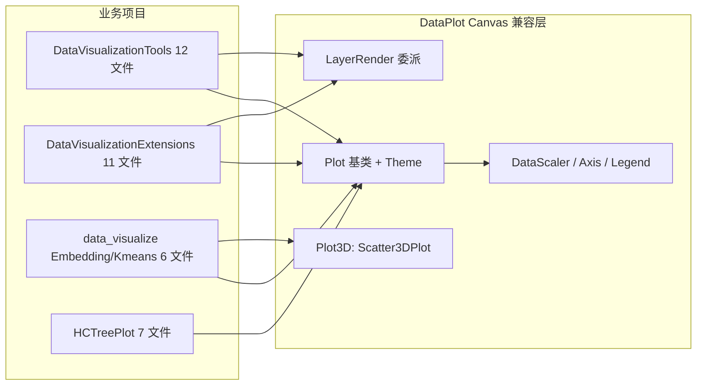

## 产品概述

按照此前推荐的迁移顺序，完成 GCModeller 仓库中剩余旧绘图引擎（plots-netcore5.vbproj / plots_extensions-netcore5.vbproj，命名空间 `Microsoft.VisualBasic.Data.ChartPlots.*`）使用方的第一批迁移（第①②③组），全部切换到新引擎 DataPlot（`Microsoft.VisualBasic.Data.Plots`），并移除相关 vbproj 的旧项目引用。

## 核心功能

- **兼容层缺口补齐**：DataPlot Canvas 层补齐 4 个缺失基元（旧 `XAxis` 轴绘制类、`ColorMapLegend` 色阶图例、`AxisScalling.GetAxisByTick`、`Theme.legendLayout/Absolute`），并确认/补齐 `BubblePlot` 与 `Scatter3DPlot` 的共享画布能力
- **第①组A DataVisualizationTools**（12 个文件）：b 类继承体系切换到 `Canvas.Plot` 基类；`PatternPlot.vb` 的旧 `Scatter.Plot` 静态多面板调用改写为 `LayerRender` 委派；`GSVADiffBar.vb` 的 `XAxis`、`EnrichmentCategoryHeatmap.vb` 的 `ColorMapLegend` 切换到兼容层
- **第①组B DataVisualizationExtensions**（11 个文件）：b 类切换；`CatalogBubblePlot.vb` 的旧 `Bubble` 气泡引擎改写为新引擎委派；`LabelDisplayStrategy.vb` 的 `SerialData` → `Series`
- **第②组 data_visualize Embedding/Kmeans**（6 个文件）：基类切换 + 两处 3D 渲染（`Embedding3D` 的 `Scatter3D`、`Kmeans` 的 `Serial3D.Plot`）改用 DataPlot `Plot3D` 引擎，解除 vbproj 中"3D 待迁移"注释标记的旧 plots 引用
- **第③组 HCTreePlot**（7 个文件）：通过 `DendrogramPanel.vb` 的 `Chart` 别名切换到 Canvas `Plot` 完成整条继承链迁移，严格保留 `DendrogramPanelV2.Paint(g, layout)` 公开 API
- **引用清理与验证**：三个（组）vbproj 移除旧 plots 引用改引 DataPlot，逐项目编译通过，全库确认无 `ChartPlots` 残留

## 技术栈

- 语言：VB.NET / .NET 10.0（各目标项目与 DataPlot 同为 net10.0）
- 目标引擎：`runtime/sciBASIC#/Data_science/Visualization/DataPlot/DataPlot.vbproj`
- 兼容层：DataPlot `Canvas/`（Plot 基类、Theme、GraphicsRegion、DataScaler、AxisScalling、Axis.DrawAxis、LayerRender、ThemeBridge）——已完成并经 ggplot/R# 三包迁移验证

## 实现方案

### 迁移范式（沿用已验证的两类改写）

- **b 类（占绝大多数，约 30 个文件）**：`Inherits Plot` / `Chart = ChartPlots.Graphic.Plot` 别名与 Imports 从 `ChartPlots.*` 切换到 `Microsoft.VisualBasic.Data.Plots.Canvas`，`PlotInternal(ByRef g, canvas)` 契约不变，`Plot(size, dpi, driver)` 签名不变，继续返回 `GraphicsData`
- **a 类（3 处改写主体 + 2 处 3D）**：
- `PatternPlot.vb`：旧静态 `Scatter.Plot(..., g, rect:=layout, ...)` → `LayerRender.DrawScatter(g, scaler, theme, serials...)` 或 `New ScatterPlot(g, theme).Plot(series)`，`SerialData` → `Series`
- `CatalogBubblePlot.vb`：旧 `New Bubble(serials, ...) + bubbles.Plot(g, region)` → `New BubblePlot(g, theme)`（属性注入 Series 后 Plot），或经 `LayerRender` 委派
- `Embedding3D.vb` / `Kmeans.vb` 3D：旧 `Scatter3D`/`Scatter.Plot(Serial3D)` → DataPlot `Plot3D.Scatter3DPlot` + `Serial3D`（必要时为 Scatter3DPlot 补 `Plot(g As IGraphics, region, camera)` 共享画布重载）
- **兼容层缺口先行补齐**：XAxis、ColorMapLegend、GetAxisByTick、legendLayout/Absolute 移植进 `DataPlot/Canvas/`，避免业务代码二次改写

### 关键决策

| 决策 | 理由 |
| --- | --- |
| HCTreePlot 用"基类别名切换"而非收敛到 Advanced/DendrogramPlot 移植版 | 移植版缺少 `Paint(g, layout)` 公开 API（被旧 Plots-statistics 的 HistStackedBarplot/HeatMapPlot/CorrelationHeatmap 消费），且 theme 类型不同；收敛需同步迁移旧 Plots-statistics，超出本批范围 |
| a 类改写优先走 LayerRender 委派 | 与 ggplot 迁移同范式，几何体由新引擎统一渲染，主题经 ThemeBridge 转换 |
| 每步保证可编译 | DataPlot（补缺口）→ HCTreePlot → data_visualize → DataVisualizationTools → DataVisualizationExtensions，逐组 dotnet build |


### 迁移后数据流

`Plot(size, dpi, driver)` → `DriverLoad.CreateGraphicsDevice(size, fill, driver)` → `PlotInternal(g, canvas)` → 各图层经 `LayerRender`/Canvas 原语绘制 → `DriverLoad.GetData(g, padding)` 返回 `GraphicsData`——与旧引擎驱动行为一致



## 目录结构

```
runtime/sciBASIC#/Data_science/Visualization/DataPlot/
├── Canvas/Axis.vb                # [MODIFY] 移植旧 XAxis 类（Draw(g, XAxisLayoutStyles, ...)）
├── Canvas/Legend.vb              # [MODIFY] 移植旧 ColorMapLegend 色阶图例类
├── Canvas/AxisScalling.vb        # [MODIFY] 补 GetAxisByTick
├── Canvas/Theme.vb               # [MODIFY] 补 legendLayout 字段与 Absolute 布局类（如缺失）
├── Plot3D/Scatter3DPlot.vb       # [MODIFY] 如缺共享画布则补 Plot(g As IGraphics, region, camera) 重载
└── Advanced/BubblePlot.vb        # [确认/补] New(g As IGraphics, theme) 共享画布构造

GCModeller/visualize/DataVisualizationTools/
├── DataVisualizationTools.vbproj # [MODIFY] plots-netcore5 → DataPlot.vbproj
├── UPGMATreeDrawer.vb            # [MODIFY] b 类基类切换
├── ExpressionPattern/PatternPlot.vb      # [MODIFY] a 类：Scatter.Plot → LayerRender 委派，SerialData→Series
├── ExpressionPattern/Extensions.vb       # [MODIFY] New Theme → Canvas Theme
├── KeggPlot/EnrichmentCategoryHeatmap.vb # [MODIFY] 旧 HeatMapPlot 基类 → Canvas.Plot；ColorMapLegend 切换
├── KeggPlot/EnrichmentCategoryBubble.vb  # [MODIFY] 基类切换 + DataScaler 切换
├── KeggPlot/EnrichmentCategoryBar.vb     # [MODIFY] trivial
├── CategoryImpactBox/ImpactBoxPlot.vb    # [MODIFY] trivial
├── DEGPlot/DEGPlot.vb            # [MODIFY] New Theme 切换
├── DEGPlot/ClassChanges.vb       # [MODIFY] CreateAxisTicks 切换
├── DEGPlot/GSVADiffBar.vb        # [MODIFY] 旧 XAxis → Canvas XAxis
├── DEGPlot/Volcano.vb            # [MODIFY] DataScaler/DrawAxis/LegendObject/DrawLegends 切换
└── DEGPlot/VolcanoMultiple.vb    # [MODIFY] LegendObject/DrawLegends 切换

GCModeller/visualize/DataVisualizationExtensions/
├── datavisual-netcore5.vbproj    # [MODIFY] plots-netcore5 → DataPlot.vbproj
├── CollectionSet/IntersectionPlot.vb     # [MODIFY] legendLayout/Absolute + Legend 切换
├── CatalogProfiling/AbstractPlot.vb      # [MODIFY] 继承链根切换
├── CatalogProfiling/MultipleBubble.vb    # [MODIFY] DataScaler/CreateAxisTicks/Legend 切换
├── CatalogProfiling/CatalogBubblePlot.vb # [MODIFY] a 类：旧 Bubble 引擎 → 新引擎委派，SerialData→Series
├── CatalogProfiling/CatalogProfiling.vb  # [MODIFY] GetAxisByTick/CreateAxisTicks 切换
├── CatalogProfiling/ColorProfileManager.vb # [MODIFY] 残留 import 清理
├── CatalogProfiling/LabelDisplayStrategy.vb # [MODIFY] SerialData → Series
├── CatalogProfiling/Heatmap/*.vb         # [MODIFY] 继承链切换（3 个文件）
└── CatalogProfiling/DAScorePlot.vb      # [MODIFY] trivial

runtime/sciBASIC#/Data_science/Visualization/Visualization/
├── data_visualize-netcore5.vbproj    # [MODIFY] 移除旧 plots 引用（DataPlot 已引用）
├── Embedding/EmbeddingRender.vb      # [MODIFY] b 类基类切换
├── Embedding/Embedding2D.vb          # [MODIFY] b 类基类切换
├── Embedding/Embedding3D.vb          # [MODIFY] a 类：旧 Scatter3D → DataPlot Plot3D
├── Embedding/SOMEmbedding.vb         # [MODIFY] 基类切换 + 残留 import 清理
├── Embedding/EmbeddingRenderExtensions.vb # [MODIFY] Theme → Canvas Theme
└── Kmeans/Kmeans.vb                 # [MODIFY] a 类：Serial3D.Plot → DataPlot Scatter3DPlot

runtime/sciBASIC#/Data_science/DataMining/hierarchical-clustering/HCTreePlot/
├── HCTreePlot.vbproj             # [MODIFY] plots-netcore5 → DataPlot.vbproj
├── DendrogramPanel.vb            # [MODIFY] Chart 别名 → Canvas.Plot（关键一处）
├── DendrogramPanelV2.vb          # [MODIFY] imports 切换，保留 Paint 公开 API
├── Dendrogram.vb / RadialDendrogram.vb / Horizon.vb / HorizonRightToLeft.vb / Circular.vb  # [MODIFY] imports/CreateAxisTicks 切换
```

## 实施注意

- 非绘图依赖（DataMining 算法、data_visualize 网络图、hctree、Math 等）全部保留，仅切绘图命名空间
- `data_visualize` 仅迁移 Embedding/Kmeans，`CorrelationNetwork.vb`、`Tabular/*`、`UmapGraph.vb` 不动
- 移除 vbproj 旧引用前逐项目全量搜索 `ChartPlots` 确认无残留
- 公开 API 签名（GraphicsData/Image 返回值）保持不变，三组均无 SerialData 公开导出

## Agent Extensions

### SubAgent

- **code-explorer**
- Purpose: 迁移前核对旧 XAxis/ColorMapLegend/GetAxisByTick/legendLayout 的精确签名与消费点，核实 BubblePlot/Scatter3DPlot 共享画布支持情况，以及迁移后 ChartPlots 残留的全库扫描
- Expected outcome: 获得旧 API 与 DataPlot Canvas 等价物的逐条对照证据（绝对路径+行号），避免签名猜测导致编译错误

### Skill

- **lsp-code-analysis**
- Purpose: 对 `PlotInternal` 重写、`Paint(g, layout)`、`XAxis.Draw`、`ColorMapLegend` 等符号做定义/引用导航，确认 HCTreePlot 继承链与公开 API 影响面
- Expected outcome: 完整掌握被改动符号的全部调用点，保证批量 Imports 切换不遗漏、不误改