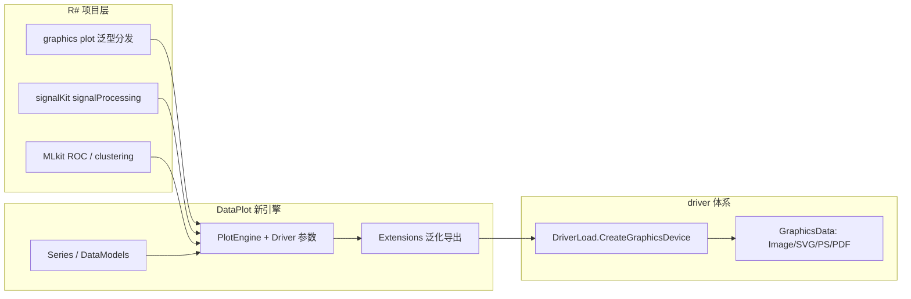

## 产品概述

将 R# 语言三个项目（graphics、signalKit、MLkit）中所有依赖旧绘图库（plots-netcore5 / plots_extensions-netcore5，即 `Microsoft.VisualBasic.Data.ChartPlots.*`）的绘图代码，全部迁移到新绘图引擎 `DataPlot`（`Microsoft.VisualBasic.Data.Plots`），实现旧绘图体系在 R# 生态中的彻底退役。

## 核心功能

- **引擎驱动化改造**：DataPlot 绘图引擎支持通过 `Microsoft.VisualBasic.Imaging.Drawing2D.g` / `DriverLoad.CreateGraphicsDevice` 相关 API 创建 `IGraphics` 画布，兼容现有 driver 模式，可通过 `Drivers` 枚举切换输出 png / pdf / svg / postscript 格式；绘图函数统一返回 `GraphicsData`
- **数据模型替换**：`SerialData` / `Serial3D` 等旧类型全部替换为新引擎的 `Series`，R# 的 `serial()` 等 API 直接返回新类型，无旧类型残留
- **graphics 项目迁移**：`plot()` 泛型分发枢纽（heatmap、corHeatmap、barplot、histogram、serial、violin、fillPolygon、contourPlot、upset、3D 散点等）全部改用新引擎图型类（ScatterPlot、LinePlot、HistogramPlot、HeatmapPlot、ViolinPlot、FillPolygons、ContourPlot 等）
- **signalKit 迁移**：峰分解曲线绘图改用新引擎 ScatterPlot
- **MLkit 迁移**：ROC 曲线绘图改用新引擎 ROCPlot；聚类画布输出改写为新引擎等价形式
- **引用清理**：三个 vbproj 删除对 plots / plots_extensions 的 ProjectReference，改为引用 DataPlot.vbproj

## 技术栈

- 语言：VB.NET（.NET 10.0，三个 R# 项目与 DataPlot 同为 net10.0，可直接项目引用）
- 新引擎：`runtime/sciBASIC#/Data_science/Visualization/DataPlot/DataPlot.vbproj`（RootNamespace: `Microsoft.VisualBasic.Data.Plots`）
- 驱动体系：`Microsoft.VisualBasic.Imaging.Driver`（DriverLoad / DeviceInterop / GraphicsData 体系，已存在于 imaging 与 core 项目，无需新写）

## 实现方案

### 1. DataPlot 引擎驱动化改造（前置关键步骤）

- `Engine/PlotEngine.vb` L168-174 构造函数 `New(width, height, theme)` 增加可选参数 `driver As Drivers = Drivers.Default`，透传给 `DriverLoad.CreateGraphicsDevice(size, fill, dpi, driver)`；现有绘制逻辑全部经由 `IGraphics` 抽象类（Interface.vb L81），SVG/PostScript 画布可无缝工作，无需改动子类绘制代码
- `Extensions.vb` L66-125 的 `SavePng` / `Save` / `AsGraphicsData` 当前硬性 `TryCast(..., GdiRasterGraphics)`，非 GDI 驱动会抛异常：泛化为按 `g.Driver` 分派，参照旧库 `CreateGraphicsDriver.vb` L108-118 的 `GraphicsPlot` 模式（`DriverLoad.UseGraphicsDevice(g.Driver).GetData(g, padding)` 返回对应 `GraphicsData` 派生：ImageData / SVGData / PostScriptData），再在其上落盘
- 非 GDI 驱动需先注册：GDI/SVG 走 `ImageDriver.Register()`，PostScript 走 `RegisterPostScript()`；PDF 在 NET48 受限但本项目为 net10.0，走 Skia 驱动路径

### 2. R# 项目迁移模式（统一范式）

- 旧调用：Module 静态方法 `Xxx.Plot(data, size$, ppi, driver)` 返回 `GraphicsData`
- 新调用：`Using plt As New XxxPlot(w, h, PlotTheme.Light())` → 属性注入（Title/XLabel/数据集合）→ `plt.Plot()` → `plt.AsGraphicsData(driver)`（改造后的扩展）返回 `GraphicsData`
- `serial()` 等 R# ExportAPI 返回类型从 `SerialData` 改为 `Series`；`generic.add("plot", GetType(SerialData))` 相应改为 `GetType(Series)`

### 3. 各项目迁移要点

- **graphics/Plot2D/plots.vb**（分发枢纽，工作量最大）：L162-180 泛型注册表改 Series；`plot_heatmap` → HeatmapPlot / ClusterHeatmapPlot；`plot_corHeatmap(DistanceMatrix)` → CorrelationHeatmapPlot；barplot/histogram → BarPlot/HistogramPlot（数据契约 BarDataSample/BarDataGroup）；violin → ViolinPlot；contourPlot → ContourPlot；upset 在新引擎无对应实现，需基于新引擎坐标系补写最小 UpSetPlot 或改写为等价热图矩阵形式
- **graphics/Plot2D/geometry2D.vb**：`ChartPlots.PolygonGroup` → 新引擎 `PolygonGroup` + `FillPolygons`
- **graphics/Render3D/plot3D.vb**：`ChartPlots.Plot3D.Scatter`（Serial3D）在新引擎无实现，需在 DataPlot 中新增 Scatter3DPlot（渲染到 IGraphics，支持 driver 输出）或降级移植
- **signalKit/signalProcessing.vb**：SerialData 构造改 Series，`Scatter.Plot` → `ScatterPlot`
- **MLkit**：`ROCPlot.CreateSerial`/`ROCPlot.Plot` → 新引擎 ROCPlot（数据契约 ROCCurve）；clustering.vb 的 Canvas 画布输出改写为新引擎等价绘图
- 不需迁移的非绘图依赖：`Imaging.Drawing2D.HeatMap` 调色板（imaging 项目）、`DataMining.*` / `Data.visualize.*`（算法/网络图项目）

## 架构



## 目录结构

```
runtime/sciBASIC#/Data_science/Visualization/DataPlot/
├── Engine/PlotEngine.vb            # [MODIFY] 构造函数增加 Drivers 参数并透传 DriverLoad
├── Extensions.vb                   # [MODIFY] SavePng/Save/AsGraphicsData 按 g.Driver 分派，泛化 GraphicsData 输出
├── Advanced/FillPolygons.vb        # [确认] 新引擎 PolygonGroup 与旧 API 对齐
├── (新增) Advanced/Scatter3DPlot.vb # [NEW] 3D 散点图（如需保留 plot3D 功能）
├── (新增) Advanced/UpSetPlot.vb    # [NEW] 最小 UpSet 图实现（如需保留 upset API）
R-sharp/Library/graphics/
├── graphics.NET5.vbproj            # [MODIFY] 移除 plots/plots_extensions 引用，加 DataPlot
├── Plot2D/plots.vb                 # [MODIFY] 全部绘图 API 改新引擎，SerialData→Series
├── Plot2D/geometry2D.vb            # [MODIFY] FillPolygons/PolygonGroup 改新引擎
├── Render3D/plot3D.vb              # [MODIFY] 3D 散点改新引擎实现
└── grDevices.vb                    # [MODIFY] 移除旧 ChartPlots.Graphic 依赖
R-sharp/studio/Rsharp_kit/signalKit/
├── signalKit-netcore5.vbproj       # [MODIFY] 引用替换
└── signalProcessing.vb             # [MODIFY] 峰分解绘图改 Series + ScatterPlot
R-sharp/studio/Rsharp_kit/MLkit/
├── MLkit-netcore5.vbproj           # [MODIFY] 引用替换
├── validation.vb                   # [MODIFY] ROC 绘图改新引擎 ROCPlot
├── MachineLearning/SVM.vb          # [MODIFY] ROC 曲线改新引擎
└── dataMining/clustering.vb        # [MODIFY] 画布输出改新引擎等价形式
```

## 实施注意

- **编译顺序**：先改 DataPlot 引擎（扩展导出后向后兼容旧 SavePng 用法），再逐项目迁移，每步保证可编译
- **残留检查**：vbproj 移除旧引用前，用全项目搜索确认无 `Microsoft.VisualBasic.Data.ChartPlots` / `SerialData` 残留 Imports
- **R# 脚本兼容**：serial()/plot() 返回类型变更属破坏性变更，需同步更新仓库内相关 R# 示例脚本
- **性能**：新引擎渲染到 IGraphics 抽象接口，无额外转换开销；GraphicsData 输出直接走 driver GetData，无位图中转（SVG/PS 路径避免了旧方案中 GDI 强转异常）

## Agent Extensions

### SubAgent

- **code-explorer**
- Purpose: 迁移前精确核对新引擎各图型类的构造签名与属性注入方式、旧 plots.vb 各 ExportAPI 的参数契约，以及迁移后残留依赖的全库搜索
- Expected outcome: 每个迁移任务执行前获得准确的旧 API ↔ 新 API 对照证据，避免签名猜测导致编译错误