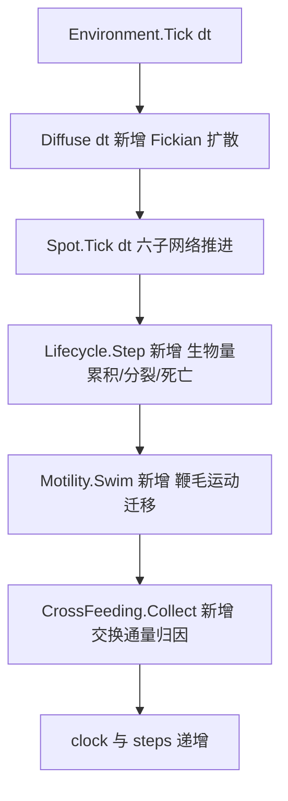

## 产品概述

在已完成重构的 `engine/Cella` 虚拟细胞引擎基础上，补充「细胞生命周期」与「运动」两块能力，并用它跑一个多物种发酵仿真，验证细胞通过跨膜转运与 Spot 环境交换物质而形成的交叉喂养网络。

## 核心功能

### 1. 细胞分裂规则
- 细胞从代谢通量与蛋白池累积**生物量**；生物量达到阈值、且年龄与所在 Spot 容量允许时执行**二分裂**。
- 子代继承亲代的**一半生物量与一半状态**（转录本、蛋白、代谢物、回收池减半；信号与细胞周期相位直接复制），并记录亲代 id 与代次。
- **死亡**：所在 Spot 营养枯竭且持续若干步判定为饥饿死亡；年龄超过上限判定为老化死亡。死亡细胞从格点移除，但保留在谱系记录中。

### 2. 鞭毛运动
- 细胞依据鞭毛结构蛋白水平获得**运动能力**，依据趋化受体蛋白水平获得**趋化能力**。
- 每步以基础迁移概率乘以运动能力决定是否移动；移动时在上下左右前后 6 个相邻 Spot 中，按「基础等概率 + 营养梯度偏置」加权抽样选址，向营养更高的格点游动。
- 迁移事件被记录（时间、细胞、物种、起点、终点），可用于导出轨迹。

### 3. Spot 间物质扩散
- 相邻 Spot 的胞外物质按浓度差进行 Fickian 扩散（可配置扩散系数、按代谢物覆盖），使分泌的产物能跨格点传播，交叉喂养网络得以在空间上展开。
- 可选边界补料，模拟补料发酵，避免葡萄糖一步耗尽。

### 4. 多物种发酵仿真
- 构建 4 个代谢分工物种：葡萄糖发酵菌（初级生产者）、乳酸利用菌（次级消费者）、乙酸利用菌（三级消费者）、氨基酸营养缺陷型。
- 碳链：葡萄糖发酵菌分泌乳酸与乙酸，供给后两级消费者；氮环：葡萄糖发酵菌分泌氨基酸供给缺陷型，缺陷型分泌铵回补前者的氮同化，形成闭环互养。
- 各物种以各自比例播种到摇瓶形状的不同格点，通过转运系统与所在 Spot 交换物质。

### 5. 结果导出
- **每个 Spot 内的细胞数量分布**：按时间、格点坐标、物种三要素记录细胞计数，并在控制台打印格点占用平面示意。
- **细胞的代际繁殖进化树**：记录每代细胞的父子关系、物种、代次、出生时间、死亡时间与死亡原因，导出为表格与 Newick 谱系树。
- **Spot 内交叉喂养网络代谢流**：按「生产者物种 → 消费者物种」的方向统计每个格点内每种胞外代谢物的转移通量，导出逐格点明细与物种级汇总。
- 迁移事件明细、以及原有的表达、代谢物、通量、信号、培养基与训练损失曲线一并导出。

## 输出效果

控制台分阶段打印：物种配置与网络规模、各物种训练损失、按时间推进的物种计数、Spot 占用示意、代次与死亡率统计、排名靠前的交叉喂养边。结果目录产出种群分布、谱系树（表格 + Newick）、交叉喂养通量、迁移事件等 CSV 文件。


## 技术栈选型

沿用当前仓库既有技术栈，不引入任何新框架或新依赖：

| 层次 | 选型 | 事实依据 |
| --- | --- | --- |
| 语言/框架 | VB.NET，`net10.0`，SDK 风格 `vbproj` | `Cella.vbproj` 与 `demo/CellaDemo.vbproj` 均已是 `net10.0` |
| 转录调控 | `SMRUCC.genomics.Analysis.GEARS` | 已由 `Networks/GeneRegulatoryNetwork.vb` 使用 |
| 代谢网络 | `SMRUCC.genomics.Analysis.Metaboliq`（LTC 液态网络） | 已由 `Networks/MetabolicNetwork.vb` 使用 |
| 翻译/周转/信号 | `Microsoft.VisualBasic.Math.Sundials.CVODE`（BDF） | 已由 `Networks/ODE/OdeSubNetwork.vb` 封装使用 |
| 扩散/分裂/运动 | 纯托管实现，确定性伪随机（`Random(seed)`） | 与现有 ODE 求解器无耦合，无需新依赖 |
| 快照容器 | 复用 `Snapshots/CellSnapshot.vb`、`SpotSnapshot.vb`、`TimeFrameSnapshot.vb` | `CellSnapshot` 已有 `parent_id`；`TimeFrameSnapshot.cells` 已是 taxonomy 到计数的字典 |
| 导出 | 复用 `demo/Report.vb` 的 `SaveSeries` / `SaveTable` / `SaveCurve` | 已有 UTF-8 CSV 写出与转义逻辑 |

## 实现方案

### 总体策略

在现有「状态中枢 + 统一时间步」之上，新增**生命周期层**、**运动层**、**环境层扩散**与**交换归因层**四块，全部通过既有接口接入，不改变六个子网络的职责。

单个时间步的调度顺序（新增环节标注为新增）：



### 关键技术决策与取舍

1. **子网络必须支持状态重同步（Resync）**。这是本次最关键的正确性约束：`TranslationSystem` 与 `TurnoverSystem` 的权威状态在各自 CVODE 求解器内部，`MetabolicNetwork` 的权威状态在液态网络的隐藏层 `h`；直接修改 `CellularState` 的池**不会**传播进去（`TranslationSystem.Tick` 以 `CurrentState()` 为起点写回 `state.Protein`，外部写入会被覆盖）。因此必须在 `SubNetwork` 上新增 `Public Overridable Sub Resync()`（默认空实现），并在三个持有 ODE 状态的子网络上实现「从共享状态池重新播撒 + 重新 `Initialize`」。分裂后的状态减半依赖它才能生效。
2. **分裂/死亡/迁移只能在格点遍历之外执行**。`Spot.Tick` 会 `cells.ToArray()` 快照后遍历，但生命周期与运动阶段仍需在 `Environment` 层面用 `GetAllCells()` 快照后再增删，避免边遍历边修改集合。
3. **扩散采用增量缓冲而非就地更新**。若对每个相邻对就地做 `cA -= f; cB += f`，结果会依赖遍历顺序。改为先累加到 `spot 到 (代谢物到增量)` 的缓冲，最后统一应用，保证结果与顺序无关，且天然质量守恒。
4. **交叉喂养归因采用「按摄取份额分摊」假设**。同一 Spot 内某代谢物的总分泌质量，按各消费者对该代谢物的摄取量占比分摊给每一对生产者与消费者。这是可解释且质量守恒的近似（分摊之和等于总分泌量）；跨 Spot 的传递由扩散项承接，不重复计入。该假设必须写入代码注释与导出说明。
5. **不同物种的状态维度不同，归因必须按名称而非下标**。各物种 `CellularState` 的内部与边界代谢物集合不同，`Spot.Medium` 取所有物种边界代谢物的并集；归因与扩散全部按代谢物 id 字符串解析，不假设数组下标对齐。
6. **不引入突变**。本次只做「代际谱系树」（父子关系与代次），不做可遗传变异；树结构用 Newick 表达森林，叶节点为存活细胞，内部节点携带代次与物种标签。
7. **性能取舍**。新增热路径成本为扩散 O(格点数 × 胞外代谢物数)、运动 O(细胞数)、生命周期 O(细胞数)；细胞总数上限为 格点数 × `MaxCellsPerSpot`。为避免 `Environment.GetAllSpots()` 每次新建列表，新增惰性缓存的 `Spots` 属性并在 `Space` 赋值时失效。分裂会新建一个 `MetabolicNetwork`（内含一个液态网络与若干 CVODE 求解器），因此 demo 需把 `MaxCellsPerSpot` 控制在较小值（约 6）并限制总步数。

### 性能与可靠性

- **扩散**：每个正方向相邻对只处理一次；缓冲用 `Dictionary(Of Spot, Dictionary(Of String, Double))`，每步重建，避免跨步残留。复杂度 O(格点数 × 代谢物种类)。
- **归因**：每步对每个 Spot 的每个胞外代谢物聚合一次性完成，复杂度 O(细胞数 × 胞外代谢物数)，键为四元组，用字符串拼接的字典键并在导出时拆分。
- **数值安全**：生物量、年龄、培养基增量全部做 NaN/负值钳制；分裂后的半量状态经 `Sanitize` 后再 `Resync`。
- **可观测性**：每个阶段输出摘要（细胞数、平均代次、分裂次数、死亡次数与死因分布、迁移次数、扩散净通量），失败可定位到具体阶段。

## 实现要点（执行细节）

1. **`CellaBlueprint` 新增参数分组**（全部带默认值，`Validate()` 不因此变化）：
   - 生命周期：`SpeciesName`、`DivisionBiomassThreshold`、`BiomassYieldPerFlux`、`BiomassYieldPerProtein`、`MinDivisionAge`、`MaxCellAge`、`StarvationNutrientThreshold`、`StarvationDeathTicks`、`MaxCellsPerSpot`
   - 运动：`FlagellarGenes`、`ChemotaxisReceptorGenes`、`MotilityBaseProbability`、`MotilityGradientBias`、`GradientScale`、`NutrientMetabolites`
   - 环境：`DiffusionCoefficient`、`DiffusionByMetabolite`、`BoundaryReservoir`
2. **`SubNetwork` 增加 `Resync()`**；`OdeSubNetwork` 已有 `Protected Sub ResetState(values As Double())` 与 `CurrentState()`，直接复用。`MetabolicNetwork` 需新增公开方法把共享浓度写回液态网络隐藏层（`ResetState` 后 `Cells(0).SetState(h)`）。
3. **`VirtualCella.Snapshot()` 修正**：把误写成 `"x,y,z"` 的 `parent_id` 改为真正的 `ParentId`；格点坐标改由 `SpotSnapshot` 承载（已存在该字段）。
4. **GEARS 铁律**（沿用）：先验网络必须用 `prior.AddEdge(...)`；先验边两端必须是基因级 id 且出现在表达矩阵行名中；`Train()` 前必须先 `GenerateTrainingSamples()`。
5. **Metaboliq 铁律**（沿用）：源码无 `Namespace` 声明，必须 `Imports SMRUCC.genomics.Analysis.Metaboliq`；浓度对外报告必须走 `Liquid.ComputeOutputFrom(h)`；酶序列取值于 [0,1]；时间网格严格递增；`SetTauBounds(2.0, 60.0)` 与 `MaxSubStep` 约 1.0。
6. **CVODE 铁律**（沿用）：`RHSFunction` 是 `Sub` 委托；`Jacobian` 的矩阵参数名为 `J`，循环变量不能再用 `j`（VB 不区分大小写）。
7. **VB 不区分大小写带来的命名陷阱**（上一轮已踩过，必须避免）：构造参数名不能与属性同名；`Public ReadOnly Property X` 与 `Private x` 不能同名；`Dim T` 不能与 `For t` 共存；`Environment` 内部字段用 `clock`、`steps`。
8. **`Cella.vbproj` 必须保留 `<Compile Remove="demo\**" />` 等三条排除**，否则子目录源码会被库项目重复收录导致 AssemblyInfo 重复定义。新增的 `Lifecycle/`、`Motility/`、`CrossFeeding/` 目录会被 SDK 默认 glob 自动收录，无需改 vbproj。
9. **改动半径**：`engine/Dynamics/test/test5.vbproj` 是外部唯一引用 `Cella.vbproj` 的项目，改动后必须验证其仍可编译。
10. **demo 入口**：保留现有单物种流程作为 `--single` 模式，默认走发酵模式，避免丢失上一轮的验证路径。

## 架构设计

### 分层结构

```
环境层   Environment（时钟 + Space + 扩散 + 调度）/ Spot（培养基 + 细胞 + 营养指标）
生命周期 Lifecycle/CellLifecycle（生物量累积、二分裂、饥饿/老化死亡）
         Lifecycle/CellLineage（谱系记录、CSV 与 Newick 导出）
运动层   Motility/FlagellarMotor（随机游走 + 梯度偏置、迁移事件）
归因层   CrossFeeding/CrossFeedingRecorder（生产者到消费者的通量分摊）
细胞层   VirtualCella（元数据：物种/亲代/代次/生物量/年龄/存活）+ 六个子网络
状态层   CellularState（mRNA/Protein/Metabolite/Boundary/Signal/回收池）
装配层   CellaFactory（BuildCell / DivideCell / StarterCulture 多物种播种）
输出层   Snapshots（CellSnapshot/SpotSnapshot/TimeFrameSnapshot）+ demo/Report（CSV）
```

### 数据流

`Environment.Tick(dt)` 先做 Spot 间扩散，再让每个 Spot 驱动其细胞跑完整六子网络，随后生命周期阶段读取代谢通量与蛋白池累积生物量并在达阈值时分裂、在饥饿或老化时死亡，接着运动阶段按鞭毛与趋化能力决定是否迁移到相邻 Spot，最后归因阶段把每个 Spot 内各细胞的摄取与分泌质量分摊成生产者到消费者的交叉喂养通量。

## 目录结构

```
engine/Cella/
├── Cella.vbproj                     [MODIFY] 无需改（新增目录由默认 glob 收录）；确认保留 demo 排除项
├── VirtualCella.vb                  [MODIFY] 新增物种/亲代/代次/生物量/年龄/存活/死因字段与累积逻辑；
│                                             修正 Snapshot 的 parent_id；新增 ResyncSubNetworks()
├── Environment.vb                   [MODIFY] 新增 Diffuse、生命周期与运动调度、GetSpotAt/GetNeighbors、
│                                             Spots 惰性缓存、Lineage 与 CrossFeeding 记录器、补料
├── Spot.vb                          [MODIFY] 新增 NutrientLevel、CellCount、IsFull、AddCell/RemoveCell
├── SpaceInitializer.vb              [KEEP]   形状生成逻辑不变
├── Gene.vb / Metabolite.vb          [KEEP]
├── Snapshots/
│   ├── CellSnapshot.vb              [MODIFY] 新增 species、generation、biomass、age、x、y、z
│   ├── SpotSnapshot.vb / TimeFrameSnapshot.vb / Metadata.vb  [KEEP]
├── State/
│   ├── CellularState.vb             [MODIFY] 新增 CopyScaled(factor) 便于分裂继承半量状态
│   ├── CellaBlueprint.vb            [MODIFY] 新增生命周期/运动/扩散/培养基参数分组与查询方法
│   └── MetabolicTrainingSet.vb      [KEEP]
├── Lifecycle/
│   ├── CellLifecycle.vb             [NEW] 生物量累积、二分裂、饥饿与老化死亡、阶段统计
│   └── CellLineage.vb               [NEW] 谱系记录（父子/代次/出生/死亡/死因/格点）与 Newick 导出
├── Motility/
│   └── FlagellarMotor.vb            [NEW] 运动能力与趋化能力计算、迁移抽样、迁移事件记录
├── CrossFeeding/
│   └── CrossFeedingRecorder.vb      [NEW] 每 Spot 每代谢物的生产者到消费者通量分摊与导出
├── Networks/
│   ├── SubNetwork.vb                [MODIFY] 新增 Public Overridable Sub Resync()
│   ├── MetabolicNetwork.vb          [MODIFY] 实现 Resync()（把共享浓度写回液态网络隐藏层）
│   ├── TranslationSystem.vb         [MODIFY] 实现 Resync()（从 state.Protein 重新播撒并 Initialize）
│   ├── TurnoverSystem.vb            [MODIFY] 实现 Resync()（从 state.mRNA 与 RecyclePool 重新播撒）
│   ├── TransportSystem.vb           [MODIFY] 新增本步摄取与分泌质量（速率乘 dt）供归因使用
│   └── GeneRegulatoryNetwork.vb / SignalTransductionNetwork.vb / ODE/OdeSubNetwork.vb  [KEEP]
├── Factory/
│   └── CellaFactory.vb              [MODIFY] 新增 DivideCell（子代继承半量状态）、StarterCulture（多物种播种）
└── demo/
    ├── CellaDemo.vbproj             [KEEP]
    ├── Program.vb                   [MODIFY] 入口支持发酵模式（默认）与既有单物种模式
    ├── SyntheticData.vb             [MODIFY] 新增胞外代谢物与物种特有反应、按 graph 生成训练集
    ├── Species.vb                   [NEW]    4 物种定义：反应子集、先验网络、耦合映射、鞭毛/趋化基因、播种比例
    ├── Fermentation.vb              [NEW]    发酵仿真主流程：建摇瓶、训练、播种、推进、采样
    ├── Report.vb                    [MODIFY] 新增种群分布、谱系树、交叉喂养、迁移事件导出与打印
    └── result/                      [OUTPUT] 导出目录
```

`engine/Cella.slnx` 无需修改（demo 项目与六个依赖项目均已登记）。

## 关键代码结构

```vb
' Networks/SubNetwork.vb —— 新增：让持有 ODE 状态的子网络能够被外部重新播撒
Public MustInherit Class SubNetwork
    Protected cell As VirtualCella
    Sub New(cell As VirtualCella)
    Public MustOverride Sub Tick(dt As Double)
    Public MustOverride Function GetStats() As Dictionary(Of String, Double)
    ''' <summary>从共享状态池重新播撒内部状态（分裂后状态减半等外部跳变时调用）</summary>
    Public Overridable Sub Resync()
    End Sub
End Class
```

```vb
' Lifecycle/CellLifecycle.vb —— 生命周期阶段
Public Module CellLifecycle
    ''' <summary>累积生物量、执行二分裂、判定饥饿与老化死亡</summary>
    Public Sub [Step](env As Environment, dt As Double)

    ''' <summary>单个细胞的生物量累积速率（由平均比通量与蛋白池折算）</summary>
    Public Function BiomassRate(cella As VirtualCella) As Double

    ''' <summary>判定并执行一次二分裂（失败时返回 Nothing，例如格点已达容量上限）</summary>
    Public Function TryDivide(env As Environment, parent As VirtualCella) As VirtualCella
End Module
```

```vb
' CrossFeeding/CrossFeedingRecorder.vb —— 交叉喂养通量归因
Public Class CrossFeedingRecorder
    ''' <summary>累加一个时间步内所有 Spot 的交换通量</summary>
    Public Sub Collect(env As Environment, dt As Double)

    ''' <summary>逐格点明细：格点坐标、代谢物、生产者物种、消费者物种、累计通量</summary>
    Public Function DetailedFlux() As IEnumerable(Of CrossFeedingEdge)

    ''' <summary>物种级汇总：生产者物种、消费者物种、代谢物、累计通量</summary>
    Public Function SpeciesFlux() As IEnumerable(Of CrossFeedingEdge)

    ''' <summary>导出逐格点明细 CSV 与物种级汇总 CSV</summary>
    Public Sub Save(directory As String)
End Class

Public Class CrossFeedingEdge
    Public Property x As Integer
    Public Property y As Integer
    Public Property z As Integer
    Public Property metabolite As String
    Public Property producer As String
    Public Property consumer As String
    Public Property flux As Double
End Class
```


## Agent Extensions

### SubAgent
- **code-explorer**
  - Purpose: 在动手改造前精确定位 `SubNetwork` 全部子类、`Spot.Tick` 与 `Environment.Tick` 的调用点、`demo/Report.vb` 的导出函数签名，以及 `engine/Dynamics/test/test5.vbproj` 对 Cella 的实际引用范围，确认新增 `Resync()` 与元数据字段不会破坏既有编译与调用约定。
  - Expected outcome: 得到受影响类型的完整清单与原样引用的行号，据此确定向后兼容策略（新增成员全部带默认实现或默认值）。

### Skill
- **lsp-code-analysis**
  - Purpose: 在新增 `Resync()`、`CellLifecycle`、`FlagellarMotor`、`CrossFeedingRecorder` 并改造 `Environment` 之后，用语义级定义与引用分析定位编译错误与遗漏的覆盖实现（例如某个 `MustInherit` 成员未实现、命名空间歧义、VB 大小写同名冲突）。
  - Expected outcome: 在完整构建前先消除符号级错误，缩短编译验证轮次并避免重复全量构建。
