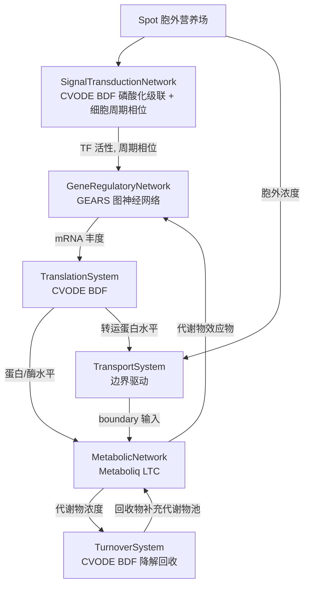

## 产品概述

对 `engine/Cella/Cella.vbproj` 虚拟细胞引擎做整体重构：把 `Networks/` 下各子网络从当前未实现的空壳（动态贝叶斯网络 + 未赋值的 `SolverIterator`）替换为仓库中已有的真实计算组件，形成一个可实际推进时间步的虚拟细胞系统；细胞分布在 `Environment.vb` 提供的特定形状空间（培养皿 / 圆柱 / 锥形瓶 / 长方体）的 `Spot` 格点中。

## 核心功能

1. **转录调控网络（GRN）**：先用转录因子 TF → 靶基因的调控关系构建先验网络，作为图神经网络的图结构；再用该 GNN 预测每个基因的转录响应，输出 mRNA 丰度。
2. **代谢网络**：用液态神经网络（LTC）建模，内部代谢物浓度即液态神经元隐藏状态，代谢反应即网络连接与掩码约束，随 ODE 时间步演化，同时给出反应通量与液态时间常数。
3. **翻译系统**：mRNA → 蛋白质，刚性常微分方程求解。
4. **跨膜转运系统**：不单独建 ODE，而是把胞外营养/产物浓度与转运蛋白水平转换为代谢网络的边界驱动输入，实现细胞与所在 Spot 环境的物质交换。
5. **周转系统**：mRNA / 蛋白质的降解与物质回收，刚性常微分方程求解。
6. **信号转导与细胞周期（新增子网络）**：胞外信号 → 磷酸化级联 → 转录因子活性与细胞周期相位，刚性常微分方程求解；其输出作为转录调控网络的输入扰动信号。
7. **统一时序与状态中枢**：所有子网络共享同一套转录组 / 蛋白组 / 代谢组 / 信号状态，按固定顺序逐步推进（`Tick(dt)`），避免各模块各说各话。
8. **构建入口**：保留原 `FromModel`（全基因组 GCMarkup 模型）路径，新增轻量构建入口（TF 先验网络 + 代谢反应列表），新入口为演示默认路径。
9. **命令行演示项目**：在 `engine/Cella` 下新建命令行项目，用自行合成的数据（合成 TF 调控网络、合成表达矩阵、合成代谢反应网络与时序数据）一键跑完：构建环境 → 训练转录网络 → 拟合代谢网络 → 推进若干时间步 → 控制台打印关键统计 → 导出结果 CSV。

## 视觉/输出效果

控制台分阶段打印：环境形状与格点统计、先验网络规模与图谱边数、转录网络训练损失曲线摘要、代谢网络拟合损失与稳态残差、每个时间步的关键基因表达 / 关键代谢物浓度 / 关键通量 / 时间常数；最终在 `demo/result/` 下产出表达、代谢物、通量、快照等 CSV 文件。

## 技术栈选型

沿用仓库现有技术栈，不引入新框架：

| 层次 | 选型 | 事实依据 |
| --- | --- | --- |
| 语言 / 框架 | VB.NET，`net10.0`，SDK 风格 `.vbproj` | `Cella.vbproj` 已是 `net10.0`；GEARS / Metaboliq / Sundials.CVODE 同为 `net10.0` |
| 转录调控网络 | `SMRUCC.genomics.Analysis.GEARS`（`sub-system/GEARS/GEARS.vbproj`） | RootNamespace `SMRUCC.genomics.Analysis.GEARS`；先验网络类型 `PriorNetwork` / `RegulatoryEdge` 来自 BNLearn |
| 代谢网络 | `SMRUCC.genomics.Analysis.Metaboliq`（`sub-system/Metaboliq/Metaboliq.vbproj`） | RootNamespace 提供命名空间（源码无 `Namespace` 声明，必须 `Imports`）；LTC 内核在 `runtime/sciBASIC#/Data_science/MachineLearning/LNN/` |
| 翻译 / 周转 / 信号转导 | `Microsoft.VisualBasic.Math.Sundials.CVODE`（`runtime/sciBASIC#/Data_science/Mathematica/Math/CVODE_Solver/Sundials.CVODE.vbproj`） | 独立 vbproj、**零 ProjectReference 依赖**，BDF 支持刚性系统 |
| 反应 / 代谢物类型 | `SMRUCC.genomics.MetabolicModel.MetabolicReaction`、`CompoundSpecieReference`（biocore） | Cella 已引用 biocore |
| 快照 | 复用现有 `engine/Cella/Snapshots/`（`CellSnapshot` 已有 `rna`/`protein`/`metabolite` 字典） | 已实勘，正好承载状态中枢输出 |


## 实现方案

### 总体策略

引入**状态中枢 + 统一时间步**两层抽象：

- `CellularState` 持有 `mRNA` / `Protein` / `Metabolite` / `Boundary` / `Signal` 五个以 `Double()` 向量 + 名称索引映射表示的状态池，是各子网络之间唯一的通信媒介（避免子网络互相直接引用导致的循环依赖）。
- `SubNetwork` 抽象方法由 `RunStep()` 改为 `Tick(dt As Double)`，由 `VirtualCella` 按固定顺序调度，形成可解释的因果链。

单个时间步的执行顺序（也是子系统耦合关系）：



### 关键技术决策与取舍

1. **转录网络调用层级**：细胞仿真循环使用 `GEARS.Model.PredictDelta(controlExpr As Double(), pertFlag As Double()) As Double()` 的低层连续推理，而不是 `Predict(specs)` 的离散敲除接口。理由：仿真需要**连续**的 TF 活性信号（来自信号转导模块的磷酸化水平），离散 `Knockout/Knockdown/Overexpression` 三档无法表达平滑的时间演化。`PredictDelta` 返回归一化空间的 Δ，需再乘 `WildtypeSDs` 还原为真实表达量（对齐 `GEARS.Predict` 内部 `delta = deltaNorm(i) * sd`、`mutant(i) = max(0, inputExpr(i) + delta)` 的还原约定）。
2. **转运并入代谢网络边界驱动**：转运与代谢共享同一批边界代谢物，若各自建 ODE 会出现同一物质的双重记账与质量不守恒。改为 `TransportSystem` 只负责把"胞外浓度 × 转运蛋白水平"折算成 Metaboliq 的 `boundary` 向量（`model.BuildInput(enzymes, boundary)`），代谢物变化全部由 LTC 网络统一积分，天然满足 Metaboliq 自带的质量守恒软约束。
3. **其余模块统一用 CVODE BDF**：翻译、周转、信号转导都是典型的刚性系统（速率常数跨越数个数量级），BDF（最高 5 阶）比显式 RK 稳定得多，且 `Sundials.CVODE.vbproj` 零依赖、可直接 `ProjectReference`。为三者抽一个 `OdeSubNetwork` 基类复用求解器生命周期管理，避免重复代码。
4. **保留 `FromModel`，新增轻量入口**：`FromModel` 依赖 BootstrapLoader + GCMarkup 全基因组，是既有资产；新入口 `BuildFrom(blueprint)` 直接吃 `PriorNetwork` + `MetabolicReaction()`，依赖更浅、便于合成数据演示。二者共用同一个 `VirtualCella` 装配函数，只是蓝图来源不同。
5. **不做生长与分裂**（按用户确认）：`Environment` / `Spot` / `SpaceInitializer` 只做形状与营养场支撑，不引入生物量与分裂逻辑，控制改动半径。

### 性能与可靠性

- **热路径**：`Tick` 每步调用一次 GEARS 前向 + 一次 Metaboliq `StepInterval`（内部按 `MaxSubStep` 自动细分为若干 RK4 子步）+ 三次 CVODE `Integrate`。`N` 个细胞 × `T` 步的复杂度为 `O(N·T·(|E|·d + m² + n_sub·m²))`，主要瓶颈是 Metaboliq 的 RK4 子步积分与 CVODE 的 Newton 迭代。
- **缓解措施**：① Metaboliq 侧 `SetTauBounds(2.0, 60.0)` + `MaxSubStep = 1.0`（`test/Program.vb:125-129` 的经验值），既保稳定又限制子步数；② CVODE 侧提供解析 Jacobian（三个 ODE 模块均可写出对角/带状 Jacobian），显著减少 Newton 迭代次数；③ 状态全部用 `Double()` + `Dictionary(Of String, Integer)` 索引，不在热路径上做字符串查找或反复分配；④ CVODE 求解器在细胞生命周期内**复用**（`Initialize` 一次，之后只 `Integrate`），不每步 new。
- **数值安全**：所有状态更新后做 `NaN/Inf` 与非负钳制；CVODE 返回非 `Success` 时记录并回退到上一步状态（不静默继续），防止单点发散污染整个环境。

## 实现要点（执行细节）

1. **`Cella.vbproj` 必须新增的 `ProjectReference`**（相对路径从 `engine/Cella/` 起算）：

- `..\..\sub-system\GEARS\GEARS.vbproj`
- `..\..\sub-system\Metaboliq\Metaboliq.vbproj`
- `..\..\..\runtime\sciBASIC#\Data_science\Mathematica\Math\CVODE_Solver\Sundials.CVODE.vbproj`
- `..\..\..\runtime\sciBASIC#\Data_science\MachineLearning\GNN\GNN.vbproj`
- `..\..\..\runtime\sciBASIC#\Data_science\MachineLearning\TensorFlow\TensorFlow.vbproj`
- `..\..\..\runtime\sciBASIC#\Data_science\MachineLearning\LNN\LNN.vbproj`
- 注意：`Sundials.CVODE.vbproj` 是独立项目，不要误引 `ODE/odes-netcore5.vbproj`（后者不含 CVODE）。

2. **GEARS 使用铁律**：

- 先验网络必须用 `prior.AddEdge(tf, target, Effector, confidence, evidence)` 构造，**不要**直接 `Edges.Add`，否则 `TFNames`/`TargetNames` 为空会让 `BuildPerturbationCandidates()` 退化。
- 先验边的 `TF` 与 `TargetGene` 都必须是**基因级 id** 且必须出现在表达矩阵行名中；操纵子 id 会被静默丢弃（建图后应校验 `GraphData.NumPriorEdges` 与预期一致）。
- `Train()` 前必须先 `GenerateTrainingSamples()`，否则抛 `InvalidOperationException`。
- `GeneExpressionData` 是纯 POCO（`GeneNames`/`SampleNames`/`Matrix As Double(,)`/`TimePoints`），合成数据可在代码中直接构造，无需落 CSV。

3. **Metaboliq 使用铁律**：

- 必须 `Imports SMRUCC.genomics.Analysis.Metaboliq`（源码无 `Namespace` 声明）。
- 状态在**归一化空间**，对外报告浓度必须走 `Liquid.ComputeOutputFrom(h)`，直接读 `cell.State` 会与训练监督目标不一致。
- 酶序列必须 min-max 到 `[0,1]`；时间网格严格单调递增；`Simulate`/`StepInterval` 不满足则抛异常。
- 仿真循环中读取状态：`Dim cell = model.Liquid.LiquidLayer.Cells(0)` → `cell.State`、`cell.GetSystemTau(h, u)`；推进用 `model.StepInterval(u, dt)`（不要直接 `Liquid.Forward`，大步长会越过显式 RK4 稳定域）。

4. **CVODE 使用铁律**：`RHSFunction` 是 `Sub` 委托（无返回值，写 `ydot`）；三个模块都用 `CVODEMethod.BDF` 并尽量 `SetJacobianFunction`；求解器对象在子网络构造时创建、`Initialize(t0, y0)` 一次，实现 `IDisposable` 释放。
5. **改动半径控制**：

- `engine/Dynamics/test/test5.vbproj:120` 引用了 `Cella.vbproj`，改动后必须 `dotnet build` 验证其仍可编译。
- 全仓搜索确认 `VirtualCella` / `SpaceInitializer` 仅在 Cella 项目内部使用，外部无调用点。
- `Snapshots/` 下 4 个类型已存在且 `CellSnapshot` 已有 `rna`/`protein`/`metabolite` 字段，重构时**复用而非新建**快照结构。

6. **命名空间**：`Cella`（RootNamespace 很浅）与 GEARS / Metaboliq / CVODE 命名空间无冲突；但 Cella 内已有 `MetabolicNetwork` 类，与 Metaboliq 的 `MetabolicNetworkGraph` 名称相近，Imports 时用完全限定名避免歧义。

## 架构设计

### 分层结构

```
Engine 层   Environment(Space 三维格点 + 时钟) → Spot(营养场 + 细胞列表) → VirtualCella
装配层      CellaBlueprint(蓝图) → CellaFactory → VirtualCella(含 CellularState)
子网络层    SubNetwork.Tick(dt)
            ├─ SignalTransductionNetwork (CVODE BDF)
            ├─ GeneRegulatoryNetwork    (GEARS GNN)
            ├─ TranslationSystem        (CVODE BDF)
            ├─ TransportSystem          (Metaboliq 边界驱动)
            ├─ MetabolicNetwork         (Metaboliq LTC)
            └─ TurnoverSystem           (CVODE BDF)
状态层      CellularState (mRNA/Protein/Metabolite/Boundary/Signal + 索引映射)
输出层      Snapshots/CellSnapshot + CSV 导出
```

### 数据流

`Environment.Tick()` 推进时钟 → 遍历有效 Spot → `Spot.Tick(dt)` 先刷新胞外营养场再驱动每个细胞 → `VirtualCella.Tick(dt)` 按「信号 → 转录 → 翻译 → 转运 → 代谢 → 周转」顺序调度六个子网络 → 每个子网络从 `CellularState` 读输入、写输出 → 每个采样步由 `VirtualCella.Snapshot()` 产出 `CellSnapshot`。

## 目录结构

```
engine/Cella/
├── Cella.vbproj                              # [MODIFY] 新增 GEARS / Metaboliq / Sundials.CVODE / GNN / TensorFlow / LNN 六个 ProjectReference
├── VirtualCella.vb                           # [MODIFY] 持有 CellularState 与六个子网络；实现 Tick(dt) 顺序调度、Snapshot()；保留 FromModel，新增 BuildFrom
├── Environment.vb                            # [MODIFY] 增加 TimeStep / CurrentTime 时钟；Spot 判空；Tick(dt) 传递时间步
├── Spot.vb                                   # [MODIFY] external 改为胞外营养场(EnvironmentMedium)；Tick(dt) 刷新营养场并驱动细胞；external 为空时不再空引用
├── SpaceInitializer.vb                       # [MODIFY] 四种形状(培养皿/圆柱/锥形瓶/长方体)生成逻辑保留；CreateSpot 同时初始化该格点的营养场
├── Gene.vb                                   # [MODIFY] 扩展为基因蓝图：Id / Ontology / IsTF / 关联反应 id / 基础表达水平
├── Metabolite.vb                             # [KEEP]   保持 Inherits Factor，不动
├── Snapshots/                                # [MODIFY] 复用；CellSnapshot 由 CellularState 填充
│   ├── CellSnapshot.vb  Metadata.vb  SpotSnapshot.vb  TimeFrameSnapshot.vb
├── State/
│   ├── CellularState.vb                      # [NEW] 状态中枢：mRNA/Protein/Metabolite/Boundary/Signal 的 Double() 向量 + name→index 映射，提供 Get/Set/AsDictionary、NaN 与非负钳制
│   └── CellaBlueprint.vb                     # [NEW] 细胞蓝图：PriorNetwork + MetabolicReaction() + 基因列表 + 反应↔基因映射 + 边界代谢物 + 各子网络配置
├── Networks/
│   ├── SubNetwork.vb                         # [MODIFY] 抽象方法 RunStep() 改为 MustOverride Tick(dt)；保留 GetStats()
│   ├── GeneRegulatoryNetwork.vb              # [MODIFY] 以 PriorNetwork 为先验构建 GEARS 图神经网络；Tick 内用信号/TF 活性构造 pertFlag，Model.PredictDelta 预测 Δ 并更新 mRNA
│   ├── MetabolicNetwork.vb                   # [MODIFY] 以 MetabolicNetworkGraph + MetabolicLiquidNetwork(LTC/rk4) 建模；Tick 内 BuildInput(酶水平, 边界) → StepInterval(u, dt) → 回写代谢物与通量
│   ├── TransportSystem.vb                    # [MODIFY] 不再继承 MetabolicNetwork；负责把 Spot 胞外浓度 × 转运蛋白水平折算为 Metaboliq boundary 向量并回写胞外消耗
│   ├── TranslationSystem.vb                  # [MODIFY] CVODE BDF：dP/dt = k_tl·mRNA − k_deg·P（按基因维）
│   ├── TurnoverSystem.vb                     # [MODIFY] CVODE BDF：mRNA/蛋白降解 + 回收物补充代谢物池
│   ├── SignalTransductionNetwork.vb          # [NEW]   CVODE BDF：胞外信号→传感器激酶自磷酸化→响应调节因子磷酸化→TF 活性；含细胞周期相位振荡器，输出周期相位
│   └── ODE/
│       └── OdeSubNetwork.vb                  # [NEW]   CVODE 封装基类：求解器生命周期、Initialize 一次 + 逐步 Integrate、解析 Jacobian 注入、状态回写与失败回退、IDisposable
├── Factory/
│   └── CellaFactory.vb                       # [NEW] 由 CellaBlueprint 装配 VirtualCella 的六个子网络；FromModel 的内部装配也复用此处
└── demo/
    ├── CellaDemo.vbproj                      # [NEW] OutputType=Exe，RootNamespace=CellaDemo，net10.0，Platforms=AnyCPU;x64
    ├── Program.vb                            # [NEW] 一键跑完主流程 + 控制台分阶段打印 + 退出码
    ├── SyntheticData.vb                      # [NEW] 合成 TF 先验网络、合成表达矩阵 GeneExpressionData、合成代谢反应网络、合成时序代谢/酶/边界数据
    └── Report.vb                             # [NEW] CSV 导出与关键统计打印
```

另外需修改：`/Users/xieguigang/Documents/GitHub/GCModeller/src/GCModeller/engine/Cella.slnx` —— 把 `demo/CellaDemo.vbproj` 登记进解决方案。

## 关键代码结构

```
' Networks/SubNetwork.vb —— 子网络统一契约
Public MustInherit Class SubNetwork
    Protected cell As VirtualCella
    Sub New(cell As VirtualCella)
        Me.cell = cell
    End Sub
    Public MustOverride Sub Tick(dt As Double)
    Public MustOverride Function GetStats() As Dictionary(Of String, Double)
End Class
```

```
' State/CellularState.vb —— 子网络之间唯一的通信媒介
Public Class CellularState
    Public ReadOnly Property GeneIndex As Dictionary(Of String, Integer)
    Public ReadOnly Property MetaboliteIndex As Dictionary(Of String, Integer)
    Public ReadOnly Property BoundaryIndex As Dictionary(Of String, Integer)
    Public ReadOnly Property SignalIndex As Dictionary(Of String, Integer)

    Public Property mRNA As Double()          ' 转录本丰度 [gene]
    Public Property Protein As Double()       ' 蛋白/酶水平 [gene]
    Public Property Metabolite As Double()    ' 内部代谢物浓度（Metaboliq 归一化空间）[metabolite]
    Public Property Boundary As Double()      ' 胞外/边界代谢物浓度 [boundary]
    Public Property Signal As Double()        ' 磷酸化/TF 活性 [signal]
    Public Property CyclePhase As Double      ' 细胞周期相位

    Public Function Level(name As String, pool As StatePool) As Double
    Public Sub SetLevel(name As String, pool As StatePool, value As Double)
    Public Function Sanitize() As Boolean     ' NaN/Inf 检测与非负钳制，返回是否发生了钳制
End Class
```

```
' State/CellaBlueprint.vb —— 轻量构建入口的输入契约
Public Class CellaBlueprint
    Public Property Prior As PriorNetwork                       ' TF → 靶基因 先验调控网络
    Public Property Expression As GeneExpressionData            ' 基线表达矩阵（可为合成数据）
    Public Property Reactions As MetabolicReaction()            ' 代谢反应网络
    Public Property ExplicitBoundary As String()                ' 显式指定胞外代谢物
    Public Property ReactionGeneMap As Dictionary(Of String, String)  ' 反应 id → 催化基因 id
    Public Property Transporters As Dictionary(Of String, String)     ' 边界代谢物 → 转运蛋白基因 id
    Public Property Effectors As Dictionary(Of String, String)        ' 代谢物效应物 → 受调控 TF 基因 id
    Public Property TimeStep As Double = 1.0
End Class
```

## Agent Extensions

### SubAgent

- **code-explorer**
- 用途：实施第一步前用它精确定位 `engine/Dynamics/test/test5.vbproj` 对 Cella 的实际引用点、`Snapshots/` 四个类型的完整字段、以及 `MetabolicReaction` / `CompoundSpecieReference` 的构造约定，避免改名或删字段时破坏既有编译。
- 预期结果：拿到受影响类型的完整清单与引用行号，改动前即可确认向后兼容策略。
- **lsp-code-analysis**
- 用途：重构完成、新增 demo 项目后，用语义级引用/定义分析快速定位编译错误（如 `MustOverride` 未实现、命名空间歧义、`MetabolicNetwork` 与 `MetabolicNetworkGraph` 冲突），替代反复全量 build。
- 预期结果：在 `dotnet build` 之前先行消除符号级错误，缩短编译验证轮次。