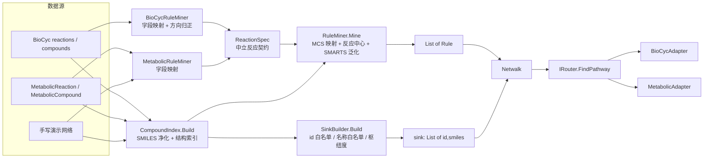

## 产品概述

为 GCModeller 内部标准的代谢网络对象（`MetabolicCompound` / `MetabolicReaction`）构建合成途径查找模块 `MetabolicAdapter`，使其与已有的 `BioCycAdapter` 一样实现 `IRouter` 接口，对外提供 `FindPathway(targetSmiles) As PathReport`。

核心做法是**把上一阶段为 BioCyc 编写的那套「SMILES 净化 → MCS 原子映射 → 反应中心提取 → SMARTS/SMIRKS 泛化 → 底盘汇构建」引擎抽成与数据源无关的通用核心**，BioCyc 与内部代谢模型各自只提供一层"字段映射"，从而做到最大程度复用、且两份适配器的挖掘行为完全一致。

完成后在 `models\BioCyc\test\test.vbproj` 中构建演示：先用知识库手写一套自包含的 E. coli 代谢网络跑通主流程，再把真实 EcoCyc 库转换为内部模型做规模化验证并与 `BioCycAdapter` 结果对拍。

## 核心特性

- **通用挖掘引擎**：输入为数据源中立的 `ReactionSpec`（id / 名称 / 左右底物 id / EC / ΔG / 可逆 / 自发），与 `CompoundStructure` 结构索引；输出 RetroPath 的 `List(Of Rule)`。BioCyc 与内部模型共用同一套引擎。
- **数据源映射层**：`BioCycRuleMiner`（`reactions` → `ReactionSpec`，含 `REACTION-DIRECTION` 方向归正）与 `MetabolicRuleMiner`（`MetabolicReaction` → `ReactionSpec`）各自只有几十行映射代码。
- **通用底盘汇构建**：`SinkBuilder` 同时支持"按 id 精确白名单"（BioCyc 专用）与"按名称/同义名白名单"（跨数据库可移植），并保留"枢纽代谢物按反应出现次数"与"全库"两种模式。
- **MetabolicAdapter**：构造期一次性装配（结构索引 → 规则挖掘 → 汇集合 → `Netwalk`），输出装配诊断；查询时把目标自身从汇中剔除；提供按化合物 id 查询的便捷方法。
- **演示**：手写内置网络（中心代谢 + 肠杆菌素/吲哚/多胺/海藻糖分支）自包含演示；以及真实 EcoCyc 库 → 内部模型转换器做规模化验证与结果对拍。

## 已知边界（沿用上一阶段实测结论）

- 化学计量数（如 3 × DHB-Ser → 肠杆菌素）在现有规则模型中无法表达。
- 立体化学与芳香性不建模；辅因子以"入汇"近似替代货币分子语义。
- SMARTS 子集不支持环闭合写法，环状反应中心的规则只能写成树，部分规则无法通过严格自洽检验（由 `strictSelfCheck` 开关控制是否丢弃）。

## 技术栈

- 语言与平台：VB.NET（.NET 10），沿用现有工程，无新增第三方依赖。
- 算法基座：复用 `analysis\MetabolicRouter\RetroPath.vbproj`（`Netwalk` / `RuleEngine` / `PatternMatcher` / `BeamSearch` / `Scoring`），上一阶段已补齐 XML 注释。
- 内部模型：`core\Bio.Assembly\MetabolicModel`（`SMRUCC.genomics.MetabolicModel` 命名空间下的 `MetabolicCompound` / `MetabolicReaction`，其 `left`/`right` 与 BioCyc 同为 `CompoundSpecieReference`）。
- 适配层：`models\RouterAdapter\RouterAdapter.vbproj`（已按 `AtomMapping/`（通用）、`BioCyc/`（BioCyc 专用）、`Data/`（通用数据契约）分层）。
- 测试宿主：`models\BioCyc\test\test.vbproj`（Exe，已引用 RouterAdapter / BioCyc / RetroPath / biocore）。

## 实现思路

整体策略是「**一次抽取、两端复用**」：把 `BioCyc/BioCycRuleMiner.vb`（845 行）里与 BioCyc 类型无关的全部挖掘逻辑整体下沉到 `Data/RuleMiner.vb`，唯一的类型耦合点收敛到 `ReactionSpec` 这个中立契约上；`BioCyc/BioCycRuleMiner.vb` 退化为仅做字段映射的薄层（对外 `Mine` 签名与行为保持不变），新增的 `Metabolic/MetabolicRuleMiner.vb` 做 `MetabolicReaction` 的映射。

三条关键设计决策：

1. **以 `ReactionSpec` 作为唯一的挖掘输入契约**。BioCyc 侧需要 `rxn.equation` 做方向归正（`RIGHT-TO-LEFT` / `PHYSIOL-RIGHT-TO-LEFT` 要把左右翻转），而 `MetabolicReaction` 没有方向枚举、一律按 left→right 理解——这个差异被封装进各自的映射层，引擎本身只看到"已归正的底物/产物 id 列表"，因此两端挖出的规则语义完全一致。
2. **汇构建按"可移植性"分两种白名单**。BioCyc 的白名单是 EcoCyc 的 frame id（如 `PYRUVATE`），换库即失效；内部模型可能来自 KEGG / ModelSEED / 任意来源，因此 `SinkBuilder` 额外支持按 `id`/`name`/`synonym` 的归一化名称白名单匹配（如 "pyruvate"、"acetyl-coa"、"shikimate"），并保留"枢纽代谢物（反应出现次数 ≥ coreDegree）"这一与命名无关的机制作为兜底。
3. **结构索引与 SMILES 净化也下沉为共享件**。`CompoundIndex.Build` 统一产出 `CompoundStructure` 并附带"无 SMILES / 不可用原因 / 样例"的诊断统计，两个适配器的装配日志格式因此一致；`BioCycSmiles` 本质是数据源无关的 SMILES 净化，迁入 `Data/SmilesSanitizer.vb`（模块更名 `SmilesSanitizer`，公开 API 不变，全项目仅 `BioCycAdapter.vb` 一处调用需要改名）。

**性能与规模**：规则挖掘是构造期一次性开销，沿用三道闸门（参与者重原子数 ≤ 80、MCS 节点预算 60000、模式原子数 ≤ 32）；搜索期沿用上一阶段验证过的参数区间（手写小网络可用小束宽；真实库沿用 beam=50 / depth=6，单目标 0.2–5s）。参考量级：EcoCyc 29.0 化合物 7588 → 可用结构 3191，反应 3272 → 规则约 850，装配 4–6s。

**必须保持的实测约束**（在通用化的搬运过程中一条都不能丢）：

- 每侧模式只保留最大连通分量（`KeepLargestComponent`）——否则产物侧带 Pi/丙酮酸时规则永不命中；
- 反应中心 = 未映射原子 ∪ 键发生变化的已映射原子，再按 `shellRadius=2` 扩展；
- 模式两侧的环键省略必须一致（forbidden 迭代，最多 4 轮）；
- 括号原子必须整体匹配（`[Cr+3]` 否则会被静默解析成碳原子）；
- 查询时把目标自身从汇中剔除。

## 执行要点

- **搬运而非重写**：`RuleMiner.vb` 的主体（`JoinSmiles` / `AddEdge` / `ExpandShell` / `KeepLargestComponent` / `HasCenterNeighbor` / `RepairIsolated` / `AtomToken` / `BondSymbol` / `Find` / `CompleteSide` / `EdgeKey` / `LargestComponent` / `EmitSide` / `EmitAtom` / `CountSkip` / `Bail` / `PatternEdge`）整体迁移，只把 `MineOne` 开头的 `rxn.uniqueId` / `rxn.equation` / `rxn.gibbs0` / `rxn.ec_number` / `rxn.spontaneous` / `rxn.commonName` / `rxn.reactionDirection` 换成 `spec` 的对应字段，避免引入行为回归。
- **对外 API 保持不变**：`BioCycRuleMiner.Mine`、`BioCycSink.Build`、`BioCycAdapter` 的构造与查询签名都不改，现有 `PathwayFinderDemo` 只需把 `BioCycSink.SinkModes.Core` 改为 `SinkModes.Core`（枚举迁到 `Data/SinkBuilder.vb`）。
- **搬运后必须回归对拍**：通用化前后，同一份 EcoCyc 库挖掘出的规则数、跳过原因分布、以及 7 个目标的路径数应与上一阶段记录（`反应 3272 → 广义规则 852`；indole 5 / putrescine 5 / AI-2 1；Core 模式；beam=50 depth=6）基本一致，若出现明显偏差说明搬运有损。
- **酶层级取值**：有 EC → `Common(1)`；无 EC 但 `is_spontaneous` → `General(2)`；否则 `Specialized(3)`。ΔG 取 `MetabolicReaction.gibbs`（BioCyc 侧取 `gibbs0`）。
- **防御性**：所有 `SmilesIO.Parse` / `New Rule(...)` / `equation` 访问都要 Try/Catch；单条脏数据只跳过计数，绝不让装配失败。
- **确定性**：反应按 id 排序后再挖掘，汇集合按 id 排序，保证同一输入结果可复现（束搜索依赖确定性顺序）。
- **搬运后清理**：`BioCyc/BioCycRuleMiner.vb` 中不复使用的私有辅助过程必须删除，不要留下死代码。

## 架构设计



- `Data/`：与数据源无关的通用件（`CompoundStructure` / `ReactionSpec` / `RuleMiner` / `SinkBuilder` / `CompoundIndex` / `SmilesSanitizer`）。
- `AtomMapping/`：MCS 原子映射，已与数据源无关，直接复用。
- `BioCyc/`：仅保留 BioCyc 特有部分（frame id 白名单、`reactions` → `ReactionSpec` 映射）。
- `Metabolic/`：内部代谢模型特有部分（`MetabolicReaction` → `ReactionSpec` 映射、可移植的中心代谢名称白名单）。

## 目录结构

```
models\RouterAdapter\
├── MetabolicAdapter.vb              # [MODIFY] 实现 IRouter：装配（结构索引→规则→汇→Netwalk）+
│                                    #   FindPathway（查询时剔除目标自身）+ FindPathwayById +
│                                    #   诊断属性（Rules/Compounds/Skipped/RuleTrace/Stats）
├── IRouter.vb                       # [保留] 无需改动
├── Data\
│   ├── CompoundStructure.vb         # [MODIFY] 追加可选的 Name / Synonyms 字段，供名称白名单匹配
│   ├── ReactionSpec.vb              # [NEW] 中立反应契约：Id / Name / ReactantIds / ProductIds /
│   │                                #       ECNumbers / IsSpontaneous / Gibbs / IsReversible
│   ├── RuleMiner.vb                 # [NEW] 通用挖掘引擎（自 BioCycRuleMiner 整体下沉）：
│   │                                #       Mine(specs, structures, ...)、MineOne(spec, ...)
│   │                                #       及全部模式构造/发射/校验辅助过程与 PatternEdge
│   ├── SinkBuilder.vb               # [NEW] SinkModes 枚举 + Build(...)：支持 idWhitelist（精确）
│   │                                #       与 nameWhitelist（归一化名称匹配）
│   ├── CompoundIndex.vb             # [NEW] CompoundSeed + Build()：SMILES 净化→结构索引，
│   │                                #       输出可用结构、无 SMILES 计数、拒绝原因与样例
│   └── SmilesSanitizer.vb           # [NEW] 自 BioCyc/BioCycSmiles.vb 迁入（Sanitize / TryParse）
├── BioCyc\
│   ├── BioCycRuleMiner.vb           # [MODIFY] 退化为薄映射层：reactions → ReactionSpec → RuleMiner.Mine
│   │                                #       （对外 Mine 签名与行为不变，删除已下沉的私有过程）
│   ├── BioCycSink.vb                # [MODIFY] 保留 EcoCyc frame id 白名单，Build 委托给 SinkBuilder；
│   │                                #       删除 SinkModes 枚举（迁至 Data/SinkBuilder.vb）
│   └── BioCycSmiles.vb              # [DELETE] 已迁入 Data/SmilesSanitizer.vb
├── Metabolic\
│   ├── MetabolicRuleMiner.vb        # [NEW] MetabolicReaction → ReactionSpec 映射 + Mine 包装
│   └── MetabolicSink.vb             # [NEW] 可移植的中心代谢名称白名单（糖酵解/PPP/TCA/氨基酸/
│                                    #       分支点/辅因子），按 id/name/synonym 归一化匹配
└── BioCycAdapter.vb                 # [MODIFY] 改用 CompoundIndex / SmilesSanitizer / SinkModes，
                                     #   其余（构造参数、FindPathway、FindPathwayById、诊断）保持不变

models\BioCyc\test\
├── DemoNetwork.vb                   # [NEW] 知识库手写的 E. coli 代谢网络：
│                                    #   MetabolicCompound（shikimate/PEP/chorismate/isochorismate/
│                                    #   DHB/L-serine/DHB-Ser/enterobactin/tryptophan/indole/
│                                    #   ornithine/arginine/agmatine/putrescine/trehalose-6P/
│                                    #   trehalose + ATP/ADP/AMP/Pi/PPi/丙酮酸/水/CO2/NH4+ 等）
│                                    #   与 MetabolicReaction（莽草酸途径、肠杆菌素分支、色氨酸酶、
│                                    #   鸟氨酸/精氨酸脱羧、海藻糖-6-磷酸磷酸酶等）
├── MetabolicDemo.vb                 # [NEW] 演示主体：Part A 手写网络搜索；
│                                    #   Part B 真实库转换后的规模化验证并与 BioCycAdapter 对拍
├── BioCycMetabolicConvertor.vb      # [NEW] BioCyc → MetabolicModel 转换器（仿 KEGGConvertor 写法）：
│                                    #   ConvertCompound / ConvertReaction
└── Program.vb                       # [MODIFY] Main 增加 metabolic 分发到 MetabolicDemo.Run
```

## 关键代码结构

```
' models\RouterAdapter\Data\ReactionSpec.vb —— 与数据源无关的反应契约
Public Class ReactionSpec
    ''' 反应唯一 id（规则 Id 用它，便于把结果回溯到原始反应条目）
    Public Property Id As String
    ''' 反应名称（规则 Name，优先 common name，回退系统名/id）
    Public Property Name As String
    ''' 已按方向归正的底物 compound id（去重、去空、字典序）
    Public Property ReactantIds As List(Of String)
    ''' 已按方向归正的产物 compound id
    Public Property ProductIds As List(Of String)
    ''' EC 号集合；非空即视为"常见酶家族"
    Public Property ECNumbers As String()
    ''' 是否无需酶催化即可发生
    Public Property IsSpontaneous As Boolean
    ''' 正向 ΔG（kJ/mol）
    Public Property Gibbs As Double
    ''' 生理条件下是否可逆
    Public Property IsReversible As Boolean
End Class
```

```
' models\RouterAdapter\Data\RuleMiner.vb —— 通用挖掘引擎（自 BioCycRuleMiner 下沉）
Public Module RuleMiner
    Public Function Mine(reactionList As IEnumerable(Of ReactionSpec),
                         structures As Dictionary(Of String, CompoundStructure),
                         Optional maxMoleculeAtoms As Integer = 80,
                         Optional maxPatternAtoms As Integer = 32,
                         Optional mcsNodeBudget As Integer = 60000,
                         Optional maxUnmappedAtoms As Integer = 3,
                         Optional shellRadius As Integer = 2,
                         Optional includeBuiltin As Boolean = False,
                         Optional strictSelfCheck As Boolean = False,
                         Optional skipped As Dictionary(Of String, Integer) = Nothing,
                         Optional trace As Dictionary(Of String, String) = Nothing) As List(Of Rule)
End Module
```

```
' models\RouterAdapter\MetabolicAdapter.vb —— 对外主入口
Public Class MetabolicAdapter : Implements IRouter
    Sub New(compounds As IEnumerable(Of MetabolicCompound),
            metabolic As IEnumerable(Of MetabolicReaction),
            Optional opts As SearchOptions = Nothing,
            Optional w As ScoreWeights = Nothing,
            Optional sinkMode As SinkModes = SinkModes.Core,
            Optional coreDegree As Integer = 4,
            Optional maxMoleculeAtoms As Integer = 80,
            Optional maxPatternAtoms As Integer = 32,
            Optional mcsNodeBudget As Integer = 60000,
            Optional maxUnmappedAtoms As Integer = 3,
            Optional shellRadius As Integer = 2,
            Optional includeBuiltinRules As Boolean = False,
            Optional strictSelfCheck As Boolean = False,
            Optional verbose As Boolean = True,
            Optional keepRuleTrace As Boolean = False)

    Public Function FindPathway(targetSmiles As String) As PathReport Implements IRouter.FindPathway
    Public Function FindPathwayById(compoundId As String) As PathReport
End Class
```

## 实施注意与已知边界

- 手写演示网络的 SMILES 必须落在支持子集内（Kekulé 大写式、无 `%nn`、无 `*`、元素限于 C/N/O/S/P/F/I/B/H/Cl/Br/Si；允许带 `@` 与 `/ \`，净化时会被剔除）。所有 SMILES 先用知识库写出，再用只读命令对 `F:\ecoli\29.0\data\compounds.dat` 逐一核对；演示会打印解析失败的条目，便于发现并修正。
- 手写网络规模小（约 30 个化合物 / 20 余条反应），Core 模式下"枢纽度 ≥ 4"可能几乎选不出汇成员，因此名称白名单必须覆盖演示网络里的底盘代谢物；必要时为小网络把 `coreDegree` 降到 2 或直接用 `SinkModes.All`。
- 真实库规模验证依赖 `F:\ecoli\29.0`；若该路径不可用，`MetabolicDemo` 的 Part B 应优雅跳过并提示，而不是抛异常中断。
- 化学计量数、立体化学、芳香性、环闭合、辅因子货币语义等边界与 `BioCycAdapter` 完全一致，在报告与注释中如实声明。

## Agent Extensions

### SubAgent

- **code-explorer**
- 用途：在搬运 `BioCycRuleMiner.vb`（845 行）前，完整核对其全部私有辅助过程、跳过原因字符串与调用关系，确保下沉到 `Data/RuleMiner.vb` 时不漏搬、不留死代码；并确认 `BioCycSmiles` / `SinkModes` / `BioCycSink` 的全部引用点，避免改名后漏改。
- 预期结果：给出待迁移过程清单与全部引用点文件行号，支撑"搬运后行为不变"的回归对拍。