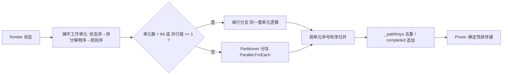

## 用户需求

审查 `analysis\MetabolicRouter\RetroPath.vbproj` 项目，找出 `Netwalk.Search`（Netwalk.vb:69）与 `Netwalk.SynthesisRoute`（Netwalk.vb:175-181）所调用链路中可并行化的部分，生成并行优化方案并实施性能优化，以提升大型代谢网络的搜索效率。

## 产品概述

在保持搜索结果**完全不变**的前提下，把逆向合成束搜索中最耗时的「状态 × 待分解物 × 规则」规则应用循环改造为确定性并行，并同步消除分子图运算与规则匹配中的重复计算开销；提供可关闭的并行度开关与串行/并行对比基准，用于验证加速比与结果一致性。

## 核心特性

- **确定性并行展开**：束搜索展开按「状态序 → 待分解物序 → 规则序」摊平为有序工作单元，分块并行后按单元序号有序归并，结果与串行版本逐位一致。
- **并行度可配置**：`SearchOptions.MaxDegreeOfParallelism`（默认=处理器核数，1=退化为串行），便于回归对比与资源受限环境降级。
- **算法层加速**：规则侧拓扑预计算（`ApplyPlan`）、规则元素多重集预过滤、分子不变量快照与邻接表优化、`MolKey` 缓存。
- **可观测**：新增预过滤命中统计，便于观察规则裁剪率与热点分布。
- **基准入口**：test 项目 `bench` 子命令，同一批查询串行/并行各跑一遍，输出耗时、加速比，并断言两者路径签名一致。

## 技术栈

- VB.NET / .NET 10（`net10.0`），沿用现有项目结构，**不引入第三方依赖**
- 并行设施：`System.Threading.Tasks.Parallel` / `Partitioner`、`Interlocked`（.NET 内置）
- 涉及项目：`analysis\MetabolicRouter\RetroPath.vbproj`（核心）、`models\RouterAdapter\RouterAdapter.vbproj`、`models\BioCyc\test\test.vbproj`（bench）

## 代码审查结论（已读码确认）

### 调用链

`Netwalk.Search` / `Netwalk.SynthesisRoute` → `BeamSearch.Search` → 私有 `Search(frontier, completed)`（三重循环）→ `RuleEngine.ApplyForward` + `ApplyReverse` → `PatternMatcher.Match` → `Molecule.Copy/SplitComponents/ValenceViolations/MolKey` → `Scoring.ScorePath/AssembleForward`。

### 线程安全性：可安全并行

项目内 7 处 `Shared` 全是纯函数（`Netwalk.ParseOrThrow/TryMolKey/CloneOptions`、`PatternMatcher.KeyOf`、`BeamSearch.PathKey`、`SmilesWriter.BondChar`、`Bond` 转换运算符），**无可变静态状态**；`RuleEngine.Apply` 先 `m.Copy()` 再变换、不修改入参；`PatternMatcher.Match` 每次新建 `MatcherState`。故「(状态, 待分解物, 规则)」三元组之间完全独立。

### 热点分级

- **P0**：`BeamSearch` 私有 `Search` 三重循环。实测单查询 30 万次规则应用，SER→TRP 三轮升级达 355 万次。
- **P1**：`Netwalk` 汇集合（363 个）+ 货币分子的 SMILES 解析与 `MolKey()`（串行，约 368 次）。
- **P2**：`SynthesisRoute` 的 `Evaluate` 过滤与 `ToRouteDto` 组装（候选 ≤144 条）。
- **P3**：escalate 多轮（束宽 50→100→200、深度 6→7→8）严格串行；本次保持串行（CPU 效率优先），投机并行仅作文档化后续项。

### 算法层热点

1. `RuleEngine.Apply` 每次调用重建 4 个只依赖规则的拓扑结构（`otherBonded/otherAtom/otherBonds/matchBonds`），却在「分子 × 规则 × 方向」上重建数百万次。
2. `Molecule.Neighbors(a)` 每次全表扫描键并 `New List(Of Tuple)`，被 `ImplicitH/ValenceViolations/MorganRanks/Components/TotalH` 反复调用 → 实际 O(原子数 × 键数 × 轮数)；`BondOrder/SetBondOrder/RemoveBond` 同样全表扫描，`RemoveBond` 还 `Where().ToList()` 重建整表。
3. `PatternMatcher.MatcherState.OkAtom` 对「模式原子 × 分子原子」每个组合调用 `TotalH/Degree`，各自 O(键数) 扫描。
4. 对 852 条规则**零预过滤**，逐条尝试匹配。
5. `MolKey()` 无缓存，同一分子在多处反复计算。

## 实现思路

**策略：先做「减少工作量」的算法层优化，再做「分摊工作量」的确定性并行**——前者通常带来更大且无副作用的加速，后者把剩余负载摊到多核。二者都不改变搜索语义。

### 1. 确定性并行展开（P0）

把三重循环摊平为一维有序工作单元序列，单元序号 = `(状态序, 待分解物序, 规则序)` 字典序；单元内部严格保持原顺序（先 `ApplyForward` 后 `ApplyReverse`，碎片按原序处理）。用 `Partitioner.Create(0, totalUnits)` + `Parallel.ForEach(MaxDegreeOfParallelism = n)` 让每个线程处理连续区间，结果连同单元序号写入**线程本地缓冲**；并行区结束后**单线程按单元序号稳定排序合并**，去重（`_pathKeys`）与 `completed` 追加在合并阶段做。



- **一致性依据**：`Prune` 的排序键（导向优先、Pending 数、原子总数、末步 ΔG、StateKey）全部是状态自身的确定性字段；只要合并顺序确定，剪枝与去重结果即与串行逐位一致。
- **计数器**：`ApplicationsTried/RulesApplied/StatesGenerated` 为顺序无关求和量，按分区累加后求和。
- **降级**：`MaxDegreeOfParallelism <= 1` 或单元数 < 64 走同一套串行分支，无任务调度开销。

### 2. 算法层三项

- **`ApplyPlan` 预计算**：把 `Apply` 里与分子无关的 4 个结构，在 `Rule` 构造期为正向（Reactant→Product）与逆向（Product→Reactant）各算一份并只读缓存；`Apply` 改为消费 `ApplyPlan`。
- **分子不变量快照 + 邻接表**：`Molecule` 内部一次性 O(键数) 构建邻接表，供 `MorganRanks/ValenceViolations/Components/ImplicitH` 复用；`PatternMatcher.Match` 入口构建一次「元素/电荷/度/氢总数 + 邻接 + 键级字典」快照供 `OkAtom`/`BondsConsistent` 复用。公共 `Neighbors()` 保留原语义以兼容外部调用。
- **规则元素预过滤**：按方向预计算「模式中有键原子的元素多重集」需求表（BeamSearch 构造期一次，852×2，开销可忽略）；展开时先做多重集包含判定再决定是否调用 `Apply`。**正确性**：只有参与匹配的「有键类」才计入需求（与 `BuildOrderAndCandidates` 的 `bondedCls` 语义一致），断开的组分是被创建的辅底物模板，不计入。
- **`MolKey` 缓存（含安全改造）**：`Bonds` 是 Public 可变列表，实例级缓存有陈旧风险。改为：新增 `AddBond(a,b,order)` 统一入口 + `InvalidateStructure()`，在 `AddAtom/SetBondOrder/RemoveBond/AddBond/Copy` 处失效；并把项目内**所有**直接改 `Bonds` 的点（`RuleEngine.Apply` 的 `res.Bonds.Add`、`SplitComponents` 的 `fm.Bonds.Add`、`SmilesIO` 的三处 `m.Bonds.Add`）改为走 `AddBond`。已确认项目内仅这 5 处直接写入（RCSB PDB、AutoDock 的 `Bonds` 属同名不同类的无关类型）。

### 3. 并行度开关

`SearchOptions.MaxDegreeOfParallelism As Int32 = 0`（0/负 = `Environment.ProcessorCount`，1 = 串行）+ `EffectiveParallelism()` 辅助；`Netwalk.CloneOptions` 同步复制该字段。

### 4. 次级并行点

`Netwalk.Search`/`SynthesisRoute` 的汇与货币分子指纹构建改为 `Parallel.For` 写入定长数组后按索引顺序入 HashSet；`SynthesisRoute` 的 `Evaluate` 过滤与 `ToRouteDto` 组装对候选（≤144）并行（收益小，列为可选，实现时按实测决定是否保留）。

### 5. Bench 入口

`BioCycAdapter`/`MetabolicAdapter` 新增 `CreateNetwalk(Optional opts, Optional w)` 复用已装配的 `ruleList`/`sinkEntries`；新建 `BenchDemo.vb` + `Program.vb` 的 `bench` 分支：装配一次 → 固定查询集（`TRP→INDOLE`、`L-ORNITHINE→PUTRESCINE`、`PUTRESCINE→SPERMIDINE`、`SHIKIMATE→CHORISMATE` 的 `SynthesisRoute`，以及 `CHORISMATE`/`INDOLE` 的 `Search`）分别以并行度 1 与默认并行度各跑一遍，输出单项/合计耗时与加速比，**比对路径签名（规则 id + 正向步骤底物/产物 SMILES + 各项得分 + 步数）完全一致**，落盘 `bench_result.json`。

## 实现要点（防回归）

- **语义不变优先于性能**：每完成一项优化即编译 + 跑 `route` 回归，确认 4/7 命中与最经济通路内容与优化前一致。
- **预过滤会改变 `Stats.ApplicationsTried` 数值**（不再尝试不可能匹配的规则），但**不改变任何路径结果**；bench 一致性断言比对路径签名而非统计计数，新增 `RulesPrefiltered` 观察裁剪率。
- **`MolKey` 取值语义不得改变**（现用 `TotalH` 而非 `ExplicitH`，见前一轮修复）。
- **不可并行处**：`Prune` 排序、`_pathKeys` 去重、`completed` 追加、escalate 轮次推进。
- **性能风险**：并行区不得持有锁；线程本地缓冲避免共享集合；小 frontier（深度 1，单元数 < 64）直接串行，避免任务调度开销反超收益。
- **日志**：沿用 `Console.Error` 单行摘要风格，bench 结果同时落盘 JSON。

## 目录结构

```
analysis/MetabolicRouter/
├── Chem/
│   ├── ApplyPlan.vb                    # [NEW] 规则方向侧拓扑预计算（otherBonded/otherAtom/otherBonds/matchBonds 只读快照）
│   ├── RuleEngine.vb                   # [MODIFY] Rule 构造期缓存正/逆向 ApplyPlan；Apply 改消费 ApplyPlan；Bonds.Add → AddBond
│   ├── PatternMatcher.vb               # [MODIFY] Match 入口构建分子不变量快照，OkAtom/BondsConsistent 复用
│   └── Molecule/
│       ├── Molecule.vb                 # [MODIFY] 邻接表复用、AddBond/InvalidateStructure、MolKey 缓存与失效
│       └── SmilesIO.vb                 # [MODIFY] 三处 m.Bonds.Add 改为 m.AddBond
├── Search/
│   ├── SearchOptions.vb                # [MODIFY] 新增 MaxDegreeOfParallelism + EffectiveParallelism()
│   ├── RuleFilter.vb                   # [NEW] 按方向的规则元素多重集需求表与预过滤
│   ├── BeamSearch.vb                   # [MODIFY] 工作单元摊平 + 确定性并行 + 有序归并 + 预过滤接入
│   └── SearchState.vb                  # [MODIFY] SearchStats 增加 RulesPrefiltered
├── Netwalk.vb                          # [MODIFY] CloneOptions 同步新字段；汇/货币指纹并行构建；Evaluate/ToRouteDto 可选并行
└── test/                               # [VERIFY] 复用自带 SelfTest 校验规则应用语义未变

models/RouterAdapter/
├── BioCycAdapter.vb                    # [MODIFY] 新增 CreateNetwalk（复用 ruleList/sinkEntries）
└── MetabolicAdapter.vb                 # [MODIFY] 新增 CreateNetwalk

models/BioCyc/test/
├── BenchDemo.vb                        # [NEW] 串行/并行对比基准 + 路径签名一致性断言 + bench_result.json
└── Program.vb                          # [MODIFY] Main 增加 bench 分支（保留 route/legacy/pathway/默认）
```

## 关键结构

```
' Chem/ApplyPlan.vb —— 规则一侧拓扑的只读预计算（与分子无关，构造期算一次）
Public Class ApplyPlan
    Public ReadOnly Bonded As HashSet(Of Int32)                       ' other 侧有键的类号
    Public ReadOnly AtomOfCls As Dictionary(Of Int32, PatternAtom)   ' 类号 → 模式原子
    Public ReadOnly OtherBonds As Dictionary(Of (Int32, Int32), Int32)
    Public ReadOnly MatchBonds As Dictionary(Of (Int32, Int32), Int32)
    Public Sub New(matchSide As Pattern, otherSide As Pattern)
End Class

' Search/SearchOptions.vb —— 并行度开关
Public Class SearchOptions
    ...
    ''' <summary>并行度：0/负 = Environment.ProcessorCount；1 = 串行。</summary>
    Public MaxDegreeOfParallelism As Int32 = 0
    Public Function EffectiveParallelism() As Int32
End Class
```

```
' Search/BeamSearch.vb —— 确定性并行展开的工作单元与归并契约（示意）
' 单元序号 = ((状态序 * 待分解物数 + 待分解物序) * 规则数 + 规则序)
' 每单元内部顺序：ApplyForward → ApplyReverse → 碎片按原序处理（与串行完全一致）
' 线程本地缓冲：List(Of (unitIndex As Int64, st As SearchState, isCompleted As Boolean))
' 并行区结束后单线程按 unitIndex 稳定排序合并 → _pathKeys 去重 / completed 追加 / nextStates
```

## Agent Extensions

### SubAgent

- **code-explorer**
- 目的：全面审计 `Molecule.Bonds` 的直接写入点与 `MolKey/Neighbors/MorganRanks` 的全部调用点，确保 `MolKey` 缓存失效覆盖无遗漏、分子图优化不引入陈旧指纹。
- 预期产出：给出项目内所有可变 `Bonds` 的位置清单与调用点清单，作为缓存失效与邻接优化的实现依据与回归核对表。