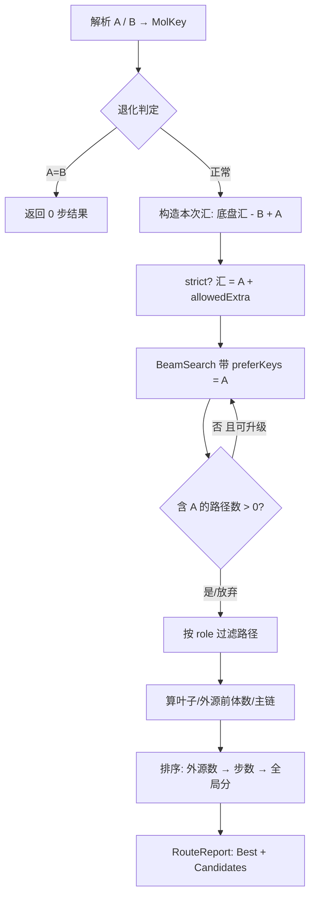

## 用户需求

在现有代谢网络生物合成通路查找工具中，新增「从代谢物 A 出发、找到最经济的一条合成代谢物 B 的途径」能力。

## 产品概述

当前做法是先调用 `Netwalk.Search(B)` 枚举目标 B 的全部候选逆合成通路，再后置筛选「包含化合物 A」的结果，命中率与正确性都不理想。需要把这一语义下沉为 `Netwalk` 的一等公民函数 `SynthesisRoute(A, B)`：搜索过程中就把 A 作为路径的合法起点纳入约束，并按经济性准则直接给出最优通路；随后在 `models\BioCyc\test\test.vbproj` 中用 `F:\ecoli\29.0`（EcoCyc 29.0）编写 demo 进行算法调试。

## 核心特性

- **起点约束可配**：默认允许 A 与底盘内源代谢物（汇）共同作为起点；提供 strict 开关切到「只允许 A + 货币分子（水/CO2/NH3/Pi）」的严格 A→B 模式，并支持 `allowedExtra` 临时放行额外辅因子。
- **A 的角色可配**：`Source`（A 必须是路径最上游的叶子原料，不能再被分解）/ `Anywhere`（A 出现在路径任意位置即可，召回更高）。
- **A 导向搜索**：把 A 注入本次查询的汇集合，并在束剪枝中优先保留「已触达 A」的分支，避免通往 A 的路径被剪掉。
- **经济性排序**：先比「除 A 外还需几个外源起始物」（越少越好）→ 再比反应步数（越少越好）→ 最后用现有全局分（ΔG/酶可得性/长度）决出并列，返回最经济的一条（同时保留候选列表）。
- **主链标注**：标出 A→B 主链上的步骤，便于人工判读与 demo 打印。
- **自动升级与诊断**：首轮未命中时自动加大束宽/深度重试，输出命中情况、路径指标与耗时。
- **Demo 验证**：用 EcoCyc 中已确认可用结构的 A→B 对（TRP→INDOLE、L-ORNITHINE→PUTRESCINE、PUTRESCINE→SPERMIDINE、SHIKIMATE→CHORISMATE、GLT→PRO、CHORISMATE→ENTEROBACTIN 等）逐个跑通并落盘 JSON。

## 技术栈

- 语言/框架：VB.NET，.NET 10（`net10.0`），沿用现有项目结构（无新增第三方依赖）
- 涉及项目：`analysis\MetabolicRouter\RetroPath.vbproj`（算法核心）、`models\RouterAdapter\RouterAdapter.vbproj`（BioCyc 适配层，命名空间 `SMRUCC.genomics.Model.Metabolic.RouterAdapter`）、`models\BioCyc\test\test.vbproj`（Exe 演示）
- 数据来源：`F:\ecoli\29.0`（`Workspace.Open` 加载，实测可装配约 844 条广义规则、Core 汇数百个）

## 实现思路

把「A→B」语义从「后置筛选」改为「搜索期约束 + 专用排序」：

1. **汇注入**：本次查询的汇 = 构造期汇（剔除 B 自身）∪ {A}；strict 模式则汇 = {A} ∪ `allowedExtra`（货币分子由 `currencyKeys` 自动忽略，无需入汇）。这样 A 一旦作为前体出现即判定为「已落地」，不再被继续分解。
2. **A 导向剪枝**：给 `BeamSearch` 增加**可选**的 `preferKeys`，在 `Prune` 排序中把「`Used` 含 A 的指纹」作为首要键，保证通往 A 的分支优先存活（默认 Nothing 时行为与现在完全一致，零回归风险）。
3. **叶子/外源前体推导**：`produced = {各步 SubstrateKey}`，`leaves = (各步 Precursors keys) − produced − {B}`；`sourceIsLeaf = leaves 含 A`，`externalCount = leaves.Count − If(sourceIsLeaf,1,0)`。
4. **过滤 + 经济性排序**：按 role 过滤后执行 `Order By externalCount Asc, NumSteps Asc, GlobalScore Desc`，第 1 条即最经济通路。
5. **主链标注**：从 A 的叶子沿正向步骤做可达性传播，标记每个 `ForwardStep` 是否位于 A→B 主链及其阶段号。
6. **自动升级（escalate）**：首轮无命中时按 `BeamWidth×4 / MaxDepth+2` 重试（最多 2 轮，带耗时预算），轮次写入 Stats。

流程示意：



## 实现要点（落地细节）

- **`BeamSearch.vb`（向后兼容扩展）**：新增可选构造参数 `preferKeys As HashSet(Of String) = Nothing`；`Prune` 中改为 `Order By (若 preferKeys 非空则 If(st.Used.Overlaps(preferKeys),0,1) Else 0) → Pending.Count → TotalAtoms() → 末步 ΔG → StateKey`。不传参时排序键为常量 0，既有 `Search` 行为完全不变。
- **`Model\RouteModel.vb`（新建）**：`Enum SourceRoles {Source, Anywhere}`；`RouteStepDto`（继承/复用 `ForwardStepDto` 字段 + `from_source`、`stage`）；`RouteDto`（含 `PathDto` 全部字段 + `external_count`、`external_precursors() `、`source_is_start`、`source_stage`、`from_source `标记、`economy_rank`）；`RouteReport`（`Program/Version/Source/Target/Parameters/Stats/Best/Candidates`）。**不修改**现有 `PathDto/PathReport`，保证既有 JSON 契约不变。
- **`Netwalk.SynthesisRoute`**：
- 签名 `SynthesisRoute(sourceSmiles As String, targetSmiles As String, Optional role As SourceRoles = SourceRoles.Source, Optional strict As Boolean = False, Optional allowedExtra As IEnumerable(Of (String, String)) = Nothing, Optional maxRoutes As Integer = 0, Optional escalate As Boolean = True) As RouteReport`
- 与 `Search` 共用 `RuleLibrary.CurrencySmiles()` 构造 `currencyKeys`；复用 `Scoring.ScorePath` / `Scoring.AssembleForward` 做评分与正向组装，避免重复实现。
- A/B 解析失败抛 `ArgumentException`；A=B 返回 0 步结果；B 在汇中被剔除（沿用 `FindPathway` 的既有做法）。
- 每轮搜索复用 `Stopwatch`，把「轮次 / 命中数 / 外源数 / 步数」写入 `Console.Error` 一行摘要（与 `Search` 的日志风格一致）。
- **性能**：搜索期只增加「`Used` 集合与 preferKeys 求交」的 O(1)~O(|Used|) 开销，可忽略；escalate 最多 2 轮，单轮上限沿用 `opts.MaxPaths` 提前停止；大分子（ENTEROBACTIN，60+ 重原子）在 demo 中单独降级（beam 20 / depth 4）并如实打印耗时。
- **边界声明（写进注释与 demo 输出）**：化学计量（如 3×DHB-Ser）无法表达；立体化学/芳香性不建模；ATP/NADH/CoA/SAM 不在硬编码货币分子内，strict 模式下需 `allowedExtra` 放行；束搜索非完备。

## 目录结构

```
analysis/MetabolicRouter/
├── Netwalk.vb                  # [MODIFY] 新增 SynthesisRoute 主函数 + 私有辅助（汇构造、叶子推导、主链标注、escalate 循环、报告组装）
├── Search/BeamSearch.vb        # [MODIFY] 新增可选 preferKeys 构造参数与 A 优先剪枝（默认关闭，行为不变）
├── Model/RouteModel.vb         # [NEW] SourceRoles 枚举、RouteStepDto、RouteDto、RouteReport（A→B 专用契约，不侵入既有 PathReport）
models/RouterAdapter/
├── IRouter.vb                  # [MODIFY] 增加 SynthesisRoute 契约（与实现签名保持一致）
├── BioCycAdapter.vb            # [MODIFY] SynthesisRoute / SynthesisRouteById 转调 netwalk；复用 structures 做 id→SMILES
models/BioCyc/test/
├── SynthesisRouteDemo.vb       # [NEW] A→B demo：装配适配器、逐对搜索、打印经济性与主链、落盘 biocyc_routes.json
└── Program.vb                  # [MODIFY] Main 增加 route 分支（route [strict] [PAIRID]），保留 legacy 与 PathwayFinderDemo 分支
```

## 关键结构

```
' Model/RouteModel.vb
Public Enum SourceRoles
    Source      ' A 必须是路径最上游的叶子原料
    Anywhere    ' A 出现在路径任意位置即可
End Enum

' Netwalk.vb
Public Function SynthesisRoute(sourceSmiles As String,
                               targetSmiles As String,
                               Optional role As SourceRoles = SourceRoles.Source,
                               Optional strict As Boolean = False,
                               Optional allowedExtra As IEnumerable(Of (String, String)) = Nothing,
                               Optional maxRoutes As Integer = 0,
                               Optional escalate As Boolean = True) As RouteReport
```