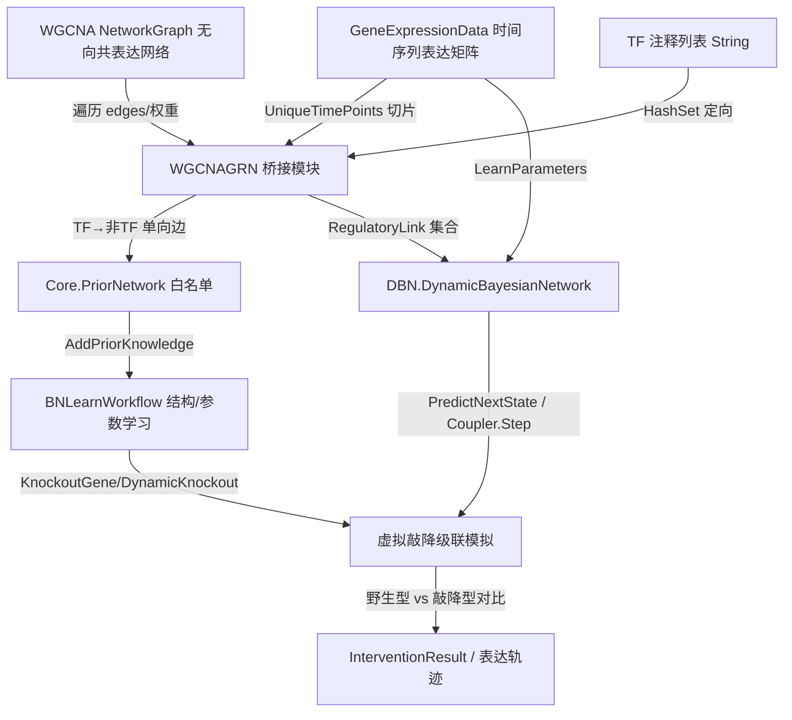

## 用户需求

在 `sub-system\CellPhenotype\WGCNAGRN.vb` 模块中扩展 `BuildBNNetwork` 函数（签名已固定：`BuildBNNetwork(wgcna As NetworkGraph, TF As String()) As BNLearnWorkflow`），利用 WGCNA 共表达网络作为 BNLearn 动态贝叶斯网络的拓扑先验，构建基因表达调控网络模型并支持虚拟敲降模拟。

## 产品概述

建立 WGCNA 无向共表达网络与 BNLearn 动态贝叶斯网络之间的桥接层，通过 TF 注释结果将共表达边定向为单向调控先验，再导入时间序列表达矩阵拟合 DBN 参数，最终提供基因虚拟敲降的级联模拟能力。

## 核心功能

- 按 TF 注释（`TF` 参数）将 WGCNA 共表达网络（节点=基因 label，边=相关系数 `weight`）定向为有向调控先验：TF 节点为上游调控因子（边起点），非 TF 节点为下游靶基因（边终点），仅生成 TF→非TF 单向边。
- 权重符号决定调控类型：正相关 `weight > 0` → `Effector.Activator`，负相关 `weight < 0` → `Effector.Inhibitor`；权重绝对值作为先验置信度。
- 将定向后的拓扑同时转换为 `Core.PriorNetwork`（高斯 BN 结构学习白名单）与 `DBN.RegulatoryLink` 集合（DBN 拓扑）。
- 加载时间序列表达矩阵（`GeneExpressionData`），驱动 DBN 的 `BuildFromTopology` + `LearnParameters` 拟合条件概率表。
- 执行指定基因的虚拟敲降模拟：固定目标节点为 Low 状态，多步推演下游基因表达级联变化，输出与野生型基线的差异。
- 提供端到端封装：WGCNA 网络 + 表达矩阵 → DBN 建模 → 敲降模拟结果。

## 技术栈

- 语言/框架：Visual Basic (.NET 10)，与 `CellPhenotype`、`BNLearn`、`WGCNA` 现有项目保持一致。
- 已有依赖：`CellPhenotype.vbproj` 已引用 `BNLearn.vbproj` 与 `network_graph`（NetworkGraph 程序集）。
- **需补充引用**：`annotations\WGCNA\WGCNA\WGCNA.vbproj`（RootNamespace `SMRUCC.genomics.Analysis.HTS.WGCNA`）。
- BNLearn 侧复用：`Core.PriorNetwork`、`Core.GeneExpressionData`、`Core.BNLearnWorkflow`、`DBN.DynamicBayesianNetwork`、`DBN.RegulatoryLink`、`DBN.DBNODECoupler`、`DBN.DBNPredictionResult`、`Enum Effector`。

## 实现方案

### 总体策略

在 `WGCNAGRN` 模块内，将无向 WGCNA 共表达网络按 TF 注释转为有向调控先验，并驱动 DBN 完成建模与虚拟敲降。核心流程为：遍历 `wgcna.edges` 定向生成先验 → 注入 `BNLearnWorkflow.PriorNetwork` 与 `DynamicBayesianNetwork.BuildFromTopology` → 时间序列表达矩阵拟合参数 → 多步 `PredictNextState`/`DBNODECoupler.Step` 模拟敲降级联。

### 关键技术决策

1. **方向性（按用户要求）**：建立 `HashSet(Of String)(TF, OrdinalIgnoreCase)` 区分 TF/非 TF。对每条边 (U, V, weight)：仅当一端为 TF 且另一端非 TF 时生成单向 `RegulatoryEdge(TF→非TF)` 与 `RegulatoryLink`；两端均为 TF 或均为非 TF 的边跳过（方向无法由共表达确定），并用 `VBDebugger` 给出统计日志。此策略严格遵循用户"按 TF 注释结果构建调控方向"的要求，避免产生虚假反向边。

2. **调控类型推导**：`InferEffector(weight)`：`weight >= 0` → `Activator`，否则 `Inhibitor`；置信度 `confidence = |weight|`。

3. **RegulatoryLink 构造**：`.TF_id = tf`，`.target_operon = target`，`.regulate_genes = {target}`，`.effector = New Dictionary(Of String, Effector) From {{target, InferEffector(weight)}}`。与 `BuildFromTopology` 内部节点/父关系建立逻辑完全对齐。

4. **时间序列转换**：`GeneExpressionData` 为纯数据结构（无 `LoadTimeCourse`/`LoadGCT`）。按 `UniqueTimePoints` 排序，将每个时间点 `GetSample(idx)` 映射为 `Dictionary(Of String, Double)`（node_id→abundance）形成 `List(Of Dictionary(...))`，供 `DBN.LearnParameters` 使用（需 ≥2 时间点）。

5. **虚拟敲降模拟**：DBN 无现成 Knockdown 方法。在模块内实现模拟循环：将被敲降基因在 `PredictNextState` 的 `tfAbundances`/`currentGeneStates` 证据中强制置为 "Low"，多步推演下游基因状态变化（`DBNODECoupler.Step` 或手动循环 `PredictNextState`），对比野生型基线得出表达变化。同时利用 `BNLearnWorkflow.KnockoutGene`/`DynamicKnockout` 提供高斯 BN 路径的对照结果。

### 性能与可靠性

- 拓扑转换复杂度为 O(E)（E=边数），单次遍历 `wgcna.edges` 完成，无 N+1 问题。
- 参数学习复杂度与 DBN 节点/父节点组合数相关；通过 `adj_thres`（已在 WGCNA 导出时过滤低相关边）控制网络规模。
- 错误处理：空网络、空表达矩阵抛出明确异常；表达矩阵中缺失的网络节点在 `LearnParameters` 时间序列构造时自动跳过（DBN 内部 `ContainsKey` 过滤），不需额外处理；两端同类型的边计数并警告日志。
- 复用现有 `BNLearn` API，不修改其公共接口，仅在 `CellPhenotype` 侧做适配封装，blast radius 受控。

## 实现注意事项

- **项目引用**：`CellPhenotype.vbproj` 必须新增 WGCNA `ProjectReference`，否则无法访问 `NetworkGraph`（来自 network_graph，已引用）与后续 WGCNA 类型。
- **命名空间**：模块需 `Imports SMRUCC.genomics.Analysis.BNLearn.Core`、`SMRUCC.genomics.Analysis.BNLearn.DBN`、`Microsoft.VisualBasic.Data.visualize.Network.Graph`、`Microsoft.VisualBasic.Language`（用于 LINQ）。
- **日志**：复用 `VBDebugger`（sciBASIC# 标准日志），控制边转换进度频率，不输出敏感信息。
- **向后兼容**：保留现有 `BuildBNNetwork` 签名，所有新增函数为扩展，不影响已有调用方。

## 架构设计



## 目录结构

```
sub-system/CellPhenotype/
├── CellPhenotype.vbproj        # [MODIFY] 新增 WGCNA 项目引用 ProjectReference
└── WGCNAGRN.vb                # [MODIFY] 扩展 BuildBNNetwork + 新增定向先验/拓扑转换/参数拟合/虚拟敲降函数
```

`WGCNAGRN.vb` 职责与关键函数：

- `BuildBNNetwork(wgcna As NetworkGraph, TF As String()) As BNLearnWorkflow`：主入口，按 TF 定向构建先验并装配工作流（保留原签名）。
- `InferEffector(weight As Double) As Effector`：权重符号→激活/抑制。
- `BuildPriorNetwork(wgcna As NetworkGraph, TF As HashSet(Of String)) As Core.PriorNetwork`：生成单向 TF→非TF 先验边。
- `BuildRegulatoryLinks(wgcna As NetworkGraph, TF As HashSet(Of String)) As IEnumerable(Of DBN.RegulatoryLink)`：生成 DBN 拓扑链路。
- `BuildDBN(wgcna As NetworkGraph, expr As Core.GeneExpressionData, TF As HashSet(Of String)) As DBN.DynamicBayesianNetwork`：构建并 `LearnParameters` 拟合的 DBN。
- `ToTimeSeries(expr As Core.GeneExpressionData) As List(Of Dictionary(Of String, Double))`：时间序列矩阵转 DBN 学习输入。
- `VirtualKnockdown(dbn As DBN.DynamicBayesianNetwork, gene As String, nSteps As Integer) As Dictionary(Of String, Double())`：多步级联模拟，返回各基因随时间表达轨迹。
- `RunPipeline(wgcna As NetworkGraph, exprFile As String, knockGene As String, TF As String()) As Object`：端到端封装。

## 关键代码结构

```
' 调控方向推导（按 TF 注释单向）
Function ToRegulatoryLink(tf As String, target As String, weight As Double) As RegulatoryLink
    Return New RegulatoryLink With {
        .TF_id = tf,
        .target_operon = target,
        .regulate_genes = {target},
        .effector = New Dictionary(Of String, Effector) From {{target, InferEffector(weight)}}
    }
End Function

' 边定向主逻辑（TF -> 非TF 单向）
For Each e In wgcna.edges
    Dim a = e.U.label, b = e.V.label
    If tfSet.Contains(a) AndAlso Not tfSet.Contains(b) Then
        prior.AddEdge(a, b, InferEffector(e.weight), Math.Abs(e.weight), "WGCNA co-expression")
        links.Add(ToRegulatoryLink(a, b, e.weight))
    ElseIf tfSet.Contains(b) AndAlso Not tfSet.Contains(a) Then
        prior.AddEdge(b, a, InferEffector(e.weight), Math.Abs(e.weight), "WGCNA co-expression")
        links.Add(ToRegulatoryLink(b, a, e.weight))
    Else
        ' 两端同类型，方向无法确定，跳过并计数
    End If
Next
```

## Agent Extensions

### SubAgent

- **code-explorer**
- 用途：在实施阶段深入检索 `BNLearn` 中 `BNLearnWorkflow`、`DynamicBayesianNetwork`、`GeneExpressionData`、`DBNODECoupler` 的精确方法签名与返回结构（如 `LearnParameters` 参数形态、`PredictNextState`/`Step` 返回字段、`RegulatoryLink` 字段可写性），确保桥接代码正确编译。
- 预期结果：获取可验证的 API 签名与调用示例，避免类型/方法名猜测错误。

### Skill

- **lsp-code-analysis**
- 用途：通过 LSP 语义分析确认 `NetworkGraph.edges`/`vertex` 成员、`Edge.U`/`Edge.V`/`Edge.weight` 定义、`RegulatoryLink` 字段可访问性、`PriorNetwork.AddEdge` 重载的真实签名。
- 预期结果：定位符号定义位置，保证新增代码引用准确，减少编译回退。