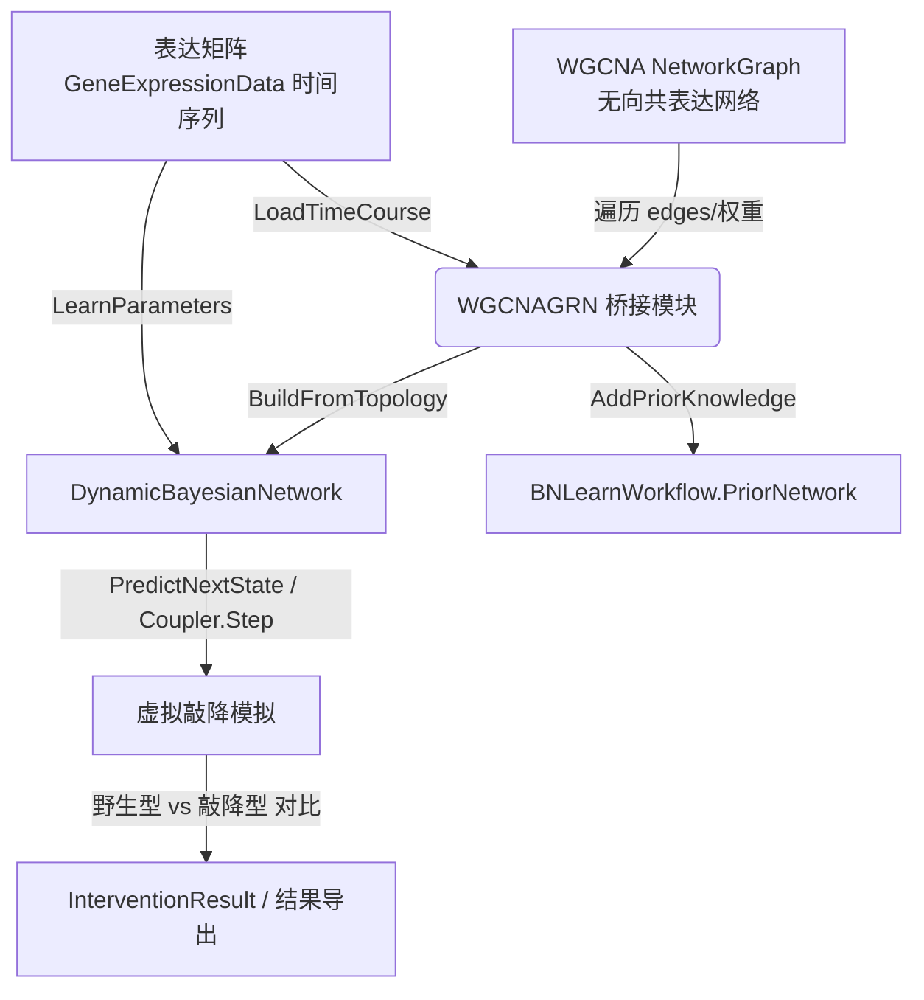

## 用户需求

用户希望在 `sub-system/CellPhenotype/WGCNAGRN.vb` 中新增一个模块，将 WGCNA 共表达网络（由 `CorrelationNetwork.ExportGraph` 产生的 `NetworkGraph`）作为动态贝叶斯网络（DBN）的拓扑先验知识，导入并构建基因表达调控网络模型，最后基于时间序列表达数据进行基因表达虚拟敲降模拟计算。

## 产品概述

在 `CellPhenotype` 子系统中建立 WGCNA 共表达网络与 BNLearn 动态贝叶斯网络之间的桥接层，实现"共表达网络 → 拓扑先验 → DBN 建模 → 时间序列拟合 → 虚拟敲降模拟"的完整分析流水线。

## 核心功能

- 将 WGCNA `NetworkGraph` 转换为 `BNLearn` 的 `PriorNetwork` 或 `RegulatoryLink` 拓扑集合，作为 DBN 网络结构先验。
- 将表达矩阵（支持时间序列）导入 DBN 进行参数学习（`LearnParameters`）。
- 基于构建好的 DBN 执行指定基因的虚拟敲降模拟，输出下游基因的表达变化级联结果。
- 提供端到端工作流封装：从 WGCNA 网络 + 表达矩阵直接产出敲降模拟结果。

## 技术栈选择

- 语言/框架：Visual Basic (.NET 10)，与现有 `CellPhenotype`、`BNLearn`、`WGCNA` 项目保持一致。
- 已有依赖：
- `CellPhenotype.vbproj` 已引用 `BNLearn.vbproj` 与 `network_graph`（NetworkGraph 所在程序集）。
- **需补充引用**：`annotations/WGCNA/WGCNA/WGCNA.vbproj`（RootNamespace `SMRUCC.genomics.Analysis.HTS.WGCNA`，提供 `CorrelationNetwork`、`ModuleMembershipResult`）。
- `BNLearn` 侧依赖：`Core.PriorNetwork`、`Core.GeneExpressionData`、`DBN.DynamicBayesianNetwork`、`DBN.RegulatoryLink`、`DBN.DBNODECoupler` 等均已存在。

## 实现方案

### 总体策略

在 `WGCNAGRN` 模块中新增桥接函数，将无向的 WGCNA 共表达网络（节点=`gene label`，边=`weight`=相关系数）转换为有向调控先验，并驱动 DBN 完成建模与虚拟敲降。

关键技术决策与权衡：

1. **拓扑桥接**：WGCNA 网络是无向、无 TF/target 区分的。采用合理默认策略：

- 权重符号推导调控方向：正相关（`weight > 0`）→ `Effector.Activator`；负相关（`weight < 0`）→ `Effector.Inhibitor`。
- 由于共表达网络不区分 TF/靶基因，将每条边在两端各生成一条 `RegulatoryLink`（A→B 与 B→A），并将两端均标注为可作为 TF 调控对方（通过 `RegulatoryLink.effector` 与 `target_operon`/`regulate_genes` 映射）。同时生成 `PriorNetwork`（TF/TargetGene 双向边，带置信度=|weight|）作为高斯 BN 结构学习白名单，二者并存以满足不同下游需求。
- 若用户提供了 TF 注释列表（`TF As String()`），则仅以 TF 为上游生成单向 `/A→B` 边，降低虚假双向边。

2. **DBN 构建**：使用 `DynamicBayesianNetwork.BuildFromTopology(links)` 注入拓扑；再通过 `GeneExpressionData` 时间序列（`TimeSeriesData`/`LoadTimeCourse`）构造 `List(Of Dictionary(Of String, Double))` 传入 `LearnParameters` 拟合 CPT。
3. **虚拟敲降**：DBN 无现成 knockdown 方法。在模块内实现模拟循环：将被敲降基因节点状态固定为 "Low"（在 `PredictNextState`/`DBNODECoupler.Step` 的证据字典中强制置位），多步推演下游基因状态变化，对比野生型基线得出表达变化。提供单基因敲降与多步级联模拟两种入口。

### 性能与可靠性

- 网络遍历复杂度为 O(E)（E=边数），对 WGCNA 网络的 `edges` 单次遍历即可完成转换，无 N+1 问题。
- 参数学习基于时间序列样本数，复杂度与 DBN 节点/父节点组合数相关；保持对大网络提供阈值参数（如 `adj_thres` 过滤低相关边）以控制规模。
- 错误处理：对缺失基因（表达矩阵中不含网络节点）做跳过并给出警告日志；对空网络、空表达矩阵抛出明确异常。
- 复用现有 `BNLearnWorkflow`、`BnIO`、`PriorNetwork` 等 API，不重复造轮子，避免引入新架构模式。

## 实现注意事项

- **项目引用**：必须在 `CellPhenotype.vbproj` 增加 WGCNA 项目引用，否则无法访问 `CorrelationNetwork`/`ModuleMembershipResult` 类型。
- **命名空间**：模块需 `Imports SMRUCC.genomics.Analysis.BNLearn.Core`、`SMRUCC.genomics.Analysis.BNLearn.DBN`、`SMRUCC.genomics.Analysis.HTS.WGCNA`、`Microsoft.VisualBasic.Data.visualize.Network.Graph`。
- **日志**：复用现有 `VBDebugger`（sciBASIC# 标准日志），避免输出敏感信息，控制边转换进度日志频率。
- **向后兼容**：仅扩展 `WGCNAGRN` 模块，不改变现有 `BNLearn`、`WGCNA` 公共 API；新函数均为新增，不影响已有调用方。
-  **blast radius**：不修改 BNLearn 核心算法代码，仅在 CellPhenotype 侧做适配封装。

## 架构设计



## 目录结构

```
sub-system/CellPhenotype/
├── CellPhenotype.vbproj        # [MODIFY] 新增对 WGCNA 项目的 ProjectReference
└── WGCNAGRN.vb                # [MODIFY] 扩展模块：新增 WGCNA→DBN 拓扑转换、表达矩阵导入、虚拟敲降模拟函数
```

`WGCNAGRN.vb` 职责：

- `BuildPriorNetwork(wgcna As NetworkGraph, Optional TF As String() = Nothing) As Core.PriorNetwork`：将共表达网络转为先验调控网络（双向/单向边，权重→置信度，符号→激活/抑制）。
- `BuildRegulatoryLinks(wgcna As NetworkGraph, Optional TF As String() = Nothing) As IEnumerable(Of DBN.RegulatoryLink)`：转换为 DBN 拓扑链路。
- `BuildDBN(wgcna As NetworkGraph, expr As Core.GeneExpressionData, Optional TF As String() = Nothing) As DBN.DynamicBayesianNetwork`：构建并拟合参数的 DBN。
- `VirtualKnockdown(dbn As DynamicBayesianNetwork, gene As String, nSteps As Integer) As Dictionary(Of String, Double())`：虚拟敲降多步级联模拟，返回各基因随时间的表达轨迹。
- `RunPipeline(wgcna As NetworkGraph, exprFile As String, knockGene As String, Optional TF As String() = Nothing) As Object`：端到端封装。

## 关键代码结构

```
' 拓扑方向推导（默认策略）
Function InferEffector(weight As Double) As Effector
    If weight >= 0 Then Return Effector.Activator
    Return Effector.Inhibitor
End Function

' RegulatoryLink 桥接（A→B 单向示例）
Function ToRegulatoryLink(fromId As String, toId As String, weight As Double) As RegulatoryLink
    Return New RegulatoryLink With {
        .TF_id = fromId,
        .target_operon = toId,
        .regulate_genes = {toId},
        .effector = New Dictionary(Of String, Effector) From {{toId, InferEffector(weight)}}
    }
End Function
```

## Agent Extensions

### SubAgent

- **code-explorer**
- 用途：在最终实施阶段深入检索 `BNLearn` 中 `BNLearnWorkflow`、`DynamicBayesianNetwork`、`GeneExpressionData` 的精确方法签名（如 `LoadTimeCourse`、`LearnParameters` 参数形态、`DBNODECoupler.Step` 返回结构），确保桥接代码正确编译。
- 预期结果：获取可验证的 API 签名与调用示例，避免类型/方法名猜测错误。

### Skill

- **lsp-code-analysis**
- 用途：通过 LSP 语义分析确认 `NetworkGraph.edges`/`vertex` 成员、`RegulatoryLink` 字段、`PriorNetwork.AddEdge` 重载的真实定义与可访问性，辅助精确编码。
- 预期结果：定位符号定义位置，保证新增代码引用准确，减少编译回退。