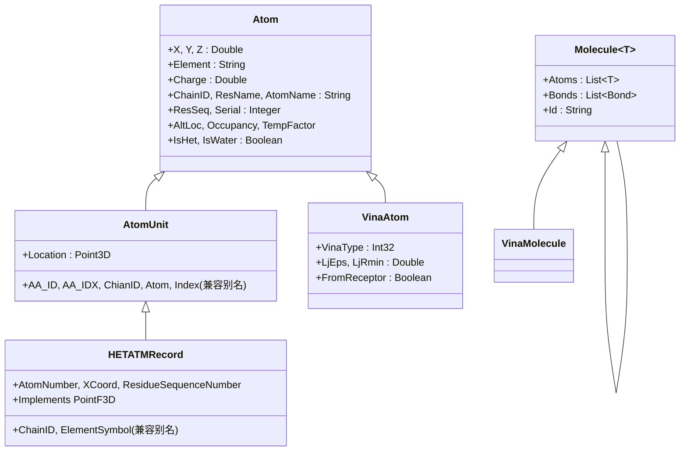

## 需求概述

将 MiniDock（AutoDock Vina 实现）中 `analysis\AutoDock\Core\StructureIO.vb` 里的 PDB 分子结构读取代码，合并进基础库 `data\RCSB PDB\RCSB PDB.vbproj`，与该项目原有的数据结构与文件读取代码统一，再由 MiniDock 复用合并后的基础代码，消除跨项目代码冗余。

## 核心内容

1. **统一原子模型**：RCSB PDB 现有 `Keywords.AtomUnit`（ATOM 路径）与 `Keywords.HETATM.HETATMRecord`（HETATM 路径）两套并行原子模型，合并为单一通用基类 `Structures.Atom`；`AtomUnit` 与 `HETATMRecord` 降级为兼容外观（保留旧属性名做别名转发），MiniDock 通过 `VinaAtom Inherits Atom` 承载对接专属字段。
2. **统一 PDB 固定列解析**：用 StructureIO 的固定列解析器替换 `AtomUnit.InternalParser` 现有的空白分词实现，修正链 ID 为空时的坐标列错位缺陷；ATOM 与 HETATM 两条路径共用同一解析函数。
3. **补齐缺失字段**：新增 `Element`、`Serial`、`AltLoc`、`Occupancy`、`TempFactor`、`Charge`、`IsHet`、`IsWater`，并补齐元素符号兜底推测（列 77-78 缺失时由原子名/残基名推断）。
4. **统一共价半径**：删除 StructureIO 硬编码的 17 元素半径表，改由已有的 `CovalentRadii`（118 元素，单位 Å）提供，键感知 `PerceiveBonds` 保留原 `1.3*(ri+rj)` 判据。
5. **复用与瘦身**：MiniDock 新增 `Core\VinaAtom.vb`（`VinaAtom` + `VinaMolecule`），`Core\StructureIO.vb` 精简为仅保留 SDF/MOL V2000 读取（按决策该部分不迁入基础库），其余 Core 文件改用基础库类型。

## 边界与约束

- SDF/MOL V2000 读取器保留在 MiniDock，不迁入 RCSB PDB。
- 不改变 `PDB.Load/Parse`、`PDB.AtomStructures`、`PDB.MaxSpace/MinSpace`、`AminoAcid.SequenceGenerator`、`HETATM.HetAtoms(key)`、`CovalentRadii.MeasureBonds(HETATMRecord())`、`ConnectBond`、`PDBQt\ComplexGenerator` 等既有公开 API 的签名与语义。
- MiniDock 继续走轻量容错逐行扫描路径，不改用 `PDB.Load`（后者对未知记录会抛 `NotImplementedException`，语义过重）。

## 技术栈

- 语言/框架：VB.NET（VB 2022+，`LangVersion Latest`），.NET 10.0，两套工程均为 SDK 风格（默认 glob 编译，新增 `.vb` 文件无需改 vbproj）
- MiniDock：`RootNamespace = MiniDock`，`OptionStrict On` / `OptionExplicit On` / `Nullable Disable` / `InvariantGlobalization true`
- RCSB PDB：`RootNamespace = SMRUCC.genomics.Data.RCSB.PDB`，`GenerateDocumentationFile=True`（新增 Public 成员需补 XML 注释，否则告警）
- 依赖：`Microsoft.VisualBasic.Core`（sciBASIC# 运行时）、`Bio.Assembly`（biocore-netcore5）

## 实现思路

以「一份固定列解析代码 + 一套原子字段 + 兼容外观」为核心，形成三层结构：

1. **字段层** `Structures.Atom`：合并后的唯一真实字段存储（坐标、元素、残基/链信息、电荷、占据率、B 因子、altLoc、序号、是否 HETATM/水）。
2. **解析层** `Structures.PdbLineParser`：单一固定列解析函数，被 `Parser.ReadLine`（完整关键字解析路径）与 `StructureIO.ReadPdbFrames`（轻量扫描路径）共同复用，彻底消除两份列偏移代码。
3. **兼容层** `Keywords.AtomUnit` / `Keywords.HETATM.HETATMRecord`：均继承 `Atom`，旧属性名转发到新字段，保证既有公开 API 与 `PDBQt\ComplexGenerator` 零改动。

关键取舍：

- **模型统一选「新建通用基类 + 旧类型降级为外观」**（而非直接扩展 `AtomUnit`）：既让 MiniDock 的 `VinaAtom Inherits Atom` 语义干净、命名可修正（`ResidueName`/`ResSeq`/`ChainID`/`AtomName`），又不破坏 `AminoAcid.SequenceGenerator`、`PDB.MaxSpace/MinSpace`、`ComplexGenerator`、`CovalentRadii.MeasureBonds`。
- **泛型 `Molecule(Of T As {Atom, New})` 规避 VB 下的大量 `DirectCast`**：MiniDock 使用 `Molecule(Of VinaAtom)`（封装为 `VinaMolecule`），`MolBuilder`/`Charges`/`VinaScoring`/`MmGbsa` 仅需改签名，`Program.vb` 的 `New Atom` 改 `New VinaAtom`，可做到零向下转型；基础库另提供非泛型 `Molecule : Inherits Molecule(Of Atom)` 供普通调用。
- **ATOM 与 HETATM 解析统一但实例类型仍分开**：统一的是解析函数与字段；`Keywords.Atom.Atoms`（标准残基）与 `HetAtoms`（HETATM）仍按 `IsHet` 分流，避免把配体 HETATM 混入 `AminoAcid.SequenceGenerator` 的氨基酸分组。
- **`PerceiveBonds` 保留 `1.3*(ri+rj)` 判据**，只把半径查表换成 `CovalentRadii`。原因：`MolBuilder.BuildTorsionTree` 依赖 `b.Order = 1.0` 判定可旋转键，若改用 `CovalentRadii.MeasureBonds` 的「理论键长 ± 容忍度」判据会引入键级 2/3，直接改变对接结果。注意 `CovalentRadii` 与 MiniDock 原表数值存在约 1%~8% 差异（C 0.76 vs 0.77、N 0.71 vs 0.75、O 0.66 vs 0.73），会在临界距离上产生成键差异，需按验证清单做等价性回归。

## 架构设计



数据流（两条路径共用解析层）：

```mermaid
flowchart LR
    A[PDB 文本行] --> B[PdbLineParser.ParseLine]
    B --> C[Parser.ReadLine 全关键字路径]
    C --> D[Keywords.Atom / HETATM]
    D --> E[PDB.AtomStructures]
    B --> F[StructureIO.ReadPdbFrames 轻量扫描]
    F --> G[Molecule(Of T) 多 MODEL 帧]
    G --> H[MiniDock: Molecule(Of VinaAtom)]
    I[CovalentRadii] --> J[PerceiveBonds]
    G --> J
```

## 目录结构

```
data/RCSB PDB/                                   # 目标基础库（SDK glob 编译，vbproj 无需改动）
├── PDB/Structure/                               # [NEW] 命名空间 SMRUCC.genomics.Data.RCSB.PDB.Structures
│   ├── Atom.vb                                  # [NEW] 合并后的通用原子模型：坐标/元素/电荷/残基链信息/占据率/B因子/altLoc/序号/IsHet/IsWater；提供 Point3D Location 兼容属性。原 StructureIO.Atom 的通用字段迁入此处
│   ├── Bond.vb                                  # [NEW] 共价键结构（A/B/Order，含 New(a,b,order)），由 StructureIO.Bond 原样迁入
│   ├── Molecule.vb                              # [NEW] 泛型 Molecule(Of T As {Atom, New})（Atoms/Bonds/Id/AtomCount）+ 非泛型 Molecule : Inherits Molecule(Of Atom)
│   ├── PdbLineParser.vb                         # [NEW] 统一固定列解析器：ParseLine(Of T)(rawLine, atom)、NormalizeElement、GuessElement、SafeSub、列偏移常量。ATOM/HETATM 双路径唯一入口
│   └── StructureIO.vb                           # [NEW] ReadPdb / ReadPdb(Of T) / ReadPdbFrames / ReadPdbFrames(Of T)（MODEL/ENDMDL 多帧、altLoc 过滤、容错跳过）/ PerceiveBonds（复用 CovalentRadii，保留 1.3 系数）
├── PDB/Keywords/
│   ├── AtomUnit.vb                              # [MODIFY] AtomUnit 改为 Inherits Atom；新增 Element/Serial/AltLoc/Occupancy/TempFactor/Charge/IsHet/IsWater；重写 InternalParser 为固定列解析（改为接收原始整行）；AA_ID/AA_IDX/ChianID/Atom/Index/Location 降级为兼容别名属性
│   ├── Atom.vb                                  # [MODIFY] cache 改为存储原始行；Append 改为接收 Parser 传入的原始整行并解析；Flush 分流 IsHet 到 HetAtoms
│   └── Headers/HetAtom/HetAtom.vb               # [MODIFY] HETATMRecord 改为 Inherits AtomUnit 并保留 Implements PointF3D；XCoord/YCoord/ZCoord/AtomNumber/ResidueName/ResidueSequenceNumber/ChainID/ElementSymbol 改为兼容别名属性；Append 改为复用 PdbLineParser；修正拷贝构造中 AtomName/ElementSymbol 取错的缺陷
├── PDB/
│   ├── Parser.vb                                # [MODIFY] ReadLine 的 ATOM/HETATM/ANISOU 分支改传原始整行给 Append；其余分支不动
│   ├── PDB.vb                                   # [MODIFY] 可选：新增 GetMolecules() 便捷 API（按 Serial 恢复原子原始顺序），保持 MaxSpace/MinSpace 语义
│   └── AminoAcid.vb                             # [MODIFY] 仅在不兼容时调整（SequenceGenerator/Carbon 依赖 AA_IDX 与 Atom 别名，预期零改动）
├── CovalentRadii.vb                             # [MODIFY] 新增大小写不敏感的 Public 半径查询（GetRadii / SingleBondRadius），Single_Bond1 为 -1（表中 "-"，105 号及以后元素）时回退默认值 0.77；MeasureBonds(HETATMRecord()) 原签名与判据保持不变
└── RCSB PDB.vbproj                              # 无需修改

analysis/AutoDock/                               # 复用方（MiniDock）
├── Core/
│   ├── VinaAtom.vb                              # [NEW] VinaAtom : Inherits Atom（VinaType/LjEps/LjRmin/FromReceptor）+ VinaMolecule : Inherits Molecule(Of VinaAtom)；文件内 Imports 基础库 Structures 命名空间
│   ├── StructureIO.vb                           # [MODIFY] 删除 Atom/Bond/Molecule/CovalentRadius 字典/ReadPdb/ReadPdbFrames/PerceiveBonds/GuessElement/SafeSub，仅保留 ReadSdf（V2000 + M CHG），NormalizeElement 改为转发基础库
│   ├── MolBuilder.vb                            # [MODIFY] 签名 Molecule 改为 VinaMolecule；L273 子分子改为 New VinaMolecule()；其余逻辑不变
│   ├── Charges.vb                               # [MODIFY] 签名改 VinaMolecule；L155 PerceiveBonds 改调基础库 Structures.StructureIO.PerceiveBonds
│   ├── VinaScoring.vb                           # [MODIFY] List(Of Atom) 改 List(Of VinaAtom)；网格与打分循环只读 X/Y/Z/VinaType，逻辑不变
│   ├── MmGbsa.vb                                # [MODIFY] FillLjAndBorn/BornRadiusOf 等签名改 VinaAtom
│   ├── DockEngine.vb / DockObjective.vb         # [MODIFY] 涉及 Molecule/Atom 的签名改 VinaMolecule/VinaAtom
│   └── ResidueTemplates.vb                      # [MODIFY] 按实际命中点调整原子类型参数
├── Program.vb                                   # [MODIFY] 新增 Imports 基础库 Structures 命名空间；L114/L124 改 ReadPdb(Of VinaAtom)；L221 改 ReadPdbFrames(Of VinaAtom)；L146 New Atom 改 New VinaAtom
└── test/SelfTest.vb                             # [MODIFY] 同步类型改名，保留 ReadSdf 用例与成键数/打分基线断言
```

## 关键代码结构

```
' data/RCSB PDB/PDB/Structure/Atom.vb
' 命名空间 SMRUCC.genomics.Data.RCSB.PDB.Structures
' 合并后的通用原子模型：仅承载通用物理化学字段，不含对接语义
Public Class Atom
    Public Property X As Double
    Public Property Y As Double
    Public Property Z As Double
    Public Property Element As String          ' 规范元素符号（首字母大写，两字符元素第二位小写）
    Public Property Charge As Double
    Public Property ChainID As String = " "
    Public Property ResName As String = ""
    Public Property ResSeq As Integer = 0
    Public Property AtomName As String = ""
    Public Property Serial As Integer = 0       ' 列 7-11，用于恢复原子原始顺序
    Public Property AltLoc As String = ""
    Public Property Occupancy As Double = 1.0
    Public Property TempFactor As Double = 0.0
    Public Property IsHet As Boolean = False    ' True = HETATM，False = ATOM
    Public Property IsWater As Boolean
    Public ReadOnly Property Location As Keywords.Point3D
End Class
```

```
' data/RCSB PDB/PDB/Structure/Molecule.vb
' 泛型容器：让 MiniDock 以 Molecule(Of VinaAtom) 直接访问 VinaType 等子类字段，避免全项目 DirectCast
Public Class Molecule(Of T As {Atom, New})
    Public Property Atoms As New List(Of T)()
    Public Property Bonds As New List(Of Bond)()
    Public Property Id As String = ""
    Public Function AtomCount() As Integer
End Class

' 非泛型便捷类型，供普通调用方（ReadPdb 默认返回）
Public Class Molecule : Inherits Molecule(Of Atom)
End Class

' analysis/AutoDock/Core/VinaAtom.vb（MiniDock 侧）
Public Class VinaAtom : Inherits Atom
    Public Property VinaType As Int32
    Public Property LjEps As Double
    Public Property LjRmin As Double
    Public Property FromReceptor As Boolean = True
End Class

Public Class VinaMolecule : Inherits Molecule(Of VinaAtom)
End Class
```

```
' data/RCSB PDB/PDB/Structure/PdbLineParser.vb —— 固定列解析唯一入口
Public Module PdbLineParser
    ' 解析一条 ATOM/HETATM 原始整行到任意 Atom 派生实例；坐标解析失败返回 False 由调用方跳过
    ' altLoc 过滤（仅保留空/A）由调用方决定，不在此处理
    Public Function ParseLine(Of T As Atom)(rawLine As String, atom As T, isHet As Boolean) As Boolean
    Public Function NormalizeElement(raw As String) As String
    Public Function GuessElement(atomName As String, resName As String) As String
    Public Function SafeSub(line As String, start As Integer, len As Integer) As String
End Module
```

## 实现要点（防回归）

- **解析入口必须传原始整行**：现有 `Atom.Append` 收到的是 `line.Substring(6)`，列偏移已丢失。必须同步修改 `Parser.ReadLine`（ATOM/HETATM/ANISOU 三个分支）与 `Atom.cache` 的存储内容，否则固定列解析无从落地。
- **`CovalentRadii` 键大小写**：字典键为 `"C"/"Mg"/"Fe"/"Cl"`（原始大小写），而 `Atom.Element` 经 `NormalizeElement` 后为 `"MG"/"FE"`（原 StructureIO 字典为全大写）。查询函数必须做大小写不敏感匹配，且 `Single_Bond1 = -1` 时回退 0.77，否则半径取负值导致成键全部丢失。
- **`PerceiveBonds` 复杂度**：O(n²)。MiniDock 现状已是全量两两比较；受体原子量大时是热点。可保留原语义，但建议按元素分组或按坐标网格做空间哈希剪枝作为可选优化（若改动需重新验证成键集合完全一致）。
- **命名冲突防护**：`Structures.Atom` 与既有的 `Keywords.Atom`（PDB 关键字节类）同名不同命名空间，任何文件**不得同时 Imports 两者**；MiniDock 侧仅 Imports `...PDB.Structures`。
- **VB 语法风险点**：`Namespace Structure` 非法（故用 `Structures`）；`Molecule` 与 `Molecule(Of T)` 同名不同元数在 VB 中允许；`HETATMRecord` 继承 `AtomUnit` 后 `Implements PointF3D` 的 `X/Y/Z` 需经 `Location`（值类型 `Point3D`）做临时副本回写，不能直接 `_Location.X = value` 的链式赋值。
- **日志与告警**：RCSB PDB 开启了 XML 文档生成，所有新增 Public 成员需补 `''' <summary>`；解析失败/未知元素沿用现有 `$"...".warning` 风格，禁止在热路径逐原子打印。
- **向后兼容**：`AA_ID`/`AA_IDX`/`ChianID`/`AtomUnit.Atom` 与 `HETATMRecord` 的全部旧属性名保留为别名属性（读写均转发），确保 `PDB.vb`、`AminoAcid.vb`、`Atom.vb`、`CovalentRadii.vb`、`PDBQt\ComplexGenerator.vb` 零改动或最小改动。
- **本环境无法编译验证**（依赖 `runtime\sciBASIC#\...` 外部路径），实现需自行保证语法与类型正确，并按下方验证清单人工核对。

## Agent Extensions

### SubAgent

- **code-explorer**
- 用途：在改动 `AtomUnit`/`HETATMRecord`/`Molecule`/`Atom` 前，全量定位 `AA_ID`、`AA_IDX`、`ChianID`、`AtomUnit.Atom`、`HETATMRecord.XCoord/ElementSymbol`、`New Atom`、`As Molecule` 的全部引用点，生成带行号的完整改动清单，避免漏改。
- 预期产出：覆盖 `data\RCSB PDB` 与 `analysis\AutoDock` 两个项目的引用点清单，每个点标注「需改 / 因别名兼容无需改」。