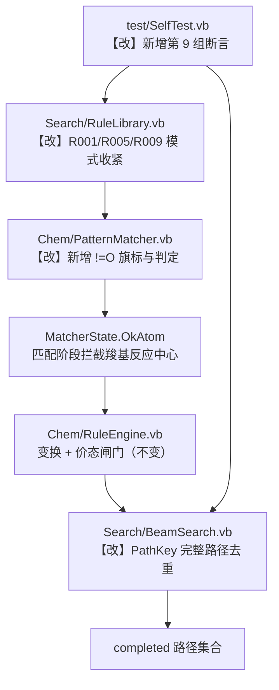

## 产品概述

`MetabolicRouter`（RetroPath）是基于广义反应规则的代谢网络逆向合成路径搜索模块。上一轮已让 `selftest` 8 组全部通过（修复了 SMARTS 电荷解析与 SMILES 环闭合写出两处阻断级缺陷）。本轮修复端到端搜索暴露的、selftest 未覆盖的 2 项算法缺陷，提升搜索结果的化学合理性与去重正确性。

## 核心功能

- **缺陷 A：规则泛化过宽，产生化学不合理中间体**
  - A1 R001（醇脱氢）逆向还原把 `-COOH` 变成 `-CH(OH)2` 偕二醇，凭空多 2 个隐式氢。
  - A2 R009（酮-烯醇互变）正向把羧基变成烯二醇 `C=C(OH)2`。
  - A3 R005（水合/脱水）逆向把羧基变成烯酮累积双键 `C(=C)(=O)`。
  - 根因：这三条规则的反应中心碳缺少"排除羧基"约束。R002 已用 `[CD3H0!O:1]` 建立了正确范式，R001/R009 未沿用；R005 因反应中心碳自身带 `-OH`，现有 `!O` 无法表达，需扩展模式语言。
- **缺陷 B：同构重复路径未去重**
  - 柠檬酸两条对称臂产出内容完全相同的路径（仅 `substrates` 数组顺序相反），被计为 2 条。根因是 `Prune` 的状态键只取 pending 集合，而完整路径 pending 为空、直接入 `completed`，从未参与去重。

## 验收标准

- selftest 原有 8 组断言**全部仍通过**（第 3 组 R001/R005 产物断言、第 4 组束搜索断言不得回归）。
- 新增第 9 组自检（新增方法，不修改既有断言）：
  1. `ApplyReverse(乙酸, R001).Count = 0` —— 羧基不再被还原为偕二醇
  2. `ApplyReverse(乙酸, R005).Count = 0` —— 羧基不再被脱水为烯酮
  3. `ApplyForward(乙酸, R009).Count = 0` —— 羧基不再被异构为烯二醇
  4. 柠檬酸搜索中 1 步 R003 路径去重后恰好 1 条
- 端到端：`search --target 柠檬酸 --sink sink.tsv` 输出中不再出现 `C(O)O` 偕二醇片段；1 步醛缩路径数由 2 降为 1。
- 不引入第三方依赖；保持 `Option Strict On`；不改公开签名。


## 技术栈

- VB.NET / .NET 10（`net10.0`），SDK 10.0.400；仅 BCL（`System.Text.Json` + LINQ），零第三方包
- 依赖工程：`biocore-netcore5`（`SMRUCC.genomics.ComponentModel.Chemical.ChemicalExtensions.ValenceOf`）、sciBASIC# `Graph`/`Math`/`Microsoft.VisualBasic.Core`
- 约束：`Option Strict On` / `Option Explicit On` / `Nullable Disable`

## 实现思路

沿用"最小改动 + 每改一处即复跑"的闭环。核心策略是**用模式约束在匹配阶段拦掉化学不合理的反应中心**，而不是在变换后打补丁——因为价态闸门在"还原/脱水"这类**降低键级和**的方向上天然失效（永不超价），只有模式约束能拦。

关键技术决策与取舍：

- **A1/A2 复用既有 `!O` 旗标，不新增机制**：`!O` 语义（见 `MatcherState.OkAtom`）为"无单键 OH 邻居"，恰好等价于"非羧基碳"。R001 产物侧改 `[C!O:1]=[O:2]`、R009 反应物侧改 `[C:1]-[C!O:2]=[O:3]`，与 R002 的 `[CD3H0!O:1]` 范式一致，零新增代码。酯/酰胺羰基相邻 O 无 H（`TotalH=0`）不被排除，逆向还原得半缩醛属合理中间体，可接受。
- **A3 必须扩展模式语言**：R005 产物侧 cls1 自身带 `-OH`（即 cls3），加 `!O` 会 100% 误杀。故新增 `!=O` 旗标（"无双键羰基氧邻居"）。语法沿用 `!` 前缀风格保持可读性；`ParsePattern` 的方括号分支用 `IndexOf("]")` 整体截取 body，其中的 `=` 不会被 tokenizer 误判为键符号，无需改 tokenizer。
- **B 在入队时去重而非返回前过滤**：若在 `Search` 返回前统一过滤，`completed.Count >= MaxPaths` 的早停判断会基于未去重的计数，导致去重后实际路径数不足。故在 `completed.Add(ns)` 前判定。
- **不动 `Prune` 的 `StateKey`**：那是束搜索的既有剪枝语义（同 pending 集合只保留最优状态），若改为携带步骤历史会导致状态爆炸。新增独立的路径内容键。
- **不改动 R003/R004/R006/R007/R008**：逐条推演确认无误匹配（R003 的 cls4 为羧基碳是正确化学——苹果酸是 β-羟基酸；R004 本就针对羧基）。

## 关键改动明细

### 1. `Chem/PatternMatcher.vb`（扩展模式语言）

```
PatternAtom 新增：Public NoOxoNeighbor As Boolean = False
ParsePatternAtom 旗标循环新增分支（须排在 !O 之前或之后均可，二者互斥）：
    core(pos)="!" 且 core(pos+1)="=" 且 core(pos+2)="O" → NoOxoNeighbor = True, pos += 3
OkAtom 新增判定：NoOxoNeighbor 为真时，若存在邻居满足 (键级=2 且 元素="O") → 返回 False
文件头注释补充 !=O 语义
```

对 `[C!=O:1]`：`ParsePattern` 截取 body=`C!=O:1` → `LastIndexOf(":")=4` → `Cls=1`，`core="C!=O"` → 元素 C（pos=1）→ 命中 `!=O`（pos→4）→ 循环结束。

### 2. `Search/RuleLibrary.vb`（3 处规则文本）

| 规则 | 原文本 | 新文本 |
|---|---|---|
| R001 产物侧 | `[C:1]=[O:2]` | `[C!O:1]=[O:2]` |
| R005 产物侧 | `[C:1](-[O:3])-[C:2]` | `[C!=O:1](-[O:3])-[C:2]` |
| R009 反应物侧 | `[C:1]-[C:2]=[O:3]` | `[C:1]-[C!O:2]=[O:3]` |

回归推演：`TestRules` 的 R001 正向（乙醇→乙醛、苹果酸→OAA）匹配反应物侧，不受产物侧约束影响；R005 逆向苹果酸，cls1 候选由 {C4, C1, C6} 收敛为 {C4}（C1/C6 含 `=O` 邻居被排除），断言为 `Contains` 语义仍通过；R009 无专项断言。

### 3. `Search/BeamSearch.vb`（路径去重）

```
新增字段：Private ReadOnly _pathKeys As New HashSet(Of String)()
Public Search(target) 开头：_pathKeys.Clear()          ' 支持同实例多次调用
私有 Search 中：If ns.Pending.Count = 0 Then
                    If _pathKeys.Add(PathKey(ns)) Then completed.Add(ns)
新增 Private Shared Function PathKey(st As SearchState) As String
    ' 每步 = $"{RuleId}|{SubstrateKey}|{前体keys升序拼接}"；各步字符串升序后以 ";" 拼接
    ' 前体 keys 升序 → 消除对称臂导致的底物顺序差异
```

### 4. `test/SelfTest.vb`（新增第 9 组）

新增 `TestRuleConstraints()`，在 `RunAll()` 中追加调用，覆盖验收标准中 4 条断言。**不修改**既有 8 组任何断言。

## 执行要点（防回归）

- **回归锚点**：第 3 组 R001/R005 产物断言、第 4 组"柠檬酸 1 步醛缩 / 苏氨酸 1 步+2 步 / 苹果酸 1 步氧化 / 循环消除"必须保持通过。
- **归因方式**：按 A1+A2（纯规则文本）→ A3（模式语言+规则文本）→ B（去重）顺序分步修改，每步复跑 selftest，用失败项定位。
- **端到端对比**：每步修完跑 `search --target 柠檬酸 --sink sink.tsv`，对比"完整路径数 / 1 步醛缩数 / 是否残留 `C(O)O` 偕二醇片段"。
- **爆炸半径**：仅动 4 个文件；不新增依赖、不改公开签名、不重构既有架构。
- **性能**：`PathKey` 为 O(steps × precursors)，在 `completed` 入队时调用一次，相对规则应用次数（实测 2034 次）可忽略。

## 架构设计

改动点在既有数据流中的位置（其余模块不变）：



## 目录结构

```
MetabolicRouter/
├── Chem/
│   └── PatternMatcher.vb               # [MODIFY] PatternAtom 新增 NoOxoNeighbor 字段；ParsePatternAtom 旗标循环新增 !=O 分支（pos += 3）；MatcherState.OkAtom 新增"存在键级=2 的 O 邻居则失败"判定；文件头注释补充 !=O 语义说明。
├── Search/
│   ├── RuleLibrary.vb                  # [MODIFY] BuiltinRules() 中 3 处规则文本：R001 产物侧 → [C!O:1]=[O:2]；R005 产物侧 → [C!=O:1](-[O:3])-[C:2]；R009 反应物侧 → [C:1]-[C!O:2]=[O:3]。
│   └── BeamSearch.vb                   # [MODIFY] 新增 _pathKeys 字段与 Shared PathKey(st)；Public Search(target) 开头清空；私有 Search 中 completed.Add 前按路径内容去重。
└── test/
    └── SelfTest.vb                     # [MODIFY] 新增 TestRuleConstraints()（第 9 组：羧基三项拦截 + 柠檬酸 1 步路径去重计数），并在 RunAll() 中调用；既有 8 组断言保持原样。
```

