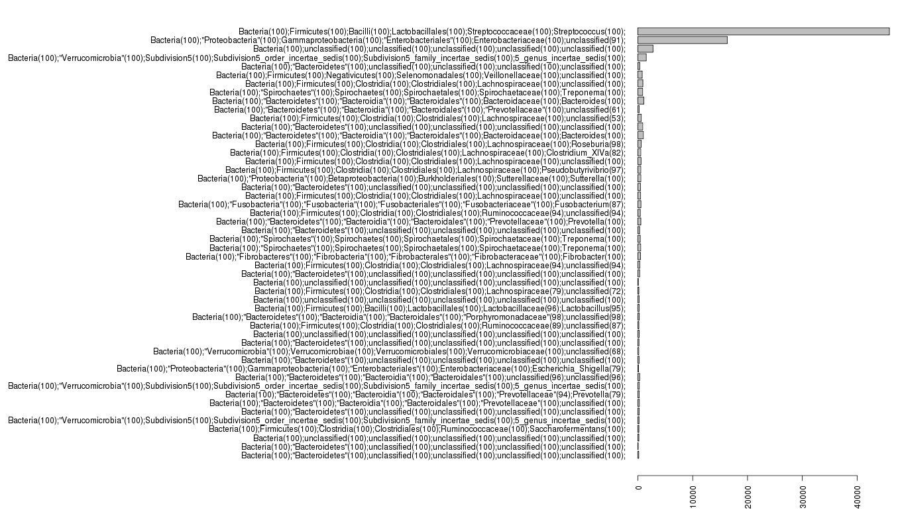

## A Mothur tutorial: what can we find out about the horse gut metagenome?

> http://www.opiniomics.org/a-mothur-tutorial-what-can-we-find-out-about-the-horse-gut-metagenome/

Mothur is a tool, or set of tools, to analyse 16S rDNA sequencing data.  I’ve been meaning to try it out for a while, and found some time last week.  Given my background in animal gut metagenomics, I thought we could take a look at some horse guts.  SRA has some data from 16S sequencing here: http://www.ncbi.nlm.nih.gov/sra/?term=SRX333666

Let’s get the data and split it out into fastq using the NCBI toolkit:

```bash
wget ftp://ftp-trace.ncbi.nlm.nih.gov/sra/sra-instant/reads/ByRun/sra/SRR/SRR952/SRR952153/SRR952153.sra
fastq-dump --split-spot --split-files SRR952153.sra
```

This gives us two paired fastq files.  We’ll follow the Mothur MiSeq SOP to analyse the data.

We start by creating a file which details how the fastq files relate to one another.  We only have one group here, so this should be easy.  I created horse.files such that it contains:

```
SRR952153       SRR952153_1.fastq       SRR952153_2.fastq
```

From there we can merge these using Mothur’s make.contigs command:

```bash
mothur "#make.contigs(file=horse.files, processors=8)"
```

This outputs a lot to STDOUT, and this is the useful information:

```bash
Group count:
SRR952153       165749
Total of all groups is 165749

Output File Names:
SRR952153_1.trim.contigs.fasta
SRR952153_1.scrap.contigs.fasta
SRR952153_1.contigs.report
SRR952153_1.contigs.groups
```

We can summarise the results like this:

```
mothur "#summary.seqs(fasta=SRR952153_1.trim.contigs.fasta, processors=8)"

                Start   End     NBases  Ambigs  Polymer NumSeqs
Minimum:        1       150     150     0       3       1
2.5%-tile:      1       253     253     0       4       4144
25%-tile:       1       253     253     0       4       41438
Median:         1       254     254     0       4       82875
75%-tile:       1       254     254     0       5       124312
97.5%-tile:     1       255     255     6       6       161606
Maximum:        1       301     300     100     139     165749
Mean:   1       253.884 253.884 0.743582        4.56734
# of Seqs:      165749
```

This step produces a .summary file which details the length of each read/contig. There are definitely some outliers here – we have 2x150bp reads, and whilst the majority of our data appear to be between 253-and 255, we also have one that is 155bp and another that is 300.  We can remove these:

```
mothur "#screen.seqs(fasta=SRR952153_1.trim.contigs.fasta, group=SRR952153_1.contigs.groups, maxambig=0, minlength=250, maxlength=260)"
```

At this point you may note some things:

1. Mothur decides the output file names
2. A logfile is output every time Mothur is run
3. This can get confusing

We can clear up the log files safely I think:

```bash
rm *.logfile
```

Let’s try and figure out what all of the files are:

```bash
$> grep ">" SRR952153_1.trim.contigs.fasta | wc -l
165749
$> wc -l SRR952153_1.contigs.groups
165749 SRR952153_1.contigs.groups
$> grep ">" SRR952153_1.trim.contigs.good.fasta | wc -l
127306
$> wc -l SRR952153_1.contigs.good.groups
127306 SRR952153_1.contigs.good.groups
```

So we started off with 165749 merged reads, and the groups they belong to is listed in SRR952153_1.contigs.groups.  In this very simple example, there is only one group/dataset, but we will keep the groups file for now.  After removing contigs with ambiguous bases (N) and of a dubious length, we end up with 127306 reads and SRR952153_1.contigs.good.groups is the groups file for these contigs.

At this stage, we can do a bit of clean up:

```bash
rm SRR952153_1.scrap.contigs.fasta SRR952153_1.contigs.report SRR952153_1.contigs.groups SRR952153_1.trim.contigs.fasta SRR952153_1.trim.contigs.summary SRR952153_1.trim.contigs.bad.accnos
mv SRR952153_1.trim.contigs.good.fasta horse.m.s.fasta
mv SRR952153_1.contigs.good.groups horse.m.s.groups
```

What we’ve done is remove all previous files, as we probably won’t use them, and renamed those that are left.  So we have horse.m.s.fasta full of sequences and horse.m.s.groups which details which experimental groups the sequences belong to (still just one!).  The m stands for merged and the s for screened.

The next stage is to get a list of unique sequences.  If we have 1000s of sequences that are identical in our dataset, it makes no sense to analyse them all individually.  It is best to analyse the unique sequence once, and keep a record of how many times it occurs and in which experimental groups. We do this like so:

```
mothur "#unique.seqs(fasta=horse.m.s.fasta)"
```

This produces two files: horse.m.s.names and horse.m.s.unique.fasta. The fasta file is a fasta file of unique sequences. The .names file details which of the original reads are in the unique reads. The .names file has a row for each unique sequence. The first column is an ID chosen to represent that unique sequence, and the second column is a list of all read identifiers that are a member of that unique sequence.

We can now run a command to keep a track of how often each unique sequence occurs in each experimental group:

```
mothur "#count.seqs(name=horse.m.s.names, group=horse.m.s.groups)"
```

This produces a single file, horse.m.s.count_table, which shows the counts across all groups.  We only have one group, so we only have that column in the file, alongside the total and the unique read identifier.

We can clean up again, by deleting the logfiles and the files from the previous step, and renaming the unique file:

```
rm horse.m.s.fasta horse.m.s.groups *.logfile
mv horse.m.s.unique.fasta horse.m.s.u.fasta
```

We can take a look at how many total and unique sequences we have, and some summary statistics:

```
mothur "#summary.seqs(fasta=horse.m.s.u.fasta,count=horse.m.s.count_table)"

                Start   End     NBases  Ambigs  Polymer NumSeqs
Minimum:        1       250     250     0       3       1
2.5%-tile:      1       253     253     0       4       3183
25%-tile:       1       253     253     0       4       31827
Median:         1       254     254     0       4       63654
75%-tile:       1       254     254     0       5       95480
97.5%-tile:     1       254     254     0       6       124124
Maximum:        1       260     260     0       47      127306
Mean:   1       253.548 253.548 0       4.52554
# of unique seqs:       46214
total # of seqs:        127306
```

So we still have 127306 sequences, but we are working only with the 46214 unique ones.

At this point in the Schloss SOP, they use the tool pcr.seqs to make a custom version of the SILVA database that includes only the region they know the reads should map to.  At this point, I don’t know this information, so I am going to skip that step and align to the whole SILVA database.  We do this by running:

```
mothur "#align.seqs(fasta=horse.m.s.u.fasta, reference=silva.bacteria.fasta, processors=8)"
```

Now, I’ve got a reasonably large computer (64Gb RAM; 8 cores), but even still, this takes a long time.  When the command has finished, I have an error message:

```
Some of you sequences generated alignments that eliminated too many bases, a list is provided in horse.m.s.u.flip.accnos. If you set the flip parameter to true mothur will try aligning the reverse compliment as well.
```

Looking at horse.m.s.u.flip.accnos I can see that there are only 21 of these in the dataset.  This thread also details the problem, but for now, I have no explanation for this.  When re-running the align.seqs command with flip=TRUE, some of the reads had a better flipped alignment, and some of them had no good alignment at all.  We actually don’t want either in our dataset, so we carry on with the original command.

So we have three files: horse.m.s.u.align, horse.m.s.u.align.report, horse.m.s.u.flip.accnos.  The .align file is the actual alignment, the .report file is a report of the reads and their hit, and the .accnos file is a list of those reads that produced no good alignment.  We can summarise what we have found from the alignment:

```
mothur "#summary.seqs(fasta=horse.m.s.u.align, count=horse.m.s.count_table, processors=8)"

                Start   End     NBases  Ambigs  Polymer NumSeqs
Minimum:        0       0       0       0       1       1
2.5%-tile:      13862   23446   253     0       4       3183
25%-tile:       13862   23446   253     0       4       31827
Median:         13862   23446   254     0       4       63654
75%-tile:       13862   23446   254     0       5       95480
97.5%-tile:     13862   23446   254     0       6       124124
Maximum:        43115   43116   260     0       47      127306
Mean:   13860.6 23444.1 253.507 0       4.52505
# of unique seqs:       46214
total # of seqs:        127306
```

So the vast majority of the reads align between 13862 and 23446. We could go back and create a custom version of the SILVA database using these co-ordinates, but we won’t.  We can also see that we have outliers, and we want to screen these out.

First off, another quick clean up:

```
rm *.logfile
```

Then screen out sequences we don’t like:

```
mothur "#screen.seqs(fasta=horse.m.s.u.align, count=horse.m.s.count_table, summary=horse.m.s.u.summary, start=13862, end=23446, maxhomop=8, processors=8)"
```

This removes unwanted sequences from the .align, .summary and the .count_table files. We have a new pre-prefix in all of these filenames now: “good”.  So let’s take a minute and clean up:

```
rm *.logfile horse.m.s.u.align horse.m.s.u.align.report horse.m.s.u.flip.accnos horse.m.s.u.summary horse.m.s.count_table
rename good g *good*
```

You might want to keep the list of reads that were removed, but I don’t, so:

```
rm horse.m.s.u.bad.accnos
```

We now are left with .align, .summary and .count_table files and these are what we’ll work with.  At this stage, much of the alignment is spurious (as we aligned to the ENTIRE SILVA database), so we can trim it

```
mothur "#filter.seqs(fasta=horse.m.s.u.g.align, vertical=T, trump=., processors=8)"
```

From this we end up with horse.m.s.u.g.filter.fasta, which is an aligned fasta file of our sequences after being filtered (all 46013 of them).  We will now pre-cluster the reads to merge those that are similar to one another:

```
mothur "#pre.cluster(fasta=horse.m.s.u.g.filter.fasta, count=horse.m.s.g.count_table)"
```

This basically takes the current set of unique reads and collapses those that are similar to one another.  We end up with three files: horse.m.s.u.g.filter.precluster.fasta, horse.m.s.u.g.filter.precluster.count_table, horse.m.s.u.g.filter.precluster.SRR952153.map.  The fasta and count_table files you will be familiar with.  The .map file describes the clustering, in a format I don’t entirely understand 🙂

We can do a quick clean up:

```
rm *.logfile
rm horse.m.s.u.g.filter.fasta horse.filter
rename filter.precluster f.p *filter.precluster*
```

The next stage is to use uchime to remove potential chimeras, and we need to find these and remove them from the .fasta file and the .count_table file:

```
mothur "#chimera.uchime(fasta=horse.m.s.u.g.f.p.fasta, count=horse.m.s.u.g.f.p.count_table, dereplicate=t)"
```

The above command finds the actual chimeras, and because we have given it the count file, it will remove the sequences from the count file – but somewhat confusingly, the chimeric sequences are still in the fasta file.  We need to run an extra command to remove them from the fasta file:

```
mothur "#remove.seqs(fasta=horse.m.s.u.g.f.p.fasta, accnos=horse.m.s.u.g.f.p.uchime.accnos)"
```

This produces horse.m.s.u.g.f.p.pick.fasta.  You may be interested in horse.m.s.u.g.f.p.uchime.accnos and horse.m.s.u.g.f.p.uchime.chimeras which relate to the chimeric sequences themselves, but that’s not for this post.  It’s now time for another cleanup:

```
rm *.logfile
rm  horse.m.s.u.g.f.p.fasta horse.m.s.u.g.f.p.count_table horse.m.s.u.g.f.p.count_table horse.m.s.u.g.f.p.uchime.chimeras horse.m.s.u.g.f.p.uchime.accnos
mv horse.m.s.u.g.f.p.uchime.pick.count_table horse.m.s.u.g.f.p.u.count_table
mv horse.m.s.u.g.f.p.pick.fasta horse.m.s.u.g.f.p.u.fasta
```

We can have a brief look at what we have left:

```
mothur "#summary.seqs(fasta=horse.m.s.u.g.f.p.u.fasta, count=horse.m.s.u.g.f.p.u.count_table)"

Start   End     NBases  Ambigs  Polymer NumSeqs
Minimum:        1       414     250     0       3       1
2.5%-tile:      1       414     253     0       4       2896
25%-tile:       1       414     253     0       4       28953
Median:         1       414     254     0       4       57906
75%-tile:       1       414     254     0       5       86858
97.5%-tile:     1       414     254     0       6       112915
Maximum:        1       414     257     0       8       115810
Mean:   1       414     253.533 0       4.50614
# of unique seqs:       25965
total # of seqs:        115810
```

Finally, we are ready to classfiy the sequences. Amazing! We do this with the classift.seqs command:

```
mothur "#classify.seqs(fasta=horse.m.s.u.g.f.p.u.fasta, count=horse.m.s.u.g.f.p.u.count_table, reference=trainset9_032012.pds.fasta, taxonomy=trainset9_032012.pds.tax, cutoff=80, processors=8)"
```

Now that everything is classified we want to remove our undesirables.   This assumes that the point of our experiment is to look at Bacteria, and given we are working with 16S data, we can probably assume this is the case.  So to remove Chloroplast, Mitochondria, unknown, Archaea and Eukaryota, we use the remove.lineage command:

```
mothur "#remove.lineage(fasta=horse.m.s.u.g.f.p.u.fasta, count=horse.m.s.u.g.f.p.u.count_table, taxonomy=horse.m.s.u.g.f.p.u.pds.wang.taxonomy, taxon=Chloroplast-Mitochondria-unknown-Archaea-Eukaryota)"
```

You will note that we now have a lot more files. All we really need are the latest taxonomy, fasta and count_table files. So let’s do another cleanup!

```
rm *.logfile
mv horse.m.s.u.g.f.p.u.pds.wang.pick.taxonomy horse.m.s.u.g.f.p.u.l.taxonomy
mv horse.m.s.u.g.f.p.u.pick.fasta horse.m.s.u.g.f.p.u.l.fasta
mv horse.m.s.u.g.f.p.u.pick.count_table horse.m.s.u.g.f.p.u.l.count_table
rm *.pds.tree* *.pds.train* *.pds.wang*
```

Now we have the files we need, we can cluster them into OTUs. For this we will use the cluster.split command which will save on resources:

```
mothur "#cluster.split(fasta=horse.m.s.u.g.f.p.u.l.fasta, count=horse.m.s.u.g.f.p.u.l.count_table, taxonomy=horse.m.s.u.g.f.p.u.l.taxonomy, splitmethod=classify, taxlevel=4, cutoff=0.15, processors=8)"
```

This produces a single file: horse.m.s.u.g.f.p.u.l.an.unique_list.list – again, the format I do not entirely understand, but we use it in downstream analyses anyway.  If we had multiple groups, we would now make a summary table (called a “shared file”). We only have one group, but we will do this anyway:

```
mothur "#make.shared(list=horse.m.s.u.g.f.p.u.l.an.unique_list.list, count=horse.m.s.u.g.f.p.u.l.count_table, label=0.03)"
```

We probably also want to know the taxonomy for each of our OTUs. We can get the consensus taxonomy for each OTU using the classify.otu command:

```
mothur "#classify.otu(list=horse.m.s.u.g.f.p.u.l.an.unique_list.list, count=horse.m.s.u.g.f.p.u.l.count_table, taxonomy=horse.m.s.u.g.f.p.u.l.taxonomy, label=0.03)"
```

We can do some final clean up before looking at the results:

```
rm *.logfile horse.m.s.u.g.f.p.u.l.an.unique_list.SRR952153.rabund
rename an.unique_list otu *an.unique_list*
```

The files we’re interested in are:

```
head horse.m.s.u.g.f.p.u.l.otu.0.03.cons.taxonomy

OTU     Size    Taxonomy
Otu0001 45883   Bacteria(100);Firmicutes(100);Bacilli(100);Lactobacillales(100);Streptococcaceae(100);Streptococcus(100);
Otu0002 16301   Bacteria(100);"Proteobacteria"(100);Gammaproteobacteria(100);"Enterobacteriales"(100);Enterobacteriaceae(100);unclassified(91);
Otu0003 2752    Bacteria(100);unclassified(100);unclassified(100);unclassified(100);unclassified(100);unclassified(100);
Otu0004 1525    Bacteria(100);"Verrucomicrobia"(100);Subdivision5(100);Subdivision5_order_incertae_sedis(100);Subdivision5_family_incertae_sedis(100);5_genus_incertae_sedis(100);
Otu0005 340     Bacteria(100);"Bacteroidetes"(100);unclassified(100);unclassified(100);unclassified(100);unclassified(100);
Otu0006 786     Bacteria(100);Firmicutes(100);Negativicutes(100);Selenomonadales(100);Veillonellaceae(100);unclassified(100);
Otu0007 909     Bacteria(100);Firmicutes(100);Clostridia(100);Clostridiales(100);Lachnospiraceae(100);unclassified(100);
Otu0008 869     Bacteria(100);"Spirochaetes"(100);Spirochaetes(100);Spirochaetales(100);Spirochaetaceae(100);Treponema(100);
Otu0009 1088    Bacteria(100);"Bacteroidetes"(100);"Bacteroidia"(100);"Bacteroidales"(100);Bacteroidaceae(100);Bacteroides(100);
```

This tells you the OTU name, the size of it (i.e. how many times it occurred) and the taxonomic classification. As we only have one group, this is useful information for plotting and summarisation.

```
head horse.m.s.u.g.f.p.u.l.otu.0.03.cons.tax.summary

taxlevel         rankID  taxon   daughterlevels  total  SRR952153
0       0       Root    1       7314    7314
1       0.1     Bacteria        15      7314    7314
2       0.1.1   "Actinobacteria"        1       75      75
3       0.1.1.1 Actinobacteria  3       75      75
4       0.1.1.1.1       Actinomycetales 9       29      29
5       0.1.1.1.1.1     Actinomycetaceae        2       14      14
6       0.1.1.1.1.1.1   Actinomyces     0       2       2
6       0.1.1.1.1.1.2   Arcanobacterium 0       12      12
5       0.1.1.1.1.2     Corynebacteriaceae      1       1       1
```

This is more of a structured view of the taxonomy present, and how often each node occurs in each group.

Finally, the shared file horse.m.s.u.g.f.p.u.l.otu.shared has one column for each OTU and one row for each group. This is hard to see in Linux, so we will manipulate it in R:

```
$> R

R version 2.15.2 (2012-10-26) -- "Trick or Treat"
Copyright (C) 2012 The R Foundation for Statistical Computing
ISBN 3-900051-07-0
Platform: x86_64-unknown-linux-gnu (64-bit)

R is free software and comes with ABSOLUTELY NO WARRANTY.
You are welcome to redistribute it under certain conditions.
Type 'license()' or 'licence()' for distribution details.

  Natural language support but running in an English locale

R is a collaborative project with many contributors.
Type 'contributors()' for more information and
'citation()' on how to cite R or R packages in publications.

Type 'demo()' for some demos, 'help()' for on-line help, or
'help.start()' for an HTML browser interface to help.
Type 'q()' to quit R.

> tax <- par(mar=c(4,50,4,2))
> barplot(tax$Size[50:1], horiz=TRUE, names=tax$Taxonomy[50:1], las=2)
```



Some interesting stuff here – Firmicutes dominate, followed by Proteobacteria.  Third largest OTU is a bunch of bacteria that are essentially unclassified.  Then comes Verrucomicrobia, which have been previously described in soil, water and human faeces.  Then come the Bacteroides – personally I would have expected far more Bacteroides than are reported here as they are well known to be present in Equine faeces.  Further investigation is required!