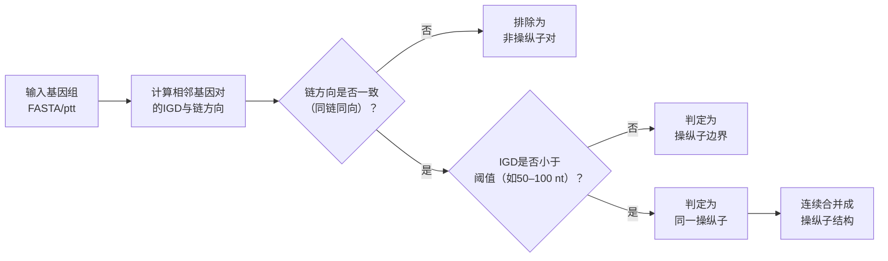

操纵子预测的核心思路是把“基因间距离 + 基因方向一致性 + 基因簇保守性 + 功能相关性 + 启动子/终止子信号”这些信号整合到一个概率或机器学习模型中，判断相邻基因是否属于同一转录单元，目前主流算法可分为距离/方向规则、比较基因组学、机器学习（SVM/贝叶斯HMM/深度学习）、启动子/终止子信号、转录组数据驱动五大类。

无论算法复杂与否，几乎所有方法都建立在对以下几类生物学特征的统计判断上：

1. 基因间距离（IGD）：同一操纵子内相邻基因的间隔通常远短于不同转录单元之间的间隔。仅靠该特征在大肠杆菌上的特异性约为65–70%，是最便携、最普适的信号，也是几乎所有算法的基础输入。
2. 基因链方向一致性：操纵子内基因几乎总是同链同向排列，反向或发散排列通常意味着不同转录单元。
3. 保守基因簇 / 系发育谱：如果一对相邻基因在多个物种中保持顺序保守，它们大概率位于同一操纵on；保守性判断特异性可达98%，但灵敏度有限，会漏掉物种特异的操纵子。
4. 功能相关性：同通路（KEGG）、同COG/Pfam、STRING互作评分等，作为辅助证据。
启动子与终止子：操纵子边界应有上游启动子（如σ因子结合位点）和下游Rho非依赖型终止子（发夹+U串）；若两个同向基因之间检测到强终止子，则大概率属于两个操纵子。

为什么需要多信号整合？ 单一信号要么灵敏度高但特异性不足（如纯距离），要么特异性极高但覆盖面窄（如纯保守基因对），只有把它们在概率框架下组合，才能同时达到较高的灵敏度和特异性（>85%）。

在非机器学习方法领域内，目前有两类算法分别对应"**单基因组内信号推断**"与"**跨基因组进化信号推断**"：距离/方向规则类仅依赖目标基因组自身的基因间距离和链方向分布，最快最普适但特异性有限；比较基因组学类通过跨物种的保守基因簇与系统发育谱信号判断操纵子结构，特异性更高但对参考基因组选择敏感。
下面分别拆解两类算法的底层逻辑、具体步骤、代表工具与适用场景。
---
## 一、距离/方向规则类
### 1.1 底层原理与理论依据
该类方法的核心假设是：**操纵子内的基因间距离显著短于转录单元边界之间的距离，且几乎总是同链排列**。这一假设在大肠杆菌、枯草芽孢杆菌等模式生物中已被反复验证。
Salgado 等人对 E. coli K-12 的经典分析显示，同一操纵子内相邻基因的间隔呈短距离尖峰分布，而转录单元边界处则呈平坦的长距离分布；仅基于距离的最大预测准确率约为 88%。Dam 等人进一步指出，在 E. coli 和 B. subtilis 中，当基因间距离 < 40 nt 时，约 85–92% 的基因对属于同一操纵子。
链方向同样关键：操纵子内基因必须位于同一链（同向）；相反链的基因对（无论发散型还是趋同型）不可能属于同一转录单元。
### 1.2 算法输入
- 基因组序列（FASTA）或基因注释表（.ptt / .gff）
- 每个基因的位置、链方向
- 可选：基因间距离
对于只有序列的基因组，可先用 Prodigal 等基因预测工具识别 CDS，再进行后续计算。
### 1.3 算法流程（以经典规则法为例）

**步骤说明**：
1. **扫描相邻基因对**：按基因组顺序枚举所有相邻基因对 (i, i+1)。
2. **链方向过滤**：若两基因位于不同链，直接判定为非操纵子对。
3. **距离计算**：对同链同向基因对计算基因间距离（IGD）。
4. **阈值/概率判断**：将 IGD 与经验阈值比较（如 < 50 nt 判为同一操纵子），或用概率模型输出归属概率。
5. **合并成操纵子**：连续的"同一操纵子"基因对合并，形成最终的操纵子结构。
### 1.4 概率模型变体：UniOP（2024）
UniOP 是该类方法的最新代表，仅用基因间距离即可预测，无需任何参考基因组或训练数据。其核心创新在于：
- **非操纵子距离分布近似**：操纵子间距离包含一个终止子+一个启动子；发散型对（反向转录远离）间距含两个启动子，趋同型对（相互转录靠近）间距含两个终止子。UniOP 通过随机采样一对"趋同+发散"距离并取算术平均值，来近似非操纵子间距的分布。
- **先验概率估计**：设同链相邻对数为 M，异链对数为 O，则操纵子对先验概率 q = (M − 2O)/(M − O)。
- **贝叶斯推断**：用核密度估计（高斯核）估计所有同链相邻对距离分布与非操纵子对距离分布，再用贝叶斯公式计算每对同链相邻基因属于同一操纵子的后验概率。
UniOP 平均每基因组仅需 1.3 秒，在 10 个完整基因组及 3269 个宏基因组拼装基因组（MAG）上均表现优异，是目前唯一针对 MAG 专门优化并持续维护的工具。
### 1.5 代表工具
| 工具 | 特点 | 使用方式 |
|------|------|---------|
| Salgado 经验阈值法 | 奠基性方法，E. coli 特异 | 原始文献流程，可自行脚本实现 |
| Moreno-Hagelsieb 方法 | 证明距离法可推广至任何原核基因组 | 原始文献流程 |
| UniOP | 2024 年新方法，无监督概率模型，支持 MAG | GitHub 本地或 Web 服务器，输入 FASTA |
### 1.6 准确性与局限
- **准确性**：单独使用距离信号时，特异性约 65–70%；结合方向信息后，在 E. coli 上可达约 88% 的最大准确率。
- **优点**：实现简单，计算速度快，无需参考基因组或训练数据，适用于新测序基因组、宏基因组 contig 和 MAG。
- **局限性**：单一信号特异性有限；阈值依赖物种（不同细菌的操纵子内间距分布略有差异）；可能漏掉操纵子内间隔较长的情况（例如含有内部启动子或 mRNA 加工位点）。
---
## 二、比较基因组学类
### 2.1 底层原理与理论依据
该类方法基于"**功能耦合的基因在进化中倾向于保持邻近并共转录**"这一核心假设。Overbeek 等人早在 1999 年就提出：如果两个基因在多个物种中均以"成对紧密双向最佳命中"（PCBBH）的形式出现，则它们之间存在功能耦合，而操纵子正是这种功能耦合最典型的基因组体现。
Chen 等人进一步指出，操纵子作为功能单位，其基因组成和邻接关系在近缘物种中高度保守；但在远缘物种中，操纵子结构经历了大量基因洗牌，因此**参考基因组应选择与目标基因组相对近缘的物种**。
比较基因组学方法的共同特点是：它们都把"一组连续基因在多个物种中的序列与功能保守性"作为候选操纵子的判定依据。
### 2.2 算法输入
- 目标基因组序列及注释
- 多个参考基因组的蛋白序列（用于 BLAST 同源搜索）
- 可选：COG/Pfam 功能注释、启动子/终止子预测结果
### 2.3 算法流程（以 Chen 方法为例）
Chen 等人的方法（发表于 Nucleic Acids Research，以 Synechococcus WH8102 为例）分为四步：
1. **同源搜索与正交群分配**：用 BLASTp 对目标基因组与每个参考基因组进行两两比对，找出同源基因对；再用 COGnitor 为每个基因分配 COG ID。
2. **构建基因匹配图**：将具有相同 COG ID 的同源基因对连接成多阶段图，形成跨基因组的基因匹配网络。
3. **聚类候选操纵子**：在目标基因组中，将邻接基因在参考基因组中保守的基因簇聚合，形成候选操纵子；同时检查它们是否满足操纵子的通用约束（如位于同链、距离较短等）。
4. **计算似然评分**：为每个候选操纵子计算综合评分，考虑功能类别一致性（COG）、是否存在保守启动子和终止子（SIGSCAN + TransTerm）等因素。
最终按似然评分对候选操纵子排序，输出高置信度预测。
### 2.4 概率模型变体：Bergman 贝叶斯 HMM
Bergman 等人 2004 年提出的贝叶斯隐马尔可夫模型是目前最具代表性的比较基因组学方法之一。其核心设计如下：
- **系统发育条形码**：对目标基因组中的每个基因，在 35 个参考基因组中逐一判断是否存在同源基因（BLASTp，E 值 < 10⁻⁴），生成一个长度为 35 的 0/1 向量，称为系统发育条形码。**同一操纵子内的基因倾向于具有高度相似的条形码**。
- **同源判定策略**：使用"宽松最佳命中"而非传统的"双向最佳命中"。后者在存在旁系同源时会漏掉部分真实同源基因，而前者（只要目标基因在参考基因组中的最佳命中满足 E 值阈值即算同源）更具包容性，能覆盖整个基因组。
- **HMM 框架**：
  - 隐状态 = 相邻基因对是否属于同一操纵子
  - 观测值 = 系统发育条形码差异（海明距离）+ 基因间距离
  - 操纵子内距离用 Gamma 分布建模，操纵子间距离用另一个 Gamma 分布建模
  - 条形码差异在操纵子内/间分别服从不同的二项分布
  - 转移概率随基因间距离变化（距离短→高概率转移到"同一操纵子"状态）
  - 使用 Viterbi 算法进行全局最优解码，输出每个基因对的操纵子归属概率
该方法在 E. coli 上的表现：敏感性 87.5%，特异性 86.4%，ROC 曲线下面积 0.907。
### 2.5 保守基因对法
Ermolaeva 等人提出的方法更直接：统计一对相邻基因在多少个物种中以相同顺序出现，若在相对较多的物种中保守，则判定为操纵子对。
该方法的**特异性高达 98%**，但其灵敏度有限——由于需要基因在较多物种中保守，它只能覆盖基因组的 30–50%。此外，Itoh 等人的研究表明，进化过程中许多操纵子经历了内部基因洗牌（内容不变但顺序改变），这类操纵子会被纯顺序保守法漏掉。
### 2.6 代表工具与数据库
| 工具/方法 | 核心算法 | 数据来源 | 输出 |
|----------|---------|---------|------|
| Chen 方法 | 基因匹配图 + 似然评分 | BLASTp + COG + 启动子/终止子预测 | 候选操纵子及评分 |
| Bergman HMM | 贝叶斯 HMM（距离+条形码） | BLASTp + 35 个参考基因组 | 每对基因的操纵子归属概率 |
| PCBBH 方法 | 成对紧密双向最佳命中 | BLASTp + 多个参考基因组 | 保守基因簇（功能耦合证据） |
| Ermolaeva 保守对法 | 保守基因对频率统计 | 多基因组比对 | 高特异性操纵子对 |
| MicrobesOnline | 基因组特异性距离模型 + 比较基因组 + 表达数据 | 整合多源数据 | 操纵子与调节子预测 |
| OperonDB | 综合算法（距离+保守性） | 多基因组数据 | 全基因组预测操纵子数据库 |
| JPOP | 逻辑回归（距离+系统发育+功能） | BLASTp + 参考基因组 + STRING | 基因对"operonic"概率 |
### 2.7 准确性与局限
- **优点**：特异性极高（保守基因对法达 98%），不依赖实验数据，可应用于新测序基因组，能捕捉进化信号。
- **局限性**：
  - 需要多个参考基因组，对参考基因组的选择较为敏感（近缘参考效果好，但覆盖面窄；远缘参考覆盖广但保守性信号弱）。
  - 漏掉物种特异操纵子或内部洗牌的操纵子。
  - 计算量较大（需多次 BLAST 比对）。
  - 对于宏基因组 contig 或 MAG 不适用（缺乏完整参考基因组信息）。
---
## 三、两类算法对比
| 维度 | 距离/方向规则类 | 比较基因组学类 |
|------|---------------|---------------|
| 核心信号 | 基因间距离 + 链方向 | 跨物种保守基因簇 + 系统发育谱 |
| 参考基因组需求 | 不需要 | 需要（通常 5–35 个） |
| 训练数据需求 | 不需要（UniOP 等无监督） | 不需要（但可用已知操纵子校准） |
| 计算速度 | 极快（秒级/基因组） | 较慢（依赖 BLAST 计算量） |
| 特异性 | 约 65–88%（单用距离偏低） | 85–98%（保守对法极高） |
| 灵敏度 | 高（覆盖全基因组） | 中等（保守对法仅 30–50%） |
| MAG 适用性 | 高（UniOP 专门优化） | 低（依赖完整参考基因组） |
| 代表工具 | Salgado 法、UniOP、JPOP | Chen 法、Bergman HMM、MicrobesOnline、OperonDB |
---
## 四、选型建议
**距离/方向规则类适合**：新测序的细菌基因组、宏基因组拼装基因组（MAG）、缺乏近缘参考的孤立分类群、需要快速批量处理大量 contig 时。UniOP 是目前该类方法的首选，既快又准且无需外部数据。
**比较基因组学类适合**：已有多个近缘参考基因组的模式生物、需要高置信度预测关键操纵子用于实验验证、关注功能保守性与进化信号时。Bergman HMM 和 Chen 方法是经典选择；若需直接查询已预测结果，可使用 MicrobesOnline 或 OperonDB 数据库。
实际项目中，两类方法往往互补使用：先用距离/方向法快速获得全基因组初步预测，再用比较基因组学方法对关键操纵子进行高置信度复核。
