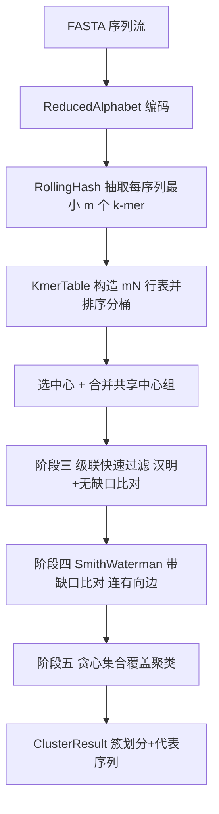

## 用户需求

在 GCModeller 的 ProteinMatrix 工程中,按照用户提供的 Linclust 算法原理文档,构建一个复现 Linclust 的无监督蛋白序列聚类算法模块。

## 产品概述

该模块接收 N 条蛋白序列(FASTA),经缩减字母表 k-mer 锚定、排序分桶选中心、级联快速过滤、Smith-Waterman 带缺口比对、贪心集合覆盖五阶段,输出簇划分结果及每簇代表序列(代表序列为簇中最长成员)。算法通过"每条序列仅与少数中心序列比对"将复杂度从 O(N²) 压到严格 O(N)。

## 核心功能

- 缩减字母表编码:将 20 种氨基酸按 BLOSUM62 合并为 13 字母表,提升突变容忍下的 k-mer 命中率。
- k-mer 提取与索引:自动选择 k 长度(k ≥ ⌊log(NL)/log(A_eff)⌋,A_eff≈8.7,并取 max(k_spec, k_seqid));每序列用 16 位滚动哈希仅保留哈希值最小的 m(默认20)个 k-mer,构造 mN 行 × 16 字节索引表。
- 排序分桶选中心:按 k-mer 索引排序,相同 k-mer 成组,每组选最长序列为中心。
- 级联快速过滤(阶段三):汉明距离(从 k-mer 匹配位置无缺口向两端延伸)+ 无缺口局部比对得分,淘汰绝大多数假阳性。
- 带缺口局部比对(阶段四):复用现有 SmithWaterman,对幸存者计算一致性与覆盖率,通过判据者连成员→中心的有向边。
- 贪心集合覆盖(阶段五):有向边图补反向边后,按长度降序取顶部序列连同有边邻居成簇,顶部序列即代表序列。
- 对外暴露纯 .NET 公共 API(Cluster 方法与 Options 配置类),输出簇划分与代表序列模型,不内置 MSA。

## 技术栈

- 语言:Visual Basic (.NET, net10.0,与 ProteinMatrix.vbproj 一致)
- 工程:复用现有 `ProteinMatrix.vbproj`,新建 `Linclust/` 子目录,命名空间 `SMRUCC.genomics.Model.MotifGraph.ProteinStructure.Linclust`
- 复用依赖(已在 vbproj 引用):`Bio.Assembly`(FASTA/StreamIterator/KSeq)、`SequenceAlignment`(SmithWaterman)、`DynamicProgramming`(GSW)、`Graph`、`DataFramework`
- 无新增第三方依赖

## 实现方案

### 总体策略

按 Linclust 五阶段顺序构建管道,主入口 `Linclust.Cluster(seqs, opts)` 串联各阶段。沿用现有 `StreamIterator.SeqSource` 做流式读入,`KSeq.Kmers` 做 k-mer 枚举(需先缩减字母表编码序列),`SmithWaterman.Align`+`GetOutput` 做阶段四比对。现有 `KSeq.CalculateDirectQuaternaryHashCode` 是 DNA 专用(仅认 A/T/G/C),必须对 13 字母缩减表新写滚动哈希,不可复用。

### 关键技术决策

1. **缩减字母表**:预定义 13 字母映射表(基于 BLOSUM62 合并的公开标准表),提供 `Map(aa As Char) As Char` 将序列编码为缩减序列后再抽取 k-mer。
2. **16 位滚动哈希**:基于缩减字母表(基数 13),对 k-mer 计算 16 位滚动哈希,每序列保留哈希值最小的 m 个 k-mer(位置、原始序列ID、长度一并记录)。采用 struct(8字节索引+4字节ID+2字节长度+2字节位置=16字节)数组存储,内存 mN×16 字节,与序列长度无关。
3. **排序分桶选中心**:对 mN 行按 k-mer 索引排序(Linq OrderBy 或 Array.Sort 稳定排序),线性扫描同 k-mer 组,选最长序列 ID 作为中心。
4. **阶段三快速过滤**:自建轻量无缺口局部比对(基于缩减序列、从 k-mer 位置向两端延伸算汉明/匹配得分),按覆盖率与一致性阈值先行淘汰;此步不调用 SW,避免昂贵计算。
5. **阶段四**:仅对阶段三幸存者调用 `SmithWaterman.Align` 获取 `Output`,从中提取一致性(identity%)与覆盖率(coverage);若 `Output` 不直接提供,则基于对齐字符串自行计算。E-value 若 `Output` 未提供,先以一致性+覆盖率判据实现(预留 E-value 扩展位),必要时补充统计模型。
6. **阶段五贪心覆盖**:用邻接表(字典 List)存成员→中心有向边并补反向边;按序列长度降序排序剩余列表;循环取顶部 s 连同有边邻居移除成簇。可复用 Graph 项目的简单图结构或自建轻量邻接表(避免引入 Graph 重依赖,优先自建以保证可控性)。

### 性能与可靠性

- 整个比对总数上界 mN,严格线性;排序 O(mN log mN)通常 <10% 总时。
- 16 字节紧凑 struct 数组降低 GC 压力;对大 N 用流式读入避免全量驻留。
- 错误处理:非法字符(非标准氨基酸)在缩减表映射时回退为通配或抛明确异常;空序列、N=0 边界保护。

## 实现注意事项

- 不修改现有 `KSeq`/`SmithWaterman` 公共行为;仅在确需性能优化时改动 `DynamicProgramming` 库并在计划中标注。
- 复用 `StreamIterator.SeqSource` 的 `tqdm_wrap` 进度提示。
- `SmithWaterman.GetOutput(cutoff, minW)` 的 cutoff 为 0-100% 一致性阈值,需确认 `Output` 结构字段(identity/coverage/score)以正确接入阶段四判据。
- 阶段三无缺口比对优先自建(基于缩减序列的线性扫描),避免对每对调用完整 SW。

## 架构设计



## 目录结构

```
ProteinMatrix/Linclust/
├── ReducedAlphabet.vb   # [NEW] 13 字母缩减表定义与 Map 映射函数,基于 BLOSUM62 合并标准表,提供氨基酸→缩减字母编码。
├── RollingHash.vb       # [NEW] 蛋白 k-mer 的 16 位滚动哈希(基于缩减字母表,非复用 DNA 四进制哈希),提供 GetMinHashes(seq, k, m) 返回最小 m 个 k-mer 哈希+位置。
├── KmerTable.vb         # [NEW] 16 字节记录 struct(KmerIndex/SeqId/SeqLen/Position)mN 行表;排序、按 k-mer 分桶、每组选最长序列为中心;合并共享中心组。
├── CascadeFilter.vb     # [NEW] 阶段三快速过滤:汉明距离(从 k-mer 位置无缺口延伸)+ 轻量无缺口局部比对得分,按覆盖率/一致性阈值淘汰假阳性。
├── GreedyCover.vb       # [NEW] 阶段五贪心集合覆盖:邻接表存有向边并补反向边,按长度降序循环取顶部序列连同邻居成簇,输出簇与代表。
├── ClusterResult.vb     # [NEW] 聚类结果模型:簇列表(成员ID集合 + 代表序列ID),以及 Options 配置类(m、seqid阈值、coverage、一致性阈值等)。
└── Linclust.vb          # [NEW] 主入口 Cluster(seqs, opts),串联五阶段,编排 ReducedAlphabet→RollingHash→KmerTable→CascadeFilter→SmithWaterman→GreedyCover,返回 ClusterResult。
```

## 关键代码结构

```
Namespace SMRUCC.genomics.Model.MotifGraph.ProteinStructure.Linclust

    Public Structure KmerEntry
        Public KmerIndex As Long   ' 8 字节 k-mer 哈希索引
        Public SeqId As Integer    ' 4 字节序列 ID
        Public SeqLen As UShort    ' 2 字节序列长度
        Public Position As UShort  ' 2 字节 k-mer 位置
    End Structure

    Public Class LinclustOptions
        Public m As Integer = 20
        Public seqidThreshold As Double = 0.9   ' 一致性阈值, >=0.9 时 k_seqid=14
        Public coverage As Double = 0.8
        Public evalue As Double = 0.001
    End Class

    Public Class ClusterResult
        Public Property clusters As List(Of Cluster)
    End Class

    Public Class Cluster
        Public Property representative As Integer  ' 代表序列 ID(最长)
        Public Property members As List(Of Integer)
    End Class

    Public Module Linclust
        Public Function Cluster(seqs As IEnumerable(Of FastaSeq), opts As LinclustOptions) As ClusterResult
    End Function
End Module
```