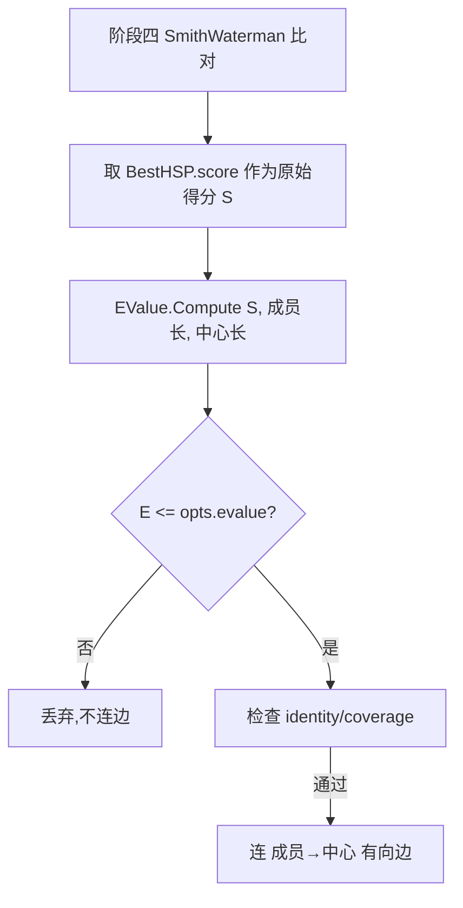

## 用户需求

为已实现的 Linclust 蛋白序列无监督聚类模块补充阶段四的 E-value 统计模型,并基于最终代码编写可运行的 demo 测试。

## 产品概述

在现有 Linclust 五阶段流程的阶段四(带缺口 Smith-Waterman 比对)中,除一致性(identity)与覆盖率(coverage)判据外,新增 Karlin-Altschul E-value 统计判据,使连边条件更符合标准同源判定。同时在 `test/LinclustDemo.vb` 中编写演示程序,用人工构造的同源家族蛋白序列验证算法可将同源序列聚到一起且代表序列为最长成员。

## 核心功能

- E-value 统计模型:基于 Karlin-Altschul 方程 E = K·m·n·exp(-λ·S) 计算成员 vs 中心的局部比对显著性,默认采用 BLOSUM62 统计量 λ≈0.267、K≈0.041,允许在 Options 中覆盖。
- 阶段四判据增强:将原 identity/coverage 判据与 E-value 判据取逻辑与(E ≤ opts.evalue),三者均满足才连成员→中心有向边。
- Demo 测试:构造 2~3 个同源家族与若干随机序列,调用 Linclust.Cluster 并打印 k 值、簇数、每簇代表与成员,验证同源聚集与代表序列为最长成员。

## 技术栈

- 语言:Visual Basic (.NET, net10.0),与 ProteinMatrix.vbproj / test.vbproj 一致
- 复用:现有 Linclust 模块(命名空间 `SMRUCC.genomics.Model.MotifGraph.ProteinStructure.Linclust`)、`SmithWaterman`(BestLocalAlignment 命名空间,`HSP.score` 提供比对原始得分)、`FastaSeq`(公共 `SequenceData`、`title`)
- 不新增第三方依赖,E-value 模型自实现

## 实现方案

### 总体策略

保持阶段四既有的 Smith-Waterman 比对不变,仅在其后增加一步 E-value 计算,并将 E-value 判据与现有 identity/coverage 判据并联(AND)。E-value 采用 Karlin-Altschul 标准局部比对公式,数据库规模按"成员长度 × 中心长度"近似(Linclust 语义为单条对单条两两比对)。

### 关键技术决策

1. **E-value 模型**:新建 `EValue.vb`,暴露纯函数 `Compute(rawScore, m, n, lambda, K)`。取 `S = hsp.score`(即 SmithWaterman 原始比对得分),`m`、`n` 分别为成员与中心序列长度,默认 λ=0.267、K=0.041(BLOSUM62 通用近似常量,常量附带注释说明来源,允许 Options 覆盖)。计算 `E = K * m * n * Exp(-λ * S)`。
2. **判据接入**:在 `Linclust.vb` 阶段四循环内,于现有 `identity >= opts.seqidThreshold AndAlso coverage >= opts.coverage` 之后追加 `AndAlso E <= opts.evalue`。`opts.evalue` 已在 `LinclustOptions` 预留(默认 0.001),本次使其生效,不移除原 identity/coverage 判据。
3. **Demo 自包含**:`LinclustDemo.vb` 提供 `Public Sub Run()`,在内存中用 `FastaSeq` 构造序列(无需磁盘文件),调用 `Linclust.Cluster`,向 Console 打印关键结果,供运行验证。

### 性能与可靠性

- E-value 为 O(1) 标量计算,不引入额外扫描或比对,比对总数仍受 mN 上界约束,不影响整体线性复杂度。
- 边界保护:`Compute` 对 m、n ≤ 0 或 S 异常返回极大值(保证不误连边);浮点溢出用 `Math.Exp` 正常处理负指数。
- 错误处理:Demo 中序列构造与 Cluster 调用包裹基础断言(簇数 > 0、代表存在于成员中),输出可读日志,不抛未捕获异常。

## 实现注意事项

- 不修改 `SmithWaterman`/`GSW`/`KSeq` 任何公共行为。
- `FastaSeq` 通过公共 `SequenceData` 属性与 `title` 设置,内存构造即可。
- `LinclustOptions.evalue` 已有字段,本次直接生效,无需新增 Option 字段(λ/K 作为 EValue 内部默认常量,后续如需暴露再扩展)。
- 不改 `Program.vb` 既有 `FamilyCluster` 调用逻辑;`LinclustDemo` 以独立 `Run()` 入口提供,demo 在 `Program.Main` 中通过 `Call LinclustDemo.Run()` 调用(置于原有调用之前或之后均可,保持原有测试仍可运行)。

## 架构设计



## 目录结构

```
ProteinMatrix/Linclust/
├── EValue.vb          # [NEW] Karlin-Altschul E-value 模型。Compute(rawScore, m, n, lambda, K) 返回 E-value;默认 λ=0.267、K=0.041(BLOSUM62),含边界保护。
├── Linclust.vb        # [MODIFY] 在阶段四连边条件中追加 E-value 判据(E <= opts.evalue),与 identity/coverage 取 AND。
└── test/
    └── LinclustDemo.vb # [NEW/WRITE] Demo:内存构造同源家族 + 随机序列,调用 Linclust.Cluster,打印 k、簇数、代表与成员,验证同源聚集。
```

## 关键代码结构

```
Namespace SMRUCC.genomics.Model.MotifGraph.ProteinStructure.Linclust

    Public Module EValue
        ' BLOSUM62 默认统计量
        Public Const LambdaBlosum62 As Double = 0.267
        Public Const KBlosum62 As Double = 0.041

        ''' <summary>
        ''' Karlin-Altschul 局部比对 E-value:
        ''' E = K * m * n * exp(-lambda * S)
        ''' </summary>
        Public Function Compute(rawScore As Double, m As Integer, n As Integer,
                                Optional lambda As Double = LambdaBlosum62,
                                Optional K As Double = KBlosum62) As Double
    End Function
End Module
```