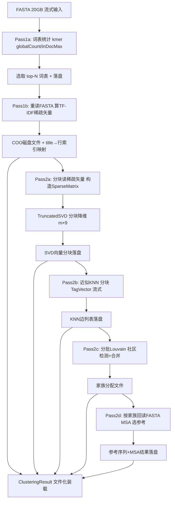

## 用户需求

将 ProteinTools/ProteinMatrix 中已实现的无监督蛋白家族聚类流程，从"全量加载内存"重构为"流式 + 两阶段 + 分块"处理，以处理约 20GB、可能千万级条目的 FASTA 蛋白数据库（无法一次性加载到内存）。

## 产品概述

在保留现有算法语义（kmer词表 → TF-IDF稀疏矢量 → TruncatedSVD降维 → KNN近似近邻图 → Louvain社区 → 每家族MSA取参考序列）的前提下，新增一套流式执行路径：第1遍仅统计词表并把每条序列的TF-IDF稀疏矢量逐行落盘；第2遍从磁盘分块读入稀疏矢量，做随机化SVD、近似KNN、分批Louvain与按家族回读MSA。完整中间产物（TF-IDF稀疏矩阵、SVD向量、KNN边列表、家族分配、参考序列）以磁盘文件+索引形式产出。

## 核心特性

- 词表统计流式化：仅常驻词表规模内存，不再保留全量 docCounts。
- 稀疏矢量流式落盘：第1遍重读FASTA，逐序列写出COO格式TF-IDF矢量与 title→行索引映射。
- 随机化SVD分块化：第2遍流式逐行构造 SparseMatrix 或分块送 TruncatedSVD，m×9 结果分块写盘。
- 近似KNN分块化：改用 KdTree.ApproximateNearNeighbor 的 IEnumerable(Of TagVector) 入口，分块产出边列表并落盘。
- 分批Louvain：基于分块边列表做分批社区检测与合并，避免整图常驻。
- 按家族回读MSA：依据家族分组回读原始FASTA取成员序列，CenterStar选编辑最少为参考。
- 完整中间产物文件化：TF-IDF、SVD、KNN边、家族分配、参考序列均产出可检视的磁盘文件与索引，向后兼容小数据冒烟测试。

## 技术栈选型

- 语言/框架：沿用 VB.NET + sciBASIC# 运行时（Microsoft.VisualBasic.Core、Data_science、NLP、Graph 等已引用项目），目标框架 net8.0/net10.0，x64 优先。
- 复用现有 API：`StreamIterator.SeqSource`（流式读FASTA）、`SparseMatrix`（行字典，支持逐行 Set）、`TruncatedSVD.Reduce(SparseMatrix, k)`（随机化SVD，原生稀疏输入）、`KdTree.ApproximateNearNeighbor.FindNeighbors(IEnumerable(Of TagVector), k)`（流式近似近邻）、`Louvain.Builder.Load`、序列对齐 `CenterStar.Compute`。
- 不引入新第三方依赖，仅在 sciBASIC# 做最小化扩展（如 SparseMatrix 批量Append/分块写盘、TagVector 构造暴露）时明确标注。

## 实现方案

采用"两遍扫描 + 磁盘中间产物"的流式架构。第1遍解决词表与稀疏矢量落盘（内存仅词表大小）；第2遍解决降维、近似近邻、社区检测与MSA（内存仅当前分块 + 索引）。

关键技术决策与权衡：

1. **词表统计与矢量写出分离为两个小遍**：第一小遍仅统计 globalCount/inDocMax 选 top-N（内存≈词表大小，远低于序列数）；第二小遍重读FASTA，对每条序列仅计算选中词表的TF-IDF稀疏矢量并写出。避免现有 `docCounts` 全量常驻（千万序列×词表 = 内存爆炸）。代价是多读一遍FASTA（I/O开销），但内存可控，且FASTA流式读已具备。
2. **稀疏矢量磁盘格式用 COO + 行名映射**：每行一个序列，写出 (rowIndex, colIndex, value) 三元组与 title→rowIndex 映射文件。第2遍可随机/顺序分块读回，喂给 SparseMatrix 逐行 Set，或直接分块构造 SparseMatrix 送 TruncatedSVD.Reduce。复用现有 SparseMatrix 行字典特性，避免先 ToArray 全量。
3. **SVD 分块**：TruncatedSVD.Reduce 已接受 SparseMatrix 且内部为稀疏矩阵-向量乘（幂迭代），无需整稠密矩阵。千万级时按块构造 SparseMatrix 分段 Reduce，m×9 结果分块写盘（每块一个文件或列式追加），最终合并为索引化文件。空间复杂度 O(m·9) 仅落盘，不常驻。
4. **KNN 改近似近邻**：用 `ApproximateNearNeighbor.FindNeighbors(IEnumerable(Of TagVector), k)`，将SVD向量分块包装为 TagVector 流式输入，分块产出邻居列表，对称去重为无向边并落盘。相比现有整 NumericMatrix KNN，内存从 O(m²) 降为 O(block·k)。精度略降但符合用户"千万级近似"选择。
5. **Louvain 分批合并**：基于分块边列表，先对每块局部跑 Louvain 得初版社区，再用跨块边做社区合并（或构建外部内存邻接并分批求解）。避免 NetworkGraph 整图常驻。分配结果流式写出 (rowIndex→familyId)。
6. **MSA 按家族回读**：流式读取家族分配，按 familyId 分组聚合成员 title；回读原始FASTA按 title 取序列（家族规模通常可控），CenterStar 选编辑最少为参考。参考序列与MSA结果落盘。
7. **完整产物文件化**：新增流式结果写出器，将 TF-IDF(COO文件)、SVD(分块文件+索引)、KNN边(文件)、家族分配(文件)、参考序列(FASTA)、词表(文件) 写出到工作目录；ClusteringResult 改为可从这些文件延迟装载，保证"完整中间产物"要求并复用现有结果容器类型。

性能与可靠性：热路径为第1遍 kmer 计数与第2遍稀疏读入；用 BufferedStream/分块批量写减少 I/O 次数；进度用受保护的 Tqdm（无头不崩）。错误用 try/catch 包裹单序列处理，坏序列跳过并计数，不中断整批。

避免技术债：复用现有 KmerVocabulary 排序/选取逻辑、ProteinFamily/MSA 逻辑、ClusteringResult 结构；新增流式编排类与磁盘IO辅助类，不重写算法内核。

## 实现要点（减少返工）

- 复用 `StreamIterator.SeqSource(fastaHandle, {"*.fa"}, debug:=False)` 流式逐条读，绝不调用 `.ToArray` 全量。
- `SparseMatrix` 用 `Set(value, i, j)` 逐行构造；若需批量Append，在 sciBASIC# SparseMatrix.vb 最小扩展 `AppendRow(i, cols(), vals())` 方法（标注改动）。
- `ApproximateNearNeighbor` 的 `TagVector` 构造若未公开，最小扩展暴露 `New TagVector(id, vector)`（标注改动）。
- 保留现有 `Run(fastaHandle)` 接口向后兼容（小数据走内存路径），新增 `RunStreaming(fastaHandle, workDir)` 流式入口；或内部按序列数自动切换。
- 所有中间文件写入工作目录，提供清理/断点续跑（第1遍产物存在则跳过重算）开关。

## 架构设计



## 目录结构

```
g:\GCModeller\src\GCModeller\analysis\ProteinTools\ProteinMatrix\
├── ProteinFamilyClustering.vb      # [MODIFY] 主管线类。新增 RunStreaming(fastaHandle, workDir) 流式入口；保留 Run 向后兼容；内部调用新增的流式子模块，按序列规模自动选择路径；不再全量 ToArray。
├── KmerVocabulary.vb              # [MODIFY] Build 拆分为 BuildVocabulary(流式统计) 与 Vectorize(流式矢量计算)；抽出可复用的单序列kmer计数与top-N选取方法，供两遍调用。
├── ClusteringResult.vb            # [MODIFY] 增加从磁盘文件延迟装载的工厂方法（FromDirectory(workDir)），tfidfMatrix/svdVectors/knnEdges 改为按需从文件读取，保持完整产物语义。
├── ProteinFamily.vb              # [MODIFY] 增加从家族分配+工作目录回读MSA结果的构造支持；reference 选择逻辑复用。
├── StreamingClustering.vb         # [NEW] 流式编排核心。实现 Pass1a/Pass1b/Pass2a~2d 的分块调度、工作目录管理、断点续跑、进度与错误隔离。
├── SparseVectorWriter.vb         # [NEW] COO格式稀疏矢量写出/读取器（流式逐序列写、分块读），含 title→行索引映射持久化。
├── SvdBlockReducer.vb            # [NEW] 封装分块 TruncatedSVD：分块构造 SparseMatrix 调 Reduce，m×9 结果分块写盘与索引合并。
├── ApproxKnnBuilder.vb           # [NEW] 封装 KdTree.ApproximateNearNeighbor 分块近似近邻，产出对称去重边列表并落盘。
├── BlockLouvain.vb               # [NEW] 分批 Louvain 社区检测与跨块合并，分配结果流式写出。
├── StreamingResultWriter.vb      # [NEW] 把 TF-IDF/SVD/KNN边/家族/参考序列/词表写出为工作目录文件与索引，供 ClusteringResult 装载。
└── test/Program.vb               # [MODIFY] 新增 20GB 模拟的小规模流式冒烟测试（如 40 条走 RunStreaming），验证向后兼容与产物完整性。
```

## 关键技术结构（接口级）

```
Namespace ProteinStructure
    Public Class StreamingClustering
        Public Property workDir As String
        Public Property resumeIfExists As Boolean = True
        Public Function RunStreaming(fastaHandle As String) As ClusteringResult
        Private Function Pass1BuildVocabularyAndVectors(fastaHandle As String) As VocabularyMeta
        Private Function Pass2ReduceAndCluster(fastaHandle As String) As ClusteringResult
    End Class

    Public Class SparseVectorWriter
        Public Sub WriteRow(rowIndex As Integer, title As String, cols As Integer(), vals As Double())
        Public Iterator Function ReadRows(blockSize As Integer) As IEnumerable(Of (rowIndex As Integer, title As String, cols As Integer(), vals As Double()))
        Public Function LoadTitleIndex() As Dictionary(Of String, Integer)
    End Class
End Namespace
```