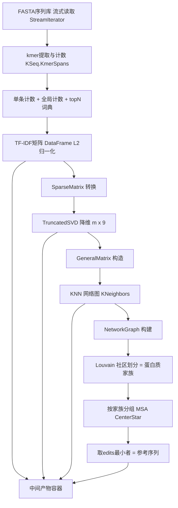

## 用户需求

在 `ProteinMatrix` 项目中构建一个用于蛋白序列无监督聚类的 VB.NET 类库模块，按照既定流程把蛋白序列库切分为蛋白质家族，并输出家族参考序列与完整中间产物。

## 产品概述

模块以 `ProteinFamilyClustering` 为核心管线类，输入为 FASTA 蛋白序列库（支持文件或目录流式读取），输出包含：每条蛋白的家族编号、每个家族的参考序列，以及 TF-IDF 矩阵、SVD 降维向量、KNN 网络边列表等中间数据，便于调试分析。

## 核心功能

- 以默认 k=5 氨基酸残基长度从蛋白序列提取 kmer，并统计每个 kmer 在单条序列内的出现次数与全库总出现次数。
- 基于两个统计指标对所有 kmer 升序排序，截取 top N（默认 10000）个 kmer 作为词典。
- 将每条蛋白序列视为 kmer 文档，基于 TF-IDF 构建 10000 维向量矩阵。
- 对 TF-IDF 矩阵做 TruncatedSVD 降维至默认 9 维。
- 基于降维向量构建 KNN 网络图（边的权重由相似度度量给出）。
- 将 KNN 图按 Louvain 社区划分算法切分为蛋白质家族。
- 对每个家族做 MSA 多序列比对，提取编辑次数最少的序列作为该家族参考序列。
- 所有关键参数（kmer 长度、topN、SVD 维度、KNN 的 k 与相似度阈值）可配置，取用户描述默认值。

## 技术栈选择

- 语言/框架：VB.NET（.NET，与现有 `ProteinMatrix.vbproj` 一致），RootNamespace 沿用 `SMRUCC.genomics.Model.MotifGraph.ProteinStructure`。
- 复用项目已引用的程序集（无需新增引用）：DataFrame（中间矩阵载体）、NLP（TFIDF）、Math.NET5（SparseMatrix/GeneralMatrix/TruncatedSVD）、graph-netcore5（KNN/Louvain/NetworkGraph）、Bio.Assembly（StreamIterator/KSeq/FastaSeq）、SequenceAlignment（CenterStar MSA）。
- 不暴露 R# 接口，纯类库形态。

## 实现方案

核心策略：在 `ProteinFamilyClustering` 类中按流水线组织步骤，每一步作为独立方法并产出可被外部读取的中间结果对象。

关键技术决策与理由：

1. kmer 统计：复用 `KSeq.KmerSpans(seq.SequenceData, k)` 流式生成 kmer；在第一次遍历序列时，同时维护 `Dictionary(Of String, Integer)` 记录每条序列内的 kmer 计数（in-document），并维护 `globalCount As Dictionary(Of String, Long)` 累计全库总出现次数（single pass 聚合，避免二次扫描全库）。
2. topN 选取：依用户要求基于两个指标升序排序。采用复合键排序（先按 in-document count 升序，再按 global count 升序；若“共同升序”需兼顾两指标，提供排序策略可配置项，默认采用加权/复合排序并提供注释），取前 topN 作为固定词典 `selectedWords`。此词典用于 `TFIDF.SetWords(selectedWords)` 保证向量维度严格等于 topN 且跨批次可比。
3. TF-IDF 矩阵：`TFIDF` 的 `Add(id, counter)` 写入每条序列计数；调用 `TfidfVectorizer(L2normalized:=True)` 得到 `DataFrame`（行=序列，列=selectedWords）。该 DataFrame 既作为中间产物保存，也作为 SVD 输入源。
4. DataFrame → SparseMatrix：TF-IDF 矩阵高度稀疏（topN=10000 维但单条序列仅含少数 kmer），应转为 `SparseMatrix` 以匹配 `TruncatedSVD.Reduce(A As SparseMatrix, k)` 的随机化 SVD 算法（O(nnz) 复杂度，避免稠密化爆炸）。需确认 `DataFrame` 提供列索引/按行取值 API；若没有直接转换，采用按行遍历 `DataFrame.foreachRow` 构造 `SparseMatrix`（行索引=序列顺序，列索引=selectedWords 字典序位置）。
5. SVD 降维：`TruncatedSVD.Reduce(sparseMatrix, k:=svdDims)` 返回 `Double()()`（m×k），保存为降维向量中间产物。
6. KNN 网络：`Double()()` → `GeneralMatrix`（需确认 `GeneralMatrix` 构造器，可能通过 `New GeneralMatrix(matrix)` 或 `Matrix.NET` 工厂；KNN.FindNeighbors 内部用 `PopulateVectors`）。选用 `ScoreMetric` 余弦相似度（向量已 L2 归一化，余弦即点积），cutoff 控制边保留阈值，默认取较小正值（如 0.0 或 0.1）由可选参数控制。结果 `IEnumerable(Of KNeighbors)` 转换为边列表（无向/对称化）并构建 `NetworkGraph(Of Node, Edge)`。
7. Louvain 社区：`Builder.Load(Of Node, Edge)(graph)` 加载为 `LouvainCommunity`，`SolveClusters()` 得 `GetCommunity()` 簇编号数组（与序列顺序对齐），作为蛋白质家族分配。
8. MSA 参考序列：按簇分组原始 `FastaSeq`，每组送 `CenterStar.Compute(ScoreMatrix.DefaultMatrix)` 得到 `MSAOutput`；在 `edits` 数组取最小者对应 `names(i)`，映射回原始序列数据作为参考序列。
9. 性能：全库流式读取（`StreamIterator.SeqSource`）避免内存溢出；kmer 计数与全局计数单趟完成；SVD 保持稀疏；KNN 为 O(m·k·m) 并行（已有 AsParallel）；MSA 仅对家族内小规模序列执行，开销可控。

## 实现注意事项

- 复用现有 `KmerTFIDFVectorizer.vb` 的 `TFIDF + KSeq.KmerSpans` 组合范式，但本模块需自建 topN 词典与全局计数，不完全复用其类。
- `TruncatedSVD` 要求 `k <= min(m, n)`；需对 `svdDims` 与序列数/词数做边界保护（若序列数少于 svdDims 则回退到 min(m, n)）。
- `Louvain` 的 `Node`/`Edge` 需满足 `New` 约束与 `Network.Node`/`Network.Edge(Of Node)` 基类；优先用 graph 库内置通用 Node/Edge 子类，必要时定义轻量子类。
- 中间产物统一放入结果容器对象，序列顺序在各步骤（TFIDF 行名、SVD 行、KNN 索引、Louvain 簇号）必须严格一致，用 `rownames` 数组贯穿。
- 日志复用项目既有 `VBDebugger`/`info`/`debug` 风格，避免敏感信息；对大库降维与 KNN 给出进度提示但不刷屏。

## 架构设计



## 目录结构

```
analysis/ProteinTools/ProteinMatrix/
├── ProteinFamilyClustering.vb        # [NEW] 主管线类。串联 kmer提取→topN→TF-IDF→SVD→KNN→Louvain→MSA 全流程；暴露 Run(fastaHandle) 与可配置参数(k,topN,svdDims,knnK,cutoff)；产出 ClusteringResult。
├── ClusteringResult.vb              # [NEW] 结果容器。保存序列名列表、家族编号数组、参考序列字典、TF-IDF DataFrame、SVD降维 Double()()、KNN边列表(无向加权)、每家族 MSA 摘要；提供导出方法。
├── KmerVocabulary.vb                # [NEW] kmer 词典与统计。负责单趟扫描生成 in-document 计数与 global 总计数，按复合键升序排序取 topN，输出有序词典与索引映射。
└── ProteinFamily.vb                # [NEW] 蛋白质家族模型。包含 familyId、成员序列名、参考序列、MSA 结果引用，便于结果组织与序列化。
```

（注：vbproj 已包含全部所需 ProjectReference，无需修改；现有文件保持不动。）

## 关键代码结构

```
Public Class ProteinFamilyClustering
    Public Property k As Integer = 5
    Public Property topN As Integer = 10000
    Public Property svdDims As Integer = 9
    Public Property knnK As Integer = 30
    Public Property similarityCutoff As Double = 0.0
    Public Function Run(fastaHandle As String) As ClusteringResult
End Class

Public Class ClusteringResult
    Public Property sequenceNames As String()
    Public Property familyAssignments As Integer()
    Public Property referenceSequences As Dictionary(Of Integer, FastaSeq)
    Public Property tfidfMatrix As DataFrame
    Public Property svdVectors As Double()()
    Public Property knnEdges As (u As Integer, v As Integer, weight As Double)()
End Class
```