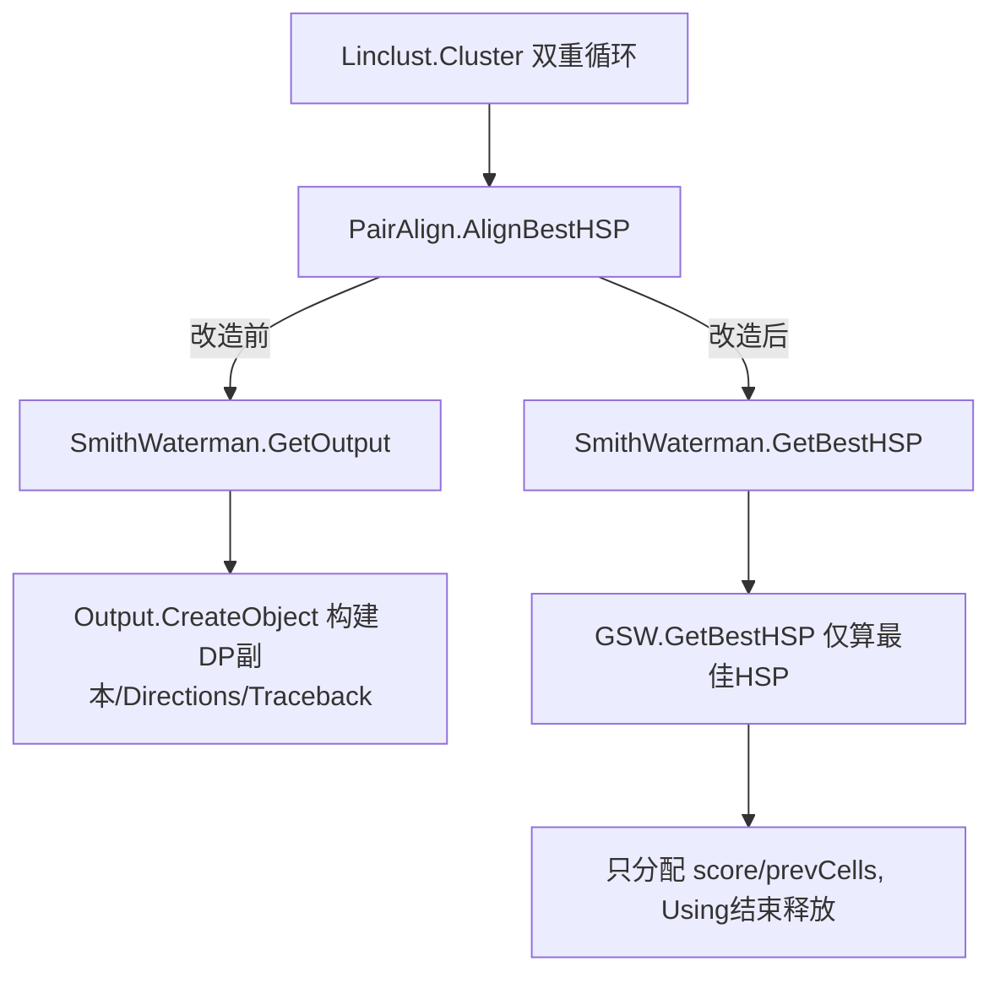

## 用户需求概述

在运行 `test\LinclustDemo.vb` 的 `RunDemo()` 时，执行到 `Linclust\Linclust.vb` 中 `Dim hsp = aligner.AlignBestHSP(list(memberId), list(centerId))` 阶段出现内存泄漏，大量内存无法被释放。该调用链为 `PairAlign.AlignBestHSP` → `SmithWaterman.GetOutput` → `Output.CreateObject`，最终落到基础代码库 `sciBASIC#` 的 `SmithWaterman` 方法。用户要求：分析泄漏原因，并针对基础代码库（及上游 `Output`/`PairAlign`）进行修改修复；若需运行测试，必须持续监控 test 进程内存占用，内存大幅上涨时立即终止进程，避免耗尽系统内存导致系统无响应或 IDE 崩溃。

## 核心问题（已确认根因）

1. `AlignBestHSP` 只需要一条 `HSP`，但 `Output.CreateObject` 无条件构建 `DP` 矩阵副本、`Directions`、`Traceback` 三份大对象（约 25MB/次，千级 aa 序列），并在 O(n²) 循环中反复分配丢弃。
2. `Output` 通过 `ArrayRow` 别名持有 `GSW` 的 jagged 行，`GSW.Dispose` 中 `Erase` 仅清空外层数组，子数组仍可达，无法回收。
3. 上述大对象进入 LOH（大对象堆）且不压缩，导致进程 RSS 单调增长，表现为“内存泄漏”。
4. `GetTraceback` 递归、`GetDPMAT` 整矩阵复制、`cutoff:=0` 致 HSP 数量膨胀、`SimpleChaining` 的 O(n²) 大数组，进一步放大分配。

## 修复后预期功能与效果

- `AlignBestHSP` 在聚类双重循环中调用时，单次比对仅分配 DP 矩阵本身与一条 HSP 所需的少量字符串，不再构建 DP 副本/Directions/Traceback。
- `GSW` 释放时真正逐行清空 jagged 子数组，使矩阵可被 GC 回收。
- 运行 `RunDemo()`（或小规模 `RunTest()`）时，test 进程内存占用平稳、不持续增长；需在监控脚本保障下验证。

## 技术栈

- 语言：Visual Basic (.NET / VB.NET)，GCModeller 科学计算项目
- 基础库：`sciBASIC#`（Microsoft.VisualBasic.Core + Data_science）
- 上游库：`GCModeller/analysis/SequenceToolkit/SequenceAlignment`
- 测试宿主：`test/LinclustDemo.vb`（控制台程序）

## 实现方案（总体策略）

核心思路：为“只取最佳 HSP”的场景提供**轻量级路径**，绕开 `Output` 的重量级构建；同时修正 `GSW.Dispose` 的释放逻辑，使 DP 矩阵在 `Using` 结束时真正可回收。

### 关键技术方案与取舍

1. **新增轻量方法 `GSW(Of T).GetBestHSP(cutoff, minW)`**：在基础库 `GSW.vb` 中直接基于 `score`/`prevCells` 计算最佳单条 HSP（复用 `CreateHSP` + `GetBestAlignment` 的语义，但只返回一条 `HSP`），不调用 `GetDPMAT`、`GetTraceback`，也不构造 `Output`。这样单次调用仅保留 `score`/`prevCells`（与 DP 计算本身同生命周期，`Using` 结束时释放）。
2. **`Output`/`PairAlign` 层面改造**：`PairAlign.AlignBestHSP` 改调轻量路径（新增 `SmithWaterman.GetBestHSP` 转发，或在 `PairAlign` 内直接调用 `sw.GetBestHSP`）。保留 `AlignDetailed`/`GetOutput` 原有完整路径以满足其他调用方（如 `Output.HSP`、`DP`、`Directions` 的可视化/序列化用途），做到向后兼容，不扩大改动面。
3. **修正 `GSW.Dispose`**：`Erase` 外层数组前，先遍历 `score`/`prevCells` 将每个子数组置 `Nothing`（或 `Erase` 子数组），再置空外层引用；被 `Output` 别名持有的问题因不再走 `Output` 路径而自然消除。对于仍使用 `Output` 的调用方，`Output` 增加 `IDisposable` 并在 `Dispose` 中清空 `DP`/`Directions`/`Traceback`/`HSP` 引用，避免别名长期持有矩阵行。
4. **降低放大器**：

- `GetTraceback` 改为迭代（用栈/队列替代递归），按需计算，防止深递归与超大 `List`；在轻量路径中根本不被调用。
- `SimpleChaining.ChainingImpl` 增加规模上限保护：当 `size` 超过安全阈值（如 4096）时直接返回得分最高的单条 `Match`，避免 O(n²) 的 `adjMatrix`/`sMatrix` 上百 MB 分配（与已有 `Integer.MaxValue` 溢出保护互补）。
- `cutoff:=0` 在 `AlignBestHSP` 中改为使用一个小的正阈值（如 `1e-3 * AlignmentScore`）或维持 0 但依赖上述 `size` 上限，控制 HSP 数量膨胀。

### 性能与可靠性

- 单次比对内存从 ~25MB 降至 ~15MB（仅 `score`+`prevCells`，且 `Using` 结束即释放），O(n²) 循环下的 LOH 压力大幅下降。
- 复用既有 `CreateHSP`/`GetBestAlignment` 语义，不重复实现算法，降低回归风险。
- 新增轻量路径与原有 `Output` 路径并存，不破坏 `Output` 的序列化/可视化用途。

## 实现要点（执行细节）

- 所有新增/修改都限定在基础库与上游 `Output`/`PairAlign`，遵循项目既有 `IDisposable` 与 `Extension` 风格。
- 修改 `GSW.Dispose` 时仅处理 `score`/`prevCells`/`query`/`subject` 的逐行释放，不改变 `BuildMatrix`/`GetMatches` 等热路径逻辑。
- `SimpleChaining` 的规模上限阈值固定常量，明确注释来源与取舍。
- 测试必须借助监控脚本（详见 todo），小批量（50/100 条）先行，监控内存曲线平稳后再放大；内存超阈值立即终止。

## 架构设计

调用链改造前后对比（精简示意）：



## 目录结构与文件清单

```
G:/GCModeller/src/runtime/sciBASIC#/Data_science/DataMining/DynamicProgramming/SmithWaterman/
├── GSW.vb              # [MODIFY] 新增 GetBestHSP 轻量方法；修正 Dispose 逐行释放 jagged 子数组
├── Workspace.vb        # [MODIFY] 可选：确保 CreateHSP/GetBestAlignment 可被轻量路径复用（通常无需改）
└── SimpleChaining.vb   # [MODIFY] ChainingImpl 增加 size 上限早退，避免 O(n^2) 巨数组

G:/GCModeller/src/GCModeller/analysis/SequenceToolkit/SequenceAlignment/
├── SmithWaterman/
│   ├── SmithWaterman.vb                      # [MODIFY] 新增 GetBestHSP 转发方法
│   └── Extension/Output.vb                   # [MODIFY] Output 实现 IDisposable，Dispose 清空大对象引用
└── Diamond/PairAlign.vb                      # [MODIFY] AlignBestHSP 改调轻量 GetBestHSP 路径

g:/GCModeller/src/GCModeller/analysis/ProteinTools/ProteinMatrix/
└── test/LinclustDemo.vb                      # [MODIFY] 提供小批量验证入口（Take(50)/Take(100)）便于内存监控
```

## 关键代码结构（示意，仅接口级）

```
' GSW.vb 新增
Public Function GetBestHSP(threshold As Double, minW As Integer) As LocalHSPMatch(Of T)
    ' 仅基于 score/prevCells 求最佳单条 HSP，不构建 Output/DP副本/Traceback
End Function

' Output.vb 新增
Public Class Output : Implements Enumeration(Of HSP), IDisposable
    Public Sub Dispose() Implements IDisposable.Dispose
        ' 清空 DP/Directions/Traceback/HSP 引用
    End Sub
End Class

' PairAlign.vb 改造
Public Function AlignBestHSP(...) As HSP
    Using sw As New SmithWaterman(query, subject, Matrix)
        Return sw.GetBestHSP(cutoff, minW)  ' 轻量路径
    End Using
End Function
```