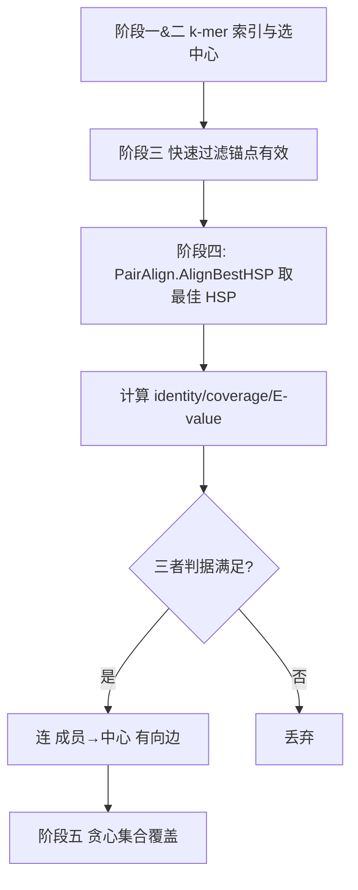

## 用户需求

使用 `G:\GCModeller\src\GCModeller\analysis\SequenceToolkit\SequenceAlignment\Diamond\PairAlign.vb` 模块中的方法，替换掉 Linclust 算法流程中阶段四现有的 SmithWaterman 比对调用，使聚类判定复用 `DIAMOND.PairAlign` 的单对单局部比对能力。

## 产品概述

将 Linclust 阶段四（成员 vs 中心的带缺口局部比对）从直接调用 `SmithWaterman.Align` + `GetOutput` + 自定义 `GetBestHSP` 抽取最佳 HSP，改为调用 `SMRUCC.genomics.Analysis.SequenceAlignment.DIAMOND.PairAlign.AlignBestHSP(FastaSeq, FastaSeq)`，该 API 内部已封装 SmithWaterman 并直接返回得分最高的单条 `HSP`，与下游 identity/coverage/E-value 判据完全兼容。

## 核心功能

- 在 Linclust.Cluster 中复用单个 `PairAlign` 实例（构造时默认 BLOSUM62，避免每条 pair 重复加载替换矩阵）。
- 阶段四对每条 (成员, 中心) 直接调用 `aligner.AlignBestHSP(list(memberId), list(centerId))` 取得最佳 HSP。
- 下游一致性与覆盖率计算（`hsp.Query`/`hsp.Subject`/`hsp.LengthQuery`/`hsp.LengthHit`/`hsp.score`）、E-value 判据与最终连边逻辑保持不变。
- 删除不再使用的 `SmithWaterman.Align`/`GetOutput`/`GetBestHSP` 私有函数及相关 import，降低维护成本。

## 技术栈

- 语言：Visual Basic (.NET, net10.0)，与 ProteinMatrix.vbproj 一致
- 复用依赖：`SequenceAlignment.vbproj`（已通过 ProjectReference 引用，含 `DIAMOND.PairAlign` 与 `BestLocalAlignment.HSP`/`Output`）、`Bio.Assembly`（`FastaSeq`）

## 实现方案

### 总体策略

保持 Linclust 五阶段流程与下游判据不变，仅将阶段四的“调用 SmithWaterman 取最佳 HSP”替换为“调用 PairAlign.AlignBestHSP”。`PairAlign.AlignBestHSP(query As FastaSeq, subject As FastaSeq)` 内部已执行 `New SmithWaterman(...).BuildMatrix` 并 `GetOutput(cutoff:=0, minW).Best`，返回类型与现用 `HSP` 完全一致（`BestLocalAlignment` 命名空间），因此下游 `Query/Subject/LengthQuery/LengthHit/score` 字段与 `EValue.Compute(hsp.score, ...)` 调用无需任何改动。

### 关键技术决策

1. **复用单实例 PairAlign**：在 `Cluster` 函数开头（阶段四循环外）`Dim aligner As New PairAlign()`，而非在每条 pair 内 `New`。`PairAlign` 构造时加载 BLOSUM62 矩阵，复用实例可避免 mN 次重复构造矩阵，保持 O(N) 线性复杂度且不引入额外开销。
2. **直接传 FastaSeq**：`AlignBestHSP` 提供 `FastaSeq` 重载，内部用 `SequenceData` 比对，无需再 `DirectCast` 为 `IPolymerSequenceModel`，代码更简洁。
3. **删除冗余代码**：移除 `SmithWaterman.Align`/`sw.GetOutput`/`GetBestHSP(output)` 三行及私有 `GetBestHSP` 函数；相应清理 `Imports ...BestLocalAlignment`（SmithWaterman/Output 依赖），保留 `Imports ...SequenceAlignment`（EValue 模块所在）与 `Imports ...SequenceAlignment.DIAMOND`（PairAlign 所在）。`HSP` 类型由 `aligner.AlignBestHSP` 返回推断，无需显式 BestLocalAlignment 引用。
4. **行为一致性**：`AlignBestHSP` 内部 `GetOutput(cutoff:=0)` 收集所有正分 HSP 并取 `.Best`，等价于现有 `GetBestHSP(output)` 取最高分逻辑；与现用 identity/coverage/E-value 判据组合后，聚类结果应与替换前一致。

### 性能与可靠性

- 比对总数仍受 mN 上界约束（阶段三已过滤），与最终贪心覆盖阶段解耦，整体线性复杂度不变。
- `PairAlign` 单实例复用替换矩阵，减少重复初始化开销。
- 边界保护：`AlignBestHSP` 在无正分比对时返回 `Nothing`，下游 `If hsp Is Nothing Then Continue For` 已保留，不会空引用。

## 实现注意事项

- 不修改 `PairAlign.vb`、`SmithWaterman.vb`、`HSP.vb`、`EValue.vb` 等基础库公共行为。
- `ProteinMatrix.vbproj` 已引用 `SequenceAlignment.vbproj`，无需新增 ProjectReference。
- 替换后运行 `test/LinclustDemo.vb` 验证：FamilyA/FamilyB 仍各自聚为一簇且代表为最长种子，随机序列各自独立成簇，断言通过。

## 架构设计



（原阶段四 `SmithWaterman.Align → GetOutput → GetBestHSP` 链路整体替换为 `PairAlign.AlignBestHSP` 单步调用）

## 目录结构

```
ProteinMatrix/Linclust/
└── Linclust.vb   # [MODIFY] 阶段四替换为 PairAlign.AlignBestHSP；新增 DIAMOND import；
                  #           复用单实例 aligner；删除 GetBestHSP 私有函数与冗余 import。
```

（其余 Linclust 文件、test/LinclustDemo.vb 无需修改）

## 关键代码结构

```
' Linclust.vb（修改后阶段四核心片段）
Imports SMRUCC.genomics.Analysis.SequenceAlignment
Imports SMRUCC.genomics.Analysis.SequenceAlignment.DIAMOND
' ... 其它既有 import

Namespace Linclust
    Public Module Linclust
        Public Function Cluster(seqs As IEnumerable(Of FastaSeq), Optional opts As LinclustOptions = Nothing) As ClusterResult
            ' ... 准备 / 阶段一二 ...
            Dim aligner As New PairAlign()   ' 复用单实例，默认 BLOSUM62

            For Each centerPair In TqdmWrapper.Wrap(byCenter)
                ' ...
                For Each memberId In centerPair.Value
                    ' ...
                    If fast.MatchLength < k Then Continue For

                    ' 阶段四：DIAMOND.PairAlign 带缺口比对
                    Dim hsp = aligner.AlignBestHSP(list(memberId), list(centerId))
                    If hsp Is Nothing Then Continue For

                    Dim identity = AlignmentIdentity(hsp.Query, hsp.Subject)
                    Dim coverage = CDbl(Math.Min(hsp.LengthQuery, hsp.LengthHit)) / Math.Min(memberRaw.Length, centerRaw.Length)
                    Dim eval = EValue.Compute(hsp.score, memberRaw.Length, centerRaw.Length)

                    If identity >= opts.seqidThreshold AndAlso
                       coverage >= opts.coverage AndAlso
                       eval <= opts.evalue Then
                        edges.Add((memberId, centerId))
                    End If
                Next
            Next
            ' ...
        End Function
        ' 删除：Private Function GetBestHSP(output As Output) As HSP
    End Module
End Namespace
```