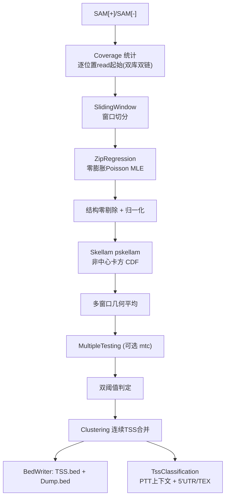

## 产品概述

将现有 TSSAR 项目从"调用外部 Perl/R 脚本"的占位实现，重构为纯 VB.NET 的、可直接复用的 dRNA-seq 转录起始位点（TSS）注释算法库，行为对齐参考文献与原始 TSSAR.pl 流程。

## 核心功能

- **输入解析**：读取（TEX 处理过的）[+] 库与（未处理的）[-] 库两个 SAM 比对文件，按正/负链在基因组每个位置上统计 read 起始计数（覆盖度），支持 CIGAR 推算比对跨度与 NH 标签按比例计数。
- **局部统计建模**：以滑动窗口（默认 1000 nt，步长 100 nt）在局部上下文中估计背景；对窗口内每个库独立拟合零膨胀 Poisson 模型，分离"结构零（不转录）"与"采样零（转录但未采到）"，得到 Poisson 均值 λ 与期望结构零数。
- **显著性检验**：按文库规模做归一化，计算 [+] 与 [-] 的逐位置计数差，用 Skellam 分布（两个 Poisson 之差）计算"在该局部背景下观察到该差值的概率"（p 值）；对覆盖同一位置的多个窗口 p 值取几何平均。
- **判定与过滤**：双阈值判定（几何平均 p 值低于用户阈值，且 [+] 库原始 read 起始数不低于噪声阈值），并将 MLE 不收敛、无法建模的基因组区间记录为未分析区域。
- **后处理**：可选多重检验校正；合并连续 TSS 并保留最显著位置（按 p 值或峰值差评分）；输出 BED 格式 TSS 注释表与未建模区域表。
- **基因上下文分类**：结合基因注释（PTT），将每个 TSS 分类为 Primary（基因上游启动子区）、Internal（基因内部）、Antisense（反义内部/反义下游）、Orphan（无关联基因）；对 Primary TSS 推断 5'UTR 长度分布，并评估 TEX 处理效率。

## 视觉/输出效果

无图形界面。结果为文本注释文件：标准 BED 记录（染色体、起止、TSS 编号、评分、链方向）、未建模区域列表，以及包含分类、关联基因、5'UTR 长度、TEX 效率等字段的结果表。

## 技术栈

- 语言/运行时：VB.NET / .NET 10，沿用现有 SDK 风格 `.vbproj`（`TargetFramework=net10.0`，`RootNamespace=SMRUCC.genomics.Analysis.RNA_Seq.TSSAR`）。
- 复用基础库（均已在 `TSSAR.vbproj` 中引用）：
- `Microsoft.VisualBasic.Math.Core`（RootNamespace `Microsoft.VisualBasic.Math`）
- `Microsoft.VisualBasic.Math.Statistics`
- `Microsoft.VisualBasic.Runtime`（Core，含 `RandomExtensions`、`CommandLine`/`ExportAPI`）
- `Microsoft.VisualBasic.Data.Framework`（DataFrame/Csv/TSV）
- `SMRUCC.genomics.Core`（Bio.Assembly：SAM 模型、PTT、`SegmentRelationships`、`LocationDescriptions`）
- `SMRUCC.genomics.SequenceModel.RNA-seq.Data`（`SAM.SAM` / `AlignmentReads` / `SamStream` / FQ）
- 统计能力：自实现 BesselI、非中心卡方 pchisq、Skellam 分布、截距型零膨胀 Poisson MLE；随机数复用 `Microsoft.VisualBasic.Math.RandomExtensions`（可 `SetSeed` 复现）。
- 输出：BED/TSV 文本与 DataFrame/Csv；**完全移除对外部 Perl/R 运行时的依赖**。

## 实现方案

### 总体策略

采用“基础库补通用数学 + TSSAR 内聚专有逻辑”的分层方式：基础库只做**可跨模块复用的增量式补齐**（填充原 `NotImplementedException` 存根与空方法、追加 `p.adjust` 分支），不改动既有行为；TSSAR 项目内实现算法编排、数据模型与分类逻辑。



### 关键技术与决策

1. **零膨胀 Poisson 参数估计的等价简化**：R 参考实现用 `vglm(y1 ~ x2, zapoisson(zero=1))`，其中 `x2 = runif(n)` 为纯噪声回归元，其系数≈0，本质是**截距型（常数参数）ZIP**。因此直接对窗口样本做 2 参数 `(phi, lambda)` 极大似然（EM 主迭代，带收敛容差/最大迭代；不收敛则判定窗口不可建模），数学上等价于 VGAM 全 MLE，但更快、无外部依赖、可控。实现“期望结构零数 = 零的个数 × phi / dzipois(0,λ,phi)”，与参考一致。
2. **非中心卡方 CDF**：采用 Poisson 加权混合级数 `P(χ'²(df,ncp) ≤ x) = Σ_j e^{-ncp/2}(ncp/2)^j/j! · P(χ²_{df+2j} ≤ x)`，中心卡方 CDF 复用 `SpecialFunctions.IncompleteGamma(df/2, x/2)`；以对数权重与 log-sum-exp 防止下溢。相比 Marcum-Q/Bessel 路线更稳健。`ncp=0` 退化为中心卡方。
3. **Skellam 分布**：严格照抄 `Resources\pskellam.txt`（负/非负分支、upper-tail 调用），主路径 `1 - pskellam(D - ε, λ1, λ2)`；`dskellam` 用指数缩放 BesselI，越界回退鞍点近似（照 `Resources\dskellam.sp.txt`）。
4. **内存优化**：不分配 `genome_size × ~11` 的 PVAL 矩阵（5 Mb 基因组约 440 MB）。改为按位置累加 `Σlog(p)` 与有效窗口计数，最终 `exp(Σlog/count)`，与 R 的 `na.rm=TRUE` 几何平均**逐位等价**，内存由 O(11N) 降为 O(N)。
5. **归一化以参考实现为准**：使用 `TSSAR.pl` 的线性比值 `normalize_P = (sum_P>=sum_M) ? sum_M/sum_P : 1`（readme 所述平方根形式为论文版差异，代码注释标注）。
6. **可复现随机性**：结构零随机剔除使用固定 seed（`RandomExtensions.SetSeed`），保证结果可复现。
7. **CIGAR 跨度语义**：保持 Perl 参考的 `(\d+)[MDX=]` 累加规则（仅 M/D/X/=），并提供可选项以计入 N。
8. **分类器组合**：基于既有 `SegmentRelationships` + `LocationDescriptions.GetLociRelations` + `PTT.GetRelatedGenes` 组合实现，阈值可配置（Primary 上游 250 nt、Antisense 下游 30 nt）。

### 性能与可靠性

- 复杂度：覆盖度统计 O(reads)；滑窗统计 O(4 × N/step × win) ≈ O(40N)，其中 N 为基因组长度、step≈N/10；每窗口 EM 为常数轮迭代。瓶颈在 EM 迭代与 pskellam 调用，通过复用 `Double()` 缓冲、避免 LINQ/装箱、预计算 `lgamma` 缓解。
- 边界处理：λ 全为 0 → p=1；负/非有限 λ → 丢弃窗口；D 取 floor；p<1e-308 走鞍点；`max_pos > genome_size` 时报错退出。

## 实施注意事项

- **复用优先**：SAM 读取用 `SAM.Load` / `SamStream`；链判定用 `AlignmentReads.Strand`；基因关系用 `LocationDescriptions`；随机数用 `RandomExtensions`。不新造 SAM 解析器。
- **热路径**：窗口循环内避免委托、字符串与集合分配；窗口切片用 `Array.Copy` 到复用缓冲。
- **日志**：复用 `__DEBUG_ECHO` / `Console`，`verbose` 打印阶段进度与汇总（TSS 数、未建模区间数与占比），禁止输出大数组。
- **影响面控制**：基础库改动以新增文件为主，仅填充原 `NotImplementedException` 与空方法、在 `p.adjust` 的 `Select` 追加 `Case`（默认仍为 fdr），不改动其他调用方行为。
- **删除旧实现**：移除 `Perl.vb` 的外部 Perl/R 调用路径与 `Module1.vb` 的注释直译稿；`Resources\TSSAR.pl` 与 `Resources\*.txt` 仅保留为算法参考。

## 目录结构

```
TSSAR/                                  (g:/GCModeller/src/GCModeller/analysis/RNA-Seq/TSSAR/)
├── TSSAR/
│   ├── TSSAR.vb                        [MODIFY] 主流程编排类：串联 SAM→覆盖度→滑窗→判定→聚类→输出→分类；暴露 <ExportAPI> 入口与选项参数。
│   ├── Module1.vb                      [DELETE] 删除被整体注释的 R 直译稿。
│   ├── Perl.vb                         [MODIFY] 移除外部 Perl/R 调用；仅保留/迁出通用 SAM/FastQ 读写 API（LoadSAM/LoadFastaq/SaveAlignmentReadsMapping），删除 Located 的 NotImplementedException 分支。
│   ├── Coverage.vb                     [NEW] 双库双链逐位置 read 起始覆盖度统计；CIGAR 跨度、NH/prorata 比例计数、位置取整；产出 4 条覆盖度向量 (P1/P0/M1/M0) 与 max_pos。
│   ├── Statistics/
│   │   ├── ZipRegression.vb            [NEW] 截距型零膨胀 Poisson MLE（EM/Newton），返回 ZipEstimate（phi/lambda/期望结构零/是否收敛）；含 dzipois、dpois。
│   │   ├── SlidingWindow.vb            [NEW] 滑窗驱动：Winsorize、三分支建模、结构零随机剔除、归一化、Skellam p 值、按位置 log 累加与几何平均、未建模区间标记。
│   │   └── MultipleTesting.vb          [NEW] 可选多重检验校正封装（fdr/BH、bonferroni、holm、hochberg、hommel、BY）。
│   ├── Clustering.vb                   [NEW] 连续 TSS 合并（间距<=range），按 score 模式 p(取最小)/d(取最大) 选代表。
│   ├── BedWriter.vb                     [NEW] 输出 TSS BED（chr/start/end/TSS_%05d/score/strand）与 Dump.bed（未建模区间），可选 --nocluster。
│   ├── TssClassification.vb            [NEW] 基于 PTT 的 Primary/Internal/Antisense(Ai/Ad)/Orphan 分类；5'UTR 长度分布与 TEX 效率评估。
│   └── Models/
│       ├── TssSite.vb                  [NEW] TSS 结果模型（含分类、关联基因、UTR 长度等字段）。
│       ├── TssTypes.vb                 [NEW] 分类枚举 Primary/Internal/AntisenseInternal/AntisenseDownstream/Orphan。
│       └── CoverageProfile.vb          [NEW] 逐位置覆盖度表模型（position, coverage），兼容 DataFrame/Csv。
├── Annotations/
│   └── Reads.vb                        [MODIFY] 复用 ReadsGroupView/GeneAssociation；用 PTT.GetRelatedGenes 实现原抛异常的 GetRelatedGenes；补充 TSS 与基因关联输出。
└── Resources/                          (保留 TSSAR.pl 与 *.txt 作为算法参考，不参与编译)
```

### 基础库改动（谨慎最小增量）

```
runtime/sciBASIC#/Data_science/Mathematica/Math/Math/
├── Distributions/Bessel.vb             [NEW] 修正 Bessel 函数 I_ν(x)（级数+渐近+向下递推，支持指数缩放）标量与向量实现。
├── Distributions/pchisq.vb             [NEW] 非中心/中心卡方下尾与上尾、logP；标量 Double 版供 Skellam 使用。
├── Algebra/Vector/Class/Math.vb        [MODIFY] 实现原抛 NotImplementedException 的 Vector.BesselI 与 Vector.pchisq（保持签名，路由到上述实现）。
└── Extensions.vb                       [MODIFY] 在 FDR/BH 基础上新增 bonferroni/holm/hochberg/hommel/BY 的 p.adjust 实现。

runtime/sciBASIC#/Data_science/Mathematica/Math/Math.Statistics/
└── Distributions/Skellam.vb            [NEW] dskellam / pskellam / pskellam.sp(鞍点) / dzipois，严格对齐 Resources/*.txt 公式。

interops/RNA-Seq/RNA-seq.Data/SAM/DocumentNodes/
└── AlignmentReads.vb                   [MODIFY] 实现空方法 CIGARParser；新增 CIGAR→参考跨度/查询长度计算（参考跨度按 M/D/X/= 累加）。

R-sharp/Library/Rlapack/
└── stats.vb                            [MODIFY] p_adjust 的 Select 追加 holm/hochberg/hommel/bonferroni/BY 分派（默认仍 fdr）。
```

## 关键代码结构

```
' 1) 零膨胀 Poisson 拟合结果（TSSAR 项目）
Namespace Statistics
    ''' <summary> 截距型零膨胀 Poisson 模型的最大似然估计结果。 </summary>
    Public Structure ZipEstimate
        Public ReadOnly Phi As Double                      ' 结构零概率 phi
        Public ReadOnly Lambda As Double                   ' Poisson 均值 lambda
        Public ReadOnly ExpectedStructuralZeros As Double  ' 期望结构零个数 = 零个数 * phi / dzipois(0,lambda,phi)
        Public ReadOnly Converged As Boolean               ' MLE 是否收敛（False 则该窗口丢弃）
    End Structure
End Namespace

' 2) 单条注释 TSS（TSSAR 项目）
Public Class TssSite
    Public Property Chromosome As String
    Public Property Position As Integer           ' 1-based
    Public Property Strand As SMRUCC.genomics.ComponentModel.Loci.Strands
    Public Property PValue As Double              ' 多窗口几何平均 p 值
    Public Property PeakDifference As Double      ' 归一化 [+] - [-]
    Public Property PlusCoverage As Double
    Public Property MinusCoverage As Double
    Public Property Type As TssTypes
    Public Property Gene As String
    Public Property UtrLength As Integer
End Class

' 3) Skellam 分布（Math.Statistics 项目）
Namespace Distributions
    Public Module Skellam
        Function dskellam(x As Double, lambda1 As Double, Optional lambda2 As Double = Double.NaN, Optional logP As Boolean = False) As Double
        Function pskellam(q As Double, lambda1 As Double, Optional lambda2 As Double = Double.NaN,
                          Optional lowerTail As Boolean = True, Optional logP As Boolean = False) As Double
        Function pskellamSP(q As Double, lambda1 As Double, lambda2 As Double, Optional lowerTail As Boolean = True) As Double
        Function dzipois(x As Double, lambda As Double, pstr0 As Double) As Double
    End Module
End Namespace
```

## Agent Extensions

### Skill

- **pdf**
- Purpose: 提取 `doc/1471-2105-15-89.pdf` 与 `doc/Skellam distribution.pdf` 的文本/公式，用于在实现统计核心时逐条核对论文描述与 Skellam 公式，确保数值行为与文献一致。
- Expected outcome: 得到论文中窗口参数、双阈值、Skellam CDF/PMF 与鞍点近似的原文依据，并与 `Resources/*.txt`、`readme.md` 交叉验证。
- **lsp-code-analysis**
- Purpose: 在修改共享基础库（`Vector.BesselI` / `Vector.pchisq` / `p.adjust` / `CIGARParser`）前做定义、引用与影响面分析，确认存根签名与所有调用点，避免破坏其他模块。
- Expected outcome: 明确每个被修改符号的定义位置与全部引用，保证改动向后兼容、影响面可控。

### SubAgent

- **code-explorer**
- Purpose: 定位并复核可复用的基础库实现（SAM 解析、PTT/基因关系、DataFrame 读写、CLI/ExportAPI 范式）与相邻模块的代码风格。
- Expected outcome: 给出精确的文件路径、命名空间与 API 签名，确保新增代码复用既有能力而不重复造轮子。