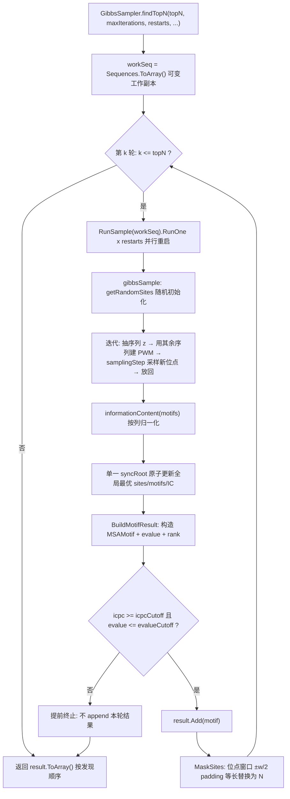

## 产品概述

优化 `MotifFinder` 中基于吉布斯采样（Gibbs Sampling）的 motif 发现算法模块。当前 `GibbsSampler.find` 只能从多次并行重启中保留信息含量最高的 1 个 motif；本次改造在**保持 `find` 签名与返回类型不变**的前提下，新增 `findTopN`，通过"发现—掩码—重采样"的迭代循环发现多个互不重叠的 motif，并对整个算法模块做代码审查与全量缺陷修复。

## 核心功能

**1. 新增 `findTopN`：迭代式掩码多 motif 发现**

- 第 1 轮在原始序列上运行标准吉布斯采样器，得到 motif M1 及其在每条序列上的位点。
- 将 M1 的所有位点窗口（含 ±w/2 的 padding）替换为 `N` 完成屏蔽，随后重新随机初始化位点，在掩码后的序列上再跑一遍采样得到 M2。
- 如此循环，直到新 motif 的信息含量或 E-value 低于阈值，或已发现数量达到 N。
- **允许返回数量少于 N**（阈值未达标时提前终止，不返回低质量结果）。
- 结果**按发现顺序**返回（因逐轮掩码，天然质量递减），不做事后重排。

**2. 代码审查与全量缺陷修复**

- 修复采样候选窗口 off-by-one（每条序列最后一个合法起点永远采样不到）。
- 修复轮盘赌选择的 log-sum-exp 上溢/下溢（下溢时静默退化为均匀随机，采样失去导向性）。
- 修复背景概率为 0 时的除零（导致候选位点权重恒为 +Inf）。
- 修复 `RunSample` 多锁对象的 check-then-act 竞态（可导致位点与 motif 序列来自不同线程、结果自相矛盾）。
- 修复早停条件的浮点等号（早停形同虚设）与迭代次数多跑一次。
- 修复信息含量按固定分母归一化导致掩码轮次间不可比（直接阻塞 top-N 阈值门）。
- 修复空结果崩溃，并清理私有死代码。

**3. 结果可解释性**

- 为每个返回的 motif 补充 `rank`（发现序号）与 `evalue`（显著性估计）字段，调用方可据此判断阈值判定依据；字段为加法式新增，向后兼容。

## 技术栈

- 语言/框架：VB.NET，目标框架 net10.0（沿用 `MotifFinder.vbproj` 现有配置）
- 依赖库（均为仓库既有引用，不新增）：`Microsoft.VisualBasic.Math.GibbsSampling`（`Gibbs.PQ`）、`Microsoft.VisualBasic.Text.Xml.Models`（`ints`）、`Microsoft.VisualBasic.Math.RandomExtensions`（`randf`）、`SMRUCC.genomics.SequenceModel.FASTA`
- 可复用统计量：`SequencePatterns.Abstract/Probability.vb` 的 `Probability.E(nsize)`、`Probability.HI(col)`、`Probability.CalculatesBits(Hi, En, NtMol)`

## 实现方案

### 总体策略

采用 **MEME 风格的 "erase-and-repeat"（发现—掩码—重采样）** 迭代策略，而非"多次重启取前 N"。理由：吉布斯采样的多次随机重启会大量收敛到同一个最优 motif（这也是当前 `RunSample` 只保留全局最优的原因），单纯取前 N 会返回一堆同源重复结果；掩码策略能保证每轮发现的 motif 在位置上互不重叠，符合用户明确的算法设计约束。

掩码用 `N` 字符实现是**零成本**的：仓库既有链路已完整处理 `N` —— `Utils.indexOfBase("N"c) = -1`，`SequenceMatrix.initSequenceMatrix` 跳过计数、`calculateMotifProbability` 跳过该位，因此掩码后无需改动任何采样逻辑。

### 关键技术决策

**决策 1：掩码只写字符、绝不改变序列长度**

`m_sequenceLength`、`getRandomSites` 的 `randf.Next(len - w)`、`samplingStep` 的 `maxStart` 全部依赖长度不变；长度变化会导致索引错乱。掩码实现为"等长替换"（char 数组原地写入 `'N'c`），并在 `MaskSites` 中做 `[0, len)` 裁剪与断言。

**决策 2：每列独立归一化 + 伪计数（B7）**

掩码后列内实际观测碱基数 `< 序列条数`，现有 `probability()` 用固定分母 `rowSum + 4` 会把概率稀释、IC 压低甚至为负，且跨轮不可比 —— 这是 top-N 阈值门的致命前提。改为按列实际观测数 `colSum`（该列非 N 碱基数）做 `(count + 1) / (colSum + 4)` 归一化；`colSum = 0` 的整列 N 列直接跳过（IC 贡献 0），保证跨掩码轮次的 IC 单调可比。

**决策 3：log-sum-exp 稳定化的轮盘赌（B2）**

权重是 W 项 `log(q/p)` 之和，W 大时典型值可达 -700 以下，`Exp` 全部下溢为 0 → `total = 0` → 静默退化为均匀随机。修复为：先减去 `max`，再 `Exp`，再归一化；用 `-Inf` 哨兵替换不可达候选（背景概率钳制后理论上不再产生，仍保留防御）。

**决策 4：单一锁对象的原子更新（B4）**

`RunSample` 现有代码对三个字段用三个不同锁对象分别加锁，且"比较"与"写入"分离，可交叉产生"位点来自线程 A、motif 来自线程 B"的静默数据损坏。改为：显式 `Private ReadOnly syncRoot As New Object`，用**一个** `SyncLock` 块包裹"读取当前最优 → 比较 → 更新 IC + sites + motifs"的整段原子区。

**决策 5：E-value 采用启发式保守估计，并显式标注（B8）**

现有 `find` 用外部 `Gibbs.PQ(i)` 计算 `p`/`q`，但其 `calculateQ` 是把候选窗口与其他序列**相同偏移量**处的窗口逐字符比对，**完全不使用本轮预测出的位点与 PWM**，因此 `q` 与 `MSAMotif.score = q/p` 作为质量指标无意义，不能作为 top-N 的阈值门。改为基于 PWM 的统计量，且复用 `MSAMotif.CreateMotif()` 已有的 bits 计算路径保持口径一致：

```
每列频率（含伪计数） → Hi = Probability.HI(col) → En = Probability.E(n)
bits_i = Probability.CalculatesBits(Hi, En, NtMol:=True)
score  = Σ bits_i                      ' 全 motif 信息量（bits）
N_cand = Σ_i (len_i - w + 1)           ' 候选位点总数
E ≈ N_cand × 2^(-score)                ' 保守估计
```

在 XML 注释中明确注明这是启发式估计而非严格 Karlin-Altschul，避免误导。IC（bits/column，上界 log2(4)=2.0）作为**主闸门**（与 `RunSample` 现有早停逻辑口径一致），E-value 作为**辅助闸门**。

**决策 6：`find` 行为保持不变，风险隔离**

`find` 保持 `As MSAMotif` 签名、重启次数仍为 `SequenceCount`，仅修复其内部缺陷并抽取结果构造逻辑；新增能力全部落在 `findTopN`。全仓库 `find` 唯一调用点是 `test/Program.vb:62`，改动安全。

### 复杂度与性能

- 单轮吉布斯采样：`restarts × maxIterations` 次迭代，每次迭代对 1 条序列的 `O(L)` 个候选起点各做 `O(w)` 计算 → 单轮 `O(restarts × maxIterations × L × w)`；`findTopN` 共 `topN` 轮，总量 `O(topN × restarts × maxIterations × L × w)`。
- 瓶颈在 `samplingStep` 的串行 `AsParallel` 遍历：它对**每条序列的每个候选**都新建委托并做 PLINQ 调度，而候选数 `L` 通常只有几十，PLINQ 调度开销远大于计算本身。修复 B1/B2 时**移除该 `AsParallel`**、改为普通串行循环（外层 `Parallel.For` 已提供充分的重启级并行度），可显著降低单轮开销。
- 内存：`O(topN × n × w)`，仅保存最终结果，无额外压力。
- `RunSample` 早停（IC 达 2.0）会让所有并行线程空转退出，实际重启次数可能小于 `restarts`，属既有设计、予以保留，但需在文档中说明。

## 架构设计

### 数据流



### 组件职责

- `GibbsSampler`：持有工作序列副本与全局背景；负责 `findTopN` 主循环、掩码、E-value 估算、结果构造；保留全部既有采样原语。
- `RunSample`：单轮多重启的并行执行器与"全局最优"持有者；改为接受外部注入的工作序列集，并用单一锁保证状态一致。
- `SequenceMatrix` / `WeightMatrix`：计数矩阵与概率；`probability` 改为按列实际观测数归一化。
- `MSAMotif`：结果载体，加法式新增 `rank`、`evalue`。

## 目录结构

```
MotifFinder/
├── Gibbs/
│   ├── GibbsSampler.vb                 # [MODIFY] 核心。1) 新增 Public Function findTopN(...) As MSAMotif()：迭代式掩码主循环（发现 → 阈值门 → 掩码 → 重采样）；2) 新增 Private Function MaskSites(work As String(), sites As List(Of Integer), pad As Integer)：把 [s_i-pad, s_i+w+pad) 裁剪到 [0,len) 后等长替换为 'N'c，断言长度不变；3) 新增 Private Function EstimateEvalue(countMatrix, n) As Double：按 bits 求和 + N_cand × 2^(-score) 估算；4) 新增 Private Function BuildMotifResult(sites, motifs, icpc, rank) As MSAMotif：抽取自 find 的既有构造逻辑（cost/MSA/names/start/countMatrix/rowSum/p/q/alphabets），空结果守卫返回 Nothing；5) 修复 samplingStep 的 off-by-one 并移除无效 AsParallel；6) 修复 weightedChooseIndex 的 log-sum-exp 稳定化；7) 修复 calculateMotifProbability 的背景概率钳制；8) 修复 gibbsSample 迭代次数多跑一次；9) 修复 informationContent 适配按列归一化；10) 删除死代码 calculateP / smoothProbabilities / minExceptInfinity；11) find 改为复用 BuildMotifResult 并增加空结果守卫，签名与返回类型保持不变
│   ├── RunSample.vb                    # [MODIFY] 1) 新增 Private ReadOnly syncRoot As New Object，用单一锁包裹"比较 + 更新 IC/sites/motifs"的原子区，修复跨线程数据不一致；2) 早停条件由浮点等号 = 2.0 改为 >= 2.0 - epsilon；3) 构造函数支持注入工作序列集（掩码轮次），默认仍取 gibbs.Sequences；4) 新增可配置重启次数支持
│   ├── Utils.vb                        # [KEEP] 保留 getSequenceFromPair/getSiteFromPair（被 Writer.writeSequenceInfo 使用的 Friend API），不误删
│   ├── Writer.vb                       # [KEEP] Public API，本轮不动
│   └── Matrix/
│       ├── SequenceMatrix.vb           # [MODIFY] probability(index, base) 改为按列实际观测数（该列非 N 碱基数）归一化 + 伪计数；整列为 N 时返回均匀分布；新增列观测数查询能力供 IC 计算使用
│       └── WeightMatrix.vb             # [KEEP] 仅被 SequenceMatrix 继承使用，如需暴露 rowSum 语义再调整
├── MSAMotif.vb                         # [MODIFY] 加法式新增 <XmlAttribute> Public Property rank As Integer（发现序号，1-based）与 <XmlAttribute> Public Property evalue As Double（阈值判定依据），向后兼容
└── test/
    └── Program.vb                      # [MODIFY] 保持既有 find 调用，追加 findTopN 调用演示与结果打印（唯一调用点，改动风险低），用于阈值默认值校准与编译冒烟验证
```

## 实现要点（防回归）

- **掩码边界**：`pad = CInt(Math.Floor(w * maskPadding))`，默认 `maskPadding = 0.5`；区间裁剪到 `[0, len)`；必须断言替换前后长度相等，否则索引体系崩塌。
- **阈值默认值**：`icpcCutoff = 0.5`（bits/column，上界 2.0）、`evalueCutoff = 1.0`；两者需在执行阶段用 `data/Staphylococcaceae_LexA___Staphylococcaceae.fasta` 实测校准，并支持置 0 / `Double.PositiveInfinity` 关闭对应闸门。
- **重启次数**：`restarts <= 0` 时取 `Math.Max(Environment.ProcessorCount, Math.Min(4 * m_sequenceCount, 200))`；`find` 仍用原 `SequenceCount` 以保持既有行为。
- **空结果守卫**：`predictedMotifs` 为空时 `BuildMotifResult` 返回 `Nothing`，`find` 返回 `Nothing`、`findTopN` 立即终止，杜绝 `New Double(-1)` 与 `sequences(0)` 越界。
- **日志**：沿用 `VBDebugger.EchoLine`，每轮输出发现序号、IC/column、E-value、被掩码的位点数；避免打印完整序列（数据量大）。
- **向后兼容**：`find` 签名/返回类型不变；`MSAMotif` 仅加字段；`Writer`、`Utils` 的 `Friend`/`Public` 成员不删。
- **不改动外部依赖**：`runtime/sciBASIC#/.../Gibbs/Gibbs.vb` 只读，其 `PQ` 语义缺陷（B8）通过在本模块内改用 PWM 统计量规避，不修改运行时库。

## 关键代码结构

```
''' <summary>
''' 迭代式掩码吉布斯采样：每轮发现一个 motif 后将其位点窗口屏蔽为 N，再重新随机初始化继续发现，
''' 直到信息含量或 E-value 低于阈值，或数量达到 topN。结果按发现顺序返回，允许少于 topN 个。
''' </summary>
''' <param name="maskPadding">位点窗口两侧的屏蔽 padding，单位为 motif 宽度的倍数（默认 ±w/2）。</param>
''' <param name="icpcCutoff">信息含量/列 的下限（bits，理论上限 log2(4)=2.0），低于则终止。</param>
''' <param name="evalueCutoff">E-value 上限（启发式保守估计，非严格 Karlin-Altschul），高于则终止。</param>
Public Function findTopN(Optional topN As Integer = 5,
                         Optional maxIterations As Integer = 1000,
                         Optional restarts As Integer = 0,
                         Optional maskPadding As Double = 0.5,
                         Optional icpcCutoff As Double = 0.5,
                         Optional evalueCutoff As Double = 1.0) As MSAMotif()
```

```
' 每轮掩码：等长替换，区间裁剪到 [0, len)，长度必须保持不变
Private Sub MaskSites(work As String(), sites As Integer(), pad As Integer)

' 每轮结果构造：抽取自既有 find 逻辑，空结果返回 Nothing
Private Function BuildMotifResult(sites As List(Of Integer),
                                  motifs As List(Of String),
                                  icpc As Double,
                                  rank As Integer) As MSAMotif
```