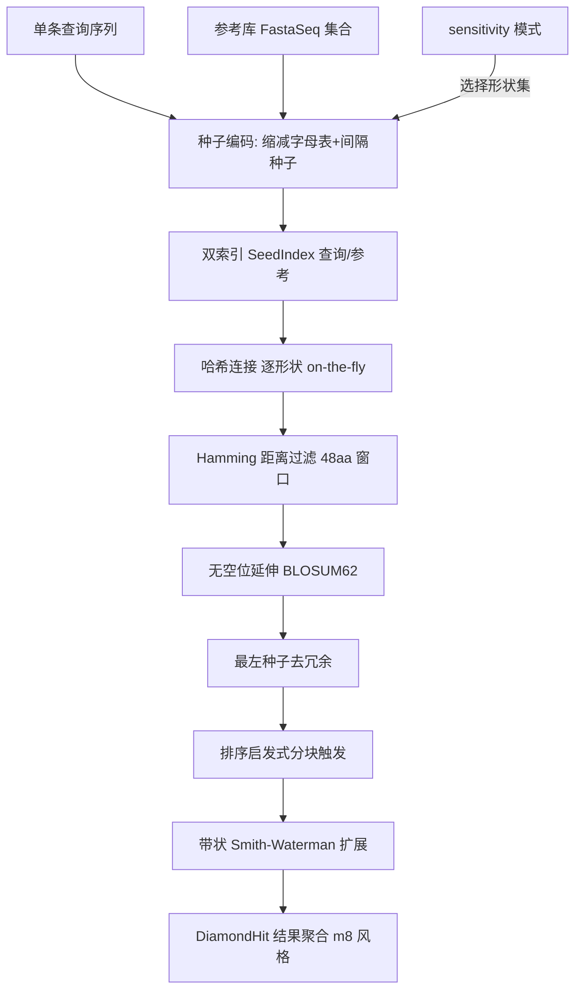

## 用户需求

在现有 GCModeller SequenceAlignment 项目中整合代码，构建 DIAMOND 风格的 blastp 加速比对算法流程，作为 GCModeller 内部可复用的算法模块（类库/API，不提供独立 CLI）。

## 产品概述

新建 `DIAMOND` 命名空间，实现单条查询蛋白序列对单个参考蛋白库的完整比对流水线。将 BLASTP 的"邻域词匹配 + 单边索引查找"替换为 DIAMOND 的"缩减字母表 + 间隔种子 + 查询/参考双索引哈希连接 + 分层过滤链 + 带状 Smith-Waterman 扩展"流水线。第一阶段聚焦单查询 vs 单库原型，保证算法正确性，SIMD 向量化作为后续可选优化层（本阶段以清晰接口边界占位，不强制实现 X86 intrinsics）。

## 核心特性

- **缩减字母表 + 间隔种子编码**：将 20 种氨基酸按物化性质聚为 11 类，按形状掩码（匹配位/忽略位）从序列抽取残基并编码为整数哈希，支持远源同源保守替换命中。
- **四档灵敏度模式**：fast（2 个权重 10 形状）/ sensitive（16 个权重 8 形状）/ very-sensitive（14 个权重 7 形状）/ ultra-sensitive（64 个权重 7 形状），形状集硬编码。
- **双索引哈希连接**：对查询与参考分别构建"种子编码 → 位置列表"索引，逐形状 on-the-fly 处理并哈希连接，避免随机访存瓶颈。
- **分层过滤链**：48aa 窗口 Hamming 距离过滤（标量实现，预留 SIMD 接口）→ BLOSUM62 无空位延伸 → 最左种子去冗余过滤 → 按无空位延伸得分排序启发式分块触发。
- **带状 Smith-Waterman 扩展**：仅计算对角带内单元完成有空位局部比对，输出 HSP 坐标、得分与比对串。
- **结果模型**：产出 DIAMOND hit 集合（query/subject id、坐标、得分、e-value 占位、比对字符串），m8 风格结构供内部 API 返回。

## 技术栈选择

- 语言/框架：VB.NET，目标框架 net10.0，平台 x64（与现有 SequenceAlignment.vbproj 一致）。
- 复用依赖：DynamicProgramming.NET5（GSW/Match/LocalHSPMatch/KBand）、Bio.Assembly（FastaSeq/KSeq/StreamIterator）、sciBASIC# Core、Math.NET5。
- 不引入新第三方库，SIMD 预留 `System.Runtime.Intrinsics.X86` 接口但不强制实现。

## 实现方案

### 总体策略

在 `SequenceAlignment\DIAMOND\` 下建立完整命名空间，将 DIAMOND 流水线拆为独立可测阶段。顶层 `DiamondBlastp` 类接收单条查询序列与参考库（FastaSeq 集合），按 sensitivity 模式选择形状集，逐形状执行：种子编码 → 双索引构建 → 哈希连接 → 分层过滤 → 带状 SW → 结果聚合。

### 关键技术决策

1. **缩减字母表与种子编码**：新增 `ReducedAlphabet` 静态类（20→11 映射）与 `SpacedSeed` 结构（形状位掩码 + 权重）。编码复用 `KSeq` 思路但新增蛋白专用路径（不修改其 DNA 哈希逻辑），将缩减后残基按形状位累加成整数哈希码，保证同形状同编码可哈希连接。
2. **双索引哈希连接**：`SeedIndex` 用 `Dictionary(Of Long, List(Of HitPos))`（HitPos 含序列 id 与位置）。参考索引一次性构建；查询索引逐形状构建、用完释放，控制内存。哈希连接以参考表为基准做线性查找，避免 BLAST 式逐词随机访存。
3. **分层过滤链**：

- Hamming 过滤：在命中位置周围 48aa 窗口逐氨基酸比较缩减字母，标量实现但封装为独立 `IHammingFilter` 接口，便于后续替换为 SSE。
- 无空位延伸：复用 `GenericSymbol`+BLOSUM62，封装 `UngappedExtension` 计算窗口得分。
- 最左种子过滤：维护已处理（形状、位置）集合，左侧存在更早命中则丢弃。
- 排序启发式：按无空位得分降序分块，仅对高分块触发带状 SW，一旦块内不再产出达标比对即停止。

4. **带状 SW**：优先复用现有 `GSW(Of Char)` 计算核心，新增 `BandSW` 包装类限定对角带宽（由种子链确定），仅填充带内单元（复杂度 O(band·n)），复用 `Match`/`LocalHSPMatch` 产出 HSP。
5. **结果模型**：`DiamondHit` 记录 query/subject 标题、坐标、bit-score、e-value（占位估算）、比对串；`DiamondBlastp.Search` 返回 `IEnumerable(Of DiamondHit)`。

### 性能与可靠性

- 索引使用 `Long` 编码与 `List` 位置池，避免装箱；逐形状释放查询索引控制峰值内存（实测单形状远低于 16GB 限制）。
- 过滤链逐级削减命中：Hamming 削减 1–2 数量级，仅少数候选进入昂贵的带状 SW。
- 排序分块触发避免对全部候选做 DP。
- 所有过滤/扩展边界保留 `Interface` 以便后续 SIMD 替换，不破坏现有逻辑。

### 避免技术债务

- 复用 `GSW`/`Match`/`LocalHSPMatch`/`StreamIterator`/`KSeq`，不重复造轮子。
- 新增类型遵循现有 `Namespace SMRUCC.genomics.Analysis.SequenceAlignment.DIAMOND` 约定。
- 文件置于项目编译目录（非 test\ 排除目录）。

## 实现要点（防回归）

- 不修改 `KSeq.vb` 的 DNA 哈希逻辑，仅新增蛋白编码方法或新类。
- 若 `KBandSearch` 仅支持全局编辑距离，则新增 `BandSW` 局部带状内核，不复用其全局逻辑以免语义混淆。
- Hamming/无空位延伸务必封装接口边界，确保后续 SIMD 替换不影响调用方。
- 参考库索引构建使用 `AsParallel` 与现有 `CDHit.Setup` 并行风格一致，但注意线程安全（每形状独立索引）。

## 架构设计



## 目录结构

```
SequenceAlignment/
├── DIAMOND/                                  # [NEW] DIAMOND 命名空间根目录
│   ├── ReducedAlphabet.vb                    # [NEW] 20→11 氨基酸缩减字母表映射与编码辅助
│   ├── SpacedSeed.vb                         # [NEW] 间隔种子形状定义（位掩码+权重）、四档形状集硬编码
│   ├── SeedIndex.vb                          # [NEW] 种子编码→位置列表双索引结构，哈希连接逻辑
│   ├── SeedEncoder.vb                        # [NEW] 基于缩减字母表的间隔种子抽取与整数哈希编码
│   ├── IHammingFilter.vb                     # [NEW] Hamming 距离过滤接口（预留 SIMD 替换边界）
│   ├── HammingFilter.vb                      # [NEW] 48aa 窗口标量 Hamming 距离过滤实现
│   ├── UngappedExtension.vb                  # [NEW] BLOSUM62 无空位延伸得分计算
│   ├── LeftMostSeedFilter.vb                 # [NEW] 最左种子去冗余过滤
│   ├── HitScheduler.vb                       # [NEW] 按得分排序启发式分块触发调度
│   ├── BandSW.vb                             # [NEW] 局部带状 Smith-Waterman 内核（复用 GSW 矩阵逻辑）
│   ├── DiamondHit.vb                         # [NEW] 比对结果模型（坐标/得分/e-value/比对串 m8）
│   └── DiamondBlastp.vb                      # [NEW] 顶层入口：单查询 vs 单库流水线编排
```

## 关键代码结构（接口级）

```
' 间隔种子形状：匹配位为 1，忽略位为 0
Public Structure SpacedSeed
    Public ReadOnly Property Shape As Long   ' 位掩码
    Public ReadOnly Property Weight As Integer
End Structure

' 双索引哈希连接结果
Public Structure SeedHit
    Public QueryPos As Integer
    Public SubjectId As Integer
    Public SubjectPos As Integer
End Structure

' Hamming 过滤接口（SIMD 后续替换点）
Public Interface IHammingFilter
    Function Pass(query As Char(), qPos As Integer, subject As Char(), sPos As Integer) As Boolean
End Interface

' 顶层比对入口
Public Class DiamondBlastp
    Public Function Search(query As FastaSeq, subjectDb As IEnumerable(Of FastaSeq), Optional mode As SensitivityMode = SensitivityMode.Fast) As IEnumerable(Of DiamondHit)
End Class
```