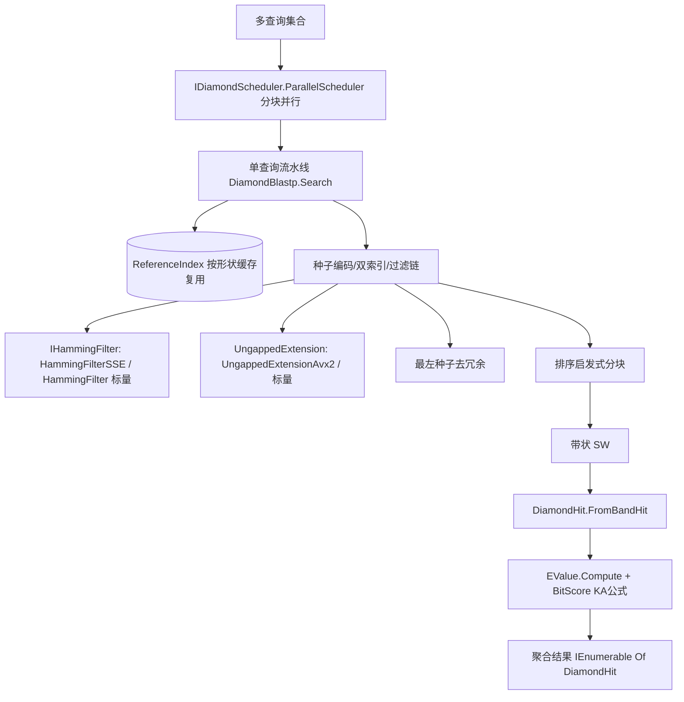

## 用户需求

在已完成的 DIAMOND 单查询 vs 单库 blastp 加速比对流水线基础上，实现三项后续优化，作为 GCModeller 内部可复用算法模块的增强（不提供独立 CLI）。

## 产品概述

基于现有 `SequenceAlignment\DIAMOND\` 命名空间的 11 个文件（已验证与朴素 SW 一致），实施三项增强：(1) 真正的 SIMD 向量化（Hamming 过滤 SSE + 无空位延伸 AVX2）；(2) 扩展多查询集合并行/分布式调度；(3) 接入 Karlin-Altschul 统计模型计算 BitScore/Evalue（复用项目内 `EValue.vb`）。

## 核心特性

- **SIMD 向量化 Hamming 过滤**：在 48aa 窗口内用 `Sse2`（`pcmpeqb`→`MoveMask`→`PopCount`）逐 16 字节比较缩减字母字节，实现 `IHammingFilter` 接口的向量化版本，运行时按 `Sse2.IsSupported` 回退标量。
- **SIMD 向量化无空位延伸**：用 `Avx2` 实现"1 查询 × 32 参考"的并行打分累加（32×32 转置），保持 `Extend` 签名与返回 `UngappedHit` 不变，运行时按 `Avx2.IsSupported` 回退标量。
- **多查询并行调度**：新增调度接口与 PLINQ 并行实现（参照 `CDHit` 的 `.AsParallel` 风格），将单查询流水线并行应用于查询集合，结果聚合；预留分布式调度骨架接口。
- **参考索引跨查询复用**：多查询场景下将 `ReferenceIndex` 按形状缓存并在查询集合间复用，仅逐形状释放查询侧索引，落实"索引可批量构建"的架构预留。
- **BitScore / Evalue 统计**：在 `DiamondHit.FromBandHit` 中调用 `EValue.Compute` 计算 E-value，并按 KA 公式 `bitScore = (λ·S − ln K)/ln 2` 计算 BitScore（λ、K 取自 `EValue` 常量），替换原占位值。
- **调用方无感**：所有替换均保留 `IHammingFilter` / `UngappedExtension.Extend` / `DiamondBlastp.Search` 的对外签名不变。

## 技术栈选择

- 语言/框架：VB.NET，net10.0，x64（与 `SequenceAlignment.vbproj` 一致）。
- SIMD：`System.Runtime.Intrinsics.X86`（Sse2 / Avx2），运行时 `IsSupported` 判定 + 标量回退，保证非 x64 环境可编译运行。
- 并行：PLINQ（`.AsParallel`），沿用现有 `CDHit.vb` 风格。
- 复用：`EValue.vb`（同项目 `SequenceAlignment` 命名空间）、`ReducedAlphabet`、`BestLocalAlignment.SmithWaterman`/`Blosum`、`FastaSeq`。

## 实现方案

### 总体策略

三项优化互不耦合，分别落点于已有的接口边界：Hamming 走 `IHammingFilter` 实现切换；无空位延伸走 `UngappedExtension` 子类化；多查询走 `DiamondBlastp` 新重载 + `IDiamondScheduler`；统计走 `DiamondHit` 内部调用 `EValue`。

### 关键技术决策

1. **SIMD Hamming**：新增 `HammingFilterSse` 实现 `IHammingFilter`，内部将 query/subject 字符串经 `ReducedAlphabet.Encode` 转为 `Byte()`（每 aa 一字节，值 0–10），窗口内每次加载 16 字节到 `Sse2.LoadVector128`，用 `Sse2.CompareEqual` + `Sse2.MoveMask` + `PopCount` 统计相等字节数，差异 = 16 − 相等数，跨 16 字节块累加至 48aa 窗口。窗口长度非 16 倍数时尾部用标量补齐。
2. **SIMD 无空位延伸**：新增 `UngappedExtensionAvx2`（继承 `UngappedExtension`），覆写 `Extend` 或替换内部核心：将 `Blosum` 得分矩阵按参考序列分块成 32 条一组，用 `Avx2` 对 32 字节/字做并行累加（32×32 转置 + 平行得分累加），保持返回 `UngappedHit` 不变；`Avx2.IsSupported` 为 false 时调用 `MyBase.Extend` 回退。
3. **多查询调度**：新增 `IDiamondScheduler` 接口（`Run(queries, subjectDb, perQuery)`）；`ParallelScheduler` 用 `.AsParallel` 分块并行各查询（每查询独立单查询流水线，读共享 `ReferenceIndex`、独立 `QueryIndex`，线程安全）；`DistributedScheduler` 提供接口骨架（基于 `Task`/流式分发的占位，说明如何接外部分布式，不引入新依赖）。
4. **参考索引复用**：`DiamondBlastp` 多查询重载中，将 `ReferenceIndex` 按形状构建一次并缓存于字典，跨查询复用；查询侧索引逐形状建、独立释放。
5. **统计计算**：`DiamondHit.FromBandHit` 调用 `EValue.Compute(rawScore, queryLen, subjectLen)` 填 `Evalue`；`BitScore = (EValue.LambdaBlosum62 * rawScore - Math.Log(EValue.KBlosum62)) / Math.Log(2)`。需显式 `Imports SMRUCC.genomics.Analysis.SequenceAlignment` 或全限定 `EValue.Compute`。
6. **运行时选择**：`DiamondBlastp` 构造函数增加 `Optional useSimd As Boolean = True`，在 `useSimd` 且 `Sse2.IsSupported`/`Avx2.IsSupported` 时选用 SSE/AVX2 实现，否则标量。

### 性能与可靠性

- SIMD 仅在 x64 + .NET 10 运行时启用；标量回退保证可移植性与正确性。
- 多查询 `ReferenceIndex` 跨查询复用，避免重复建索引的 O(查询数 × 库大小) 开销。
- 并行隔离：参考索引只读共享、查询索引线程局部，无锁竞争。
- 所有 SIMD/调度替换均经接口边界封装，调用方（含 `DiamondBlastp.Search` 单查询过载）零改动。

### 避免技术债务

- 不修改 `EValue.vb`、`KSeq.vb`、`KBandSearch.vb`（用户要求直接使用 EValue）。
- 保留 `HammingFilter`（标量）作为对照与回退，不删除。
- 新增类型遵循 `SMRUCC.genomics.Analysis.SequenceAlignment.DIAMOND` 命名空间约定。
- 分布式仅留接口骨架，不引入第三方依赖。

## 架构设计



## 目录结构

```
SequenceAlignment/
├── EValue.vb                                  # [复用] Karlin-Altschul E-value (不修改)
├── DIAMOND/
│   ├── IHammingFilter.vb                      # [复用] Hamming 过滤接口(边界)
│   ├── HammingFilter.vb                       # [复用] 标量实现(对照/回退)
│   ├── HammingFilterSse.vb                    # [NEW] SSE2 向量化 IHammingFilter 实现
│   ├── UngappedExtension.vb                   # [复用] 标量无空位延伸(基类/回退)
│   ├── UngappedExtensionAvx2.vb               # [NEW] AVX2 向量化无空位延伸(继承基类)
│   ├── DiamondHit.vb                          # [MODIFY] 接入 EValue + BitScore KA 公式
│   ├── DiamondBlastp.vb                       # [MODIFY] 增加 useSimd 参数 + 多查询重载 + 参考索引复用
│   ├── IDiamondScheduler.vb                   # [NEW] 调度接口边界
│   ├── ParallelScheduler.vb                   # [NEW] PLINQ 并行调度
│   └── DistributedScheduler.vb                # [NEW] 分布式骨架接口(占位)
```

## 关键代码结构（接口级）

```
' SIMD Hamming 过滤：实现已有 IHammingFilter
Public Class HammingFilterSse : Implements IHammingFilter
    Public Function Pass(query As String, qPos As Integer, subject As String, sPos As Integer) As Boolean Implements IHammingFilter.Pass
    Public Function Distance(query As String, qPos As Integer, subject As String, sPos As Integer) As Integer Implements IHammingFilter.Distance
End Class

' SIMD 无空位延伸：继承标量基类
Public Class UngappedExtensionAvx2 : Inherits UngappedExtension
    Public Overrides Function Extend(query As String, qPos As Integer, subject As String, sPos As Integer) As UngappedHit
End Class

' 调度接口边界
Public Interface IDiamondScheduler
    Function Run(queries As FastaSeq(), subjectDb As IList(Of FastaSeq), perQuery As Func(Of FastaSeq, IEnumerable(Of DiamondHit))) As IEnumerable(Of DiamondHit)
End Interface

' DiamondBlastp 新增重载
Public Function Search(querySet As IEnumerable(Of FastaSeq), subjectDb As IEnumerable(Of FastaSeq), Optional scheduler As IDiamondScheduler = Nothing) As IEnumerable(Of DiamondHit)
```

## Agent Extensions

### SubAgent

- **code-explorer**
- Purpose: 在编写 SIMD/调度/统计代码前，跨文件确认 `EValue.Compute` 签名、`ReducedAlphabet.Encode` 返回类型、`IHammingFilter`/`UngappedExtension`/`DiamondBlastp` 当前实现的精确签名与命名空间，避免计划与实现脱节。
- Expected outcome: 产出各待改文件的确切成员签名、命名空间与调用关系清单，供实现阶段直接参照。