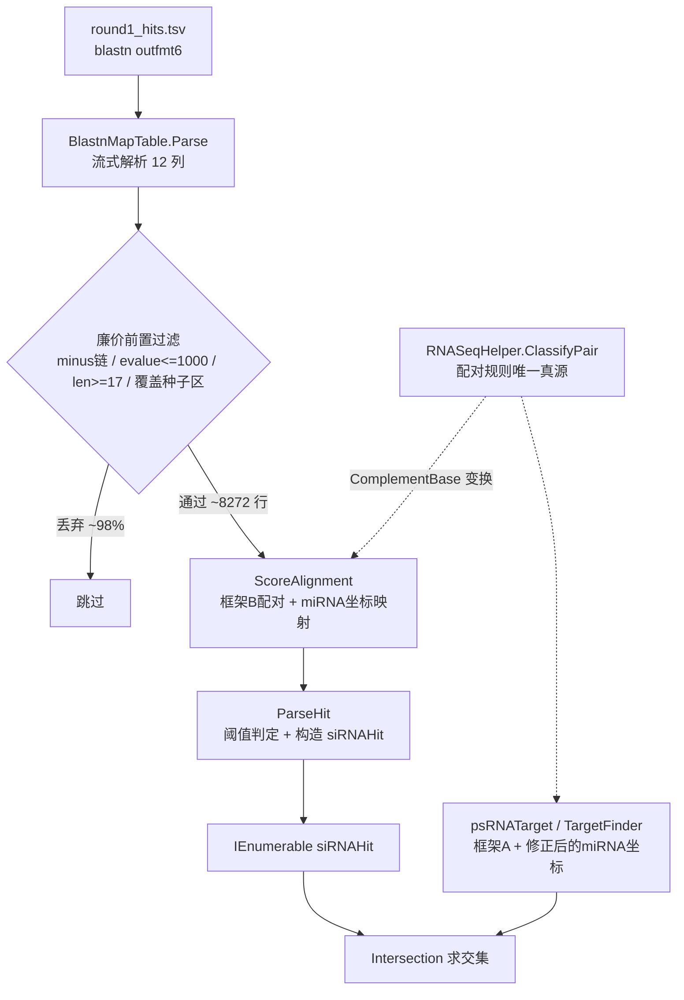

## 产品概述

修复 GCModeller 中"小RNA（miRNA/siRNA）靶基因预测"流程的算法错误。该流程用 NCBI blastn 做第一轮快速预筛，再用 psRNATarget 风格的打分体系做第二轮过滤，从而加速靶基因搜索。当前测试 demo 运行后结果集为空，需要审查并修正 `BlastnMapTable.Parse`、`BlastFilterMiRNATargets`（`ScoreAlignment` / `BlastnFilter` / `ParseHit`）中的算法错误，使其输出正常的小RNA-靶基因匹配结果。

## 核心功能

- **blastn 结果解析**：正确解析 outfmt 6 的 12 列 HSP 表（qseqid sseqid sstart send qstart qend sstrand qseq sseq length evalue bitscore），归一化序列字母表，且不因单列解析失败静默丢行
- **配对框架纠正**：BLASTN 输出的 qseq/sseq 是"同向一致"框架，匹配位点为相同字母；需按该框架判定 Watson-Crick 配对与 G:U wobble，并对 query（DNA，含 T）与 subject 两侧同时做 T→U 归一化
- **链方向过滤**：仅保留 minus 链命中（靶位点 = revcomp(miRNA) 出现在 mRNA 正义链），plus 链命中丢弃
- **阈值语义分离**：BLAST e-value 预筛阈值与 psRNATarget 期望分阈值分开，互不混用
- **坐标与种子区**：按 miRNA 真实坐标（qstart 偏移、跳过 gap）判定种子区（第 2–13 位），并要求 HSP 覆盖种子区
- **结果字段修正**：靶位点长度、gap 计数、比对可视化串、翻译抑制标记、mRNA 正义链坐标归一化
- **同源 bug 一并修复**：`RNASeqHelper.ClassifyPair` 的 wobble 判定规则，以及 psRNATarget / TargetFinder 中 miRNA 位置镜像 + 差一错误
- **可验证输出**：测试 demo 打印命中数量、Top-N 明细与断言结果

## 技术栈

- 语言/框架：VB.NET（.NET 10，`net10.0` / `net10.0-windows`），GCModeller / sciBASIC# 生态
- 相关程序集：`SequenceAlignment.vbproj`、`Microsoft.VisualBasic.Core`、`Bio.Assembly`、`DynamicProgramming.NET5`（Smith-Waterman `LocalHSPMatch`）
- 测试入口：`test\test.vbproj`（`StartupObject = test.siRNADemo`）
- 无新增外部依赖

## 实现方案

### 核心思路

把 blastn HSP 从"BLAST 输出空间"正确映射到"miRNA ↔ mRNA 双链配对空间"再打分。关键认识：**BLASTN 的 `qseq`/`sseq` 是同向（identity）框架**——匹配位是相同字母，而非互补字母。实测数据 minus 链逐位一致率 0.901、plus 链 0.907 已证实。

### 关键决策与权衡

**决策 1：两种"同向框架"必须严格区分，用互补变换统一到唯一真源**

| 框架 | 两侧内容 | WC 配对 | G:U wobble | 真错配（易误判） |
| --- | --- | --- | --- | --- |
| 框架 A（psRNATarget/TargetFinder 的 SW 比对串） | s1 = revcomp(miRNA)，s2 = mRNA | `s1 = s2` | **(C,U) / (A,G)** | (G,A)、(U,C) |
| 框架 B（BLASTN minus 链 HSP） | q = miRNA，s = revcomp(mRNA 片段) | `q = s` | **(G,A) / (U,C)** | (A,G)、(C,U) |


两框架相差"两侧各取互补"。因此框架 B 不另写一套规则，而是复用框架 A：`ClassifyPair(ComplementBase(q), ComplementBase(s))`（先 T→U 归一化）。这样保证规则只有一处定义，避免两处漂移。

> 为什么 wobble 是方向敏感的：`m=G, t=U` → s1=complement(G)=C、s2=U → **(C,U)**；`m=U, t=G` → **(A,G)**。而 (G,A) 意味着 m=C 对 t=A，是真错配。demo 数据交叉验证：`MIR=UGACGUGACUGACGUGACUGA`，`T3_core_GU_pair` 位点相对完美位点仅第 20 位 `C→U`，比对对为 **(C,U)** —— 按现有代码判为 Mismatch（错），按修正规则判为 Wobble（对，对应 miRNA 第 2 位 G:U）。

**决策 2：阈值语义分离**

- `evalueCutoff = 1000`：BLAST e-value 预筛，与命令行 `-evalue 10000` 同量级
- `maxExpectation = 5.0`：psRNATarget 期望分（打分体系产出）
- `minHitLength = 17`：对齐 `psRNATarget.MinHitLength`
- 种子区覆盖硬要求：`qstart <= 2 AndAlso qend >= 13`

原代码把 `eCutoff = 5.0` 直接当 e-value 用，而命令行是 `-evalue 10000` → 实测 441,130 行中仅 524 行（0.12%）满足，是结果为空的第一层原因。

**决策 3：仅在 minus 链上打分**
靶位点 = revcomp(miRNA) 出现在 mRNA 正义链 → 对应 BLASTN minus 链 HSP。plus 链命中表示 mRNA 含 miRNA 同向序列，无法反向互补结合，直接丢弃（不提供开关）。

### 性能设计

- 数据量 441,130 行。采用**廉价过滤前置**：先按 `sstrand / evalue / length / 种子区覆盖` 过滤，再进入逐字符打分循环。实测漏斗：

```
441130 → minus & evalue<=1000 & len>=17 : 15377 → + 覆盖种子区 : 8272 → + 打分过滤 : 5660
```

仅 8272 行进入 O(n) 字符循环（n≈20），总字符比较约 1.7×10⁵ 次，可忽略。

- **归一化延迟执行**：`ToUpper` + T→U 归一化放在打分前而非 Parse 中，避免为 44 万行每行多分配 2 个字符串（约 130 万次分配）。
- `BlastnFilter` 为 `Iterator`，保持流式处理，不在库函数内无条件 `Console.WriteLine`（44 万行会刷屏），改为 `Optional verbose As Boolean = False`，日志移至 demo。
- 复杂度：解析 O(N)，过滤 O(N) 前置 + O(K·L) 打分（K=8272，L≈20），内存 O(1) 流式。

### 坐标语义（minus 链）

- `qstart &lt; qend`（query 恒为 plus），`sstart &gt; send`
- mRNA 正义链靶位点区间 = `[min(sstart,send), max(sstart,send)]`，长度 = `|send - sstart| + 1`
- 比对列 i（0-based）→ miRNA 1-based 坐标 = `qstart + (已消耗的非 gap query 碱基数)`
- 原代码 `Length = .EndSite - .StartSite` 在 minus 链下为**负数**（样本行 198−217 = −19）且 off-by-one

## 实现要点（执行细节）

### 1. `RNASeqHelper.vb`

- 修正 `ClassifyPair`：WC 判定 `a = b` 保持；wobble 改为 `(C,U) / (A,G)`，并在 XML 注释中写明"输入必须是 (revcomp(miRNA), mRNA) 同向框架，方向敏感"
- 新增框架 B 入口（内部复用修正后的 `ClassifyPair`）：

```
''' <summary>
''' BLASTN minus 链 HSP 的配对判定：q = miRNA，s = revcomp(mRNA 片段)，二者同向 5'->3'。
''' 实现上两侧取互补后复用 ClassifyPair，保证配对规则只有一处定义。
''' </summary>
Public Function ClassifyBlastPair(mirnaBase As Char, targetRevCompBase As Char) As PairType
```

- 新增 `ToRNA`/`NormalizeRNA` 辅助：大写化并把 `T`→`U`（`ComplementBase` 已处理 `T`→`A`，但相等性判定前必须归一化）

### 2. `BlastnMapTable.vb`

- 用普通 `String` 变量重写读取循环，替换 `Do While Not (line = reader.ReadLine) Is Nothing` 的 `Value(Of String)` 惯用法（可读性差、依赖框架对 `=` 运算符的非标准重载）
- 列数不足 12 时跳过并计数；e-value 解析失败不再静默丢弃整行（退化为 `Double.MaxValue` 使其被 e-value 阈值自然淘汰，或记录跳过计数）
- 保留 `InvariantCulture` 解析（BLAST 常输出 `2e-07`）；`bitscore` 需 `Trim` 掉行尾 `\r`
- 新增只读辅助属性：`IsMinus As Boolean`（`sstrand = "minus"`，大小写不敏感）、`SiteStart`/`SiteEnd`（归一化到 mRNA 正义链的从小到大坐标）、`AlignmentLength`
- **qseq/sseq 不在 Parse 阶段做归一化**（见性能设计），保留原始串，由打分阶段处理

### 3. `BlastFilterMiRNATargets.vb`

- `AlignmentScore` 结构新增 `GapCount`（真实 gap 列数），并保留 `SeedMismatches / TotalMismatches / GuPairs / Score`
- `ScoreAlignment` 重写：
- 两侧先做 `ToRNA` 归一化（修复 `qBase='T'` 永不匹配的致命问题）
- 按框架 B 判定：相等→WC；(G,A)/(U,C)→wobble 罚 0.5；其余→错配（种子区 1.5 / 非种子区 1.0）
- gap 列（`q` 或 `s` 为 `'-'`）单独计 `GapCount`，罚 1.0 + open 2.0 / extend 0.5（对齐 psRNATarget 常量 `GAP_OPEN=2.0`、`GAP_EXT=0.5`）
- 维护 `mirnaPos = qstart + 已消耗非 gap query 碱基数`，用 `mirnaPos` 而非比对列索引 `i` 判定种子区
- `BlastnFilter` 签名改为分离阈值并前置廉价过滤：

```
Optional evalueCutoff As Double = 1000
Optional maxExpectation As Double = 5.0
Optional minHitLength As Integer = 17
Optional seedStart As Integer = 2, seedEnd As Integer = 13
Optional maxSeedMm As Integer = 2, maxTotalMm As Integer = 8, maxGu As Integer = 7
Optional verbose As Boolean = False
```

过滤顺序：`IsMinus` → `evalue <= evalueCutoff` → `length >= minHitLength` → 种子区覆盖 → 打分 → `Score <= maxExpectation` 及各计数上限

- `ParseHit` 修正：`Length = Math.Abs(send - sstart) + 1`；`GapCount = scored.GapCount`（原错误地填 `SeedMismatches`）；`StartSite/EndSite` 用归一化后的正义链坐标；补 `Alignment`（`qseq & vbCrLf & sseq`）与 `TranslationInhibition`（miRNA 第 10–11 位存在严格错配）
- 移除库函数内无条件 `Console.WriteLine`，改由 `verbose` 控制

### 4. `psRNATarget.vb` / `TargetFinder.vb`（位置镜像修正）

- `LocalHSPMatch.New` 中 `seq1.Skip(fromA).Take(toA - fromA)` 证明 **`fromA` 是 0-based** query 下标；且 query 是 `mirna.ReverseComplementRNA()`，故
**正确公式：`mirnaPos = mirna.Length - (hsp.fromA + i)`**
- 替换点：`psRNATarget.ComputeExpectation`、`psRNATarget.HasCenterMismatch`、`psRNATarget.PassFilter`、`TargetFinder.ScoreByPosition`、`TargetFinder.HasCenterMismatch`
- `psRNATarget.HasCenterMismatch(hsp)` 需补 `mirna` 参数（与 `TargetFinder.HasCenterMismatch(mirna, hsp)` 对齐）；`ComputeExpectation` 的 `mirna` 参数当前未使用，应真正启用
- 顺带补齐 `weightV1/weightV2` 到 21 项（现只有 19 项，超出部分 `PositionWeight` 返回 1.0，虽与期望一致但易误导）

### 5. `test\siRNADemo.vb`

- `blastnFilterTest` 增加输出与断言：命中总数 > 0、Top-N 明细打印、抽查命中满足"minus 链 + 覆盖种子区 + 长度 ≥ 17"
- `ssearchTest` 断言需按修正后语义重新核对（尤其 `T3_core_GU_pair` 由 Mismatch 变 Wobble、`T5_cleavage_mismatch` 的翻译抑制判定受位置镜像修正影响）

## 架构设计



- 分层：`RNASeqHelper`（碱基/配对原语）→ `BlastnMapTable`（IO/解析）→ `BlastFilterMiRNATargets`（打分与过滤）→ `siRNAHit`（统一结果模型）
- 复用既有模式：`psRNATarget` / `TargetFinder` 同实现 `miRNAMapper` 接口；`Intersection` 求交集无需改动即可消费 blastn 产出
- 不引入新架构模式，改动限于既有类的方法体与签名

## 目录结构

```
g:\GCModeller\src\GCModeller\analysis\SequenceToolkit\SequenceAlignment\
├── siRNAHit\
│   ├── RNASeqHelper.vb              # [MODIFY] 修正 ClassifyPair 同向框架的 wobble 规则为 (C,U)/(A,G) 并注明方向敏感；新增 ClassifyBlastPair（框架B，内部两侧取互补复用 ClassifyPair）；新增 RNA 归一化辅助函数
│   ├── BlastnMapTable.vb            # [MODIFY] 用 String 重写 Parse 循环；e-value 解析失败不再静默丢行并 Trim 掉 \r；新增 IsMinus / SiteStart / SiteEnd / AlignmentLength 只读辅助属性
│   ├── BlastFilterMiRNATargets.vb   # [MODIFY] AlignmentScore 增加 GapCount；ScoreAlignment 改为框架B配对 + 双侧 T→U 归一化 + miRNA 坐标映射 + gap 单独统计；BlastnFilter 分离 evalueCutoff/maxExpectation、加 minHitLength 与种子区覆盖前置过滤、日志改 verbose；ParseHit 修正 Length/GapCount/坐标/Alignment/TranslationInhibition
│   ├── psRNATarget.vb               # [MODIFY] 修正位置镜像 mirnaPos = mirna.Length - (fromA + i)；HasCenterMismatch 补 mirna 参数；ComputeExpectation 启用 mirna 参数；权重表补齐 21 项
│   ├── TargetFinder.vb              # [MODIFY] ScoreByPosition 与 HasCenterMismatch 同样修正位置镜像公式
│   └── siRNAHit.vb                  # [不改动] 结果模型保持，仅被正确填充
└── test\
    └── siRNADemo.vb                 # [MODIFY] blastnFilterTest 增加命中数统计、Top-N 明细打印与断言；按修正后语义重新核对 ssearchTest 断言
```

## 关键代码结构

```
' siRNAHit\BlastFilterMiRNATargets.vb —— 打分结果容器（新增 GapCount）
Public Structure AlignmentScore
    Public Score As Double            ' 总罚分（越低越好）
    Public SeedMismatches As Integer  ' 种子区非 G:U 错配数
    Public TotalMismatches As Integer ' 全比对区非 G:U 错配数
    Public GuPairs As Integer         ' G:U wobble 配对数
    Public GapCount As Integer        ' [NEW] 缺口列数（qseq 或 sseq 为 '-'）
End Structure
```

```
' siRNAHit\RNASeqHelper.vb —— 配对判定入口（规则唯一真源）
''' 框架 A：同向框架，query = revcomp(miRNA)，subject = mRNA。WC = 相等；wobble = (C,U)/(A,G)，方向敏感。
Public Function ClassifyPair(queryRevComp As Char, mrna As Char) As PairType

''' 框架 B：BLASTN minus 链 HSP，mirna 与 revcomp(mRNA 片段) 同向。内部两侧取互补后复用 ClassifyPair。
Public Function ClassifyBlastPair(mirnaBase As Char, targetRevCompBase As Char) As PairType
```

```
' siRNAHit\BlastFilterMiRNATargets.vb —— 阈值分离后的过滤入口
Public Iterator Function BlastnFilter(hits As IEnumerable(Of BlastnMapTable),
                        Optional evalueCutoff As Double = 1000,   ' BLAST e-value 预筛
                        Optional maxExpectation As Double = 5.0,  ' psRNATarget 期望分
                        Optional minHitLength As Integer = 17,
                        Optional seedStart As Integer = 2,
                        Optional seedEnd As Integer = 13,
                        Optional maxSeedMm As Integer = 2,
                        Optional maxTotalMm As Integer = 8,
                        Optional maxGu As Integer = 7,
                        Optional verbose As Boolean = False) As IEnumerable(Of siRNAHit)
```

## Agent Extensions

### Skill

- **lsp-code-analysis**
- 用途：在修改 `RNASeqHelper.ClassifyPair`、`psRNATarget.HasCenterMismatch`、`LocalHSPMatch.fromA` 之前做语义级引用分析，找出全部调用点，防止漏改
- 预期结果：获得 `ClassifyPair` / `HasCenterMismatch` / `fromA` / `PositionWeight` 的完整引用清单，确保 5 处位置镜像与 wobble 规则的修改覆盖所有调用点

### SubAgent

- **code-explorer**
- 用途：跨 `siRNAHit` 与 `runtime\sciBASIC#` 目录检索 `ClassifyPair`、`ReverseComplementRNA`、`LocalHSPMatch` 的其它使用方（如 MSA、Blast 模块），评估本次修改的影响半径
- 预期结果：确认修改不会破坏 `SequenceAlignment` 之外的模块，或列出需要同步核对的调用点