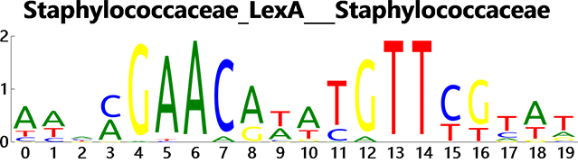
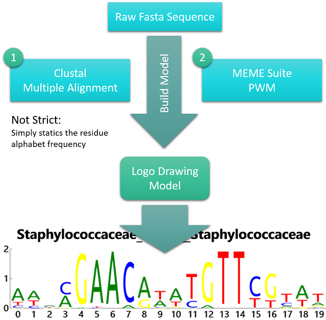
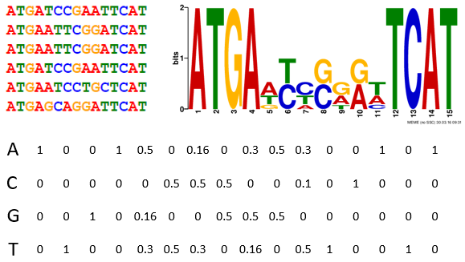
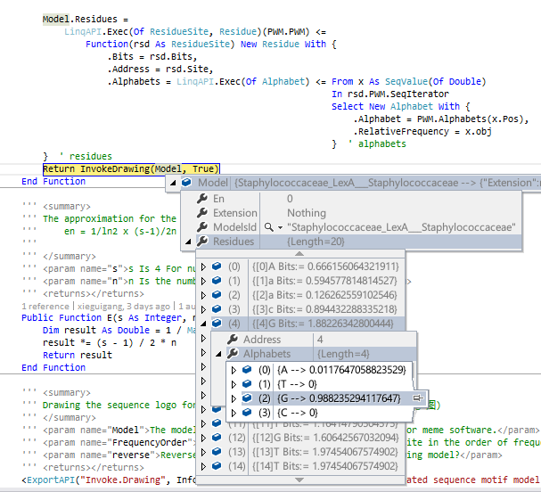
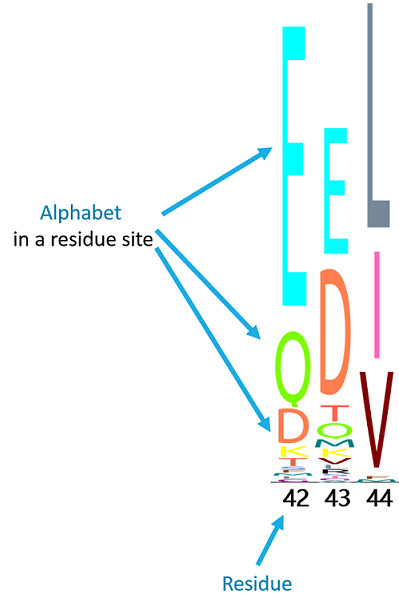
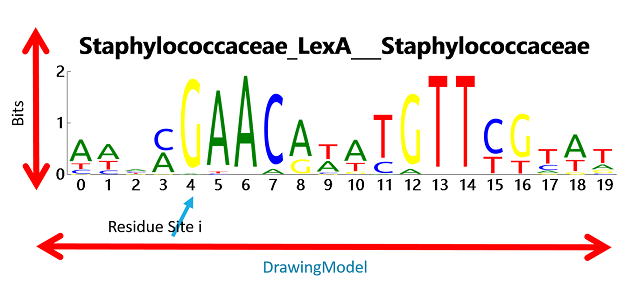
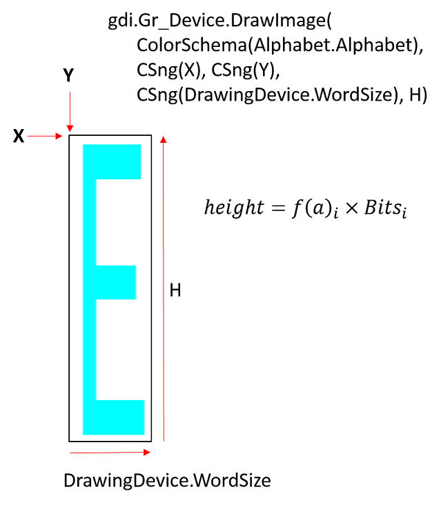
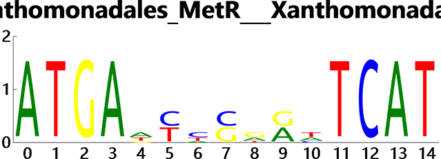
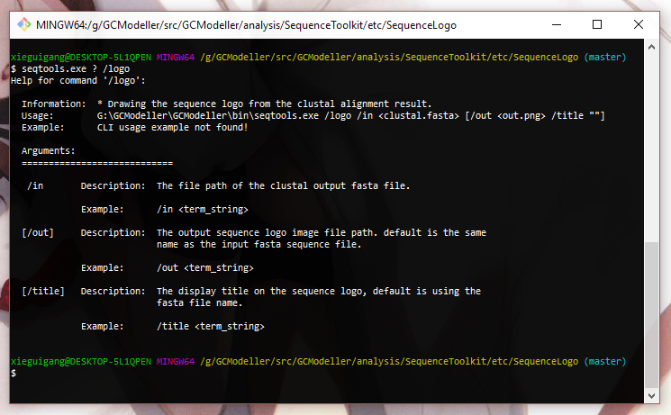

# Draw sequence logo

> CodeProject: http://www.codeproject.com/Articles/1095279/Draw-sequence-logo

###### Runtime
This project required of install ``sciBASIC#`` runtime, install package via nuget:

```bash
# Install Microsoft VisualBasic sciBASIC# runtime via nuget:
# https://github.com/xieguigang/sciBASIC/
PM>  Install-Package sciBASIC -Pre
```

## Introduction


> Picture1. Sequence logo draw for LexA in Staphylococcaceae from RegPrecise database: http://regprecise.lbl.gov/RegPrecise/regulog.jsp?regulog_id=680

In bioinformatics, a sequence logo is a graphical representation of the sequence conservation of nucleotides (in a strand of DNA/RNA) or amino acids (in protein sequences). A sequence logo is created from a collection of aligned sequences and depicts the consensus sequence and diversity of the sequences. Sequence logos are frequently used to depict sequence characteristics such as protein-binding sites in DNA or functional units in proteins.(https://en.wikipedia.org/wiki/Sequence_logo)

In this article I want to introduce how to creates this sequence logo diagram using VisualBasic language.

## Background

There are many tools can creates the motifs model for the sequence logo drawing. A sequence logo model can be simply creates from the multiple sequence alignment by using MEGA or Clustal software if the data requirements is not so strict; but in more often situation, the motif should creates from the PWM, and the meme suite software is doing the best in motifs PWM discovery and creation.


> Picture2. Drawing a sequence logo in GCModeller

#### Some concepts in the motifs

###### 1. Fasta sequence
The most common used database format to stored the biological sequence in text files, one fasta sequence is start with the title line, which its first character must be >

And then starts from the second line, is the biological sequence data, here is a example of a simple nucleotide sequence:

```
>XC_0012:21_Sigma54
-------TGCTGCTGTT--GCTGC---

>XC_0013:35_Sigma54
-------AGGCACAGGAAGTGC-----
```

A parser for the fasta sequence database is already implemented in GCModeller for .NET language, which is available at namespace: SMRUCC.genomics.SequenceModel.FASTA.FastaFile

Use this parser just simply enough:

```vbnet
Imports SMRUCC.genomics.SequenceModel

' Parsing the fasta database from the specific file
Dim fasta As New FASTA.FastaFile(path)
```

###### 2. Alphabet Relative Frequency
The alphabets between the protein and DNA is different, for DNA sequence just ATGC 4 alphabets, and for protein sequence, there are 20 characters:

```vbnet
''' <summary>
''' Enumeration for nucleotide residues
''' </summary>
''' <returns></returns>
Public ReadOnly Property NT As IReadOnlyCollection(Of Char) = {"A"c, "T"c, "G"c, "C"c}

''' <summary>
''' Enumeration for amino acid.
''' </summary>
''' <returns></returns>
Public ReadOnly Property AA As IReadOnlyCollection(Of Char) = {
     "A"c, "R"c, "N"c, "D"c, "C"c, "E"c, "Q"c, "G"c, 
     "H"c, "I"c, "L"c, "K"c, "M"c, "F"c, "P"c, "S"c, 
     "T"c, "W"c, "Y"c, "V"c
}
```


> Picture3. Statistics of the alphabet relative frequency

For calculate the alphabet relative frequency, just simply statics the frequency of each alphabet that occurs in each column. And here is the simply version of statics the alphabet frequency:

+ counts for the alphabets its number of occurrences in a column;
+ then using the occurrences number Divide the total number of the sequence

```vbnet
Imports Microsoft.VisualBasic.Linq
Imports SMRUCC.genomics.SequenceModel.FASTA

''' <summary>
''' Simple function for statics the alphabet frequency in the fasta source. 
''' The returns matrix, alphabet key char is Upper case.
''' (返回来的数据之中的残基的字符是大写的)
''' </summary>
''' <param name="source">
''' Fasta sequence source, and all of the fasta sequence 
''' in this source must in the same length.
''' </param>
''' <returns></returns>
<ExportAPI("NT.Frequency")>
Public Function Frequency(source As IEnumerable(Of FastaToken)) As PatternModel
     Dim len As Integer = source.First.Length
     Dim n As Integer = source.Count
     Dim alphabets As Char() =
         If(source.First.IsProtSource,
            Polypeptides.ToChar.Values.ToArray, New Char() {"A"c, "T"c, "G"c, "C"c})

     ' Converts the alphabets in the sequence data to upper case.
     Dim fasta As New FastaFile(source.ToArray(Function(x) x.ToUpper))
     Dim LQuery = (From pos As Integer
                   In len.Sequence.AsParallel
                   Select pos,
                        row = (From c As Char
                               In alphabets
                               Select c, ' Statics for the alphabet frequency at each column
                                   f = __frequency(fasta, pos, c, n)).ToArray
                   Order By pos Ascending).ToArray
     Dim Model As IEnumerable(Of SimpleSite) =
         From x
         In LQuery.SeqIterator
         Let freq As Dictionary(Of Char, Double) =
             x.obj.row.ToDictionary(Function(o0) o0.c, Function(o0) o0.f)
         Select New SimpleSite(freq, x.Pos)

     Return New PatternModel(Model)
End Function

''' <summary>
''' Statics of the occurence frequency for the specific alphabet at specific 
''' column in the fasta source.
''' (因为是大小写敏感的，所以参数<see cref="Fasta"/>里面的所有的序列数据都必须是大写的)
''' </summary>
''' <param name="Fasta"></param>
''' <param name="p">The column number.</param>
''' <param name="C">Alphabet specific for the frequency statics</param>
''' <param name="numOfFasta">The total number of the fasta sequence</param>
''' <returns></returns>
Private Function __frequency(Fasta As IEnumerable(Of FastaToken),
                             p As Integer,
                             C As Char,
                             numOfFasta As Integer) As Double

     Dim LQuery As Integer = (From nt As FastaToken
                              In Fasta
                              Let chr As Char = nt.SequenceData(p)
                              Where C = chr
                              Select 1).Sum
     Dim f As Double = LQuery / numOfFasta
     Return f
End Function
```

This alphabet frequency statics function code can be found at namespace: ``SMRUCC.genomics.SequenceModel.Patterns.PatternsAPI``

## Using the code
As describe in the picture 2, for drawing a sequence logo in VisualBasic, we should creates a drawing model for the visualization. And for drawing a sequence logo, there are 3 type of information that we needs for the diagram:

1. alphabets of the residues
2. height of each alphabet in a column
3. the columns of the motif that this sequence logo diagram will represents

#### Alphabets rendering

First of all, let see how to rendering the residue alphabets:

Due to the reason of there are two types of the sequence that can be store in the fasta sequence database, so that we needs two color schema for the sequence logo visualization corresponding to the DNA sequence and protein sequence. Here are the colors definitions

###### Color schema for the nucleotide sequence:

```vbnet
''' <summary>
''' Color schema for the nucleotide sequence.(核酸Motif的profiles)
''' </summary>
''' <returns></returns>
Public ReadOnly Property NucleotideSchema As Dictionary(Of Char, Image)
    Get
        Return New Dictionary(Of Char, Image) From {
            {"A"c, ColorSchema.__getTexture(Color.Green, "A")},
            {"T"c, ColorSchema.__getTexture(Color.Red, "T")},
            {"G"c, ColorSchema.__getTexture(Color.Yellow, "G")},
            {"C"c, ColorSchema.__getTexture(Color.Blue, "C")}
        }
    End Get
End Property
```

###### Color schema for the protein residues alphabets:

```vbnet
''' <summary>
''' Color schema for the protein residues alphabets.(蛋白质Motif的profiles)
''' </summary>
''' <returns></returns>
Public ReadOnly Property ProteinSchema As Dictionary(Of Char, Image)
    Get
        Return New Dictionary(Of Char, Image) From {
            {"A"c, ColorSchema.__getTexture(Color.CadetBlue, "A")},      'Alanine        Ala  
            {"R"c, ColorSchema.__getTexture(Color.Black, "R")},          'Arginine       Arg   
            {"N"c, ColorSchema.__getTexture(Color.Chocolate, "N")},      'Asparagine     Asn 
            {"D"c, ColorSchema.__getTexture(Color.Coral, "D")},          'Aspartic acid  Asp  
            {"C"c, ColorSchema.__getTexture(Color.Chartreuse, "C")},     'Cysteine       Cys  
            {"E"c, ColorSchema.__getTexture(Color.Cyan, "E")},           'Glutamic acid  Glu 
            {"Q"c, ColorSchema.__getTexture(Color.LawnGreen, "Q")},      'Glutamine      Gln  
            {"G"c, ColorSchema.__getTexture(Color.DarkMagenta, "G")},    'Glycine        Gly   
            {"H"c, ColorSchema.__getTexture(Color.Gold, "H")},           'Histidine      His  
            {"I"c, ColorSchema.__getTexture(Color.HotPink, "I")},        'Isoleucine     Ile    
            {"L"c, ColorSchema.__getTexture(Color.LightSlateGray, "L")}, 'Leucine        Leu  
            {"K"c, ColorSchema.__getTexture(Color.Yellow, "K")},         'Lysine         Lys   
            {"M"c, ColorSchema.__getTexture(Color.Teal, "M")},           'Methionine     Met   
            {"F"c, ColorSchema.__getTexture(Color.SaddleBrown, "F")},    'Phenylalanine  Phe  
            {"P"c, ColorSchema.__getTexture(Color.Red, "P")},            'Proline        Pro   
            {"S"c, ColorSchema.__getTexture(Color.RoyalBlue, "S")},      'Serine         Ser   
            {"T"c, ColorSchema.__getTexture(Color.Tomato, "T")},         'Threonine      Thr    
            {"W"c, ColorSchema.__getTexture(Color.MediumSeaGreen, "W")}, 'Tryptophan     Trp    
            {"Y"c, ColorSchema.__getTexture(Color.SkyBlue, "Y")},        'Tyrosine       Tyr    
            {"V"c, ColorSchema.__getTexture(Color.Maroon, "V")}          'Valine         Val    
        }
    End Get
End Property
```

Due to the reason of it is hardly to controls the string drawing style directly using ``DrawString`` method on the sequence logo diagram, and the method ``DrawImage`` of gdi+ can directly controls the image drawing location and size through ``x, y, width and heigh`` these function parameters, so that I creates the image cache for each alphabet which is required in the logo alphabets at first. and then these alphabet's image cache can makes the later logo drawing program more easily. Here is the code of transforming the alphabet string into a image cache:

```vbnet
''' <summary>
''' Creates the image cache for the alphabet.
''' </summary>
''' <param name="color"></param>
''' <param name="alphabet"></param>
''' <returns></returns>
Private Function __getTexture(color As Color, alphabet As String) As Image
    Dim bitmap As New Bitmap(680, 680)
    Dim font As New Font(FontFace.Ubuntu, 650)
    Dim br As New SolidBrush(color:=color)

    Using gdi As Graphics = Graphics.FromImage(bitmap)
        Dim size As SizeF = gdi.MeasureString(alphabet, font:=font)
        Dim w As Integer = (bitmap.Width - size.Width) / 2
        Dim h As Integer = (bitmap.Height - size.Height) * 0.45
        Dim pos As New Point(w, h)

        gdi.CompositingQuality = Drawing2D.CompositingQuality.HighQuality
        gdi.CompositingMode = Drawing2D.CompositingMode.SourceOver

        Call gdi.DrawString(alphabet, font, br, point:=pos)
    End Using

    Return bitmap
End Function
```

These code can be found at module:

```
SMRUCC.genomics.Analysis.SequenceTools.SequencePatterns.SequenceLogo.ColorSchema
```

#### Calculation of the Bits of residue sites

One of the important thing is measure the alphabet height that draw on the sequence logo. The height of the entire stack of residues is the information measured in bits. And this value is relative to the frequency of the alphabets and the number of the sequence from the fasta source, and reference from the Wikipedia, a formula was given to calculate this information bits:


Where the value of base is relative to the residue type, base is 4 for DNA sequence and 20 for protein sequence. For instance, here is the code example:

```vbnet
Dim base As Integer = If(fasta.First.IsProtSource, 20, 4)
```

``E`` its value is relative to the base too, and the it also relatives to the number of the fasta sequence in the alignment source:


Where variable ``n`` is the number of the fasta sequence in the alignment, which can be achieve from a property in ``FastaFile`` class:

```vbnet
Dim n As Integer = FastaFile.NumberOfFasta
Dim base As Integer = If(fa.First.IsProtSource, 20, 4)
Dim E As Double = (1 / Math.Log(2)) * ((base - 1) / (2 * n))
```

And the uncertain information for the bits of each residue site i that can be calculate from:


Where i is the column in the motif matrix, and f(a) is the alphabet relative frequency that we've creates previously. and a is the alphabet, where the relative frequency function its parameter a belongs to "ATGC" if the sequence is DNA, otherwise is the 20 amino acid residue alphabet for protein sequence. Codes for calculate this uncertain information Hi is show below:

```vbnet
Imports Microsoft.VisualBasic.Linq

Dim H As Double() = f.Residues.ToArray(Function(x) x.Alphabets.__hi)

''' <summary>
''' 
''' </summary>
''' <param name="f"></param>
''' <returns></returns>
''' <remarks>
''' If n equals ZERO, then log2(0) is NaN, n * Math.Log(n, 2) could not be measure,
''' due to the reason of ZERO multiple any number is ZERO, so that if n is ZERO, 
''' then set n * Math.Log(n, 2) its value to Zero directly.
''' </remarks>
<Extension>
Private Function __hi(f As Dictionary(Of Char, Double)) As Double
     Dim h As Double = f.Values.Sum(Function(n) If(n = 0R, 0, n * Math.Log(n, 2))) 
     h = 0 - h
     Return h
End Function
```

Then when we calculated the bits information for each residue, with the previous statics position relative alphabet frequency matrix, then we have enough information to descript a sequence motif as sequence logo.

Here is the whole code for creates the frequency motif model, which is available at namespace: ``SMRUCC.genomics.Analysis.SequenceTools.SequencePatterns.Motif.PWM``

```vbnet
Imports System.Runtime.CompilerServices
Imports SMRUCC.genomics.Analysis.SequenceTools.SequencePatterns.SequenceLogo
Imports SMRUCC.genomics.SequenceModel.FASTA
Imports SMRUCC.genomics.SequenceModel.Patterns
Imports Microsoft.VisualBasic.Language
Imports Microsoft.VisualBasic.Linq

''' <summary>
''' Build probability matrix from clustal multiple sequence alignment, this matrix model can be 
''' used for the downstream sequence logo drawing visualization.
''' (从Clustal比对结果之中生成PWM用于SequenceLogo的绘制)
''' </summary>
''' <param name="fa">A fasta sequence file from the clustal multiple sequence alignment.</param>
''' <returns></returns>
Public Function FromMla(fa As FastaFile) As MotifPWM
    Dim f As PatternModel = PatternsAPI.Frequency(fa)
    Dim n As Integer = fa.NumberOfFasta
    Dim base As Integer = If(fa.First.IsProtSource, 20, 4)
    Dim E As Double = (1 / Math.Log(2)) * ((base - 1) / (2 * n))
    Dim H As Double() = f.Residues.ToArray(Function(x) x.Alphabets.__hi)
    Dim PWM As ResidueSite() =
        LinqAPI.Exec(Of SimpleSite, ResidueSite) _
       (f.Residues) <= Function(x, i) __residue(x.Alphabets, H(i), E, base, i)

    If base = 20 Then
        Return MotifPWM.AA_PWM(PWM)
    Else
        Return MotifPWM.NT_PWM(PWM)
    End If
End Function

''' <summary>
''' Construct of the residue model in the PWM
''' </summary>
''' <param name="f">ATGC</param>
''' <param name="h"></param>
''' <param name="en"></param>
''' <param name="n"></param>
''' <returns></returns>
Private Function __residue(f As Dictionary(Of Char, Double), h As Double, en As Double, n As Integer, i As Integer) As ResidueSite
    Dim R As Double = Math.Log(n, 2) - (h + en)
    Dim alphabets As Double()

    If n = 4 Then
        alphabets = {f("A"c), f("T"c), f("G"c), f("C"c)}
    Else
        alphabets = LinqAPI.Exec(Of Double) <= From c As Char In ColorSchema.AA Select f(c)
    End If

    Return New ResidueSite With {
       .Bits = R,
       .PWM = alphabets,
       .Site = i
    }
End Function

''' <summary>
''' 
''' </summary>
''' <param name="f"></param>
''' <returns></returns>
''' <remarks>
''' If n equals ZERO, then log2(0) is NaN, n * Math.Log(n, 2) could not be measure,
''' due to the reason of ZERO multiple any number is ZERO, so that if n is ZERO, 
''' then set n * Math.Log(n, 2) its value to Zero directly.
''' </remarks>
<Extension>
Private Function __hi(f As Dictionary(Of Char, Double)) As Double
    Dim h As Double = f.Values.Sum(Function(n) If(n = 0R, 0, n * Math.Log(n, 2))) 
    h = 0 - h
    Return h
End Function
```

#### Build a Drawing Model

As the article described previously, for drawing a sequence logo, we should know what alphabets and their relative frequency in each column position. For measuring the height of each residue site, we should calculate the bits information based on the alphabet relative frequency and the number of th aligned sequence. So that after the data model calculation, all of the information that required for the logo drawing is achieved. For the further unified operation of sequence logo drawing from both multiple sequence alignment result and PWM motif model, so that we should transform the frequency model or PWM into a unify ``DrawingModel``. And here is the ``DrawingModel`` class type definitions:

1. DrawingModel for represents the whole motif's data model
2. Residue for each column site in the motif sites
3. And the relative frequency of each column is consist of the Alphabet class

```vbnet
''' <summary>
''' Drawing model for the sequence logo visualization.
''' </summary>
Public Class DrawingModel : Inherits ClassObject

    ''' <summary>
    ''' The motif model is consist of a sequence of residue sites.
    ''' </summary>
    ''' <returns></returns>
    Public Property Residues As Residue()
    Public Property En As Double
    ''' <summary>
    ''' This drawing display title.
    ''' </summary>
    ''' <returns></returns>
    Public Property ModelsId As String

    Public Overrides Function ToString() As String
        Return ModelsId & " --> " & Me.GetJson
    End Function
End Class

''' <summary>
''' A drawing site in the sequence logo drawing.(所绘制的序列logo图之中的一个位点)
''' </summary>
Public Class Residue : Implements IAddressHandle

    ''' <summary>
    ''' ATGC, 4 characters for nt, and aa is 20.
    ''' </summary>
    ''' <returns></returns>
    Public Property Alphabets As Alphabet()
    ''' <summary>
    ''' The total height of the letters depicts the information content Of the position, In bits.
    ''' (Bits的值是和比对的序列的数量是有关系的)
    ''' </summary>
    ''' <returns></returns>
    Public Property Bits As Double

    ''' <summary>
    ''' Position value of this residue in the motif sequence.(这个残基的位点编号)
    ''' </summary>
    ''' <returns></returns>
    Public Property Address As Integer Implements IAddressHandle.Address

End Class

''' <summary>
''' Alphabet model in the drawing motif model, nt for 4 and aa for 20
''' </summary>
Public Class Alphabet : Implements IComparable

    ''' <summary>
    ''' A alphabet character which represents one residue.(可以代表本残基的字母值)
    ''' </summary>
    ''' <returns></returns>
    Public Property Alphabet As Char
    ''' <summary>
    ''' The relative alphabet frequency at this site position.
    ''' </summary>
    ''' <returns></returns>
    Public Property RelativeFrequency As Double

End Class
```

These class type definition is available at namespace: ``SMRUCC.genomics.Analysis.SequenceTools.SequencePatterns.SequenceLogo``

That is all we needs to represent a sequence logo in the data model. And this function provides the interface for convert the relative frequency model into the DrawingModel andalso the motif sequence logo drawing at the end of the function:

```vbnet
''' <summary>
''' Drawing the sequence logo just simply modelling this motif site from 
''' the clustal multiple sequence alignment.
''' (绘制各个残基的出现频率)
''' </summary>
''' <param name="Fasta">The alignment export data from the clustal software.</param>
''' <param name="title">The sequence logo display title.</param>
''' <returns></returns>
<ExportAPI("Drawing.Frequency")>
Public Function DrawFrequency(Fasta As FastaFile, Optional title As String = "") As Image
     Dim PWM As MotifPWM = Motif.PWM.FromMla(Fasta)
     Dim Model As DrawingModel = New DrawingModel

#If DEBUG Then
     Dim m As String = New String(PWM.PWM.ToArray(Function(r) r.AsChar))
     Call VBDebugger.WriteLine(m, ConsoleColor.Magenta)
#End If

     If String.IsNullOrEmpty(title) Then
          If Not String.IsNullOrEmpty(Fasta.FileName) Then
               Model.ModelsId = Fasta.FileName.BaseName
          Else
               Model.ModelsId = New String(PWM.PWM.ToArray(Function(r) r.AsChar))
          End If
     Else
          Model.ModelsId = title
     End If

     Model.Residues =
        LinqAPI.Exec(Of ResidueSite, Residue)(PWM.PWM) <=
           Function(rsd As ResidueSite) New Residue With {
                 .Bits = rsd.Bits,
                 .Address = rsd.Site,
                 .Alphabets = LinqAPI.Exec(Of Alphabet) <= From x As SeqValue(Of Double)
                                                           In rsd.PWM.SeqIterator
                                                           Select New Alphabet With {
                                                                .Alphabet = PWM.Alphabets(x.Pos),
                                                                .RelativeFrequency = x.obj
                                                           }  ' alphabets
     }  ' residues
     Return InvokeDrawing(Model, True)
End Function
```



Here are two picture to shows the relationship between the components of the DrawingModel:


> Picture4. The relationship between the residue and its alphabets.
The sequence logo was consists of a sequence of residue sites, where each residue site is consists of all of the alphabets of the sequence, but the relative frequency of each alphabet in a residue is usually not equals to each other


> Picture5. The relationship between the residue and the DrawingModel class
One residue is consists of all of the alphabets, and then the DrawingModel is a sequence of these residue, each residue site its stack height is measure by the Bits information content, and the bits information content is related to the alphabet relative frequency in each residue site.

#### Sequence logo drawer function

As we mentioned above, the alphabet height is related to the Bits information content on one residue site, and the actual drawing height can be calculate from the product between the alphabet its relative frequency and the residue site:


and code for this alphabet height calculation:

```vbnet
' YHeight is the max height of current residue, and its value is calculate from its Bits value
YHeight = (n * DrawingDevice.Height) * (If(residue.Bits > MaxBits, MaxBits, residue.Bits) / MaxBits)

' H is the drawing height of the current drawing alphabet, 
' this height value can be calculate from the formula that show above. 
' As the YHeight variable is transform from the current residue Bits value, so that from this statement
' The drawing height of the alphabet can be calculated out. 
Dim H As Single = Alphabet.RelativeFrequency * YHeight
```


> Picture6. Using the image drawing is more easily controls the location and size of the alphabet than draw string directly.

```vbnet
' Due to the reason of the Y Axis in gdi+ is up side down, so that we needs Subtraction operation, 
' and then this makes the next alphabet move up direction 
Y -= H
gdi.Gr_Device.DrawImage(
     colorSchema(Alphabet.Alphabet),  ' Drawing alphabet
     CSng(X), CSng(Y),                ' position
     CSng(DrawingDevice.WordSize), H) ' Size and relative height
```

The full code of the sequence logo drawing function can be found at namespace:
```
SMRUCC.genomics.Analysis.SequenceTools.SequencePatterns.SequenceLogo.DrawingDevice
```

## Using the Example
The code in this article is already implemented as a CLI utility command in a sequence tools. Which the tools can be download from the github release. You can try to draw a sequence logo with the example test data, which is available at location https://github.com/SMRUCC/Sequence-Patterns-Toolkit/blob/master/data/Xanthomonadales_MetR___Xanthomonadales.fasta, and this motifs sequence data is download from RegPrecise database: http://regprecise.lbl.gov/RegPrecise/regulog.jsp?regulog_id=5789



Open the CMD terminal, and then using command   seqtools ? /logo   to get the details information about how to use this command

Here is a example commandline usage of drawing the example test data:

```bash
seqtools /logo /in ./data/Staphylococcaceae_LexA___Staphylococcaceae.fasta
```

