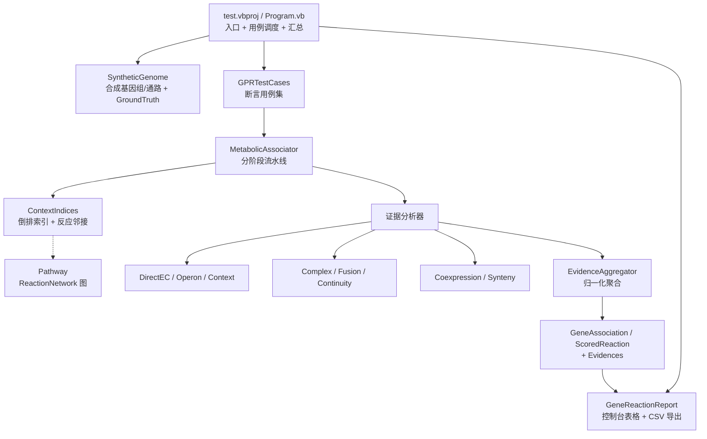

## 用户需求

当前 `GPR.vbproj` 是 GEM（基因组尺度代谢模型）构建流程中"基因 ↔ 代谢反应"关联的算法模块，但该模块实际未良好工作（且在全仓库中无任何调用方，属于未验证代码）。用户要求在 `test\test.vbproj` 中补充针对 `GPR.vbproj` 的算法测试，构建一个 Demo：

- 该 Demo 能输出"基因与代谢反应关联"的表格以及对应的打分结果；
- 通过该 Demo 测试定位、消除并完善 `GPR.vbproj` 中算法代码存在的问题。

已确认的执行口径：使用内置合成数据（自带 ground truth）、控制台 Demo + 内置断言、控制台表格 + CSV 导出、允许对算法与结果模型做深度重构。

## 产品概述

一个可离线复现、可自证正确的基因-代谢反应关联算法验证 Demo。启动后自动构造一套小型合成基因组与代谢通路，依次运行多个算法测试用例，并把算法真实产出的"基因-反应-打分"结果以表格形式直观呈现，同时导出为 CSV 供后续分析。

## 核心功能

- 内置合成测试数据：自包含的小型基因组（基因坐标、链方向、EC 编号、含同链紧密排列的操纵子、跨链基因、多 EC 融合基因、无 EC 基因、EC 无对应反应的未映射基因）与若干代谢通路（反应、底物/产物、EC 编号），并附带已知的正确答案。
- 测试用例执行：覆盖直接 EC 匹配、操纵子上下文、滑动窗口上下文、酶复合体、融合基因、共表达、保守共线性、通路完整度与反应连续性等证据来源；逐条打印 PASS/FAIL 及失败原因（期望值 vs 实际值）。
- 噪声与完整性校验：断言关联结果的作用域收敛（不得把整条通路的全部反应灌给同一基因）、分数有界且在 [0,1]、无重复条目、无伪反应 ID、结果具有确定性。
- 基因-代谢反应关联结果表：控制台打印等宽对齐表格，列为 基因 ID、反应 ID、打分、证据来源、所属通路、置信等级。
- 打分结果统计：每个基因的关联数、平均分/中位分与 Top 高置信关联；全局关联总数与分数分布。
- 结果导出：整张关联表导出为 CSV 文件，并打印文件路径。
- 算法修复：依据上述测试暴露的问题修复 `GPR.vbproj`，最终全部用例通过。

## 输出效果

纯命令行界面。启动后先打印分节标题，随后以带边框的等宽表格展示用例结果与关联结果表；PASS/FAIL 使用不同颜色标记，失败项附带期望值/实际值；结尾打印"通过/失败"汇总与 CSV 输出路径。表格列宽自适应内容，整体在 120 列终端内保持可读。

## 技术栈选择

- 语言/框架：沿用现有 VB.NET（`net10.0`），不引入任何新框架、不引入 xUnit/NUnit。
- 被测库：`annotations\GPR\GPR.vbproj`（`SMRUCC.genomics.GCModeller.CompilerServices.GPRLink`），AssemblyName 与 RootNamespace 保持不变。
- Demo 宿主：现有 `annotations\GPR\test\test.vbproj`（`OutputType=Exe`，已引用 `..\GPR.vbproj` 及所需 sciBASIC# 依赖），符合仓库既有约定（`WGCNA\test`、`P-NET\test` 均为 Exe 控制台工程）。
- 数据来源：完全内置合成数据（离线、可复现、自带 ground truth）。
- 控制台表格渲染：复用 `Microsoft.VisualBasic.ApplicationServices.Terminal` 的 `PrintTable(source As IEnumerable(Of String()), dev, title, trilinearTable)` 扩展（`src\ApplicationServices\Terminal\PrintAsTable.vb`）；备选 `TablePrinter.ConsoleTableBuilder`。
- CSV 导出：UTF-8 with BOM，逗号分隔，`System.IO` 直接写出。
- 断言：自研轻量断言模块（`AssertTrue / AssertEqual / AssertNear / AssertThrows`），统计 PASS/FAIL 并以进程退出码反映结果。

## 实现方案

**核心策略**：把当前"命中邻居 EC 就把整条通路所有反应灌分"的模糊打分，改造成**证据可枚举、可加权、可归一化、可解释**的打分模型；并用合成数据 + ground truth 断言把每一类证据单独隔离验证。

关键决策与理由：

1. **引入证据模型（Evidence-based Scoring）**
新增 `AssociationEvidence`（Kind / Weight / RawScore / Source），`ScoredReaction` 增加 `Evidences`。最终分数由聚合器按"最强证据为主 + 其余证据衰减增益"的公式计算，保证 **单调、有界于 [0,1]、可追溯到证据来源**。理由：彻底解决"整条通路灌分导致结果无区分度"这一根本噪声问题，并让 Demo 表格能直接展示"打分结果 + 评分依据"。

2. **严格的作用域收敛**
上下文/操纵子/共表达/共线性证据只作用于**证据直接指向的反应**（邻居基因 EC 命中的那个反应本身），不再扩散到该反应所在通路的全部反应；通路级证据（通路完整度、反应连续性）仅作为"已有基因级支持"反应的**受限增益**，不新造关联。

3. **阶段化流水线 + 修正时序**
主循环重排为显式阶段：Phase1 直接 EC 匹配 → Phase2 一次性物化 `Genome.MetabolicNetwork` → Phase3 上下文/操纵子/复合体/融合 → Phase4 共表达/共线性（此时网络已物化，修正当前在空网络上运行的时序缺陷）→ Phase5 通路完整度/连续性增益 → Phase6 统一过滤与输出。

4. **单一数据源**
`Genome.MetabolicNetwork` 与 `AssociateGenesToReactions()` 的返回值来自同一份累积结果，消除当前两套数据源不一致的问题。

5. **反向索引取代全表扫描**
一次构建 `reaction → genes`、`EC → reactions`、`reaction → pathways`、`substrate → reactions` 倒排索引；`Genome.GetGenesForReaction` 由 O(N) 降为 O(1)。`Pathway.ReactionNetwork` 构建由 O(R²) 降为 O(ΣR·|left|)。

6. **启用 `Option Strict On`**
在 `GPR.vbproj` 中开启 `<OptionStrict>On</OptionStrict>`。本次排查出的 28 项缺陷中，多起属于"Option Strict Off 下能编译、运行时崩"的类别（如 `Genome.GetGeneReactions` 返回类型与实际返回的 `GeneAssociation` 完全不匹配；`ConservedSyntenyAnalyzer` 把 `ConservedCluster` 当集合传给 `Intersect`）。从编译期根除该类别缺陷。项目仅被自身与 test 工程引用，爆炸半径可控。

7. **保持算法入口兼容**
保留 `MetabolicAssociator(opt, genome, pathways, coexpData, syntenyData)` 与 `AssociateGenesToReactions()` 签名，仅扩展内部结构与 `Result.vb` 结果模型；`GPRParameters` 补齐所有已定义但未使用的参数，消除魔法数字。

**性能与可靠性**：

- `ContextIndices` 构建 O(ΣR + ΣR·|EC|)；`Pathway` 图构建 O(ΣR·|left|)；主流程 O(N·W·E)（W=窗口跨度，E=邻居 EC 命中反应数）。
- Demo 设性能断言：1000 基因 / 20 通路 / 300 反应的合成数据须在设定阈值内完成（预期数十毫秒量级），防止重构引入退化。
- 除零防护：`similarity`、`completeness`、`joint / reactions.Count`、`pathwayRxns.Count = 0` 全部加保护。

## 实现要点（执行细节，均基于已核实事实）

- **数据构造必须使用已核实的 API**：
- `New GeneTable With {.locus_id, .geneName, .left, .right, .strand, .EC_Number}`；`GeneTable` **没有** `experiments` / `name` / `gene` 属性，`EC_Number` 为 `String()`。
- 反应底物/产物为 `CompoundSpecieReference()`，用 `New CompoundSpecieReference(1.0, "C00031")` 构造；**化合物标识属性是 `ID`（大写）**。
- `New Pathway(network) With {.ID, .name, .metabolicNetwork, .metabolites}`；注意 `Pathway` 的构造函数已内部赋值 `metabolicNetwork`，初始化器需保持一致。
- `GenomeContext(Of T)` **没有** `AsEnumerable` 属性，使用 `Microsoft.VisualBasic.Linq` 的扩展方法（需 `Imports Microsoft.VisualBasic.Linq`）；索引器为 `Feature(i)` / `Feature(name)`。
- `NetworkGraph.CreateEdge(u, v)` 重复调用会产生重复边，构建通路反应图时先用 `GetEdge(u, v)` 判重；`u Is v` 引用比较需替换为 `id` 比较。
- `TqdmWrapper.Range(start, count)` 第二个参数是 **count 而非 end**，修复时勿沿用旧语义。
- 断言中浮点一律使用容差比较（1e-6），不做精确相等；分数必须落在 [0,1]。
- 输出表格用 `IEnumerable(Of String()).PrintTable(dev, title:=...)`；CSV 写 UTF-8 with BOM 便于 Excel 直接打开；路径固定为 test 工程输出目录下 `debug/gene_reaction_score.csv`。
- 回归保护：`GPR.vbproj` 每次构建会生成 nupkg（`GeneratePackageOnBuild=True`），验证时优先使用普通 `dotnet build`，避免不必要的打包耗时。

## 架构设计



## 目录结构

```
src/GCModeller/annotations/GPR/
├── GPR.vbproj                        # [MODIFY] 启用 <OptionStrict>On</OptionStrict>；保持 TargetFramework/AssemblyName/引用不变
├── AssociationEvidence.vb            # [NEW] 证据模型。定义 EvidenceKind 枚举（DirectEC/Operon/ContextWindow/Complex/Fusion/Coexpression/Synteny/PathwayCompleteness/ReactionContinuity）与 AssociationEvidence（Kind、Weight、RawScore、Source、ToString）。作为打分模型的核心契约，被 Result/MetabolicAssociator/所有分析器依赖。
├── EvidenceAggregator.vb             # [NEW] 证据聚合器。实现单调、有界的聚合公式（最强证据为主 + 其余证据按参数衰减累加，结果 Clamp 到 [0,1]），并输出证据来源描述串供 Demo 表格展示。
├── GPRParameters.vb                  # [MODIFY] 补齐并统一参数体系：ConfidenceThreshold、ContextPropagation 开关、各证据权重/基准分、复合体与融合参数；移除或接线 MaxGapInPathway 等未使用参数，消除全部魔法数字。
├── Result.vb                         # [MODIFY] 修复 Genome.GetGeneReactions 返回类型错配；ScoredReaction 增加 Evidences；GeneAssociation 增加证据聚合统计；Genome 增加 O(1) 反向索引（reaction→genes）与统一物化入口；TopGPRLinks 语义修正。
├── ContextIndices.vb                 # [MODIFY] 补齐倒排索引（EC→reactions 覆盖所有反应而非仅通路内、reaction→pathways、pathway→reactions、substrate→reactions 反应邻接）；去重；FindCommonPathways 语义修正与空集合防护。
├── Pathway.vb                        # [MODIFY] 修复 ReactionNetwork 构建：底物倒排索引替代 O(R²) 双层扫描，边去重，引用比较改为 id 比较。
├── MetabolicAssociator.vb            # [MODIFY] 重写为显式六阶段流水线；修正操纵子识别（循环结束 flush 最后一个操纵子、距离为负的容忍与坐标排序校验）；删除整条通路灌分逻辑与死代码 AddGeneClusterAnalysis；单一数据源输出；移除未使用的 continuityChecker 或将其正确接线。
├── CoexpressionAnalyzer.vb           # [MODIFY] 修正调用时序（在已物化网络上运行）；排除自身相关（对角线）；使用 GPRParameters 的阈值与基准分；消除外部 Genome 与内部 Genome 实例不一致的缺陷。
├── ConservedSyntenyAnalyzer.vb       # [MODIFY] 修复 Intersect(ConservedCluster) 类型错误（改用 geneIDs）；除零防护；以 EC/反应 ID 语义替代 StartsWith("R") 猜测；参数化分值。
├── ConservedCluster.vb               # [MODIFY] 补充必要的集合访问成员与字段校验（GeneSetSize 空值保护）。
├── EnzymeComplexDetector.vb          # [MODIFY] 修正距离计算基准（前一个已入簇基因的 right）；常量迁移至 GPRParameters；清理不可达代码；EC 相似度判定细化。
├── FusionGeneAnalyzer.vb             # [MODIFY] 除零防护；限定为当前通路内的反应；参数化分值；消除对调用顺序的隐式依赖。
├── ReactionContinuityChecker.vb      # [MODIFY] 修正反应索引（纳入无 EC 反应）；修正残缺的分数更新逻辑；明确接线到主流程或移除死代码。
└── test/
    ├── test.vbproj                   # [MODIFY] 仅在必要时调整（保持 Exe + net10.0 + 现有 ProjectReference）
    ├── Program.vb                    # [MODIFY] 入口：分节标题、依次运行用例、打印 PASS/FAIL 与期望/实际、汇总统计、返回退出码
    ├── TestAssert.vb                 # [NEW] 轻量断言工具：AssertTrue/AssertEqual/AssertNear/AssertThrows/AssertInRange + 用例注册与结果统计
    ├── SyntheticGenome.vb            # [NEW] 合成数据工厂：构造操纵子、跨链基因、多 EC 融合基因、无 EC 基因、未映射基因，以及反应/底物产物/通路；导出 GroundTruth 期望表
    ├── GPRTestCases.vb               # [NEW] 用例集：直接EC、操纵子上下文、窗口上下文、噪声收敛、分数有界、共表达、保守共线性、复合体、融合、通路完整度、连续性、未映射处理、确定性与性能
    ├── GeneReactionReport.vb         # [NEW] 结果渲染：控制台对齐表格（基因/反应/打分/证据/通路/置信等级）+ 每基因统计 + gene_reaction_score.csv 导出
    └── debug/                        # [GENERATED] 运行期输出目录，含 gene_reaction_score.csv
```

## 关键代码结构

```
''' 证据种类：决定打分来源与可解释性
Public Enum EvidenceKind
    DirectEC
    OperonContext
    WindowContext
    EnzymeComplex
    FusionGene
    Coexpression
    ConservedSynteny
    PathwayCompleteness
    ReactionContinuity
End Enum

''' 单条证据：可加权、可追溯
Public Class AssociationEvidence
    Public Property Kind As EvidenceKind
    Public Property Weight As Double      ' 来自 GPRParameters 的权重/基准分
    Public Property RawScore As Double    ' 该证据的原始强度
    Public Property Source As String      ' 证据来源，如邻居基因 ID / 通路 ID / 相关系数
End Class

''' 聚合契约：单调、有界于 [0,1]
Public Module EvidenceAggregator
    Public Function Aggregate(evidences As IEnumerable(Of AssociationEvidence),
                              opt As GPRParameters) As Double
End Module
```

## Agent Extensions

### SubAgent

- **code-explorer**
- Purpose: 在重构与 Demo 编写过程中跨文件核实 sciBASIC# 依赖的真实签名与语义（`NetworkGraph.GetEdge/CreateEdge/graphEdges`、`DataMatrix.GetVector`、`Correlation` 扩展、`TqdmWrapper.Range`、`PrintTable`、`Matrix`/`DataFrameRow` 构造方式等），避免臆造 API 导致反复编译失败。
- Expected outcome: 产出可直接引用的类型/方法签名清单与最小调用示例，确保 `GPR.vbproj` 与 `test.vbproj` 在重构后一次编译通过、Demo 一次运行成功。

### Skill

- **lsp-code-analysis**
- Purpose: 对 GPR 项目做符号导航与影响分析，查找 `MetabolicAssociator`、`ScoredReaction`、`GeneAssociation`、`Genome`、`GPRParameters` 等符号的全部引用点与实现，确保深度重构不遗漏调用方与被调用方。
- Expected outcome: 输出受影响符号与文件清单，用于验证重构后无悬空引用、`GPR.vbproj` 与 `test.vbproj` 均编译通过；若 LSP 索引不可用则回退为文本检索并在实现说明中记录。