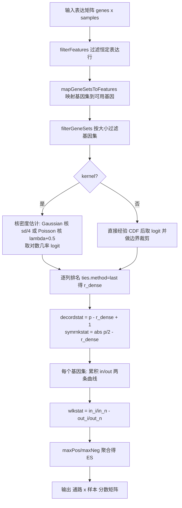
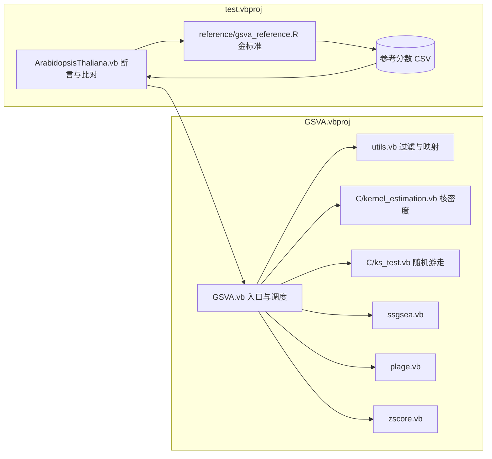

## 产品概述

对 GCModeller 中 VB.NET 实现的 GSVA（Gene Set Variation Analysis）算法库进行正确性修复与功能补全，并把拟南芥（Arabidopsis thaliana）测试改造为以 R 语言 GSVA 2.2.1 为金标准的自动化准确度验证程序。

## 核心功能

### 一、GSVA 主算法修复（GSVA.vbproj）

- **对称秩统计量修正**：修正随机游走步长统计量缺少取绝对值的问题，使富集分数严格落在 [-1, 1]，消除当前输出中 306.46、259.79 一类的越界值
- **核密度估计补全**：实现 Poisson 核（用于 RNA-seq 整数计数数据），补充带宽为零/非数值时的兜底值
- **经验 CDF 分支重写**：修正 `kcdf="none"` 路径把样本下标误当作取值传入 CDF 的语义错误，并正确处理边界值导致的无穷大
- **随机游走健壮性**：补充基因集权重和为零、基因集等于全基因集等退化情形的保护
- **并列秩处理**：按官方 `ties.method="last"` 语义实现稳定排名，保证小样本数据下与 R 结果一致

### 二、补齐三种方法

- **ssGSEA**（Barbie 2009）：基于表达秩与 Alpha 指数的随机游走，支持归一化开关
- **PLAGE**（Tomfohr 2005）：行标准化后对基因集子矩阵做奇异值分解，取第一右奇异向量
- **combined z-score**（Lee 2008）：行标准化后按基因集聚合标准化分数

### 三、拟南芥准确度测试改造

- 以 R 4.5.0 + GSVA 2.2.1（路径 `C:\Program Files\R\R-4.5.0\bin\Rscript.exe`）计算参考分数作为金标准
- 四种方法（gsva / ssgsea / plage / zscore）逐元素数值比对，输出最大绝对误差、平均绝对误差与相关系数
- 不变量检查：分数有界性、无空值、矩阵形状与标签一致
- 植入信号的模拟数据正答验证：被激活通路必须被正确检出
- 打印 PASS/FAIL 清单，去掉交互式阻塞，失败以非 0 退出码结束

## 技术栈

- 语言与框架：**VB.NET**，GSVA 库目标框架 **net10.0**；测试项目需从 net6.0 升级到 **net10.0**（当前仅安装 .NET SDK 10.0.401 与 Microsoft.NETCore.App.Ref 10.0.12，无 net6.0 目标包，且 net6.0 测试项目无法引用 net10.0 库）
- 依赖库：sciBASIC# 运行时（`Microsoft.VisualBasic.Math.LinearAlgebra.Matrix`、`Microsoft.VisualBasic.Math.Distributions`）、`SMRUCC.genomics.Analysis.HTS.DataFrame`（表达矩阵）、`FisherCore`（`Background`/`Cluster` 基因集模型）、HDSPack（`ath.db` 通路数据读取）
- 参考基准：**R 4.5.0 + Bioconductor GSVA 2.2.1**

## 实现方案

### 总体策略

以官方 GSVA C/R 源码为唯一权威依据（已从 `rcastelo/GSVA` devel 分支取回 `src/kernel_estimation.c`、`src/ks_test.c`、`R/gsva.R`、`R/plage.R`、`R/zscore.R`、`R/ssgsea.R`），对现有 VB 移植逐点校正。核心判据是：VB 输出必须与 R 输出在双精度舍入误差内一致。

### 关键技术决策

**决策一：重写 `ks_sample` 为官方 `gsva_rnd_walk` 形式**
现有 `ks_sample` 基于旧版 GSVA 的增量随机游走，与官方现版本在数值上等价但缺少退化情形保护。改为官方的「降序序数 + 对称秩统计量 + 两条累积和数组相减」形式，直接对应参考实现，便于逐行核对，且天然包含 `cumsum_in[n-1] > 0 && cumsum_out[n-1] > 0` 的判空保护。

**决策二：自行实现排名而非复用 `Vector.Ranking`**
官方要求 `ties.method="last"`（并列时下标靠后者秩更大），而 sciBASIC 的 `OrdinalRanking` 依赖 `Sort` 扩展，稳定性未经验证。改为按「值升序、下标升序」稳定排序后赋秩 1..p，语义明确且与 R 严格一致。ssGSEA 所需 `ties.method="average"` 使用 `FractionalRanking`（已确认其实现为并列组内取均值，与 R 一致）。

**决策三：Poisson 分布函数复用现有正则化 Gamma 函数**
`ppois(q, λ, lower_tail=TRUE)` 可由 `RegularizedGammaQ(floor(q)+1, λ)` 表示，该函数已存在于 `Math\Math\Distributions\ChiSquare.vb`，无需引入新的特殊函数实现。

**决策四：测试通过「中间文件 + R 脚本」桥接两端**
R 端无法读取 GCModeller 自有的 HDSPack 二进制 `ath.db`。因此 VB 侧先把「映射并过滤后的基因集」导出为 `pathway\tgene` 长表 TSV，R 脚本读取该 TSV 与 `ath_norm.csv` 计算参考分数并输出 CSV，VB 侧再读回比对。这保证两端基因全集、基因集成员、行列顺序完全一致。

**决策五：测试项目目标框架升级**
必须把 `test.vbproj` 从 net6.0 改为 net10.0，并关闭 `UseApplicationFramework`、显式指定 `StartupObject`，否则无法构建且入口点不确定。

### 复杂度与性能

- 核密度估计：O(基因数 × 样本数²)，34262 × 36 ≈ 1.2×10⁶ 次查表，可忽略
- 逐列排名：O(基因数 × log 基因数 × 样本数)，34262 × 6，可忽略
- 随机游走：O(通路数 × 样本数 × 基因数)，131 × 6 × 34262 ≈ 2.7×10⁷ 步；按官方形式改为两条累积和后仍为同阶，但每步仅一次减法
- **主要瓶颈是排名阶段的装箱开销**：现有 `Ranking` 会为每个元素构造 `SeqIterator` 并建字典。改为对 `Double()` 数组直接按下标排序，可显著减少内存分配
- **内存**：34262 × 6 双精度矩阵约 1.6 MB，无压力；但应避免在循环内重复 `ArrayPack` 与矩阵转置

### 向后兼容与影响面控制

- 保持 `gsva()` 公共签名与 `Methods`/`KCDFs` 枚举取值不变，新增参数（如 ssGSEA 的 `alpha`、`normalize`）一律设为可选并给出与官方一致的默认值
- 不改动 `utils.vb` 的过滤逻辑语义（已与官方 `.filterGenes` 顺序一致：先过滤恒定行，再映射，再过滤基因集）
- 不改动 `Matrix`、`Cluster`、`Background` 等上游类型
- 删除 `compute_geneset_es` 中把正负无穷替换为极值、把空值替换为 0 的掩盖式兜底；正确实现下分数天然有界

## 架构设计

### 数据流（GSVA 主算法）



### 模块职责



## 目录结构

```
GSVA/
├── GSVA.vb                     # [MODIFY] 入口 gsva()。补全 ssgsea/plage/zscore 三个方法分支的分发（去掉 NotImplementedException），
│                               #          新增 ssGSEA 专用可选参数（alpha 默认 0.25、normalize 默认 True）；
│                               #          重写 compute_geneset_es：用「降序序数 + 对称秩统计量（取绝对值）」替代现有缺 abs 的秩得分，
│                               #          删除末尾把 ±Inf/NaN 替换为极值的掩盖式兜底；
│                               #          重写 compute_gene_density 的 kernel=False 分支为真正的经验 CDF（按行排序后计数，
│                               #          并对 0/1 边界做裁剪避免 logit 溢出）
├── C/
│   ├── kernel_estimation.vb    # [MODIFY] 实现 ppois（基于 RegularizedGammaQ，对应 R 的 ppois(q, lambda, lower_tail=TRUE)）；
│   │                           #          为 row_d 的带宽 bw 增加 ISNA(bw) 或 bw=0 时取 0.001 的兜底；
│   │                           #          修正 sd1 在样本数小于 2 时的除零
│   └── ks_test.vb              # [MODIFY] 按官方 gsva_rnd_walk 重写：输入改为 decordstat + symrnkstat，
│                               #          用两条累积和数组相减求 wlkstat；增加 cumsum_in<=0 或 cumsum_out<=0 时返回 NA 的保护；
│                               #          增加 n_genes = n_geneset 时除零保护
├── utils.vb                    # [MODIFY] 新增稳定排名工具函数 colRanksLast（ties.method="last"）与 colRanksAverage（ties.method="average"），
│                               #          供主算法与 ssGSEA 共用；保持 filterFeatures/filterGeneSets/mapGeneSetsToFeatures 语义不变
├── ssgsea.vb                   # [MODIFY] 实现 ssGSEA：逐列平均秩 -> R^alpha -> 逐样本降序定位基因集位置 ->
│                               #          闭式随机游走 -> 可选全矩阵归一化
├── plage.vb                    # [MODIFY] 实现 PLAGE：行 z-score -> 每个基因集子矩阵 SVD -> 取第一右奇异向量
├── zscore.vb                   # [MODIFY] 实现 combined z-score：行 z-score -> 按基因集求和后除以 sqrt(基因集大小)
└── test/
    ├── test.vbproj             # [MODIFY] TargetFramework 由 net6.0 改为 net10.0；关闭 UseApplicationFramework；
    │                           #          显式设置 StartupObject 指向 ArabidopsisThalianaTest
    ├── ArabidopsisThaliana.vb  # [MODIFY] 改造为自动断言测试：加载 ath_norm.csv 与 ath.db 通路背景；
    │                           #          导出映射后基因集到 gsva_genesets.tsv；运行四种方法；
    │                           #          执行不变量检查（有界性/无空值/形状标签）；与 R 参考分数逐元素比对；
    │                           #          跑植入信号的模拟数据正答验证；打印 PASS/FAIL 并以退出码结束
    └── reference/
        └── gsva_reference.R    # [NEW] R 脚本：读取 ath_norm.csv + gsva_genesets.tsv，
                                #       用 GSVA 2.2.1 分别以 gsvaParam/ssgseaParam/plageParam/zscoreParam 计算四种参考分数，
                                #       写出 gsva_reference.csv / ssgsea_reference.csv / plage_reference.csv / zscore_reference.csv
```

## 关键代码结构

为便于实现时对齐，以下给出核心中间量的约定（对应官方 `ranks2stats` 与 `gsva_rnd_walk`）：

```
' 逐列（每样本）排名，ties.method = "last"：
'   按下标序列以 (值升序, 下标升序) 稳定排序，赋秩 1..p
'   decordstat(i) = p - rank_dense(i) + 1      ' 1 = 表达最高
'   symrnkstat(i) = std.Abs(p / 2.0 - rank_dense(i))

' 随机游走（每个基因集、每个样本）：
'   stepIn (pos)  = If(基因在集内, symrnkstat(基因) ^ tau, 0)
'   stepOut(pos)  = If(基因在集内, 0, 1)
'   其中 pos = decordstat(基因) - 1，遍历顺序为表达由高到低
'   两条数组各自 cumsum 后按末元素归一，相减得 wlkstat
'   maxPos = max(0, max(wlkstat))，maxNeg = min(0, min(wlkstat))
'   ES = If(mxdiff, If(abs_ranking, maxPos - maxNeg, maxPos + maxNeg),
'           If(maxPos > Abs(maxNeg), maxPos, maxNeg))
'   当 sum(stepIn) <= 0 或 sum(stepOut) <= 0 时该样本该基因集记为 NA
```

## 执行注意事项

- **实现顺序**：先修主算法与核估计（任务 1-3），再补三种方法（任务 4-5），最后做测试与比对（任务 6-8）。主算法未修对之前，比对无意义
- **并列秩是本数据集的高风险点**：`ath_norm.csv` 仅 6 个样本，若走 `kcdf="none"`，行归一化取值退化为 logit(k/6) 共 6 种，产生海量并列，此时 tie-breaking 规则直接决定结果是否与 R 一致。默认 Gaussian 核路径取值连续、并列极少，应先用 Gaussian 核打通比对，再单独校验 `kcdf="none"` 路径
- **两端基因集必须同源**：务必先导出 VB 侧映射过滤后的基因集再供 R 使用，否则会因基因全集不同导致整体偏差
- **PLAGE 比对需对齐符号**：奇异值分解的右奇异向量符号不确定，比对前按「令绝对值最大的分量为正」统一符号后再比较
- **不要修改 `utils.filterFeatures` 的过滤顺序**：其与官方 `.filterGenes`（先过滤恒定行，再映射，再过滤基因集）一致，改动会引入偏差
- **重建前先确认编译**：`test.vbproj` 改框架后需完整重建；`GSVA.vbproj` 本身在 bin 下有 2026-09-29 的成功产物，说明现有代码可编译，改动集中在数值逻辑
- **日志与输出**：沿用项目现有的 `.Warning` / `.debug` 提示风格；测试输出用中文 PASS/FAIL 清单，避免打印超长矩阵

## 可使用的扩展

### SubAgent

- **code-explorer**
- 用途：在修改 `C/kernel_estimation.vb`、`C/ks_test.vb` 前后，核对 sciBASIC 运行时中 `RegularizedGammaQ`、`NumericMatrix.SVD`、`SingularValueDecomposition.V`、`Vector`/`NumericMatrix` 运算符的确切签名与返回值方向，避免误用 API
- 预期结果：拿到经源码确认的函数签名与矩阵维度约定（如 `V` 是 n×n 且 `A = U*S*V'`），据此写出一次编译通过的代码