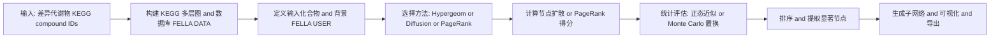

FELLA 不是那种“统计检验一条通路一条通路算 p 值”的经典通路富集，而是在一个**KEGG 多层网络（代谢物–反应–酶–模块–通路）上做扩散 / PageRank**，把输入代谢物当作“热源 / 优先节点”，计算其他节点（通路、模块、酶、反应）的扩散得分，再通过置换或正态近似做显著性检验，最后返回一个“扰动子网络”和排序列表，而不是只给通路列表。
---
## 1. FELLA 是什么，解决什么问题？
- 背景：传统代谢通路富集（超几何检验 / ORA）只看“一条通路里有几个差异代谢物”，问题包括：
  - 通路之间有重叠和交叉，单独看每条通路很割裂；
  - 忽略了拓扑（谁连着谁），对微弱但协调的扰动不敏感；
  - 只输出“通路列表”，缺少中间层次（酶、反应、模块）的机制解释。
- FELLA 的核心改变：
  - 把 KEGG 建成一个**多层图**：化合物（compound）、反应（reaction）、酶（enzyme）、模块（module）、通路（pathway），通过关系连接；
  - 把你给的差异代谢物当作“被扰动节点”，在图上做**扩散 / PageRank**，让“扰动”顺着网络传播；
  - 对所有节点计算扩散得分，做统计检验，输出：
    - 排序的通路、模块、酶、反应；
    - 一个把输入代谢物和顶端通路连起来的**子网络**，可以画出来。
一句话：**FELLA = “网络扩散 + 多层 KEGG + 统一统计框架” 的代谢组富集方法**。
---
## 2. 算法整体流程（先看图）
下面是 FELLA 的分析流程示意，从输入代谢物到输出结果和可视化：

---
## 3. 数据结构：KEGG 多层图与 FELLA.DATA
FELLA 把 KEGG 建成一个**异构图**，节点类型有 5 类：
- compound（代谢物）
- reaction（反应）
- enzyme（酶）
- module（模块）
- pathway（通路）
边包括：
- 代谢物 参与反应（底物 / 产物）
- 酶 催化反应
- 反应 属于某个模块
- 反应 属于某个通路
- 模块 属于某个通路 等
在 R 里，这个图 + 预计算的统计量被存成一个 `FELLA.DATA` 对象，只需构建一次（`buildGraphFromKEGGREST` + `buildDataFromGraph`），之后反复使用。
---
## 4. 核心算法：扩散 / PageRank + 统计检验
FELLA 提供三种方法：
1. **Hypergeometric test**：经典超几何富集，仅用网络连接信息做背景，但**不做扩散**，主要作对比基线。
2. **Diffusion**：在图上做**热扩散 / 标签传播**，得到每个节点的扩散分数。
3. **PageRank**：类似 Diffusion，但采用**有向扩散**，对应 PageRank 的随机游走模型。
下面重点讲 Diffusion / PageRank 的数学形式和统计检验。
### 4.1 扩散 / PageRank 的数学形式
设 KEGG 图有 \(n\) 个节点，邻接矩阵为 \(A\)（或带权重），度矩阵 \(D\) 为对角阵，\(D_{ii} = \sum_j A_{ij}\)。
常用拉普拉斯矩阵：
- 组合拉普拉斯：\(L = D - A\)
- 归一化拉普拉斯：\(L_{\text{norm}} = I - D^{-1/2} A D^{-1/2}\)
FELLA 的扩散核一般基于**图拉普拉斯的指数核**（热核）或**正则化拉普拉斯核**，与 diffuStats 包中的扩散框架一致：
- 热核（Heat kernel）：  
  \[
  K = e^{-t L}
  \]
  其中 \(t\) 是扩散时间尺度，控制信息传播远近。
- 正则化拉普拉斯核（Regularized Laplacian kernel）：  
  \[
  K = (I + t L)^{-1}
  \]
这些核给出节点间的“亲近度 / 扩散相似度”，FELLA 用它们来定义扩散得分。
#### 输入向量
给输入的差异代谢物定义一个初始向量 \(\mathbf{y} \in \mathbb{R}^n\)：
- 若节点 i 是输入代谢物：\(y_i = 1\)（或按某种权重）；
- 否则：\(y_i = 0\)。
#### 扩散得分（Diffusion）
典型形式为：
\[
\mathbf{f} = K \mathbf{y}
\]
即把初始扰动 \(\mathbf{y}\) 通过扩散核 \(K\) 传播，得到每个节点的扩散得分 \(f_i\)。在 FELLA 的实现中，会再对得分做归一化 / 标准化，用于后续统计检验。
#### PageRank 得分
PageRank 可以看作一种**带重启的随机游走**（Personalized PageRank），形式为：
\[
\mathbf{r} = (1 - d) \, (I - d P)^{-1} \mathbf{v}
\]
其中：
- \(P\) 是按出度归一化的转移矩阵；
- \(d\) 是阻尼因子（通常约 0.85）；
- \(\mathbf{v}\) 是偏好向量，在 FELLA 中由输入代谢物构造（例如 \(\mathbf{v} = \mathbf{y} / \|\mathbf{y}\|_1\)）。
PageRank 给每个节点一个“重要性/被访问概率”，作为其扩散得分。
### 4.2 统计显著性：正态近似 vs Monte Carlo
只看原始得分 \(f_i\) 或 \(r_i\) 还不够，要问：**在“随机输入”下，这个分数是不是异常高？**  
FELLA 对每个节点做假设检验：
- 零假设 \(H_0\)：输入代谢物是从背景中随机抽的，而不是真正有生物学关联。
#### 4.2.1 正态近似（approx = "normality"）
在零假设下，把输入代谢物看成**随机标签**，重复多次扩散/PageRank，可以得到每个节点分数的**期望和协方差**，在零假设下近似服从多元正态分布，从而计算 z 分数和 p 值：
- 对每个节点 i，计算其扩散分数 \(F_i\) 在零分布下的均值 \(\mu_i\) 和方差 \(\sigma_i^2\)；
- z 分数：\(z_i = (F_i - \mu_i) / \sigma_i\)；
- 近似 p 值：由标准正态分布计算。
优点：**确定性、速度快**，适合常规分析。
#### 4.2.2 Monte Carlo 近似（approx = "simulation"）
- 通过多次随机置换输入标签（从背景中随机抽同样大小的代谢物集合），每次做扩散/PageRank，得到零分布；
- 节点 i 的 p 值 = 随机分数 ≥ 观测分数的比例（加上伪计数避免 0）。
优点：**更灵活**，对分布假设要求低；缺点：计算量大，由 `ntrials` 控制。
最后，对所有 p 值做多重检验校正（如 BH），筛选显著节点。
---
## 5. 输出：通路、模块、酶、反应 + 子网络
FELLA 的输出不仅是“通路列表”，而是多层实体：
- 通路（pathway）
- 模块（module）
- 酶（enzyme）
- 反应（reaction）
- 以及输入代谢物本身
关键输出包括：
1. **p-score / p-value 表**：每个 KEGG 实体的得分与校正后 p 值，可导出为 CSV。
2. **子网络**：由显著节点及其关联边构成，可以：
   - 用 `plot()` 画出不同方法（hypergeom / diffusion / pagerank）对应的子网络；
   - 导出为 igraph / CSV / GraphML 等格式。
例如，扩散结果的表会有类似字段：
| KEGG.id | Entry.type | KEGG.name | p.score |
|---------|------------|-----------|---------|
| hsa00640| pathway    | Propanoate metabolism | 0.0037 |
| M00013  | module     | Malonate semialdehyde pathway | 0.0045 |
| 1.1.1.211| enzyme    | long-chain-3-hydroxyacyl-CoA dehydrogenase | 0.037 |
---
## 6. 与经典通路分析的对比
| 维度 | 传统 ORA / 超几何 | GSEA / Globaltest | FELLA |
|------|------------------|-------------------|-------|
| 输入 | 差异基因/代谢物列表 | 全部基因 + 表型 | 差异代谢物列表 |
| 拓扑 | 不考虑 | 可考虑（如 Globaltest） | 明确用 KEGG 多层图 + 扩散 |
| 层次 | 只看通路 | 通常只看通路 | 同时给出通路、模块、酶、反应 |
| 统计 | 超几何 / Fisher | 基于回归 / 秩检验 | 扩散/PageRank + 置换 / 正态近似 |
| 可解释性 | 通路列表 | 通路列表 + 富集图 | 多层子网络，可看到连接酶/反应 |
---
## 7. 实际使用：R 代码骨架（概念上）
```r
library(FELLA)
# 1. 构建或加载 KEGG 数据库（只做一次）
data(FELLA.sample)  # 示例小数据库
# 2. 输入代谢物
data(input.sample)
input.full <- c(input.sample, paste0("intruder", 1:10))
# 3. 定义输入和背景
myAnalysis <- defineCompounds(compounds = input.full, data = FELLA.sample)
# 4. 运行扩散分析（正态近似）
myAnalysis_diff <- runDiffusion(object = myAnalysis,
                                approx = "normality",
                                data = FELLA.sample)
# 5. 或运行 PageRank
myAnalysis_pr <- runPagerank(object = myAnalysis,
                             approx = "normality",
                             data = FELLA.sample)
# 6. 一次性运行所有方法
myAnalysis_all <- enrich(compounds = input.full,
                         method = listMethods(),
                         approx = "normality",
                         data = FELLA.sample)
# 7. 可视化
plot(myAnalysis_all, method = "diffusion", threshold = 0.1, data = FELLA.sample)
plot(myAnalysis_all, method = "pagerank",  threshold = 0.1, data = FELLA.sample)
# 8. 导出结果
tab <- generateResultsTable(myAnalysis_all, method = "diffusion",
                            threshold = 0.1, data = FELLA.sample)
exportResults(format = "csv", file = "fella_diff.csv", method = "diffusion",
              object = myAnalysis_all, data = FELLA.sample)
```
---
## 8. 理解 FELLA 的几个要点
1. **网络结构很重要**：FELLA 强调“扰动在图中传播”，所以 KEGG 图的质量直接影响结果；如果某物种 KEGG 注释不完整，效果会打折。
2. **扩散尺度 t / 阻尼 d**：这些参数控制信息传播远近，FELLA 一般有默认值，但理解它们有助于解释结果：
   - t 大 / d 大 → 扩散更远，更“全局”；
   - t 小 / d 小 → 更局部。
3. **背景的选择**：默认背景是图中所有化合物；你也可以自定义背景代谢物集合，这会影响零分布和 p 值。
4. **结果解读**：不要只看通路 p 值，要结合子网络和中间层次（酶、模块）一起看，往往能发现更具体的靶点或机制。

