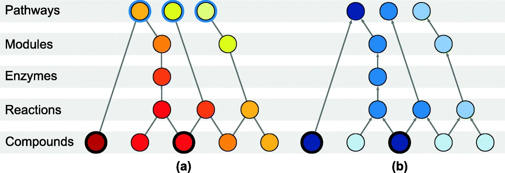

Node arrangement for the knowledge model used by FELLA. Entities are organised in a hierarchical manner, from bottom to top: KEGG compounds or metabolites, reactions, enzymes, KEGG modules and pathways. Binary labels at the level of metabolites are propagated to the rest of the network and a relevant, small sub-network is automatically reported. Nodes are ranked using the network propagation algorithms a heat diffusion and b PageRank. The affected metabolites are highlighted with a black ring. For heat diffusion (a), affected metabolites are forced to generate unitary flow. Every pathway is highlighted with a blue ring, representing its connection to a cool boundary node. In equilibrium, the highest temperature pathways (and nodes) will have the greatest heat flow, suggesting a relevant role in the experiment. For PageRank (b), affected metabolites are the start of random walks. PageRank scores, represented by the intensity of the blue colour, will attain higher values in the frequently reached random walk nodes.

> Picart-Armada, S., Fern¨¢ndez-Albert, F., Vinaixa, M. et al. FELLA: an R package to enrich metabolomics data. BMC Bioinformatics 19, 538 (2018). https://doi.org/10.1186/s12859-018-2487-5