## 产品概述

在现有 `P-NET/P-NET.vbproj`（RootNamespace `SMRUCC.genomics.Analysis.HTS.P_NET`）中，按 Nature 2021 论文《Biologically informed deep neural network for prostate cancer discovery》实现 P-NET 这一"生物学先验驱动的稀疏可见神经网络"，并在 `test/test.vbproj` 中生成 demo 数据集、编写可运行的训练/预测/解释演示程序。

## 核心功能

1. **通路层级本体建模**：以"基因 → 精细通路 → 逐级抽象通路"的多层父子关系描述生物知识，支持从类 Reactome 的 `.gmt` 文件逐层读入/导出，也支持代码合成。
2. **掩码稀疏网络构建**：由层级关系自动生成逐层二值掩码 `M`，前向为 `y = tanh[(M*W)ᵀx + b]`；输入层每基因恰好 3 个节点（mutation / amplification / deletion）连到该基因节点，形成 3→1 块状稀疏；被掩码权重梯度恒为 0（de novo 稀疏）。
3. **深度监督**：每个隐藏层（基因层 + 5 层通路层）后挂一个 sigmoid 预测头，最终预测为各头输出均值；深层预测头损失权重更高。
4. **训练**：加权二元交叉熵（按训练集类别比例加权）+ Adam（lr=0.001，每 50 epoch 衰减）+ 分层 80/10/10 划分 + mini-batch。
5. **预测与评估**：输出 0–1 患病概率，计算 AUC、AUPRC、accuracy、precision、recall、F1。
6. **可解释性**：DeepLIFT（Rescale 规则）逐层归因并满足守恒性；跨样本绝对值聚合得到节点重要性；按节点度（fan_in+fan_out）对 μ+5σ 之外的枢纽节点做归一化偏倚校正；同时输出有符号节点激活在两组的分布差异。
7. **Demo 数据集与测试程序**：合成类 Reactome 通路层级与合成患者样本（已知"驱动基因/驱动通路"真值，使标签可通过层级被学到），落盘为 `.gmt` 与 CSV；test 程序串起"构建 → 训练 → 测试评估 → 单样本预测 → 归因解读"完整链路。

## 边界

不实现 DeLong / bootstrap / log-rank 等统计检验，不下载真实 Reactome 数据，不做可视化界面。

## 技术栈

- 语言/框架：VB.NET，`net10.0`，SDK 风格项目（`**/*.vb` 自动纳入编译，无需改 vbproj）
- 复用基础库（已在 vbproj 中引用）：
- `Microsoft.VisualBasic.MachineLearning.TensorFlow.Tensor`（`Tensor.vb`）—— 唯一张量类型，作为权重/偏置/激活/梯度/掩码/数据集的存储与对外接口
- `nn`（sigmoid/tanh 等纯前向）、`NumPy`、`Core`、`Math`
- 不引入新依赖：不使用 `AutomaticDifferentiation`（Rev 体系与本 Tensor 不兼容），不引用 GNN 工程（P-NET.sln 未包含且掩码稀疏算子需自实现），Adam 优化器与训练循环在 P-NET 内自实现

## 实现方案

**总体策略**：把生物学层级"编译"成网络拓扑，再用逐层二值掩码约束的可训练权重做前向/反向。全部数值存放在 `Tensor` 上，但**热路径不使用 `Tensor.MatMul`**（O(n³) 且走属性索引器），而是从掩码预编译出按父节点分组的边表，实现 O(N·nnz) 的稀疏 scatter/gather 内核，直接遍历 `Tensor.Data` 原始 `Double()` 数组。这既满足论文 Extended Data Fig.1c 所说的 "patterned sparse matrix" 优化，也让 demo 规模（数百样本 × 数百 epoch）秒级完成。

**关键决策与权衡**

1. **稀疏内核 vs 稠密 MatMul**：基因层掩码极稀疏（每基因仅 3 条边），稀疏内核比稠密 MatMul 快约 1~2 个数量级；代价是需要维护边表，但边表只在构建时生成一次，运行期零开销，收益远大于成本。
2. **自实现反向传播**：`Tensor.Gradient` / `IsVariable` 在基础库中只是占位，整个 MachineLearning 树内无任何引擎写入；而 `AutomaticDifferentiation` 的 `Rev` 体系没有 sigmoid/BCE 且不与 `TensorFlow.Tensor` 互操作。手推梯度（掩码层 + 预测头均为解析梯度，公式简单）比适配二者更可靠。
3. **DeepLIFT 采用"按比例分摊"等价形式**：严格式为 `C_j^(l-1) = Δa_j · Σ_i [ C_i^(l) · W_eff[j,i] / Δz_i ]`，等价于"以 `W_eff[j,i]·Δa_j` 占 `Δz_i` 的比例分摊 `C_i`"，天然满足 `Σ_j C_j^(l-1) = Σ_i C_i^(l)`，且避免 `Δa_i` 接近 0 时的除零爆炸。顶层因 `p = (1/L)Σ_l σ(z_l)` 使 `Δp = (1/L)Σ_l Δp_l` 精确成立，守恒性可闭环验证。
4. **深度监督损失**：损失取 `Σ_l w_l·BCE(y, p_l) / Σ_l w_l`（而非只对均值输出求损失），与论文"逐层预测头 + 深层高权重"一致；`w_l` 默认随深度线性递增，可外部覆盖。

**性能与可靠性**

- 复杂度：单次前向/反向为 `O(N · nnz)`，`nnz` = 掩码非零元素总数（论文量级约 7 万）；空间 `O(Σ_l fanIn_l·fanOut_l + N·maxFanOut)`。
- 数值：sigmoid/tanh 用带阈值裁剪的稳定实现；BCE 对 `p` 做 `[eps, 1-eps]` 裁剪；DeepLIFT 中 `|Δz| < 1e-12` 时该节点本轮贡献置 0。
- 可复现：所有随机（初始化、数据合成、打乱、dropout）均可通过 `seed` 固定。

## 实现要点（防止回归）

- **坑位**：`Tensor.Dispose()` 会 `Erase _Data` 且类有 `Finalize → Dispose`，全程**不得**手动调用 `Dispose`。
- **坑位**：`Tensor` 的 `+` 运算符在 `[1,n] + [m,1]` 时会触发"广播加法"特例，偏置相加必须自己写循环，不能用 `+`。
- **坑位**：`Imports Microsoft.VisualBasic.MachineLearning.TensorFlow` 后 `Math` 会遮蔽 `System.Math`，文件内统一 `Imports std = System.Math`。
- **坑位**：`Tensor.Random/RandomNormal/XavierInit` 内部经 `CSng` 截断为单精度；权重初始化建议用自实现的 `RandomNormal`（直接写 `Double()`）以获得 Double 精度，mask 与输入沿用 `Tensor`。
- 兼容性：保留 `NNBuilder.vb` 文件名与 `NNBuilder` 类名（改写为层级 → 模型的工厂），不破坏既有引用；`GenerateDocumentationFile=True`，所有 `Public` 成员需写 XML 注释，否则编译警告刷屏。
- 命名空间沿用 vbproj 的 `RootNamespace`，文件内不写 `Namespace` 声明（与现有 `NNBuilder.vb` 一致）。
- 构建：`dotnet build P-NET.sln -c Debug`；demo 数据输出目录写到 `test/bin/...` 运行目录下的 `demo/`，避免污染项目目录（obj/bin 已有大量历史产物）。

## 架构设计

```mermaid
flowchart TD
    GMT[".gmt 层级文件 / 合成层级"] --> H["PathwayHierarchy<br/>基因层 + 5 层通路，节点名与父子关系"]
    H --> SC["SparseConnectivity<br/>逐层边表 childIdx / parentStart / parentStop"]
    H --> NB["NNBuilder<br/>层级 -> 网络配置"]
    SC --> ML["MaskedDenseLayer<br/>y = tanh[(M*W)ᵀx + b]，稀疏内核"]
    NB --> ML
    ML --> M["PNETModel<br/>6 个掩码层 + 6 个 PredictionHead<br/>前向 / 反向 / 预测"]
    M --> TR["PNETTrainer<br/>加权 BCE + Adam + lr 衰减 + 分层划分"]
    D["PNETSampleSet<br/>X[N, 3G] 二值特征 + 标签"] --> TR
    TR --> EV["Metrics<br/>AUC / AUPRC / accuracy / F1"]
    M --> DL["DeepLIFT<br/>Rescale 归因 + 度归一化 + 激活谱"]
    M --> PR["Predict 概率输出"]
```



- 数据分层：本体层（层级/掩码）→ 网络层（掩码层/预测头/模型）→ 训练层（优化器/训练器）→ 评估与解释层（指标/DeepLIFT）→ 数据层（样本集/demo 生成器）。
- 控制反转：`PNETModel` 只暴露 `GetParameters()` / `GetGradients()` 两个 `List(Of Tensor)`，优化器与模型解耦，便于后续替换 SGD / 加权 Adam。

## 目录结构

```
P-NET/
├── NNBuilder.vb                      # [MODIFY] 层级 → PNETModel 的构建工厂。保留文件名与类名，现有空类改写为：读取 PathwayHierarchy 生成逐层 SparseConnectivity 与 MaskedDenseLayer、按深度分配预测头损失权重、返回 PNETModel；提供 Build(hierarchy, Optional config) 与 PrintArchitecture()（打印各层节点数、连接数、可训练参数量，用于对比稠密网络）。
├── Ontology/
│   ├── PathwayHierarchy.vb           # [NEW] 生物层级本体模型。持有 GeneNames 与 List(Of HierarchyLevel)（levels(0) 为最精细通路，逐级到最粗）；提供 Depth、NodeNames(layer)、FanIn/FanOut、BuildConnectivity(layer)；负责 gmt 解析结果的合法性校验（孤立节点剔除、空通路剔除、重名处理）。
│   ├── HierarchyLevel.vb             # [NEW] 单层定义：Name、Nodes(通路名数组)、Members(i) = 该通路在前一层/基因层中的子节点索引数组。
│   ├── SparseConnectivity.vb         # [NEW] 稀疏连接内核数据结构：由 Members 编译出 childIdx()、parentStart()、parentStop()、EdgeCount；提供 BuildMask() 生成 Tensor 形式的二值掩码（供外部检视/落盘），以及 GetFanIn/FanOut 用于度归一化校正。
│   └── GmtIO.vb                      # [NEW] .gmt 读写。ReadGmt(path) 解析 "通路名<Tab>描述<Tab>基因…"，FromGmtDirectory(files 按精→粗排序) 组装层级；WriteGmt(level, path) 导出，保证可被再次读回。
├── Layers/
│   ├── MaskedDenseLayer.vb           # [NEW] P-NET 核心算子。字段 Mask/Weights/Bias/WeightGrad/BiasGrad 均为 Tensor；Forward(x[N,fanIn]) 走 O(N·nnz) 稀疏内核得 z 再 tanh；Backward(upstream) 计算 dZ、累积 dW（原地乘掩码，保证被屏蔽边梯度恒 0）、db，返回 dX；缓存 lastInput/lastZ 供反向与 DeepLIFT 使用；提供 ZeroGrad、ConnectionCount、TrainableCount、ApplyMask。
│   └── PredictionHead.vb             # [NEW] 深度监督预测头：sigmoid(a·w + b)，w[fanIn]、b 标量；Forward 返回 [N,1] 概率，Backward 返回 dL/da [N,fanIn]；带 LossWeight（深层更高）。
├── PNETModel.vb                      # [NEW] 完整网络。持有 Layers(基因层+5 通路层) 与 Heads；Forward(x) 返回 PNETForwardResult（逐层 z、激活 a、各头概率、融合概率）；Backward(y, classWeights) 完成深度监督加权 BCE 的梯度累积（含来自下一层的上游梯度与来自本层预测头的梯度）；Predict(x) 返回概率数组；GetParameters/GetGradients/ZeroGrad；TrainableParameterCount 与 DenseParameterCount（用于打印压缩比）。
├── Training/
│   ├── AdamOptimizer.vb              # [NEW] Adam：New(params, grads, lr=0.001, beta1=0.9, beta2=0.999, eps=1e-8)；Step() 含偏置校正；LearningRate 可写（供衰减）；ZeroGrad()。签名风格对齐 GNN/AdamOptimizer。
│   ├── PNETTrainer.vb                # [NEW] 训练器：分层 StratifiedSplit(80/10/10)、按训练类别比例计算 posWeight/negWeight、mini-batch 训练、每 50 epoch 按 DecayFactor 衰减 lr、记录 TrainingHistory（每 epoch 的 loss/train AUC/val AUC/lr）、早停可选。
│   └── TrainConfig.vb                # [NEW] 训练超参容器：Epochs、BatchSize、LearningRate、LrDecayStep=50、LrDecayFactor、Beta1/Beta2、DeepSupervisionWeight、Seed、Verbose。
├── Evaluation/
│   └── Metrics.vb                    # [NEW] AUC（Mann-Whitney 秩法，含并列修正）、AUPRC（平均精度）、Accuracy、Precision、Recall、F1、ConfusionMatrix。
├── Interpretation/
│   ├── DeepLIFT.vb                   # [NEW] Rescale 归因：以全零参考态 x0 前向两次，按 C_j^(l-1) = Δa_j · Σ_i [C_i^(l)·W_eff[j,i]/Δz_i] 自顶向下反传（顶层 C_i^(l) = (1/L)·Δp_l·w_i·Δa_i/Δz_head）；输出逐层每节点的样本级有符号贡献，并提供 ConservationCheck 断言 ΣC == Δp。
│   └── NodeImportance.vb             # [NEW] 跨样本聚合 C_i,l = Σ_s |C_i,l^s|；度归一化偏倚校正 d=fan_in+fan_out，仅 d > μ+5σ 时 C/d；TopGenes / TopPathways 排序；ActivationProfile 统计两组（primary/metastatic）有符号激活的均值与组间差异。
├── Data/
│   ├── PNETSampleSet.vb              # [NEW] 数据集容器：SampleNames、GeneNames、Features As Tensor [N,3G]、Labels；提供 FromCsv / WriteCsv、Train/Val/Test 切分视图、ClassRatio。
│   └── DemoData.vb                   # [NEW] Demo 数据合成：CreateHierarchy(seed) 生成 G 个基因 + 5 层通路（父随机聚合若干子，保证连通与非空）；CreateDataset(hierarchy, nSamples, seed) 选取少数"驱动基因/驱动通路"，按 latent score 经 sigmoid 采样标签，其余基因为噪声，使标签只能经通路层级学到；SaveTo(dir) 输出 *.gmt + features.csv + labels.csv。
└── Math/
    └── TensorOps.vb                  # [NEW] Tensor 扩展/工具：Double 精度 RandomNormal、逐行偏置加、sigmoid/tanh 及其导数（稳定版）、行和/列和、BCE 及其梯度、argsort；全部直接操作 Data 原始数组以规避索引器开销。

test/
└── Program.vb                        # [MODIFY] demo 主程序：生成 demo 层级与数据集 → NNBuilder 构建 P-NET → 打印架构与稀疏/稠密参数量对比 → 训练并打印每 epoch loss/AUC → 测试集 AUC/AUPRC/accuracy/F1 → 单样本预测演示 → DeepLIFT 归因输出 Top 基因与 Top 通路并与合成真值比对 → 节点激活组间差异。
```

## 关键代码结构

```
' 稀疏连接内核（由层级编译一次，运行期只读）
Public Class SparseConnectivity
    Public ReadOnly Property FanIn As Integer
    Public ReadOnly Property FanOut As Integer
    Public ReadOnly Property EdgeCount As Integer
    Public ReadOnly Property ChildIdx As Integer()      ' 按父节点分组，长度 = EdgeCount
    Public ReadOnly Property ParentStart As Integer()   ' 长度 = FanOut + 1
    Public Function BuildMask() As Tensor               ' [FanIn, FanOut] 二值掩码
End Class

' P-NET 掩码层对外契约
Public Class MaskedDenseLayer
    Public ReadOnly Property Mask As Tensor             ' [FanIn, FanOut]
    Public ReadOnly Property Weights As Tensor           ' [FanIn, FanOut]
    Public ReadOnly Property Bias As Tensor              ' [1, FanOut]
    Public ReadOnly Property LastZ As Tensor             ' [N, FanOut]，供 DeepLIFT
    Public Function Forward(x As Tensor) As Tensor       ' [N, FanIn] -> [N, FanOut]
    Public Function Backward(upstream As Tensor) As Tensor ' [N, FanOut] -> [N, FanIn]
End Class

' 模型与优化器解耦的参数契约
Public Class PNETModel
    Public ReadOnly Property Layers As List(Of MaskedDenseLayer)
    Public ReadOnly Property Heads As List(Of PredictionHead)
    Public Function Forward(x As Tensor) As PNETForwardResult
    Public Function Predict(x As Tensor) As Double()
    Public Function GetParameters() As List(Of Tensor)
    Public Function GetGradients() As List(Of Tensor)
End Class

' 归因结果（与有符号激活解耦）
Public Class NodeImportance
    Public Property LayerIndex As Integer
    Public Property NodeName As String
    Public Property RawScore As Double        ' Σ_s |C|，恒正
    Public Property AdjustedScore As Double   ' 度归一化后（仅 d > μ+5σ）
    Public Property MeanActivationPrimary As Double
    Public Property MeanActivationMetastatic As Double
End Class
```

## Agent Extensions

### SubAgent

- **code-explorer**
- 用途：在实现掩码层、DeepLIFT 与数据落盘环节，核对 `Tensor` / `nn` / `NumPy` 的精确签名与既有 VB 代码风格（如 GNN 的 `AdamOptimizer`、`LinearLayer` 写法），确认无 API 误用。
- 预期结果：所有对基础库的调用均有源码依据，不出现臆造的方法名或参数顺序；新增代码风格与仓库既有 VB 风格一致。