# WGCNA原理简介

> https://www.jianshu.com/p/dcae5fb86559

## 网络图

在传统的网络图里面，一般分为非权重网络和权重网络，对于非权重网络：

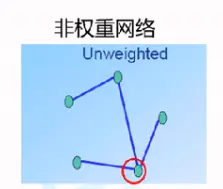

非权重网络的特点是只能表示两个点之间是否有关系，单纯的“一刀切”，即只有“有关系”和“无关系”这两种类型，规定以后阈值，大于该阈值即为有关系，若小于这个阈值即为无关系（用 1 表示有关系；用 0 表示无关系）

对于权重网络：

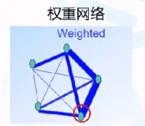

权重网络的特点是不仅能够表示两个点之间是否有关系，还能表示它们关系的强弱

## WGCNA简介

WGCNA的出发点是基于系统的基因表达水平来构建一个网络，目的是显示出基因间的共表达关系，那么相似表达模式的基因可能存在共调控、功能相关或处于同一通路；即如果某些基因的表达趋势随着不同处理之间的变化而有相同的变化趋势（表达模式），那么我们认为这些基因很可能在一个通路上，或者在相互调控的通路上富集。

从而确定在整个网络上的核心基因

## WGCNA原理

### 1.建立关系矩阵

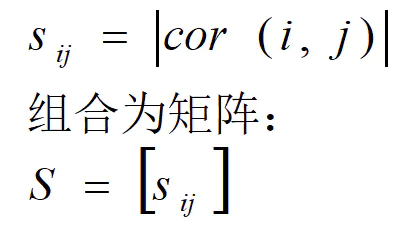

由上图所得：i 和 j 表示任意的两个基因，那么我们定义其相关系数矩阵为S，其中的相关系数为第 i 个基因在各处理中的表达量对应第 j 个基因在各处理中的表达量的相关系数

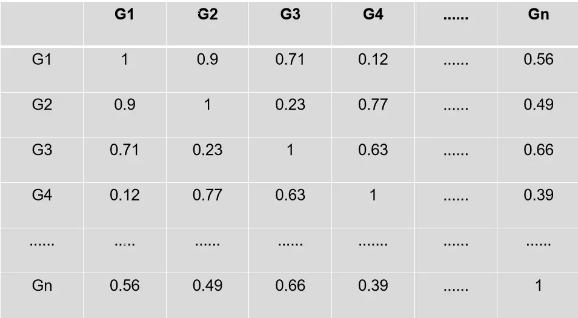
> S矩阵

计算出S矩阵后，我们可以发现，这个矩阵随关于对角线对称的矩阵，并且对角线的相关系数均为1

### 2.建立关系矩阵

对于无权重网络：

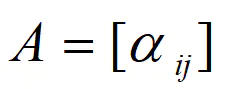

我们根据上面的S矩阵，设立个阈值，比方说设立0.6，那么S矩阵里面的元素大于0.6时，我们认为是有关系的，小于0.6时我们认为是无关系的。其中对于有无关系：我们利用 1 表示有关系；0 表示无关系

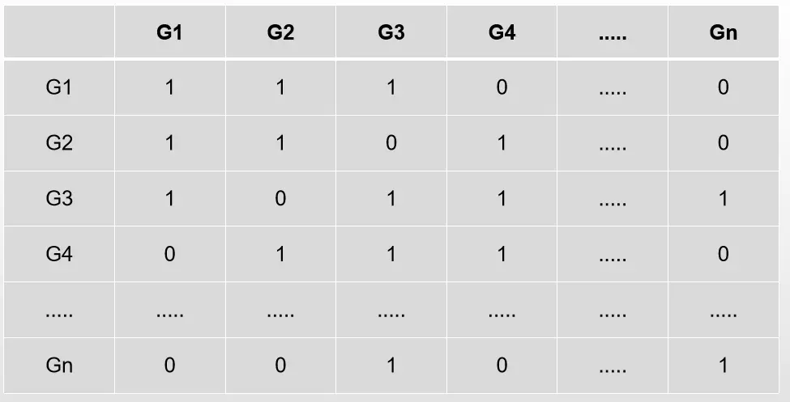
> 邻接矩阵(A矩阵)

那么正如我们之前所介绍的，非权重网络只能表示基因间是否有关系，而无法表示基因间这种关系的强弱

对于权重网络：


其中：

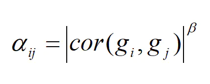

gi，gj 代表不同的基因，β代表权重，之所以要引入β作为指数是为了将区分度不高的几个基因的相关系数给区分开
我们定义 αij 为第 i 个基因和第 j 个基因的相关系数，并取β为指数，经过这样的计算以后，我们定义连通度ki：

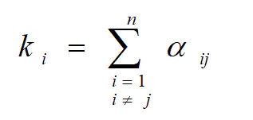
> 连接度ki

其中 n 表示有n 个基因，即连接度ki表示第 i 个基因和其他基因的α值加和

对于权重网络图，它满足无尺度分布，那么什么是无尺度分布呢？
即连通度高的点所占的比例很少，而连通度低的点所占的比例很高

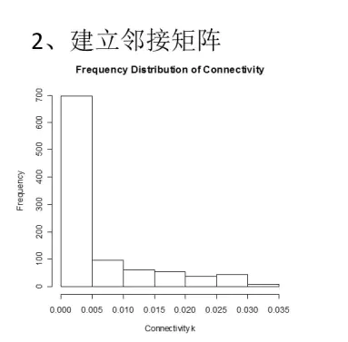

该图表示各连接度ki的一个频率分布直方图，那么当我们的基因很多的时候，我们的直方图区间就可以无限细分，从而更趋近于概率密度函数
基于无尺度分布的假设，我们认为p(ki)与ki呈负相关关系，为了方便计算，我们定义：

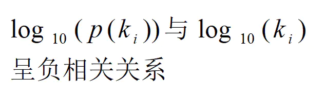

由此，我们利用一元线性回归取匹配最佳β值，即用不同的β值去试验，寻找最佳的β值

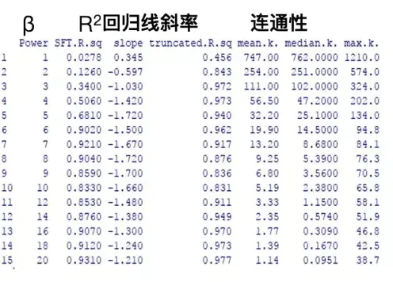

在线性回归中，我们要求 R^2 大于0.8，slope位于 -1 左右，而平均连接度要尽可能大，所以该例子中 β=6 是最佳值，如下图所示：

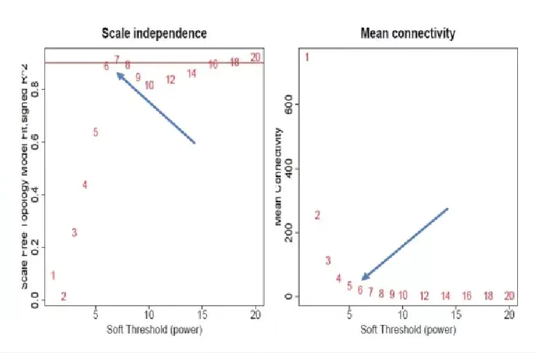

求出最佳β值以后，带入即可求得αij，那么由αij构成了邻接矩阵（软阈值筛选）：


那么该矩阵里面的数值介于[0,1]之间，数值的大小可以表示关系的强弱
依据上面S矩阵，代入β=6计算αij可得：

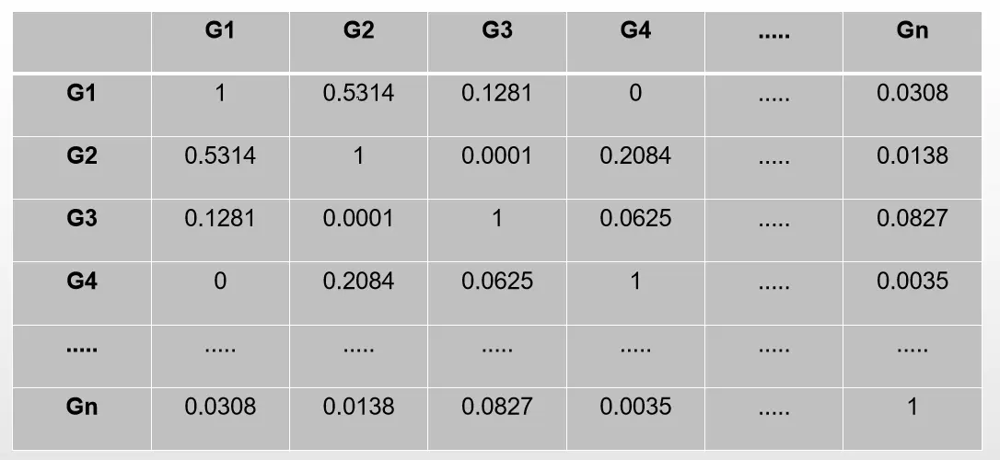
> 权重网络的邻接矩阵

（保留4位有效数字）

### 3.TOM矩阵建立

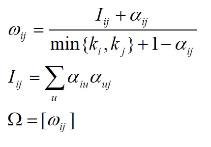

Ω为TOM矩阵
我们基于αij来计算TOM矩阵，从而将基因进行分模块化，即哪些基因在一个模块内，哪些基因在另一个模块内
其中 Iij 的目的是引入第三个基因u，即若第 i 个基因和第 j 个基因有连通性，而第 u 个基因分别于第 i 个基因和第 j 个基因都有连通性，那么我们认为第 i 个基因和第 j 个基因的连通性通过第 u 个基因的得到了间接加强，所有，当两个基因连通性很高的时候，我们通过引入 Iij 来寻找间接使这两个基因连通性加强的某些基因，如下图所示：

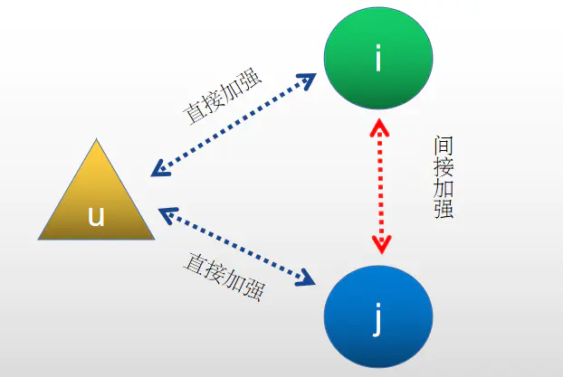
> 第i个,第j个,第u个基因互作

计算出TOM矩阵后，我们就可以将基因进行聚类分模块了，那么我们定义第 i 个基因和第 j 个基因的聚类距离为：

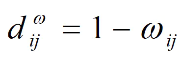

因此根据这个聚类距离，我们可以得到分模块的情况：

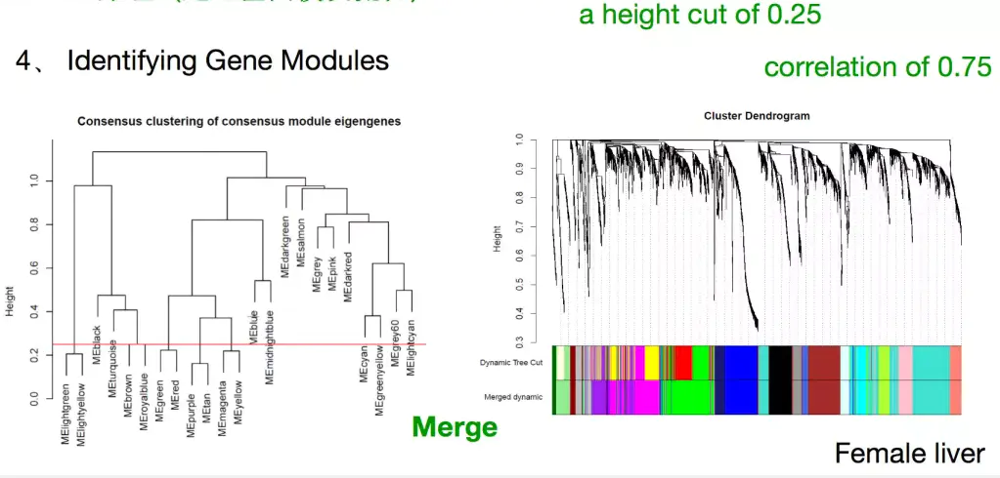

那么分好模块以后，我们可以计算模块与性状矩阵的相关性：

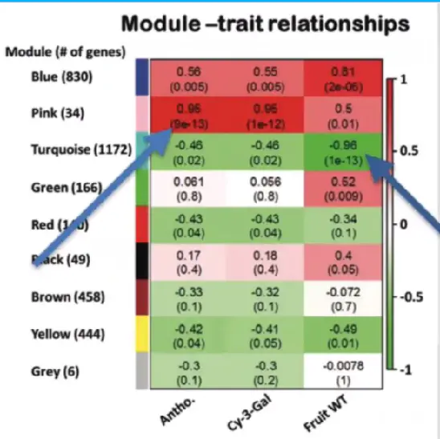
> Module-trait relationships

其中grey模块是unassigned genes模块，其他颜色的模块是聚类好的模块
Module-trait relationships这副图里面模块与性状的相关性（上面的数值为相关系数，下面数值为显著性）
其中，性状矩阵即为每一种处理
而每一模块的基因相当于整个基因表达谱的子集，对于整个的基因表达谱来说：

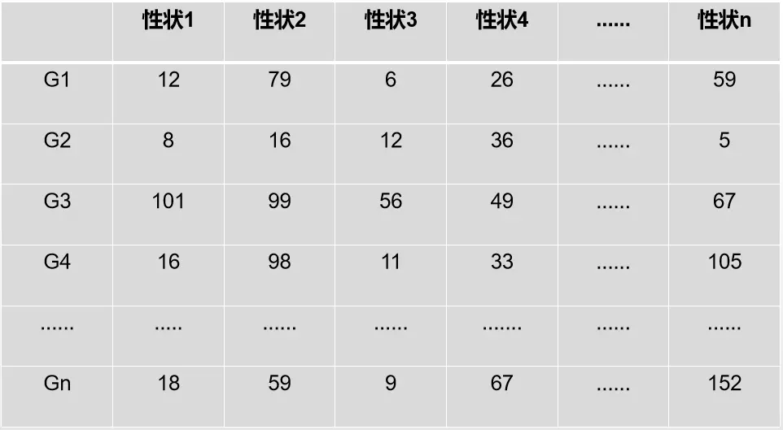
> 整个的基因表达谱

对于某一模块的基因表达谱：

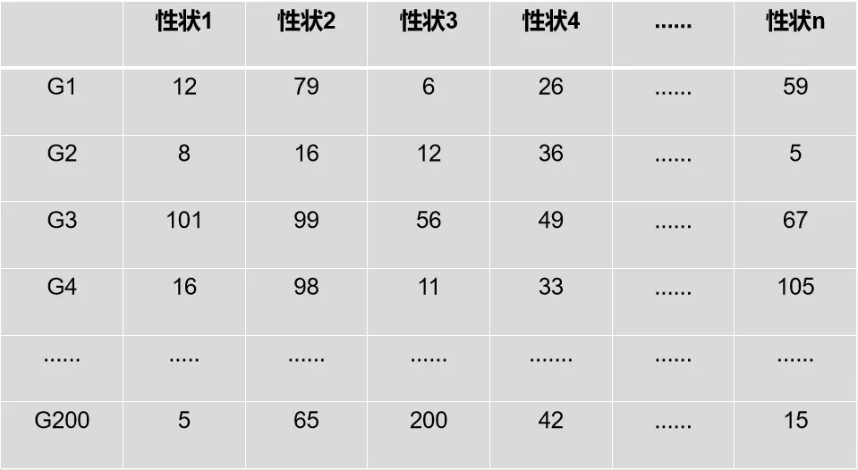
> 某一模块的基因表达谱

假设说某一模块有200个基因，那么怎么计算模块与性状之间的相关性呢？

```R
 MEs0 = moduleEigengenes(datExpr, moduleColors)$eigengenes
 MEs = orderMEs(MEs0); ##不同颜色的模块的ME值矩阵(性状[样本]vs模块)
 moduleTraitCor = cor(MEs, design , use = "p"); ##这里的design为性状矩阵（样本矩阵）
 moduleTraitPvalue = corPvalueStudent(moduleTraitCor, nSamples)
```

这里的性状1 - 性状n即为下图的 D1 - Dn

由代码可知，MEs是每一个模块中性状的特征值，该特征值即为在某一模块中，对于某一个性状，将其基因表达量PCA分解，选取PC1作为该性状的特征值，如下图：

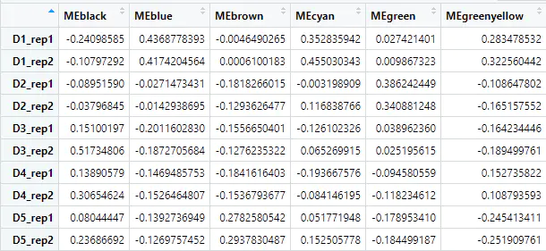
> MEs

具体为：

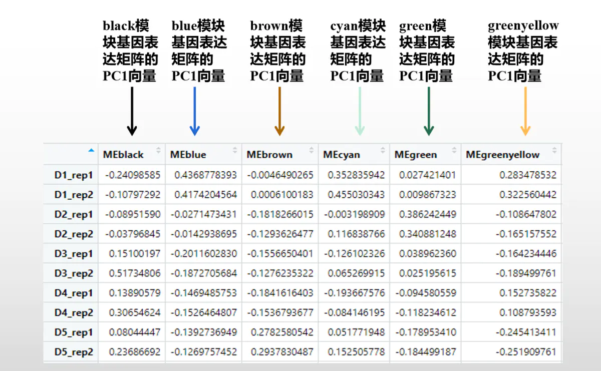

横坐标表示模块，纵坐标表示性状以及生物学重复，表中的元素表示每个模块下各个性状的PC1的值，那么总体上模块与性状的相关性为cor(MEs, design , use = "p")，其中design为性状矩阵：

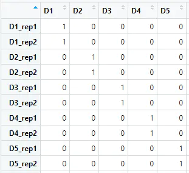
> design

那么通过这两个矩阵，我们就可以计算出模块与性状的相关性了：

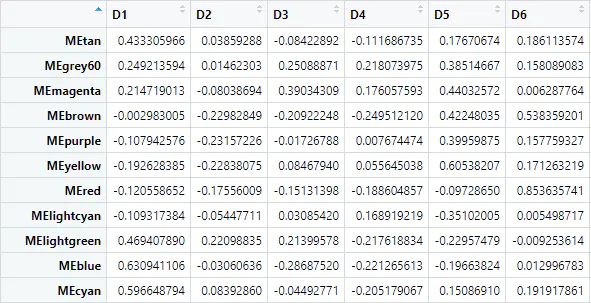
> 相关性

其中纵坐标为模块，横坐标为性状
这样一来我们计算出了Module-trait relationships这副图里面模块与性状的相关性了（上面的数值为相关系数，下面数值为显著性）

### 4.GS与MM

GS是Gene Signicance，描述的是某一个基因与性状的相关性，即某基因（在基因表达矩阵中，该基因随性状的变化的向量与模块特征向量的相关性（即上一小节中，MEs其中的某一列即为某个模块的特征向量，该特征向量不是n阶方阵的特征向量）；
而MM是Module Membership，描述的是某一个基因与模块之间的相关性，即某基因（在基因表达矩阵中，该基因随性状的变化的向量，即基因表达谱对应该基因的那一行）与该模块特征向量的相关性（即上一小节中，MEs其中的某一列即为某个模块的特征向量，该特征向量不是n阶方阵的特征向量）
那么我们怎么照hub基因呢？
通常需要做出GS和MM的关系图

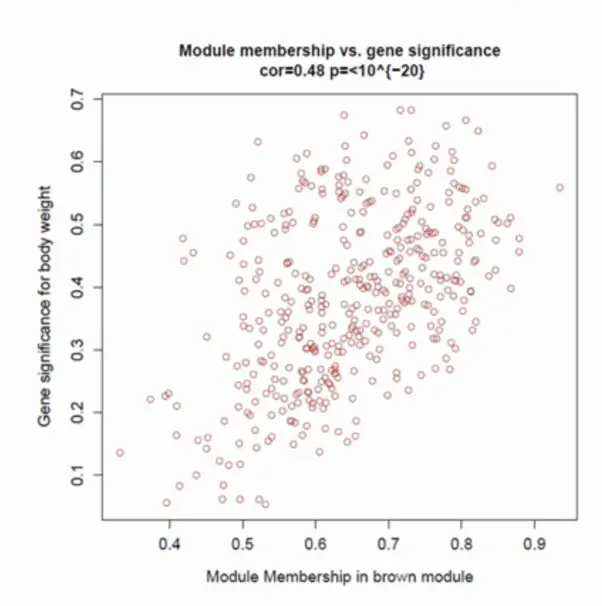

那么某个模块与性状相关性高，并且模块内某基因与该性状相关性高，则这个基因很可能为hub基因
基于我们之前说到的MEs矩阵，我们可以利用PC1来看下各个sample之间特征值的变化情况

```R
barplot(as.matrix(t(MEsWW$MEtan)), col='red', main="", cex.main=2,
        ylab="eigengene expression",xlab="array sample")
```

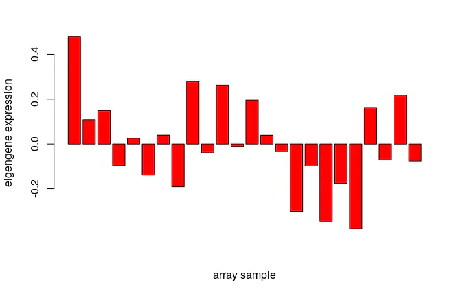
> MEtan模块

上面的条形图，每一根柱子代表每一个sample（D1_rep1，D1_rep2，D2_rep1，D2_rep2等等）在对应模块（比方说MEtan模块）的PC1值
我们具体看一下各个元素代表什么：

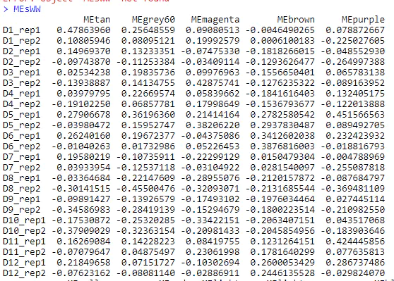

假设MEtan模块有200个基因，那么MEtan模块中的D1_rep1对应的0.47863960代表在D1_rep1中该模块所有基因的表达特征值，由于划分模块以后，我们认为在同一模块里面的基因是共表达的，所以某一个模块内对应sample的PC1值（PC1涵盖整个基因表达谱的最大信息量）可以衡量该模块内这个sample的整体表达特征

### 5.cytoscope网络图

接下来，我们就可以将自己感兴趣的，与性状相关性比较大的模块基因导出，利用cytoscope查看基因间作用关系图了。

## 几个注意事项

### 1.input文件

对于WGCNA来说，input数据无非就两种，一个是基因表达矩阵（一般用FPKM表示），另一个是性状矩阵

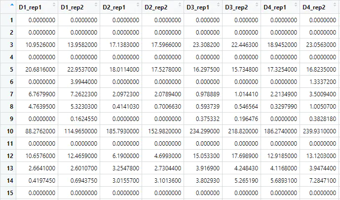
> 基因表达矩阵

上表中列为性状（样品名称），行为基因名称


> 性状矩阵

是否有某性状可以利用0（无），1（有）来区分

### 2.筛选基因

一般来说，我们尽量保留基因表达矩阵里面的全部基因，但是在WGCNA做基因聚类的时候，由于计算量过大，对于某些物种来说，可能要进行取舍
但是根据官网上的提示，并不建议利用差异基因来用作筛选条件

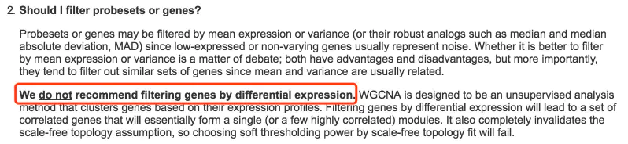

这是由于利用差异基因来做可能会破坏之前提到的无尺度分布这个条件。并且对于某些项目，其核心基因并不一定是差异基因，可能某些核心基因在各性状组别中表达差异不大，但是很可能参与到多个通路中去，从而影响生物学过程，而差异表达的基因往往都比较偏下游，利用差异表达基因作为筛选条件，可能会miss掉很多核心基因
所以，筛选的条件根据项目的不同而灵活选择，除了筛选不表达的基因以外。这里还有有一种筛选方法，即在基因表达矩阵中，对每一行基因计算其方差，我们尽量选择方差排序较大的基因，这样做出来的效果可能会好一些。

## 参考

+ https://www.jianshu.com/p/2d3d079cc338
+ https://www.omicsclass.com/article/649
+ 《WGCNA: an R package for weighted correlation network analysis》
+ 《Weighted Network analysis》
+ [WGCNA FAQ](https://horvath.genetics.ucla.edu/html/CoexpressionNetwork/Rpackages/WGCNA/faq.html)