# WGCNA 挑选软阈值

> https://www.jianshu.com/p/1804fb6d2ed8

我们今天就搞清楚这两个问题：

1. 什么是无尺度分布
2. 手工计算软阈值

## 无尺度分布

假如我问大家，如果你想认识世界上的任何一个人，需要通过几个人来联系？

6个。

这个就是6度分隔理论，描述的是随机网络里面的情形，随机网络里面，大多数节点拥有相同的链接数。
如果用计算机模拟的。在节点完全随机的情况下，任何两个节点的平均距离却远远大于6个。
但是我会感觉6度理论是靠谱的，举两个例子：
因为你想联系上特朗普的话，应该没那么困难。你先认识地方电视台，然后通过他们联系马云，而马云跟特朗普认识。

你如果找马化腾呢？也没有那么困难，你先认识地方电视台，然后找到马云，而马云跟马化腾很熟。

你看，只要我们在这个网络中，加入一些巨人，事情就会简化很多，而这些巨人拥有的特点就是，巨人很少，单个巨人跟普通人的链接特别多。
这些巨人起到了枢纽的作用，枢纽英文叫作hub。

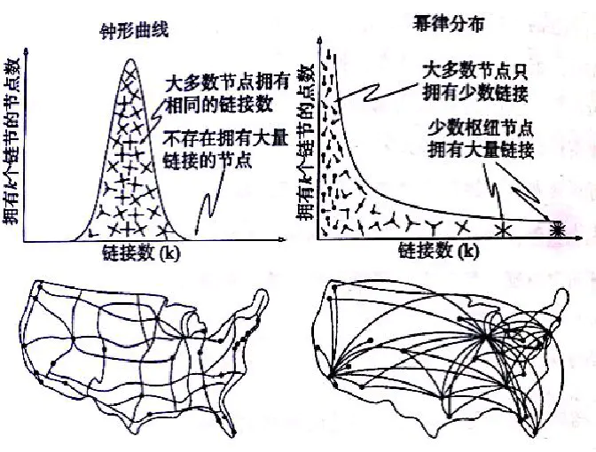
> WGCNA的分析中为什么要挑选软阈值？

真实世界的网络不是随机的，而是有hub的网络。就像右边的图一样。普通节点占大多数，hub节点是少数。

随机网络是可以用一个值来衡量大多数节点之间的距离，或者是6或者是60，也就是你可以用一个尺度去衡量他，可以称为尺度网络。
而有巨人的网络，没办法来衡量两个节点之间的距离，叫作无尺度分布，该分布又叫做幂律分布，我们说的二八定律，长尾定律都是幂律分布的口头化呈现。

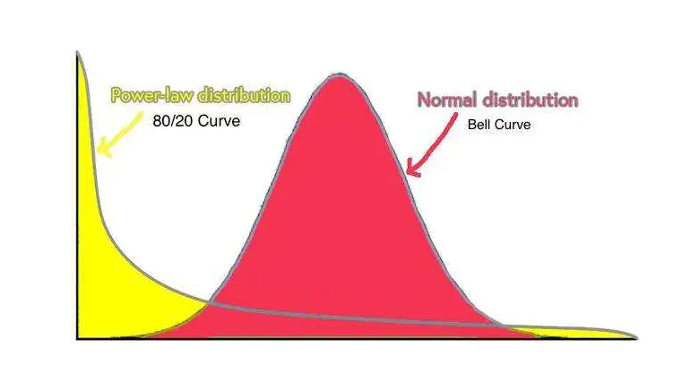
> WGCNA的分析中为什么要挑选软阈值？

人和人之间的交往是这个样子，那么蛋白和蛋白之间的互作是什么情况呢?
目前的观察是，也符合幂律分布，也就是无尺度分布。一个细胞内，不是每个基因都要表达，即使表达，也不定起作用。
决定这个基因分化，功能改变，都是一些重要基因，我们把他成为hub gene。

好了，WGCNA分析就是利用了这一点规律，强行让基因间的联系符合无尺度分布。

## 手工计算软阈值

我们用真实的数据来演示以下这个过程

```R
load(file = "FemaleLiver-01-dataInput.RData")
```

我们的数据名称是dataExpr，在第一次课的文件夹里面。
他的行是样本，134个，列是基因，3600个。

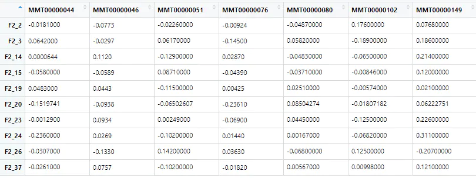
> WGCNA的分析中为什么要挑选软阈值？

WGCNA首先通过相关性分析(cor函数)，计算了任意两个基因的相关性。
如果是平常，我们就会设定一个阈值，大于0.8(假设是这个)是有联系，小于的叫没有联系。
但是正常情况并不是这样，因为0.79的基因会出来闹。

所以，作者就给这些相关性加了一个幂。

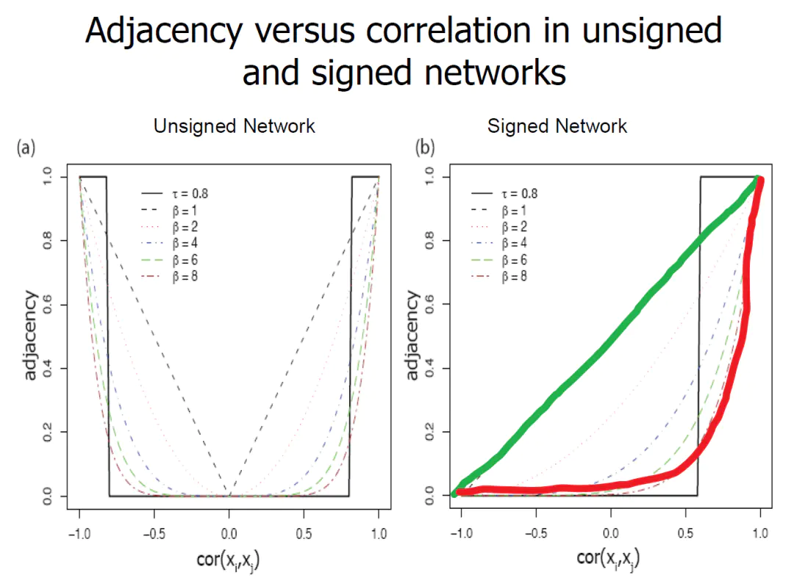
> WGCNA的分析中为什么要挑选软阈值？

图中的绿线原来的相关性，进行幂次计算之后(8次)就变成了红色。
可以看到整体的相关性都变小了，但是里面本来就小的变得更加小。

为什么要这么做，因为这样做了之后，基因间的连通性，就开始符合幂律了。
我们以幂为10来计算一下。

```R
power <- 10
ADJ=abs(cor(datExpr,use = 'p'))^power
```

现在得到了一个3600行乘以3600行的相关性矩阵

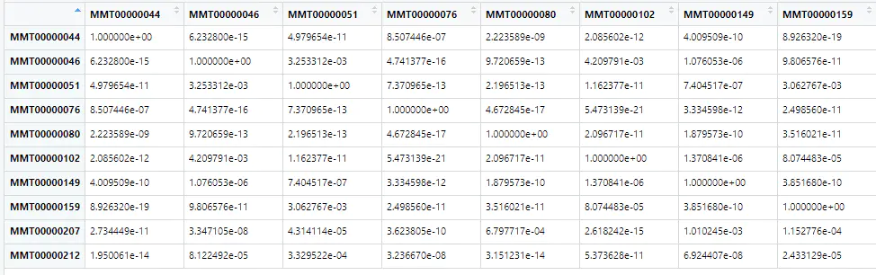
> WGCNA的分析中为什么要挑选软阈值？

如果对每一列的基因进行求和，得到的就是这个基因跟其他基因相关性之和。

```R
k=apply(ADJ,2,sum) -1
```

减去1是排除了自身。

```
MMT00000044 MMT00000046 MMT00000051 MMT00000076 MMT00000080 MMT00000102 
 0.02094526  7.13906159  4.17142638  0.22300729  6.25771609  1.20155840
```

这个K指的就是3600基因组成的网络中，每个节点的连通性。做一个频次分布图就会有惊喜

```R
hist(k)
```

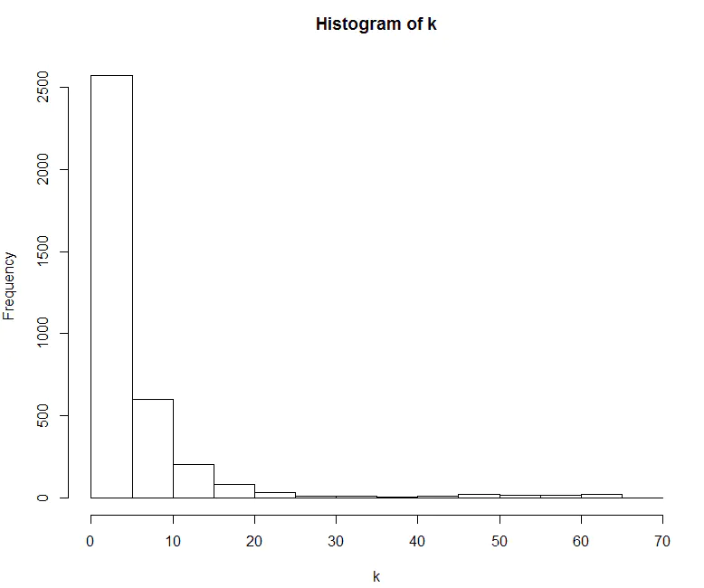
> WGCNA的分析中为什么要挑选软阈值？

横坐标是连通性依次升高，纵坐标表示该范围连通性的频次，是不是从分布上看符合了幂律呢？
当然这是靠眼睛在看，
真正的幂律是这样的，把连通性分隔，分隔内连通性的平均值取log10，跟频率的概率取log10，两者之间有线性关系。

用图展示一下，
先把k从小到大排序，切割成10份

```R
cut1=cut(k,10)
```

计算每个区间的平均值

```R
binned.k=tapply(k,cut1,mean)
```

结果如下

```
(-0.0655,6.58]    (6.58,13.2]    (13.2,19.7]    (19.7,26.3]    (26.3,32.9]    (32.9,39.5]      (39.5,46]      (46,52.6]    (52.6,59.2]    (59.2,65.8] 
      2.151281       9.145864      15.670490      22.564169      30.466627      36.649594      42.028070      49.043907      55.893530      61.864996
```

然后计算每个区间的频率

```R
freq1=tapply(k,cut1,length)/length(k)
```

结果是这样的

```
(-0.0655,6.58]    (6.58,13.2]    (13.2,19.7]    (19.7,26.3]    (26.3,32.9]    (32.9,39.5]      (39.5,46]      (46,52.6]    (52.6,59.2]    (59.2,65.8] 
   0.792500000    0.130277778    0.036666667    0.011111111    0.001944444    0.003055556    0.003611111    0.008333333    0.005555556    0.006944444
```

此时这个均值的对数和频率的对数就是线性的

```R
plot(log10(binned.k),log10(freq1+.000000001),xlab="log10(k)",ylab="log10(p(k))")
```

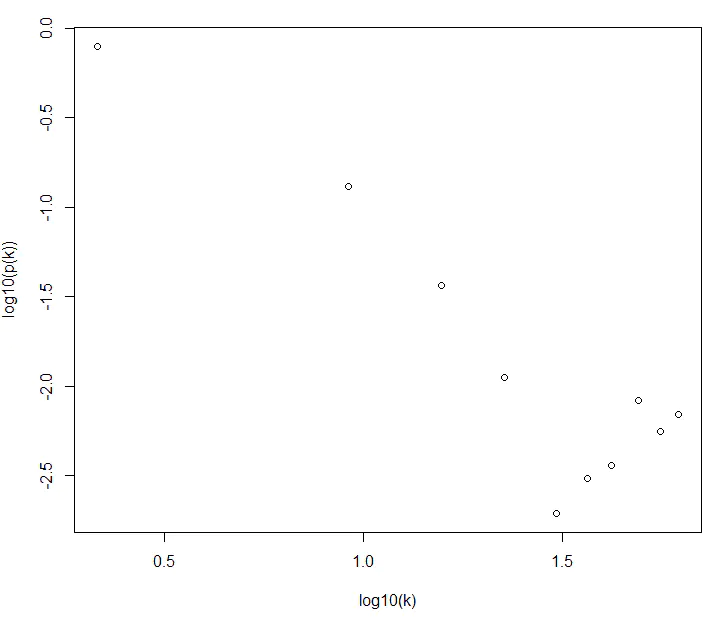
> WGCNA的分析中为什么要挑选软阈值？

如果通用线性函数加线和注释就会明显一点

```R
xx= as.vector(log10(binned.k))
lm1=lm(as.numeric(log10(freq1+.000000001))~ xx )
lines(xx,predict(lm1),col=1)
title(paste( "scale free R^2=",as.character(round(summary(lm1)$adj.r.squared,2)),", slope=", round(lm1$coefficients[[2]],2)))
```

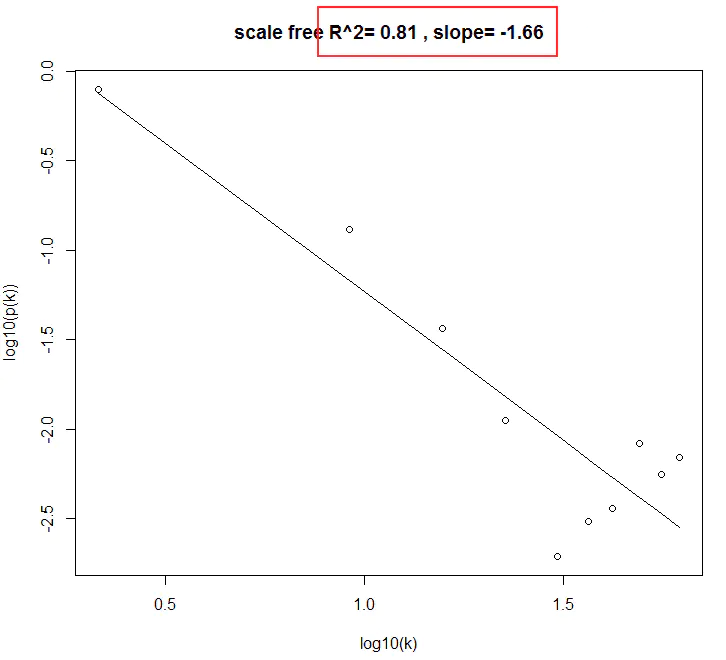
> WGCNA的分析中为什么要挑选软阈值？

R平方达到了0.81，已经很不错了。
但是，我们必须有所选择，所以我们可以几个幂次一起算，然后来选就行了。

把以上结果写一个函数

```R
mypick <- function(powerVector,datExpr){
  power <- powerVector
  cor<-stats::cor
  ADJ=abs(cor(datExpr,use = 'p'))^power
  k=apply(ADJ,2,sum) -1
  cut1=cut(k,10)
  binned.k=tapply(k,cut1,mean)
  freq1=tapply(k,cut1,length)/length(k)
  xx= as.vector(log10(binned.k))
  lm1=lm(as.numeric(log10(freq1+.000000001))~ xx )
  return(data.frame(Power=power,
                    SFT.R.sq=as.character(round(summary(lm1)$adj.r.squared,2)),
                    slope=round(lm1$coefficients[[2]],2),
                    mean.k=mean(k)))
}
```

测试一个结果,幂次为10

```R
mypick(10,datExpr)
```

结果如下，符合预期，其中mean.k，是对所有基因的连通性取均值，代表当前网络的连通性
之后作图的时候需要用到。

```
Power SFT.R.sq slope   mean.k
1    10     0.81 -1.66 5.193521
```

现在批量运算

```R
powers = c(c(1:10), seq(from = 12, to=20, by=2))
do.call(rbind,lapply(powers,mypick,datExpr))
```

得到结果如下

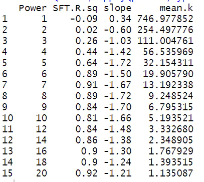
> WGCNA的分析中为什么要挑选软阈值？

结合这个表格，我会选取6，作为power值，因为从5到6，R平方显著提升。

## 官方版本的软阈值计算

以上过程只是帮助我们理解无尺度网络和软阈值的概念。
实际预算，WGCNA包中提供了一个函数pickSoftThreshold,可以轻松计算。
这个函数输入的就是不同的power值和表达矩阵

```R
powers = c(c(1:10), seq(from = 12, to=20, by=2))
sft = pickSoftThreshold(datExpr, powerVector = powers)
```

因为他使用了分块还有并行化的思想，所以计算速度十分快。

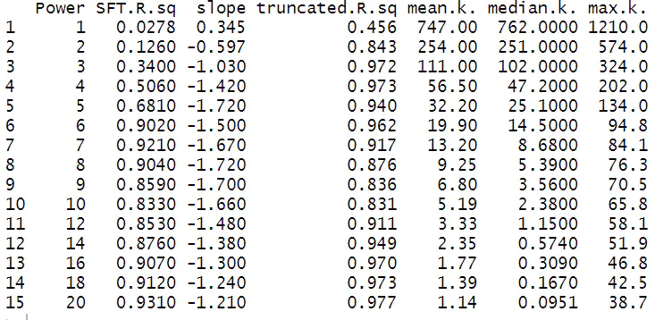
> WGCNA的分析中为什么要挑选软阈值？

结果返回的是个列表，里面有两个内容
第一个是，他自己确定的软阈值，该函数如果发现了R平法大于0.85的power值，就返回最小的那个。
这里返回的是6
可以用这句命令查看

```R
sft$powerEstimate
```

第二个返回的就是上面的表格，

```R
sft$fitIndices
```

我们之前确定6是靠眼睛看，但是很不直观，所以，抽取表格内的数据作图，就会很方便。

```R
sizeGrWindow(9, 5)
par(mfrow = c(1,2))
cex1 = 0.85
# Scale-free topology fit index as a function of the soft-thresholding power
plot(sft$fitIndices[,1], -sign(sft$fitIndices[,3])*sft$fitIndices[,2],
     xlab="Soft Threshold (power)",ylab="Scale Free Topology Model Fit,signed R^2",type="n",
     main = paste("Scale independence"));
text(sft$fitIndices[,1], -sign(sft$fitIndices[,3])*sft$fitIndices[,2],
     labels=powers,cex=cex1,col="red");
# this line corresponds to using an R^2 cut-off of h
abline(h=0.90,col="red")
# Mean connectivity as a function of the soft-thresholding power
plot(sft$fitIndices[,1], sft$fitIndices[,5],
     xlab="Soft Threshold (power)",ylab="Mean Connectivity", type="n",
     main = paste("Mean connectivity"))
text(sft$fitIndices[,1], sft$fitIndices[,5], labels=powers, cex=cex1,col="red")
```

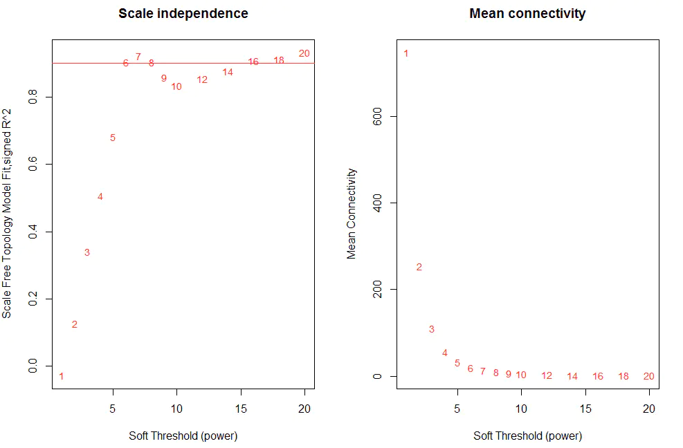
> WGCNA的分析中为什么要挑选软阈值？

这张图是很常见，由两张图组成，都是以不同的软阈值作为横坐标。
第一张图，纵坐标是R平方。横线画在了0.85的地方
从图上看，软阈值为6的时候，R平方第一次有了突破，达到了0.9.此时网络已经符合无尺度分布。
第二张图，纵坐标是连通性的平均值，我们已经计算过，他会越来越小。
这是必然的规律，联合第一张看就行了。

## 一些差别

如果你仔细看，会发现，我们自己算的R平方和官方的R平法还有差别。

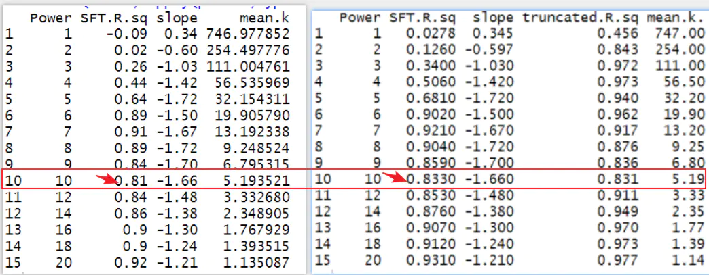
> WGCNA的分析中为什么要挑选软阈值？

这是为什么呢？
是因为每一次线性模型的计算，都会返回两个R平方。

```R
summary(lm1)
```

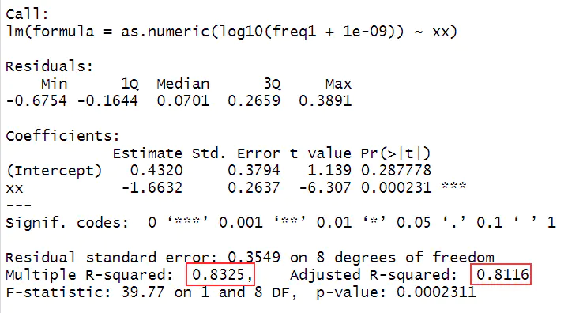
> WGCNA的分析中为什么要挑选软阈值？

我们提取的是矫正后的0.81，而他提取的是没有矫正的0.83，如果我们想改，也十分容易。
下面的语句就可以提取。

```R
summary(lm1)$r.squared
```

## 一些疑惑

把我们的数据变成无尺度是个人为的事情？？
是的。
作者也这么说了，真实基因之间的关系应该是符合无尺度分布的，但是相关性计算出来的不具有代表性。
因为相关不是因果嘛。

那么，我们就认为给他一个power值，把他们的之间的关系变成符合无尺度分布就行了。这是作者的原话。

## last but not least

基因的相关性有个选项，默认是unsigned，还可以改成sined
有什么区别？
如果是unsigned，我们计算的时候，无论相关性是正和负的，都取的绝对值。
最终得到的基因其实有正相关和负相关，我们一视同仁了。

但是真实情况又不是这样的。为了权衡，就有了signed方法来削减负相关的影响。
就是取0.5之后，再加上0.5，这样如果是负的，最终还是会变成正的值，只是相关性变小了。
如果是正的，那么相关性会变大。最终都会在0到1的区间内，没有负值。
而作者推荐的是signed，他觉得这更符合真实情况。
后面得到的模块里面的也都是正相关的基因。

当然事情并不绝对，他说，如果是单细胞的数据，那么就是因为一群基因正负调控得到的结果，这时候unsigned的比较合适。
这是一个生物学的问题，不是统计学的问题。
可以在果子学生信公众号回复“果子WGCNA”自助获取作者接近2个小时的演讲视频和PPT，自己感受和体会一下。

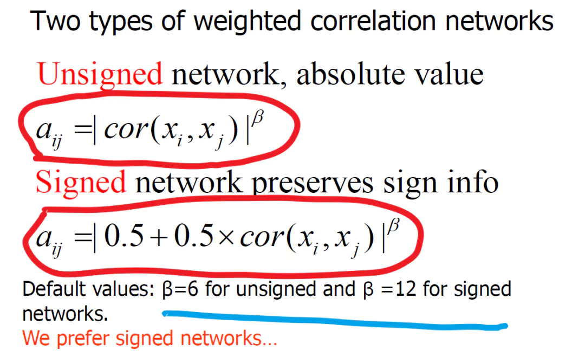
> WGCNA的分析中为什么要挑选软阈值？

现在再看这个图就好理解了吧

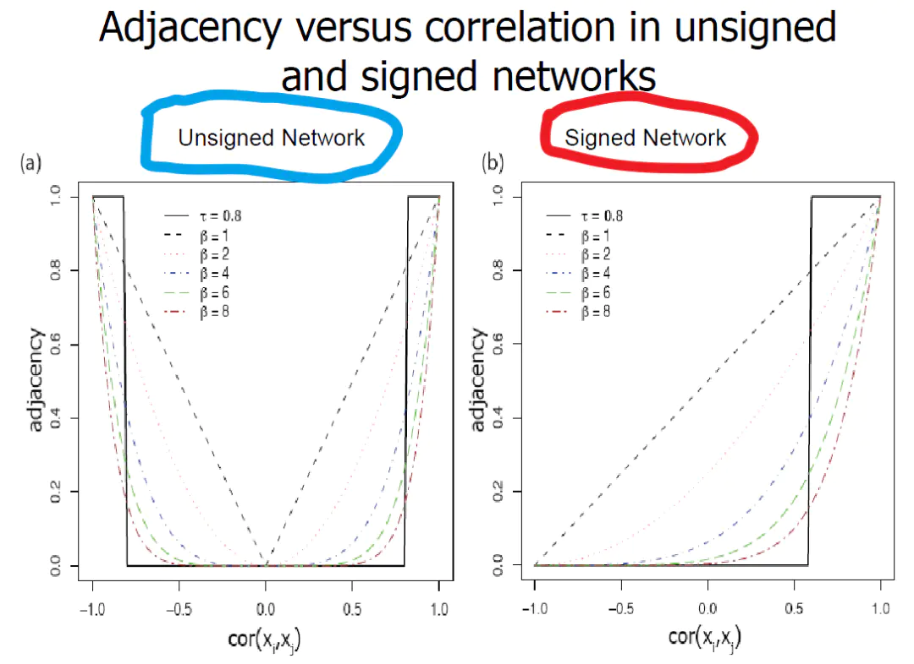
> WGCNA的分析中为什么要挑选软阈值？

假如你的数据最后没有合适的阈值怎么办呢？
作者说了，如果是unsigned的就选6，signed就选12，不要纠结了。

接下来我们还要讲讲模块的获取过程，eigengene值的计算。集结完毕后，作为连同多数据的WGCNA一起更新到答疑群中。

## WGCNA 常见问答

### 1. 需要多少样本?

建议至少15个样本. 对于高通量数据，少于15个样本的相关性将对网络的生物学意义产生较大噪音。如果可能，建议至少20个样本； 和其他分析方法一样，样本数越多得到的结果的可靠性和准确度越高。

### 2. 应该怎么过滤数据?

可以使用平均表达或方差过滤（或类似方法如中位数和中位数绝对偏差，MAD），因为低表达或不变化的基因通常给结果带来更多噪音。平均表达和方差过滤哪个更好，依然是一个有争议的问题；这两种方法各有利弊，但更重要的是，它们往往会过滤掉相似的一组基因，因为平均值和方差通常是相关的。

不建议使用差异表达基因进行过滤. WGCNA是一种基于基因表达谱的无监督分析方法. 通过差异表达过滤得到的基因集可能是来自一个或几个表达高度相关的模块。这将导致无尺度网络的假设完全失效，进而导致基于无尺度网络的软阈值挑选失败。

### 3. 有哪些设置参数的建议?

通常，我们设置的默认参数在多个应用程序中都能获得较好的运行。然而，在某些情况下，为了向后兼容性和再现性，我们保持“简单”或历史默认设置，而对于新的计算，我们不建议使用默认设置。下面列出了一些设置说明。

+ Signed networks. 选择‘ signed ’还是‘ unsigned’ 网络是一个复杂的问题，但是通常我们建议使用‘signed’(或‘signed hybrid’)网络。可以在下列函数中设置参数‘type = "signed" ’or 'type = "signed hybrid"' 来构建‘signed' 网络。函数列表如下：accuracyMeasures, adjacency, chooseOneHubInEachModule, chooseTopHubInEachModule, nearestNeighborConnectivity, nearestNeighborConnectivityMS, orderBranchesUsingHubGenes, softConnectivity 等（其他函数详见帮助文档）有些函数使用参数 **networkType**来选择网络类型; 常用的有 blockwiseModules, blockwiseConsensusModules, blockwiseIndividualTOMs, consensusTOM, intramodularConnectivity, modulePreservation, pickSoftThreshold, TOMsimilarityFromExpr, vectorTOM 等。如有疑惑请阅读帮助文档。

+ Robust correlation. WGCNA中所有函数默认的相关方法是标准皮尔逊相关。一般来说，除非有充分的理由相信没有异常值测量，否则我们推荐使用biweight mid-correlation作为替代 。 其在WGCNA的函数bicor中实现。许多WGCNA的函数都有一个‘corFnc’参数让使用者选择标准相关‘cor’还是双重相关‘bicor’。 Additional arguments to the correlation function can be specified using the argument corOptions (depending on function, this argument may require one of two alternate forms, please see the help for each function for details). In certain functions, notably the of the blockwise family, correlation function cannot be specified directly as a function; rather, one must use the argument corType to specify either Pearson or biweight mid-correlation.

关于使用bicor的重要注意事项. The biweight mid-correlation works very well in a variety of settings but in some situations it will produce unwanted results.

+ 限制排除的异常值的数量: argument maxPOutliers. The default version of the biweight mid-correlation, described in Langfelder and Horvath (2011) (link to article), can produce unwanted results when the data have a bi-modal distribution (e.g., when a gene expression depends heavily on a binary variable such as disease status or genotype) or when one of the variables entering the correlation is itself binary (or ordinal). For this reason, we strongly recommend using the argument maxPOutliers = 0.05 or 0.10 whenever the biweight midcorrelation is used. This argument essentially forces bicor to never regard more than the specified proportion of samples as outliers.
+ 处理二进制数据. When relating high-throughput data x to binary variable y such as sample traits, one can use argument robustY = FALSE to turn off the robust treatment for the y argment of bicor. This results in a hybrid robust-Pearson correlation as described in Langfelder and Horvath (2011). The hybrid correlation can also be used when one of the inputs is numeric but known to not have any outliers.

### 4. WGCNA可以用于分析 RNA-Seq 吗?

Yes. As far as WGCNA is concerned, working with (properly normalized) RNA-seq data isn't really any different from working with (properly normalized) microarray data.

We suggest removing features whose counts are consistently low (for example, removing all features that have a count of less than say 10 in more than 90% of the samples) because such low-expressed features tend to reflect noise and correlations based on counts that are mostly zero aren't really meaningful. The actual thresholds should be based on experimental design, sequencing depth and sample counts.

We then recommend a variance-stabilizing transformation. For example, package DESeq2 implements the function varianceStabilizingTransformation which we have found useful, but one could also start with normalized counts (or RPKM/FPKM data) and log-transform them using log2(x+1). For highly expressed features, the differences between full variance stabilization and a simple log transformation are small.

Whether one uses RPKM, FPKM, or simply normalized counts doesn't make a whole lot of difference for WGCNA analysis as long as all samples were processed the same way. These normalization methods make a big difference if one wants to compare expression of gene A to expression of gene B; but WGCNA calculates correlations for which gene-wise scaling factors make no difference. (Sample-wise scaling factors of course do, so samples do need to be normalized.)

If data come from different batches, we recommend to check for batch effects and, if needed, adjust for them. We use ComBat for batch effect removal but other methods should also work.

Finally, we usually check quantile scatterplots to make sure there are no systematic shifts between samples; if sample quantiles show correlations (which they usually do), quantile normalization can be used to remove this effect.

### 5. 异质性数据如何使用 WGCNA?

异质性数据会影响任何统计分析，特别是像WGCNA这样的无监督的统计分析。 What, if any, modifications should be made to the analysis depends crucially on whether the heterogeneity (or its underlying driver) is considered "interesting" for the question the analyst is trying to answer, or not. 如果幸运的话，样本差异的主要驱动因素是人们所研究的处理/条件，在这种情况下，WGCNA可以被应用于现有的数据。 不幸的是，异质性驱动因素通常是无趣的，应该对此进行调整。 Such factors can be technical (batch effects, technical variables such as post-mortem interval etc.) or biological (e.g., sex, tissue, or species differences).

If one has a categorical source of variation (e.g., sex or tissue differences) and the number of samples in each category is large enough (at least 30, say) to construct a network in each category separately, it may be worthwhile to carry out a consensus module analysis (Tutorial II, see WGCNA Tutorials). Because this analysis constructs a network in each category separately, the between-category variation does not affect the analysis.

If it is desired to construct a single network for all samples, the unwanted or uninteresting sources of large variation in the data should be adjusted for. For categorical (ordinal) factors we recommend using the function ComBat (from the package sva). Users who have never used ComBat before should read the help file for ComBat and work through the sva vignette (type vignette("sva") at the R prompt) to make sure they use ComBat correctly.

For continuous sources of variation (e.g., postmortem interval), one can use simple linear regression to adjust the data. There may be more advanced methods out there that also allow the use of covariates and protect from over-correction.

Whichever method is used, we caution the user that removal of unwanted sources of variation is never perfect and it can, in some cases, lead to removal of true interesting signal, and in rare cases it may introduce spurious association signal. Thus, only sources of relatively large variation should be removed.

### 6. I can't get a good scale-free topology index no matter how high I set the soft-thresholding power.

First, the user should ensure that variables (probesets, genes etc.) have not been filtered by differential expression with respect to a sample trait. See item 2 above for details about beneficial and detrimental filtering genes or probesets.

If the scale-free topology fit index fails to reach values above 0.8 for reasonable powers (less than 15 for unsigned or signed hybrid networks, and less than 30 for signed networks) and the mean connectivity remains relatively high (in the hundreds or above), chances are that the data exhibit a strong driver that makes a subset of the samples globally different from the rest. The difference causes high correlation among large groups of genes which invalidates the assumption of the scale-free topology approximation.

Lack of scale-free topology fit by itself does not invalidate the data, but should be looked into carefully. It always helps to plot the sample clustering tree and any technical or biological sample information below it as in Figure 2 of Tutorial I, section 1; strong clusters in the clustering tree indicate globally different groups of samples. It could be the result a technical effect such as a batch effect, biological heterogeneity (e.g., a data set consisting of samples from 2 different tissues), or strong changes between conditions (say in a time series). One should investigate carefully whether there is sample heterogeneity, what drives the heterogeneity, and whether the data should be adjusted (see previous point).

If the lack of scale-free topology fit turns out to be caused by an interesting biological variable that one does not want to remove (i.e., adjust the data for), the appropriate soft-thresholding power can be chosen based on the number of samples as in the table below. This table has been updated in December 2017 to make the resulting networks conservative.

| Number of samples | Unsigned and signed hybrid networks | Signed networks |
|-------------------|-------------------------------------|-----------------|
| Less than 20 | 9 | 18 |
| 20-30 | 8 | 16 |
| 30-40 | 7 | 14 |
| more than 40 | 6 | 12 |

### 7. The functions take many arguments! Are default settings always appropriate?

Many of the WGCNA functions take multiple arguments that control various subtleties in network construction and module identification. In general we attempt to provide defaults that work reasonably well in most common situations. However, in some cases we, over time, find that a different setting is more appropriate. In most cases we keep the old default for reproducibility.

### 8. Functions TOMsimilarity and TOMsimilarityFromExpr give slightly different results!

The function TOMsimilarityFromExpr uses a slightly different default setting for TOM calculation in unsigned networks. This should produce TOM that's slightly easier to interpret but is slightly different from what one gets by calculating a standard unsigned adjacency and then TOM using TOMsimilarity. To get the same result, use the argument TOMType="unsigned" when calling TOMsimilarityFromExpr.