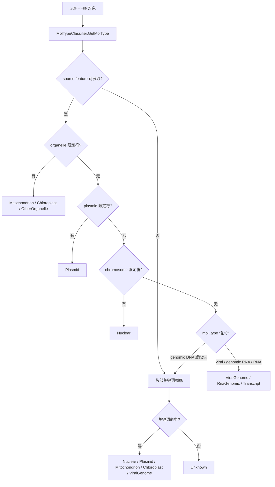

## 用户需求

在 GCModeller 核心库 `biocore-netcore5.vbproj`（工作区 `core\Bio.Assembly`）中，针对 NCBI GenBank 数据的"分子类型/基因组类型"判定能力进行增强。

## 产品概述

现有 `Assembly\NCBI\Database\GenBank\GBK\File.vb` 的 `isPlasmid` 属性仅做 `Not String.IsNullOrEmpty(Features.source.Query("plasmid"))` 单一判定，无法区分核基因组、质粒、线粒体、叶绿体、病毒基因组、RNA 基因组与转录本，无法满足实际工作需求。需要在 `GBK` 文件夹下新增一个独立的辅助模块，依据 `GBK\moltype.md` 文档的判定策略（source 限定符优先 → DEFINITION/KEYWORDS 关键词兜底 → mol_type/topology 辅助），对外暴露"传入 GenBank 对象、返回枚举"的单一入口函数。

## 核心特性

- **新增分子类型枚举**：覆盖 `Unknown` / `Nuclear` / `Plasmid` / `Mitochondrion` / `Chloroplast`（含 plastid、apicoplast、chromatophore、nitroplast）/ `OtherOrganelle` / `ViralGenome` / `RnaGenomic` / `Transcript`，完整覆盖 mol_type 取值语义。
- **单入口判定函数**：`Public Function GetMolType(gbk As GBFF.File) As ...`，同时以 `<Extension>` 形式提供，可写为 `gbk.GetMolType()`。
- **分级判定流水线**：`/organelle` → `/plasmid` → `/chromosome` → mol_type（RNA/病毒语义）→ DEFINITION/KEYWORDS 关键词兜底 → Unknown；同时带 `/organelle` 与 `/plasmid` 时**以 organelle 为准**。
- **防御性实现**：`Features` 为空、取不到 source feature、`Definition`/`Keywords`/`Locus` 为 Nothing 时均安全降级，不抛异常。
- **全量测试用例**：在 `Test\test.vbproj` 中新增测试模块，用 `GBFF.File.LoadDatabase(path, suppressError:=True)` 遍历 `K:\pangenome\Cryptococcus_neoformans\genbank`（54 个 gbff）与 `K:\pangenome\Escherichia_coli\genbank`（538 个 gbff）下的**全部文件**，逐条记录打印文件名、LOCUS 编号、长度、DEFINITION 摘要、判定枚举与命中证据，结尾输出各类型计数汇总。
- **兼容性**：不改动 `File.vb` 的 `isPlasmid` 属性及其既有行为。

## 技术栈

- 语言/框架：Visual Basic .NET，`net10.0`，SDK 风格项目（`biocore-netcore5.vbproj` 与 `Test\test.vbproj` 均为 SDK 风格，新增 `.vb` 文件自动纳入编译，无需修改 ItemGroup）
- 根命名空间：`SMRUCC.genomics`；GenBank 相关命名空间 `Assembly.NCBI.GenBank.GBFF`
- 依赖：`Feature.Query(key As String)`（取限定符值）、`FEATURES` 的 `IEnumerable(Of Feature)`、`LOCUS.Molecular/Type`、`DEFINITION.Value`、`KEYWORDS.KeyWordList`、`File.LoadDatabase`

## 实现方案

按"**结构化限定符 → 自由文本关键词 → 分子类型辅助 → Unknown**"的优先级链做确定性判定，全部为 O(1) 字符串匹配，无正则、无重复遍历：

1. **前置防御**：`gbk` 为 Nothing 直接返回 `Unknown`；source feature 通过 `gbk.Features.FirstOrDefault(Function(f) f.KeyName.TextEquals("source"))` 获取，**不使用 `Features.source`**（该属性直接取 `_innerList(Scan0)`，空列表会抛异常）。
2. **优先级 1（source 限定符）**：

- `organelle` 非空：含 `mitochondrion`/`kinetoplast` → `Mitochondrion`；含 `plastid`/`chloroplast`/`apicoplast`/`chromatophore`/`nitroplast` → `Chloroplast`；其余 → `OtherOrganelle`。**此处先于 plasmid 判定**，满足"organelle 优先"约定。
- `plasmid` 非空 → `Plasmid`
- `chromosome` 非空 → `Nuclear`

3. **优先级 2（mol_type 语义，仅在前述标记缺失时生效）**：

- 含 `viral`/`virus` → `ViralGenome`
- `genomic RNA` → `RnaGenomic`
- 其余 RNA 类（`mRNA`/`tRNA`/`rRNA`/`ncRNA`/`snRNA`/`snoRNA`/`tmRNA`/`scRNA`/`cRNA`/`precursor RNA`/`transcribed RNA`/`other RNA`）→ `Transcript`
- `genomic DNA` 不单独定性，继续下沉到关键词兜底

4. **优先级 3（头部关键词兜底，不区分大小写子串匹配）**：文本池 = `Definition.Value` + `Keywords` 拼接；病毒判定额外并入 source 的 `/organism` 与 `Source.SpeciesName`。顺序：`mitochondrion|mitochondrial|kinetoplast` → `chloroplast|plastid|apicoplast|chromatophore` → `plasmid` → `virus|viral|phage|virion|viroid` → `chromosome` → `complete genome|whole genome|genome` → 均不命中则 `Unknown`。

- 该层解决了实测数据中 **E.coli WGS 记录没有 `/chromosome` 限定符、只能靠 DEFINITION 的 "chromosome, whole genome shotgun sequence" 判定为核基因组** 的问题。

5. **辅助信号**：`Locus.Type`（实际是拓扑 circular/linear）与 `Locus.Molecular` 仅作为证据记录，**不单独定性**（moltype.md 明确：环形拓扑不能判定质粒）。

## 实现要点（执行细节）

- **性能瓶颈在 I/O 与解析，不在判定**：`GbkParser.Read` 会 `ReadAllLines` 并对每个字段做正则扫描，4.5GB 级数据全量解析耗时数十分钟。因此：
- 使用 `LoadDatabase(path, suppressError:=True)`（惰性 `IEnumerable`），逐条记录边解析边判定，避免一次性驻留全部记录；
- 判定函数保持纯函数、无状态，关键词表用 `Shared ReadOnly` 静态数组，避免每次调用重建；
- 测试代码每处理完一个文件打印一行进度（`[i/n] file -> records: k`），长时间运行可观测。
- **日志/输出规范**：单个记录的打印只取 DEFINITION 前 ~80 字符摘要，避免刷屏；证据字段只输出命中的限定符名与值（如 `organelle=mitochondrion`、`keyword=plasmid`），不打印整条 feature。
- **爆炸半径控制**：仅新增两个文件；`File.vb` 的 `isPlasmid` 保持原样以维持既有调用方（`ExportServices\Plasmid.vb` 等）的行为不变。
- **关键词匹配风险**：`phage` 可能出现在含前噬菌体注释的 DEFINITION 中造成误判，因此病毒关键词层放在 plasmid/organelle/chromosome 之后，且要求 DEFINITION 或 organism 中出现明确的病毒语义词。

## 架构设计



## 目录结构

```
core/Bio.Assembly/
├── Assembly/NCBI/Database/GenBank/GBK/
│   ├── File.vb              # [不改动] 保留 isPlasmid 原语义，作为既有调用方的兼容入口
│   ├── moltype.md           # [不改动] 判定策略依据文档
│   └── MolType.vb           # [NEW] 分子类型枚举 + 判定模块
│                            #   - Enum GenomeMolType：Unknown/Nuclear/Plasmid/Mitochondrion/
│                            #     Chloroplast/OtherOrganelle/ViralGenome/RnaGenomic/Transcript
│                            #   - Module MolTypeClassifier：
│                            #       GetMolType(gbk As GBFF.File) As GenomeMolType  (带 <Extension>)
│                            #       GetMolTypeEvidence(gbk) As MolTypeEvidence （返回类型+命中证据）
│                            #       IsPlasmid / IsOrganelle / IsNuclear 等便捷扩展
│                            #   - Structure MolTypeEvidence：Type / Evidence / Qualifier / Keyword
│                            #   命名空间 Assembly.NCBI.GenBank.GBFF
└── Test/
    └── gbMolTypeTest.vb     # [NEW] Module gbMolTypeTest
                             #   - Sub Main1()：遍历两个目录全部 *.gbff
                             #     用 GBFF.File.LoadDatabase(path, suppressError:=True) 加载
                             #     逐条打印 文件名/LOCUS/长度/DEFINITION 摘要/枚举/证据
                             #     结尾打印各类型计数汇总，最后 Pause()
```

## 关键代码结构

```
Namespace Assembly.NCBI.GenBank.GBFF

    ''' <summary>
    ''' 目标 genbank 记录所描述的分子的类型
    ''' </summary>
    Public Enum GenomeMolType
        Unknown = 0
        Nuclear = 1
        Plasmid = 2
        Mitochondrion = 3
        Chloroplast = 4
        OtherOrganelle = 5
        ViralGenome = 6
        RnaGenomic = 7
        Transcript = 8
    End Enum

    ''' <summary>
    ''' 判定结果的证据描述（用于排查与日志输出）
    ''' </summary>
    Public Structure MolTypeEvidence
        Public Property Type As GenomeMolType
        ''' <summary>证据来源：organelle/plasmid/chromosome/mol_type/keyword/unknown</summary>
        Public Property Source As String
        ''' <summary>命中的限定符名或关键词</summary>
        Public Property Hit As String
        ''' <summary>限定符原始值</summary>
        Public Property Value As String
    End Structure

    Public Module MolTypeClassifier

        ''' <summary>
        ''' 判断目标 genbank 对象所描述的分子类型
        ''' </summary>
        <Extension>
        Public Function GetMolType(gbk As File) As GenomeMolType

        <Extension>
        Public Function GetMolTypeEvidence(gbk As File) As MolTypeEvidence

        <Extension>
        Public Function IsPlasmidSource(gbk As File) As Boolean

        <Extension>
        Public Function IsOrganelleSource(gbk As File) As Boolean
    End Module
End Namespace
```