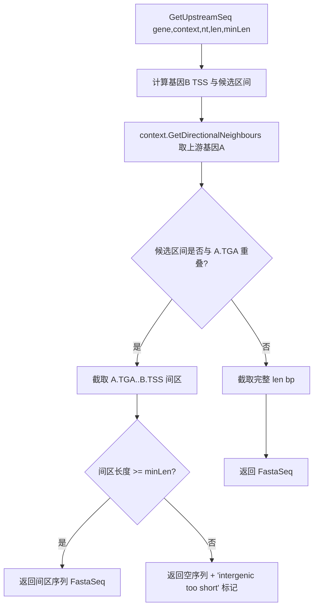

## 用户需求

优化 Bio.Assembly 中 `ContextModel\Promoter\Extensions.vb` 的 `GetUpstreamSeq` 函数，改进转录位点上游调控区域序列片段的提取逻辑，使其能智能规避与上游基因终止密码子的重叠。

## 产品概述

为 `GetUpstreamSeq` 增加上游基因重叠感知的调控区提取策略：当目标基因 B 的 TSS 上游 `len` bp 候选区不与上游基因 A 的终止密码子重叠时，直接截取完整 `len` bp；若重叠，则改为截取"上游基因 A 终止密码子 → 基因 B TSS"之间的间区序列，并在间区长度小于最小有效阈值（默认 20bp）时返回空序列并标记说明。

## 核心特性

- 基于 `GenomeContext.GetDirectionalNeighbours` 定位转录方向的上游基因 A，并取其终止密码子（TGA 端）位置。
- 计算基因 B 的 TSS（编码区转录起始端，沿用偏移 1bp 排除 ATG 的现有约定）上游 `len` bp 候选区间，按正/负链方向处理坐标。
- 候选区间与上游基因 A 终止密码子不重叠时，直接截取完整 `len` bp 序列作为调控区。
- 候选区间重叠时，截取 A.TGA 下游端到 B.TSS 之间的间区序列作为调控区。
- 间区长度小于 `minLen`（默认 20bp）时返回空 `FastaSeq`，并在 Headers 标注"intergenic too short / 可能无独立调控区"，不抛异常。
- `GetUpstreamSeq` 新增可选参数 `minLen%`（默认 20），`ParseUpstreamByLength` 透传该参数。

## 技术栈

- 语言：Visual Basic (.NET)，项目为 GCModeller 核心库 Bio.Assembly
- 现有依赖与类型（均已在代码库中确认）：
- `GenomeContext(Of T As IGeneBrief)`：提供 `GetDirectionalNeighbours(gene)` 返回转录方向邻居 `(Upstream, Downstream)`（`GenomeContext.vb` 行 312-325）
- `GeneBrief`：`ATG`（转录起始端）、`TGA`（终止端）属性（`GeneBrief.vb` 行 144-162）
- `IGeneBrief.Location As NucleotideLocation`（`left/right/Strand`）
- 序列截取：`IPolymerSequenceModel.CutSequenceCircular(loci)`（`CutSequence.vb` 行 217），已支持环状基因组边界
- 结果载体：`FastaSeq`（含 `Headers`、`SequenceData`）

## 实现方案

在 `GetUpstreamSeq`（行 110-131）中重写截取逻辑：

1. 由 `gene.Location` 按链方向确定 TSS（转录起始端）。正链 TSS = `left`，负链 TSS = `right`。沿用现有"减 1"偏移排除 ATG 起始碱基。
2. 通过 `context.GetDirectionalNeighbours(DirectCast(gene, GeneBrief))` 取得上游基因 A（需注意 `GetDirectionalNeighbours` 的泛型参数为 `T`，调用处为 `GeneBrief`，因此将 `gene` 经 `DirectCast(Of GeneBrief)` 传入；若 `gene` 非 `GeneBrief` 则退化为原逻辑，保证 `IGeneBrief` 通用性）。
3. 计算候选区间端点（正链 `[TSS-len, TSS-1]`；负链 `[TSS+1, TSS+len]`，并标记 `ComplementStrand`）。
4. 若上游基因 A 存在且候选区间与 A 的 TGA（终止端）重叠：间区区间 = `[A.TGA下游端+1, B.TSS-1]`（按链方向取物理坐标区间），用 `CutSequenceCircular` 截取。
5. 若间区长度 `< minLen`：返回 `New FastaSeq With {.Headers = headers + "intergenic too short", .SequenceData = ""}`；否则返回间区序列。
6. 若不重叠：维持原逻辑截取完整 `len` bp。

### 关键技术决策

- **复用 `GetDirectionalNeighbours` 而非自行扫描**：避免重复实现邻居定位逻辑，时间与 `GetPhysicalNeighbours` 同为 O(log N) 二分定位，符合现有架构且零新增复杂度。
- **链方向处理沿用既有模式**（行 113-121）：正链向上游（坐标减小）取区间，负链向坐标增大方向取区间并标记互补链，确保与原有 `CutSequenceCircular` 行为一致。
- **`IGeneBrief` 通用性**：因 TGA/ATG 仅在 `GeneBrief` 暴露，采用 `TryCast`/`DirectCast` 获取；获取失败（非 GeneBrief 实例）时回退到原固定长度截取，保证向后兼容。
- **阈值透传**：`ParseUpstreamByLength` 新增 `Optional minLen% = 20`，调用处 `gene.GetUpstreamSeq(genes, nt, length, minLen)` 透传，保持 API 默认值向后兼容。

## 实现注意事项

- 边界与环状：复用 `CutSequenceCircular` 处理跨原点（负坐标/超限）情况，无需自行处理 wrap-around。
- 空上游邻居：若 `GetDirectionalNeighbours` 返回 `Upstream Is Nothing`（首基因/染色体末端），直接走不重叠分支取完整 `len` bp。
- 坐标修正：候选区间 `left` 可能为负，由 `CutSequenceCircular` 内部处理；不要在函数内强制 clamp，避免静默丢失上游信号（与现有行为一致）。
- 日志：重叠/间区过短时复用现有 `warning`/注释风格在 remaks 中说明，避免引入新日志依赖；不输出大段序列。
- 向后兼容：函数签名新增可选参数置于末尾，现有调用方无需修改即可编译运行。

## 架构设计

仅修改已有模块内部逻辑，不引入新架构模式。数据流：
`ParseUpstreamByLength` → 并行遍历 `GeneBrief` → `GetUpstreamSeq(gene, context, nt, len, minLen)` → 利用 `context.GetDirectionalNeighbours` 取上游基因 → 计算区间 → `nt.CutSequenceCircular` → 返回 `FastaSeq`。



## 目录结构

```
g:/GCModeller/src/GCModeller/core/Bio.Assembly/
└── ContextModel/
    └── Promoter/
        └── Extensions.vb   # [MODIFY] 重写 GetUpstreamSeq 增加上游基因重叠感知逻辑与 minLen 参数；
                            #           ParseUpstreamByLength 增加 Optional minLen% = 20 并透传；
                            #           复用 GetDirectionalNeighbours、GeneBrief.ATG/TGA、
                            #           CutSequenceCircular；更新 XML 注释说明新行为。
```

（仅此一个文件需要修改；其余类型与工具方法均为已存在并验证可复用的 API）

## 关键代码结构（接口层面）

- `GetUpstreamSeq` 新签名（保留向后兼容）：
- `Public Function GetUpstreamSeq(gene As IGeneBrief, context As GenomeContext(Of GeneBrief), nt As IPolymerSequenceModel, len%, Optional minLen% = 20) As FastaSeq`
- 说明：为支持 `GetDirectionalNeighbours(Of GeneBrief)` 与 `GeneBrief.TGA`，`context` 形参类型调整为 `GenomeContext(Of GeneBrief)`（与 `ParseUpstreamByLength` 中 `New GenomeContext(Of GeneBrief)(...)` 一致）；`gene` 内部 `DirectCast(Of GeneBrief)` 以读取 TGA/ATG，非 GeneBrief 时退化为原逻辑。
- `ParseUpstreamByLength` 新签名：
- `Public Function ParseUpstreamByLength(context As PTT, nt As IPolymerSequenceModel, length%, Optional minLen% = 20) As Dictionary(Of String, FastaSeq)`