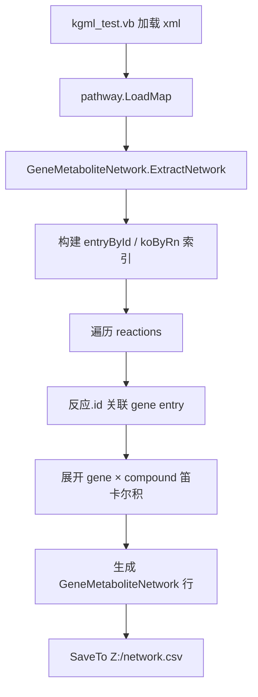

## 用户需求概述

基于已加载的 KEGG KGML 通路数据，提取代谢反应网络，以基因-代谢物关联长表形式导出。

## 核心功能

- 通过 `pathway.LoadMap` 加载 KGML 文件为 `pathway` 对象后，在 `GeneMetaboliteNetwork.ExtractNetwork` 中解析其代谢反应网络。
- 将每一个反应展开为「基因 × 代谢物」的长表行：每行包含 gene_id、ko_id、compound_id、reaction_id、pathway_id、pathway_title、role（substrate/product）。
- 通过 `reaction.id` 精确关联对应的 `gene` 类型 entry，取基因列表；通过反应底物/产物取代谢物，并标注方向（role）。
- 通过 reaction 编号关联 `ortholog` entry 解析 ko_id；能匹配则填，不能则留空字符串，不丢弃行。
- 使用测试目录中的 4 个 taes 物种特异性 KGML 文件运行 `Test/kgml_test.vb`，将结果 `SaveTo("Z:/network.csv")`。

## 边界与约定

- 输出为完全展开长表，所有字段均为单值字符串（适配 `SaveTo` CSV 导出与后续网络分析）。
- 处理空通路（如 taes04120 无 `<reaction>`）时不报错、不产出行。
- 仅在 `GeneMetaboliteNetwork.vb` 内实现；不修改 KGML.vb、Elements 数据模型类及测试文件。

## 技术栈

- 语言：Visual Basic (.NET, VB.NET)，沿用现有项目 `Bio.Assembly` 代码风格
- 序列化/数据框架：`Microsoft.VisualBasic.Data.Framework`（`SaveTo` 扩展）、`Microsoft.VisualBasic.Linq`（`IteratesALL`/`Select`/`SafeQuery`）
- 测试运行：`Test/kgml_test.vb` 已就绪，直接运行验证

## 实现方案

### 总体策略

在 `GeneMetaboliteNetwork.ExtractNetwork(kgml As pathway)` 中，以 `reaction.id` 为稳健 join key 关联 `gene` 类型 entry（实测 4 个文件 100% 一一对应），遍历每个反应，将基因列表与底物/产物代谢物做笛卡尔展开，生成每行一个 (gene_id, compound_id) 的 `GeneMetaboliteNetwork` 记录。

### 关键决策与权衡

1. **join key 选择 `reaction.id` 而非 reaction name 字符串**：实测确认 `<reaction id>` 与 `gene entry id` 完全相等且 name 一致，比现有 `ReactionNetworkExport` 按 name 建索引更可靠（规避 name 含多个 rn 空格分隔的拆分歧义）。
2. **ko_id 解析**：建立 `koByRn = ortholog entries → (rn → ko:Kxxxxx[])` 字典（参考 `ReactionNetworkExport` 模式：`entry.reaction.StringSplit(" ")` 配 `entry.name`）；当前反应的全部 rn（rxn.name 按空格拆分）任一命中即取 ko 列表，合并去重；无命中则 `ko_id = ""`。遵循用户「能填则填，否则留空」决策。
3. **role 字段**：按用户决策在类中新增 `Public Property role As String`，取值 "substrate"/"product"，保留反应方向信息。
4. **笛卡尔展开**：对每个 gene entry 的多个 gene（name 空格拆分去 `:` 前缀）+ 每个 substrate/product 的 compound（name 去 `:` 前缀），逐对产生一行，保证长表完整。
5. **空保护**：`kgml.reactions Is Nothing OrElse 空` 时直接返回（Iterator 不 yield），避免 taes04120 类无反应通路崩溃。

### 性能与可靠性

- 时间复杂度 O(R × G × C)，R=反应数，G=基因数/反应，C=代谢物数/反应；数据规模小（单图 ≤62 反应），无性能瓶颈。
- 索引 `entryById` (Dictionary, O(1) 查找) 与 `koByRn` 仅构建一次，避免 N+1 遍历。
- 复用现有 `Extensions.GetTagValue(":")` 风格（或直接 `Split(":"c).Last`）统一 id 解析，保持与 `GeneNetworkExport` 一致。

## 实现备注

- `gene_id`：保留完整 KEGG id（如 `taes:123057580`），与 entry.name 原始格式一致，便于后续回查。
- `reaction_id`：取 `rxn.name`（可能含多个 rn，空格分隔），保留完整反应标识。
- `compound_id`：取 `compound.name` 去 `:` 前缀（如 `C00082`）；如需保留 `cpd:` 前缀可在实现时确认。
- 复用 `Microsoft.VisualBasic.Linq` 的 `SafeQuery`/`IteratesALL` 防御空集合。
- 不改动测试与数据模型类，仅在目标文件内实现，控制改动范围。

## 架构设计

数据流：



## 目录结构

```
g:/GCModeller/src/GCModeller/core/Bio.Assembly/
└── Assembly/KEGG/Web/Map/KGML/
    └── GeneMetaboliteNetwork.vb   # [MODIFY] 在现有 GeneMetaboliteNetwork 类中新增 role 字段，并实现 ExtractNetwork(kgml) Iterator。负责：构建 entryById 与 koByRn 索引；遍历 reaction，按 reaction.id 取 gene entry，展开 gene×compound 为长表行，填充 gene_id/ko_id/compound_id/reaction_id/pathway_id/pathway_title/role。需处理 kgml.reactions 为空的情况。
```

## 关键代码结构

```
Public Class GeneMetaboliteNetwork
    Public Property gene_id As String
    Public Property ko_id As String
    Public Property compound_id As String
    Public Property reaction_id As String
    Public Property pathway_id As String
    Public Property pathway_title As String
    Public Property role As String   ' 新增：substrate / product

    Public Shared Iterator Function ExtractNetwork(kgml As pathway) As IEnumerable(Of GeneMetaboliteNetwork)
        ' 防御空反应；构建 entryById / koByRn 索引；
        ' 遍历 reactions，按 id 取 gene entry，笛卡尔展开 gene×compound，yield 每行
    End Function
End Class
```