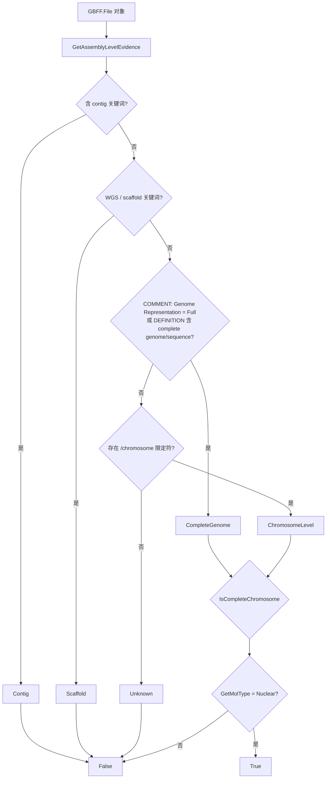

## 用户需求

在上一轮新增的 GenBank 分子类型判定模块（`MolType.vb`）基础上，再增加一套"组装完整性"判定能力，用于泛基因组分析中筛选**完整组装的染色体基因组**数据。

## 产品概述

用户正在做泛基因组分析，需要从 pangenome 目录的 gbff 数据中筛出"完整组装的染色体基因组记录"作为分析输入。现有能力只能判断分子类型（核基因组/质粒/细胞器/病毒/RNA），无法区分"完整组装"与"WGS/scaffold/contig 级草图"，因此需要新增独立的组装水平判定入口。

## 核心特性

- **主帮助函数**：`IsCompleteChromosome(gbk As File) As Boolean` —— 判断目标 genbank 数据对象是否为"完整组装的染色体基因组"。判定条件为：分子类型为核基因组 **且** 组装水平属于"完整基因组/染色体级"。
- **组装水平枚举**：`GenomeAssemblyLevel`，取值 `Unknown / CompleteGenome / ChromosomeLevel / Scaffold / Contig`。
- **分级判定函数**：`GetAssemblyLevel(gbk) As GenomeAssemblyLevel`，按"排除 WGS/scaffold/contig → 明确完整信号 → 宽松染色体级 → Unknown"顺序判定。
- **证据结构**：`AssemblyLevelEvidence`（`Level / Source / Hit / Value`），便于排查误判与日志输出。
- **宽松口径（已确认）**：ENA 风格记录（无 COMMENT、DEFINITION 为 "... genome assembly, chromosome: I"、但有 `/chromosome` 且长度接近完整染色体）**算**完整组装；凡是非 WGS、有 `/chromosome` 限定符、无 scaffold/contig 迹象的染色体级记录都算完整。
- **测试输出增强**：`Test\gbMolTypeTest.vb` 逐条记录额外打印组装水平与 `IsCompleteChromosome` 结果，结尾汇总表增加组装水平分布与"完整染色体基因组"计数。
- **范围约束**：只做单条 genbank 对象的判定，**不**新增文件级/目录级批量筛选 API。

## 不做的事

- 不修改 `File.vb` 的 `isPlasmid`（保持向后兼容）。
- 不新增目录扫描、批量过滤扩展方法或命令行参数（用户自行实现批量筛选）。
- 不改动 `MolType.vb` 的既有公开签名。

## 技术栈

- 语言/框架：Visual Basic .NET，`net10.0`，SDK 风格项目（新增 `.vb` 自动纳入编译，无需改 ItemGroup）
- 根命名空间 `SMRUCC.genomics`；模块命名空间 `Assembly.NCBI.GenBank.GBFF`（与 `MolType.vb`、`File.vb` 一致）
- 依赖既有 API：`MolTypeClassifier.GetMolType/GetSourceFeature`、`File.Comment/.Definition/.Keywords/.Locus/.Features`、`Feature.Query(key As String)`、`File.LoadDatabase`

## 实现方案

### 核心思路

"完整组装"与"分子类型"是**两个正交维度**：WGS 记录的 DEFINITION 里同样含 "chromosome" 字样，经分子类型分类器会判为 `Nuclear`，因此不能靠分子类型区分完整性，必须独立判定。最终 `IsCompleteChromosome` = 分子类型 `Nuclear` **且** 组装水平 ∈ {`CompleteGenome`, `ChromosomeLevel`}。

### 判定流水线（顺序不可调换）

1. `gbk Is Nothing` → `Unknown`
2. **降级排除（最高优先级，必须早于 `/chromosome` 判定，否则 WGS 会被误判为染色体级）**

- DEFINITION / KEYWORDS / `/submitter_seqid` 含 `contig` → `Contig`
- DEFINITION 含 `whole genome shotgun`、KEYWORDS 含 `WGS`、DEFINITION/KEYWORDS/`/submitter_seqid` 含 `scaffold` → `Scaffold`

3. **明确完整信号** → `CompleteGenome`

- COMMENT 中出现 `Genome Representation` 且 `::` 后的取值为 `Full`；（实测：NCBI/RefSeq 完整基因组有此行，WGS 记录没有该行，只有 `Assembly Name :: ...`）
- 或 DEFINITION 含 `complete genome` / `complete sequence`

4. **宽松染色体级**（ENA 风格 `genome assembly, chromosome: I`、Cryptococcus `chromosome 1.` 等无 complete 字样）→ `ChromosomeLevel`：存在 `/chromosome` 限定符
5. 其余 → `Unknown`

### 关键技术决策与取舍

- **`Genome Representation` 不做事子串匹配**：COMMENT 被解析器拼成单行（`Genome Representation  :: Full`），需先定位 `Genome Representation`，再找其后的 `::`，取后续首个 token 判断是否以 `Full` 开头。这样可区分 `Full` 与 `Partial`，避免 `Index Of("Full")` 命中注释正文。
- **不直接复用 `File.IsWGS`**：该属性内部未对 `Definition`/`Keywords` 判空（`For Each s As String In Keywords` 在 `KeyWordList` 为 Nothing 时抛 NRE）。新模块内实现安全的 `IsWgsRecord`。
- **不要求拓扑为 circular**：真菌线性染色体（Cryptococcus `linear`）同样是完整组装，环形拓扑不能作为定性条件。
- **`GetAssemblyLevel` 只描述"该复制子的组装完整度"**，不叠加分子类型（质粒记录若 DEFINITION 含 "complete sequence" 会返回 `CompleteGenome`，这是正确的复制子级语义）；染色体的语义由 `IsCompleteChromosome` 叠加 `Nuclear` 约束实现。
- **性能**：判定为 O(1) 字符串扫描，关键词表用模块级 `Private ReadOnly` 静态数组；COMMENT/DEFINITION 文本每次调用只读一次并缓存为局部字符串，不重复拼接。测试侧仍保持 `LoadDatabase` 惰性枚举，逐条判定不驻留全量记录。

### 边界与防御

- `Comment`、`Comment.Comment`、`Definition`、`Definition.Value`、`Keywords`、`Keywords.KeyWordList`、`Locus` 全部可能为 Nothing，访问前一律判空。
- source feature 一律通过 `MolTypeClassifier.GetSourceFeature(gbk)` 获取，不使用 `Features.source`（空列表会下标越界）。
- `/chromosome`、`/submitter_seqid` 用字符串 key 查询（`FeatureQualifiers` 枚举中不存在）。

## 架构设计



## 目录结构

```
core/Bio.Assembly/
├── Assembly/NCBI/Database/GenBank/GBK/
│   ├── MolType.vb          # [不改动] GenomeMolType / MolTypeClassifier，新模块依赖其 GetMolType 与 GetSourceFeature
│   ├── File.vb             # [不改动] isPlasmid 保持原语义
│   └── AssemblyLevel.vb    # [NEW] 组装水平判定模块
│                           #   - Enum GenomeAssemblyLevel：
│                           #       Unknown=0 / CompleteGenome=1 / ChromosomeLevel=2 / Scaffold=3 / Contig=4
│                           #   - Structure AssemblyLevelEvidence：Level / Source / Hit / Value + ToString()
│                           #   - Module AssemblyLevelClassifier：
│                           #       <Extension> IsCompleteChromosome(gbk As File) As Boolean
│                           #       <Extension> GetAssemblyLevel(gbk As File) As GenomeAssemblyLevel
│                           #       <Extension> GetAssemblyLevelEvidence(gbk As File) As AssemblyLevelEvidence
│                           #       私有：GetComment(gbk) / IsWgsRecord(gbk, header) /
│                           #             IsGenomeRepresentationFull(comment) / MatchAny(...) / Evidence(...)
│                           #   命名空间 Assembly.NCBI.GenBank.GBFF
└── Test/
    └── gbMolTypeTest.vb    # [MODIFY] 每条记录增打印 [level] 与 IsCompleteChromosome 结果；
                            #   结尾汇总表新增 GenomeAssemblyLevel 分布与"完整染色体基因组"计数
```

## 关键代码结构

```
Namespace Assembly.NCBI.GenBank.GBFF

    ''' <summary>
    ''' 目标genbank记录所对应的基因组组装水平
    ''' </summary>
    Public Enum GenomeAssemblyLevel
        ''' <summary>无法判定</summary>
        Unknown = 0
        ''' <summary>完整组装的基因组(COMMENT 中 Genome Representation :: Full，或 DEFINITION 声明 complete)</summary>
        CompleteGenome = 1
        ''' <summary>染色体级组装(无 complete 声明但存在 /chromosome 限定符，例如 ENA 风格记录)</summary>
        ChromosomeLevel = 2
        ''' <summary>WGS / scaffold 级别的草图组装</summary>
        Scaffold = 3
        ''' <summary>contig 级别的草图组装</summary>
        Contig = 4
    End Enum

    ''' <summary>
    ''' 组装水平判定结果的证据描述
    ''' </summary>
    Public Structure AssemblyLevelEvidence
        Public Property Level As GenomeAssemblyLevel
        ''' <summary>证据来源：contig / wgs / scaffold / genome_representation / definition / chromosome / none</summary>
        Public Property Source As String
        Public Property Hit As String
        Public Property Value As String
    End Structure

    Public Module AssemblyLevelClassifier

        ''' <summary>主帮助函数：目标genbank对象是否为完整组装的染色体基因组数据</summary>
        <Extension>
        Public Function IsCompleteChromosome(gbk As File) As Boolean

        <Extension>
        Public Function GetAssemblyLevel(gbk As File) As GenomeAssemblyLevel

        <Extension>
        Public Function GetAssemblyLevelEvidence(gbk As File) As AssemblyLevelEvidence
    End Module
End Namespace
```

## 实现要点（执行细节）

- **关键词表**（模块级 `Private ReadOnly` 静态数组，不区分大小写子串匹配）：
- `wgsKeys = {"whole genome shotgun", "WGS"}`
- `scaffoldKeys = {"scaffold"}`
- `contigKeys = {"contig"}`
- `completeKeys = {"complete genome", "complete sequence"}`
- **文本池拼接**：`header = Definition.Value + KEYWORDS 各项 + /submitter_seqid + Source.SpeciesName`（与 `MolType.vb` 的 `GetHeaderText` 风格一致，但在本模块内私有实现，避免跨模块耦合）
- **COMMENT 取值**：`If gbk.Comment Is Nothing Then "" Else gbk.Comment.Comment`（`COMMENT.Comment` 解析时已保证非 Nothing，空则为 `String.Empty`）
- **日志/输出**：测试打印只取 DEFINITION 前 60 字符；证据只输出命中的来源与关键词，不打印整段 COMMENT
- **爆炸半径**：仅新增 1 个文件 + 修改 1 个测试文件；`MolType.vb` 与 `File.vb` 的公开行为完全不变

## 验证计划（冒烟必须覆盖的四类数据）

| 数据文件 | 预期 |
| --- | --- |
| `K:\pangenome\Escherichia_coli\genbank\GCA_002269325.1_genomic.gbff` | 染色体 `CompleteGenome` + True；2 条质粒 `CompleteGenome`/`ChromosomeLevel` 但 `IsCompleteChromosome=False`（分子类型为 Plasmid） |
| `K:\pangenome\Escherichia_coli\genbank\GCA_000269645.2_genomic.gbff` | `Scaffold`，False（WGS 不得被误判为完整） |
| `K:\pangenome\Escherichia_coli\genbank\GCA_900096795.1_genomic.gbff` | `ChromosomeLevel`，True（ENA 风格、无 COMMENT、有 `/chromosome="I"`） |
| `K:\pangenome\Cryptococcus_neoformans\genbank\GCA_000149245.3_genomic.gbff` | 14 条染色体 `CompleteGenome` + True；线粒体 False（分子类型为 Mitochondrion） |


## Agent Extensions

### SubAgent

- **code-explorer**
- 用途：在新增 `AssemblyLevel.vb` 前，确认 `SMRUCC.genomics` 全仓库内 `GenomeAssemblyLevel`、`AssemblyLevelEvidence`、`AssemblyLevelClassifier`、`GetAssemblyLevel`、`IsCompleteChromosome` 无同名类型/方法冲突，并复核 `Keywords.COMMENT` 的解析行为（避免误用 `File.Comment` 为 Nothing 的场景）。
- 预期结果：输出无冲突结论 + 需复用的既有 API 签名清单，确保新模块命名与命名空间选择安全。