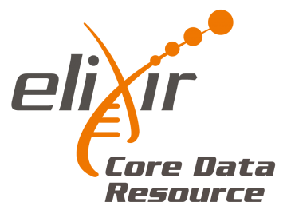

# ELIXIR Core Data Resources

ELIXIR Core Data Resources are a set of European data resources of fundamental importance to the wider life-science community and the long-term preservation of biological data.

Identification of the ELIXIR Core Data Resources involves a careful evaluation of the multiple facets of the data resources. Indicators used in the evaluation are grouped into five categories:

+ Scientific focus and quality of science
+ Community served by the resource
+ Quality of service
+ Legal and funding infrastructure, and governance
+ Impact and translational stories

The details of the selection criteria are described in the F1000R ELIXIR track article 'Identifying ELIXIR Core Data Resources'. The initial Core Data Resource list was defined in July of 2017. For a summary of that process, watch the ELIXIR webinar presented in September 2017. The list will be reviewed regularly.

ELIXIR is committed to Open Access as a core principle for publicly funded research. ELIXIR Core Data Resources should reflect this commitment and have terms of use or a licence that enables the reuse and remixing of data. The Creative Commons licenses CC0, CC-BY or CC-BY-SA are all conformant with the Open Definition (http://opendefinition.org/licenses/), as are equivalent open terms of use.1

For an introduction to the Core Data Resources list, please view this summary.

## ELIXIR Core Data Resource list

| Core Data Resource                                  | Data type                                                                                                                                                                                                                                                                                                                               |
|-----------------------------------------------------|-----------------------------------------------------------------------------------------------------------------------------------------------------------------------------------------------------------------------------------------------------------------------------------------------------------------------------------------|
| ArrayExpress                                        | Functional Genomics Data from high-throughput functional genomics experiments.                                                                                                                                                                                                                                                          |
| BRENDA                                              | Database of enzyme and enzyme-ligand information, across all taxonomic groups, manually extracted from primary literature and extended by text mining procedures, integration of external data and prediction algorithms.                                                                                                               |
| CATH                                                | A hierarchical domain classification of protein structures in the Protein Data Bank.                                                                                                                                                                                                                                                    |
| ChEBI                                               | Dictionary of molecular entities focused on ‘small’ chemical compounds.                                                                                                                                                                                                                                                                 |
| ChEMBL                                              | Database of bioactive drug-like small molecules, it contains 2-D structures, calculated properties and abstracted bioactivities.                                                                                                                                                                                                        |
| EGA                                                 | Personally identifiable genetic and phenotypic data resulting from biomedical research projects.                                                                                                                                                                                                                                        |
| ENA                                                 | Nucleotide sequencing information, covering raw sequencing data, sequence assembly information and functional annotation.                                                                                                                                                                                                               |
| Ensembl                                             | Genome browser for vertebrate genomes that supports research in comparative genomics, evolution, sequence variation and transcriptional regulation.                                                                                                                                                                                     |
| Ensembl Genomes                                     | Comparative analysis, data mining and visualisation for the genomes of non-vertebrate species.                                                                                                                                                                                                                                          |
| Europe PMC                                          | Europe PMC is a repository, providing access to worldwide life sciences articles, books, patents and clinical guidelines.                                                                                                                                                                                                               |
| Human Protein Atlas                                 | The Human Protein Atlas contains information for a large majority of all human protein-coding genes regarding the expression and localization of the corresponding proteins based on both RNA and protein data.                                                                                                                         |
| The IMEx Consortium: represented by IntAct and MINT | IntAct provides a freely available, open source database system and analysis tools for molecular interaction data. MINT focuses on experimentally verified protein-protein interactions mined from the scientific literature by expert curators.                                                                                        |
| InterPro                                            | Functional analysis of protein sequences by classifying them into families and predicting the presence of domains and important sites. *Note: This is an umbrella resource to which many collaborating databases contribute. In naming InterPro as a Core Data Resource, the critical role of the constituent databases is recognised.* |
| Orphadata                                           | The Orphadata platform provides the scientific community with comprehensive, high-quality datasets related to rare diseases and orphan drugs, in a reusable and computable format.                                                                                                                                                      |
| PDBe                                                | Biological macromolecular structures.                                                                                                                                                                                                                                                                                                   |
| PRIDE                                               | Mass spectrometry-based proteomics data, including peptide and protein expression information (identifications and quantification values) and the supporting mass spectra evidence.                                                                                                                                                     |
| SILVA                                               | SILVA provides comprehensive, quality checked and regularly updated datasets of aligned small (16S/18S, SSU) and large subunit (23S/28S, LSU) ribosomal RNA (rRNA) sequences for all three domains of life (Bacteria, Archaea and Eukarya).                                                                                             |
| STRING                                              | Known and predicted protein-protein interactions.                                                                                                                                                                                                                                                                                       |
| UniProt                                             | Comprehensive resource for protein sequence and annotation data.                                                                                                                                                                                                                                                                        |

In addition to the Core Data Resources, ELIXIR has compiled a list of recommended repositories for experimental data, the ELIXIR Deposition Databases.

Further information: Rachel Drysdale (rachel.drysdale@elixir-europe.org)

> + [1] Should a Core Data Resource lose its funding and the only option to remain viable requires a reversion to a non-open license, the license status and exception (e.g. requirement for industry co-funding) may be revisited by the ELIXIR Heads of Nodes Committee. Back to text.