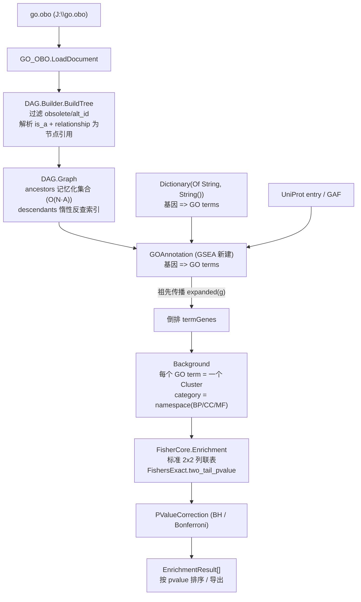

## 产品概述

在 GCModeller 的 VB.NET 基因本体（Gene Ontology）分析体系中，为 GSEA 富集分析项目补齐"GO DAG 富集分析"能力，并对整条富集链路上审查发现的算法错误进行修复，最终用 `J:\go.obo` 在 test 项目中完成端到端验证。

## 核心功能

### 1. GO DAG 富集分析模块（新建于 gsea-netcore5.vbproj）

- 从 `go.obo` 载入本体并构建 DAG 图（复用 `GeneOntology` 项目的 `DAG.Graph`）。
- 接受"基因ID => GO term 列表"的注释字典作为核心输入；同时提供 UniProt `entry` 序列与 GAF 注释文件的重载入口。
- 依据 DAG 的 `is_a` / `part_of` 关系做**祖先传播（ancestor closure）**：只注释到深层 term 的基因，自动计入其所有祖先 term 的基因集。
- 按 BP / CC / MF 三大本体切分与过滤。
- 构建 `Background`（每个 GO term 为一个 `Cluster`），调用 Fisher 精确检验做超几何富集，输出 `EnrichmentResult`（term、name、namespace、pvalue、FDR、enriched 基因、score）。
- 内置 BH（Benjamini-Hochberg）FDR 校正与 Bonferroni 校正，结果按 p 值排序并支持导出表格。

### 2. GO DAG 构建算法修复（GeneOntology 项目）

- 消除祖先路径枚举导致的组合爆炸（当前构建 go.obo 必然卡死/OOM）。
- 修正 `relationship` 边中 GO 编号被 `:` 截断、悬空父节点引用、`is_obsolete`/`alt_id` 未过滤、`def` 构造空引用崩溃、`header` 永不赋值等缺陷。
- 统一 `Family(id)` 与 `Family(id, root)` 的链语义，补齐环检测与空引用防护。

### 3. 富集链路算法修复（FisherCore + GSEA）

- 修正 Fisher 2x2 列联表构造错误（四格之和错误、b 重复计入 a）。
- 修复富集主循环进度条死代码、`IDConvertor.Converts` 缺失 Return、`Gmt` 解析类型窄化。
- 修正 rank-based GSEA 的 ES 步长、置换检验洗牌偏差与 ES 取值。

### 4. 测试验证

- 用 `J:\go.obo` 构建 DAG：校验祖先/子孙集合正确性、BP/CC/MF 根归属、构建耗时。
- 用模拟基因-GO 注释数据跑端到端 GO 富集，验证祖先传播命中数、p 值、FDR 与 BP/CC/MF 分组。

## 技术栈

- 语言/框架：VB.NET，.NET 10（`net10.0`），SDK 风格 `.vbproj`
- 目标项目：`G:\GCModeller\src\GCModeller\annotations\GSEA\GSEA\gsea-netcore5.vbproj`（RootNamespace `SMRUCC.genomics.Analysis.HTS.GSEA`）
- 依赖项目（已引用，无需新增）：
- `FisherCore\Fisher.NET5.vbproj`（`Background` / `Cluster` / `BackgroundGene` / `EnrichmentResult` / Fisher 富集主循环）
- `data\GO_gene-ontology\GeneOntology\go_owl-netcore5.vbproj`（`GO_OBO` / `DAG.Graph` / `Term`）
- `foundation\OBO_Foundry\obo_foundry-netcore5.vbproj`（`OBOFile` / `RawTerm` / `header`）
- `runtime\sciBASIC#\...\stats-netcore5.vbproj`（`Hypothesis.FishersExact.FishersExactTest`、`NullHypothesis`）
- `runtime\sciBASIC#\Microsoft.VisualBasic.Core\src\Core.vbproj`（`Index(Of T)`、`NamedValue`、`Tqdm`、`IStatPvalue/IStatFDR`）
- `core\Bio.Assembly\biocore-netcore5.vbproj`（`XmlDataModel`、`Synonym`）
- **不新增 ProjectReference**：FDR/BH 在本模块内自实现（约 25 行），避免把 `Math\Math.NET5.vbproj` 拉进 GSEA 的 NuGet 包依赖图（该工程 `GeneratePackageOnBuild=true`）。

## 实现方案

### 总体策略

"先修地基，再盖楼，最后压测"：先把 `GeneOntology.DAG` 的构建/遍历算法改成**集合化 + 记忆化**（消除指数爆炸），再在其上实现 GSEA 侧的 GO 富集模块，最后用 `J:\go.obo` 做端到端验证；同时把代码审查中发现的富集链路缺陷一并修正。

### 关键技术决策

**决策 1：祖先闭包用"记忆化集合"替代"路径枚举"（P0）**

- 现状 `Graph.Family(id)` 递归枚举**所有祖先路径**，`CreateClusterMembers` 对每个 term 都调用一次。go.obo 约 5 万 term、多父 DAG，路径数指数级 → 构建必然卡死/OOM。
- 改为：对每个节点计算**祖先集合** `HashSet(Of String)`，通过迭代式 DFS + 访问栈（环检测）+ 结果缓存，每个节点只算一次。
- 复杂度：时间 `O(N · A)`（N=term 数，A=平均祖先数，GO 约 20~50），空间 `O(N · A)`（约 100~250 万条引用 ≈ 20~40 MB）。对比原实现是指数级 → 线性级。
- 子孙索引（原 `clusters`）由祖先集合**单次反查聚合**得到：对每个 term，把自己加入其所有祖先的子孙列表；改为**惰性构建**（`Lazy` 字段），使 `New Graph(...)` 本身保持轻量。

**决策 2：`GetClusterMembers` 语义保持向后兼容**

- 原语义返回"仅子孙（不含自身）"（`annotations\GO\GoEnrichment.PullOntologyTerms` 依赖它，并自行 `JoinIterates(cluster.members)` 补回自身）。
- 保留 `GetClusterMembers(id)` = 子孙不含自身；新增 `GetAncestors(id, includeSelf)` / `GetDescendants(id, includeSelf)` 显式 API。避免在修复时破坏外部调用方。

**决策 3：祖先传播采用"基因侧展开 + 倒排"，而非"term 侧子树合并"**

- 对每个基因：`expanded(g) = ⋃_{t ∈ terms(g)} (ancestors(t) ∪ {t})`，再倒排成 `termGenes`。
- 复杂度 `O(G · A)`（G = 基因数），远优于对每个 term 做子树遍历再合并（会重复遍历共享子图）。
- 关系类型可配置：默认 `is_a + part_of`（与 topGO / clusterProfiler 默认一致），可选加入 `regulates`。

**决策 4：Fisher 列联表修正为标准超几何形式（用户已确认）**

- 现状 `FishersExact(a, b, c, d)`，其中 `b = cluster.size`（含 a）、`d = genes - b`，导致 `n = genes + inputSize`、行/列边际错位，p 值系统性偏小。
- 修正为 `n11 = a`、`n12 = inputSize - a`、`n21 = cluster.size - a`、`n22 = genes - cluster.size - inputSize + a`。
- 前置保障：先把输入基因列表过滤到背景 universe 内，保证 `a ≥ cluster.size + inputSize - genes`，从而 `n22 ≥ 0`（`|A∩B| ≥ |A|+|B|-N` 恒成立）。

**决策 5：FDR 本地实现而非新增依赖**

- `Math\Math\Extensions.vb` 已有 `FDR(Of T As IStatFDR)` 与 `BHCorrection`，但 GSEA 未引用该项目。为控制改动半径（GSEA 会打包 NuGet），在新建模块内实现标准 BH（从大到小取 `min` 保证单调）+ Bonferroni。test 项目已引用 `Math.NET5.vbproj`，可在测试中做交叉校验。

## 实现细节（执行要点）

### 性能热点与规避

- **热点 1：DAG 构建**。禁止在构造函数中做路径枚举；祖先表记忆化一次，子孙表惰性。用 `Stopwatch` 在测试中打印构建耗时（目标：go.obo 完整构建 < 15 s）。
- **热点 2：祖先传播**。用 `Dictionary(Of String, List(Of String))` + 预分配，避免 LINQ 链式 `SelectMany` 造成的多趟遍历；对每个基因用 `HashSet(Of String)` 去重后再倒排。
- **热点 3：富集主循环**。复用 FisherCore 的 `Enrichment`，但 GO 背景通常有数千~上万 term，`Cluster.Intersect` 内部懒加载的 `index` 每次调用都重建（若 `isLocustag` 切换）——调用侧须固定 `isLocustag`，不要混用。
- **避免重复计算**：`Background.GetClusterTable()` 在 `PullOntologyTerms` 中被反复调用（在循环外）——新模块须在循环外建一次。

### 向后兼容与改动半径

- `DAG.Graph` 的公开成员 `DAG` / `Family` / `GetClusterMembers` / `InheritsChain` 全部保留签名，仅修内部实现与空值/环防护。
- `calcResult` 的修正会改变既有 p 值（用户已确认）；需同步核查 `annotations\GO\GoEnrichment.vb`、`GSEA\Profiler\CLI\CLI.vb`、`GSEA\test\Module1.vb` 三处调用方是否仍编译通过。
- `Relationship.parent` 的解析修正会让 `Axioms.Infer` 从"必然查不到"变为"可查到"——`Axioms.Infer` 自身无递归环保护，需一并加 `visited` 集合，否则可能栈溢出。
- `Gmt.vb` 由 `Synonym` 改回 `BackgroundGene` 属于类型收窄修复，需确认外部没有对 `members` 做 `Synonym` 赋值。

### 健壮性

- `BuildTree`：跳过 `is_obsolete` / 重复 id；父 term 不存在时跳过该边（不产生 `Nothing` 引用）。
- `alt_id`：建立 `alt_id -> 主 id` 映射表，供注释数据中的旧编号回填。
- 除零保护：`cluster.size = 0` 时 `score` 置 0；`a = 0` 时 p 值置 1。
- 日志：复用 `VBDebugger.EchoLine` / `Call "...".debug`（项目既有模式），只在构建阶段输出 2~3 条，不刷屏；不输出完整基因列表。

## 架构设计



### 数据流

1. `go.obo` → `GO_OBO` → `DAG.Graph`（祖先/子孙索引已就绪）
2. 注释字典/UniProt/GAF → `GOAnnotation` → 按 DAG 展开 → 倒排 → `Background`
3. `Background` + 输入基因集 → Fisher 富集 → BH 校正 → `EnrichmentResult`

## 目录结构

```
g:/GCModeller/src/GCModeller/
├── data/GO_gene-ontology/
│   ├── GeneOntology/                              (go_owl-netcore5.vbproj)
│   │   ├── DAG/Graph.vb                           [MODIFY] 构造函数改为显式 CreateClusterMembers(Me)；clusters 改惰性子孙索引（由祖先集合反查）；新增 GetAncestors(id, includeSelf) / GetDescendants(id, includeSelf) / GetTerm(id)；header 由 GO_OBO 赋值；Family(id) 加空值与环防护并删除死变量 chain；Family(id, root) 修正为把 root 节点加入链中并接入三个 namespace 常量；InheritsChain.Level 在 Tree 为空时由 Route 现算
│   │   ├── DAG/Builder.vb                         [MODIFY] BuildTree 过滤 is_obsolete、去重 id、跳过缺失父节点、把 relationship 解析为 TermNode 引用；新增 AncestorIndex(tree) 记忆化 DFS（带 visiting 栈环检测）；CreateClusterMembers 改为基于祖先集合的单次反查聚合；ConstructNode 处理 alt_id
│   │   ├── DAG/Relationship.vb                    [MODIFY] 修正 parent 解析：不再用 GetTagValue(":") 把 GO:0008361 拆断，改为保留完整 GO id（与 Files/Obo/OntologyRelations.vb 一致）；增加 term As TermNode 引用字段与解析失败保护
│   │   ├── DAG/TermNode.vb                        [MODIFY] 增加 AllParents(relations) 只读属性，合并 is_a 与 relationship 的已解析父节点
│   │   ├── DAG/Fields.vb                          [MODIFY] 修正 def.New 中误用字段 ref(Nothing) 的 NRE，改为局部变量 refs
│   │   ├── DAG/Axioms.vb                          [MODIFY] Infer 增加 visited 集合防环，配合 Relationship 修正后的完整 GO id
│   │   └── Files/Obo/GO.vb                        [MODIFY] 新增/调整使 Graph 可接收 GO_OBO（携带 headers）
│   └── test/
│       ├── DAGtest.vb                             [MODIFY] 路径改为 J:\go.obo；新增祖先/子孙正确性断言（含 GO:0000007 等用例）、根归属断言、Stopwatch 构建耗时输出；Main 末尾调用 GOEnrichmentTest
│       ├── GOEnrichmentTest.vb                    [NEW] 模拟基因-GO 注释数据；验证祖先传播命中数、端到端富集 p 值/FDR、BP/CC/MF 分组、结果导出
│       └── test.vbproj                            [MODIFY] 按需（保持 StartupObject=test.DAGtest）
├── annotations/GSEA/
│   ├── GSEA/                                      (gsea-netcore5.vbproj)
│   │   ├── KnowledgeBase/GO/GOAnnotation.vb       [NEW] Class GOAnnotation：持有 Dictionary(Of String, String()) 原始注释；Expand(dag As DAG.Graph, relations) 做祖先传播；TermGenes 倒排索引；UniverseSize；提供 FromDictionary / FromUniProt / FromGAF 工厂
│   │   ├── KnowledgeBase/GO/GOEnrichment.vb       [NEW] Module GOEnrichment：CreateBackground（注释字典 / UniProt entry / GAF 三重载）→ Background（category=namespace）；Enrichment(background, geneSet, ...) 包装 FisherCore；SplitByOntology；SaveTable 导出
│   │   ├── KnowledgeBase/GO/PValueCorrection.vb   [NEW] Module PValueCorrection：BHCorrection（保证单调）、Bonferroni、FillFDR(Of T As IStatFDR)，按 pvalue 排序
│   │   ├── KnowledgeBase/IDConvertor.vb           [MODIFY] Converts 在 Accession 分支后补 Return
│   │   └── KOBAS/Formats/Gmt.vb                   [MODIFY] members 由 Synonym 改回 BackgroundGene，补齐 names/category/class
│   ├── FisherCore/
│   │   ├── Enrichment.vb                          [MODIFY] calcResult 改为标准超几何 2x2 列联表；b=0 除零保护；主循环改用 Tqdm.Wrap 后的枚举源（修进度条死代码）；CutBackgroundBySize 显式传入真实背景规模
│   │   └── GSEA.vb                                [MODIFY] enrich_score 用"列表中实际命中数"计算步长；ES 取 |max| 与 |min| 中较大者；PermutationTest.ZeroSet 改标准 Fisher-Yates（k ∈ [i, n-1]）
│   └── annotations/GO/GoEnrichment.vb             [AFFECTED-VERIFY] 依赖 GetClusterMembers 与 calcResult，修复后需确认编译与语义仍成立
```

## 关键代码结构

```
' GSEA/KnowledgeBase/GO/GOAnnotation.vb  —— 祖先传播与倒排的核心契约
Public Class GOAnnotation
    ''' 原始注释：基因ID => 直接注释的 GO term 列表
    Public ReadOnly Property raw As Dictionary(Of String, String())
    ''' 背景全集规模（universe，N）
    Public ReadOnly Property universeSize As Integer

    Public Shared Function FromDictionary(map As Dictionary(Of String, String())) As GOAnnotation
    Public Shared Function FromUniProt(entries As IEnumerable(Of entry)) As GOAnnotation
    Public Shared Function FromGAF(gaf As IEnumerable(Of GAF)) As GOAnnotation

    ''' 展开：基因ID => (直接 term ∪ 全部祖先 term)
    Public Function Expand(dag As DAG.Graph,
                          Optional relations As OntologyRelations() = Nothing) As Dictionary(Of String, String())

    ''' 倒排：GO term => 基因ID 集合（供构造 Cluster）
    Public Function TermGenes(dag As DAG.Graph,
                              Optional relations As OntologyRelations() = Nothing) As Dictionary(Of String, List(Of String))
End Class
```

```
' GSEA/KnowledgeBase/GO/GOEnrichment.vb  —— 对外 API 契约
Public Module GOEnrichment
    ''' 由注释构建 GO 背景（每个 GO term 一个 Cluster，category = namespace）
    <Extension>
    Public Function CreateGOBackground(annotations As GOAnnotation,
                                       dag As DAG.Graph,
                                       Optional relations As OntologyRelations() = Nothing,
                                       Optional name$ = Nothing) As Background

    ''' 富集：先按 universe 过滤输入，再走 Fisher，最后 BH 校正
    <Extension>
    Public Function Enrichment(background As Background,
                               geneSet As IEnumerable(Of String),
                               Optional ontology As Ontologies? = Nothing,
                               Optional cutSize As Integer = 3,
                               Optional outputAll As Boolean = False,
                               Optional isLocustag As Boolean = False) As EnrichmentResult()

    ''' 按 BP / CC / MF 切分
    <Extension>
    Public Function SplitByOntology(result As IEnumerable(Of EnrichmentResult)) As Dictionary(Of String, EnrichmentResult())
End Module
```

## 验证标准

1. `dotnet build` 三个工程（GeneOntology / FisherCore / GSEA / test）全部编译通过、无新增警告（FisherCore 有 `TreatWarningsAsErrors=true`，需特别注意）。
2. `J:\go.obo` 构建 DAG：无异常、无卡死，构建耗时可打印；`GO:0000007` 等 term 的祖先链顶端为 `biological_process`；子孙集合与手工反查一致。
3. 端到端 GO 富集：模拟注释中"只注释到深层 term 的基因"能够计入其祖先 term 的 `cluster.size` 与 `enriched` 命中数；`n22 ≥ 0`；p 值 ∈ [0,1]；FDR 单调不减；BP/CC/MF 三组结果均非空。

## Agent Extensions

### SubAgent

- **code-explorer**
- 用途：在修改 `Graph.GetClusterMembers` / `Graph.Family` / `Enrichment.calcResult` / `DAG.Relationship.parent` 这些会被外部依赖的公开成员前，检索全仓库（含 `annotations\GO`、`annotations\GSEA\Profiler`、`annotations\GSEA\test`、`R#` 脚本包等）的真实调用点，确认语义变更的影响面；并在新增 GO 模块时核对 `BackgroundGene` / `GAF` / `UniProt entry.xrefs` 的既有字段与构造约定。
- 预期结果：输出受影响调用点清单（文件 + 行号 + 用法），确保修复不引入编译破坏或静默语义回归。