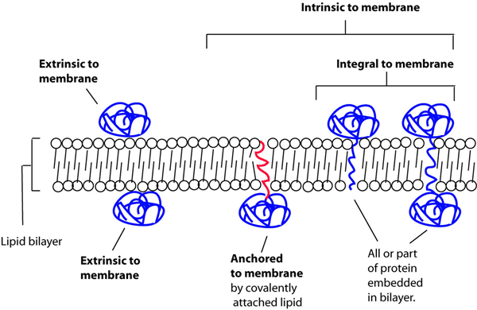
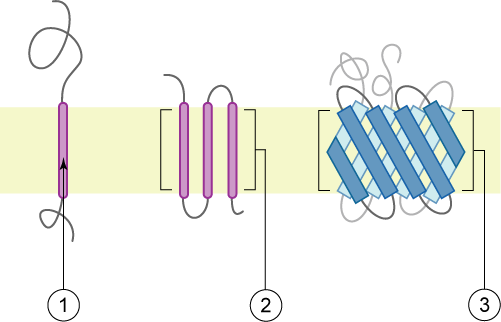
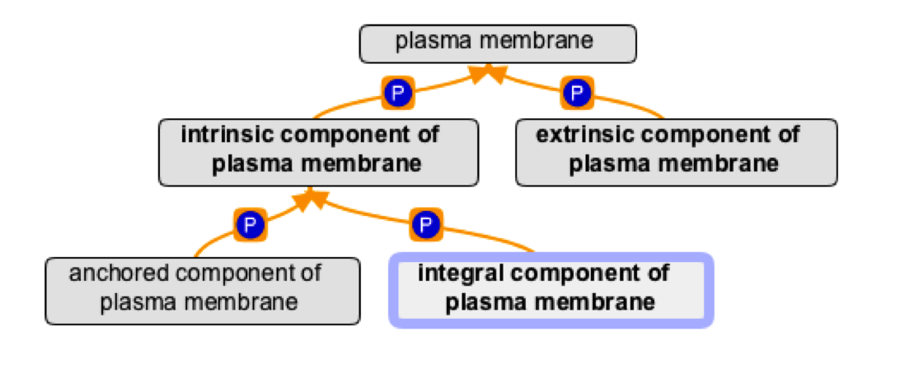
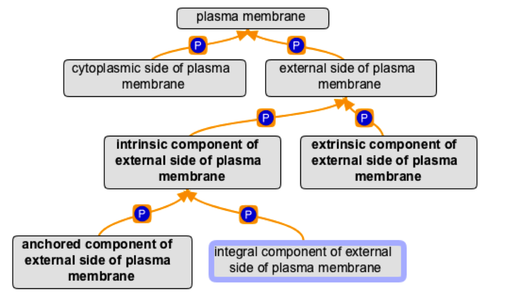
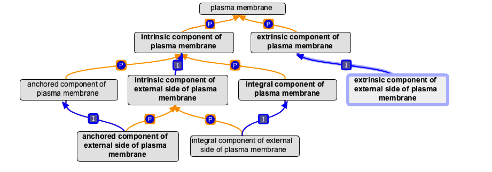

# Membrane Proteins

As GO cellular component terms describe locations where a gene product may act, rather than physical features of proteins or RNAs, the terms integral membrane protein and peripheral membrane protein are present only as non-exact synonyms. GO distinguishes classes of membrane-related location:
extrinsic component of membrane ; GO:0019898 refers to gene products that are associated with membranes, but are neither directly embedded in the membrane nor anchored by covalent bonds to any moiety embedded in the membrane.

intrinsic component of membrane ; GO:0031224 refers to gene products that have some covalently attached moiety embedded in the membrane, and is further split into integral component of membrane ; GO:0016021 and anchored component of membrane ; GO:0031225. The former refers to proteins in which some part of the peptide sequence spans all or part of the membrane (in theory, it could also be used for RNAs embedded in a membrane, if any such exist). A subclass of this covers transmembrane proteins - those that completely span the membrane (see examples in figure 2). The latter refers to gene products tethered to a membrane by a covalently attached anchor, such as a lipid moiety, which is embedded in the membrane.

Each of these terms can have child terms referring to specific membranes, for example intrinsic component of plasma membrane ; GO:0031226 or extrinsic component of vacuolar membrane ; GO:0000306.

Additionally, monotopic (non-membrane spanning proteins, as illustrated in figure 3) can be assigned to a side of membrane : "A cellular component consisting of one leaflet of a membrane bilayer and any proteins embedded or anchored in it or attached to its surface." As for whole membranes, proteins can be more specifically annotated as integral (Fig 3. 1 & 2), anchored (Fig 3. 3) or extrinsic components (Fig 3. 4) of a side of membrane.

Figure 1: Membrane component types.

Figure 2: Schematic representation of transmembrane proteins: 1. a single transmembrane α-helix (bitopic membrane protein) 2. a polytopic transmembrane α-helical protein 3. a polytopic transmembrane β-sheet protein. The membrane is represented in light-brown. Source for image and legend: Wikipedia. See link for image credit.

Figure 3: Schematic representation of the different types of interaction between monotopic membrane proteins and the cell membrane: 1. interaction by an amphipathic α-helix parallel to the membrane plane (in-plane membrane helix) 2. interaction by a hydrophobic loop 3. interaction by a covalently bound membrane lipid (lipidation) 4. electrostatic or ionic interactions with membrane lipids (e.g. through a calcium ion). Source for image and legend: Wikipedia. See link for image credit.

### Unsupported assertions about membrane proteins
The cellular component ontology does not include terms for type I, II, etc., membrane proteins, because these classifications are not locations, but instead describe a different feature of the proteins, namely topological orientation with respect to the membrane and other cellular components. Furthermore, the wording "type I integral membrane protein" describes a class of gene products.

### Definition patterns
extrinsic component of X membrane: "The component of the X membrane consisting of gene products that are loosely bound to one of its surfaces, but not integrated into the hydrophobic region."

intrinsic component of X membrane: "The component of the X membrane consisting of gene products and protein complexes that have some covalently attached part (e.g. peptide sequence or GPI anchor), which spans or is embedded in one or both leaflets the membrane."

integral component of X membrane: "The component of the X membrane consisting of the gene products and protein complexes having at least some part of their peptide sequence embedded in the hydrophobic region of the membrane."

anchored component of X membrane: "The component of the X membrane consisting of the gene products and protein complexes that are tethered to the membrane only by a covalently attached anchor, such as a lipid group embedded in the membrane. Gene products with peptide sequences that are embedded in the membrane are excluded from this grouping."

spanning component of X membrane "The component of the X membrane consisting of gene products and protein complexes that have some part that spans both leaflets of the membrane."

X side of Y membrane: "The side (leaflet) of the X that faces the Y."

extrinsic component of X side of Y membrane: "The component of the Y membrane consisting of gene products and protein complexes that are loosely bound to its X surface, but not integrated into the hydrophobic region."

intrinsic component of X side of Y membrane: "The component of the X membrane consisting of gene products and protein complexes that penetrate the Y side of the membrane only, either directly or via some covalently attached hydrophobic anchor."

### Ontology structure
Using plasma membrane as an example, each membrane has intrinsic and extrinsic components:

Each membrane has 2 sides - in this case cytoplasmic and external, each with their own intrinsic and extrinsic components:

Intrinsic and extrinsic components of the sides are subclasses (is_a children) of the corresponding terms for the whole membrane:

### Logical definitions

##### side of membrane terms

We have general classes for cytoplasmic and lumenal membrane sides, defined using adjacent to, e.g.

> 'cytoplasmic side of membrane' EquivalentTo 'side of membrane' that adjacent_to some cytoplasm

This general pattern is sufficient for classification of side of membrane terms:

> 'side of membrane' that (part_of some X) and (adjacent_to some Y)

For example, this allows inferred classification as 'early endosome membrane part' and 'cytoplasmic side of membrane':

> 'cytoplasmic side of early endosome membrane' EquivalentTo: 'side of membrane' that (part_of some 'early endosome membrane') and (adjacent_to some cytoplasm)"

###### extrinsic, intrinsic, integral and anchored components

'X component' that part_of some 'Y membrane/side of membrane' e.g.:

> 'integral component of membrane' that (part_of some 'Golgi membrane')
> 'integral component of membrane' that (part_of some 'lumenal side of endoplasmic reticulum membrane')

These patterns automate classification, but part_of relationships (see plasma membrane example above for a guide) still need to be added by hand. This could be automated in future by the use of GCIs in OWL, but these are rather ungainly to roll by hand and so will probably be added via termgenie templates following these patterns, or via some script-based support mechanism.